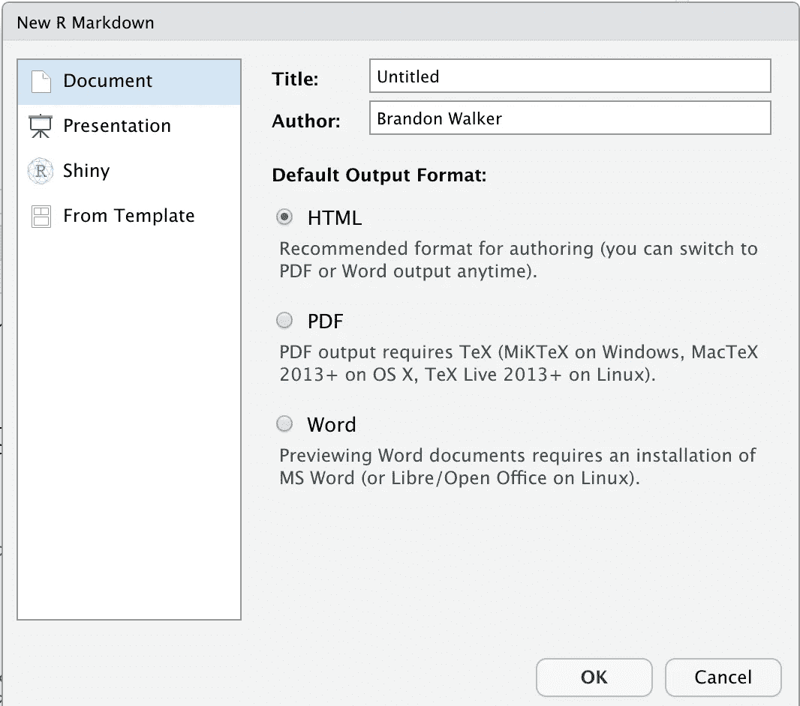
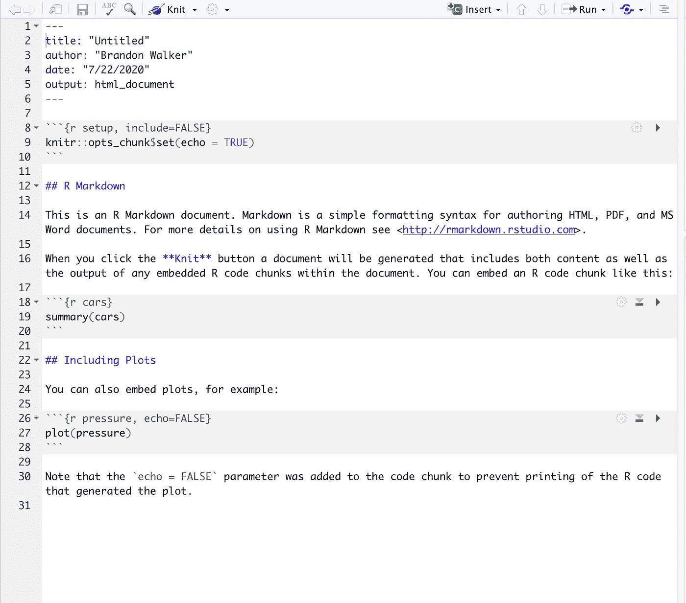
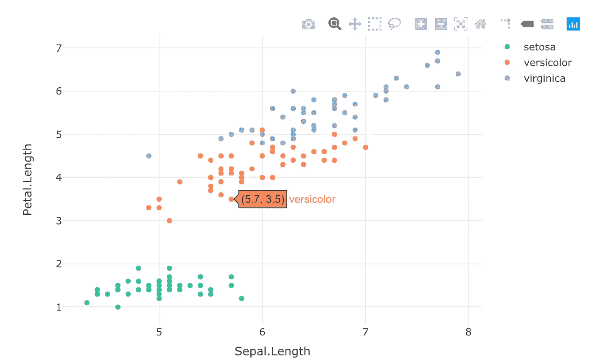
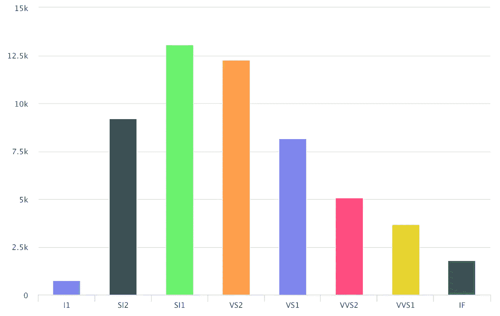
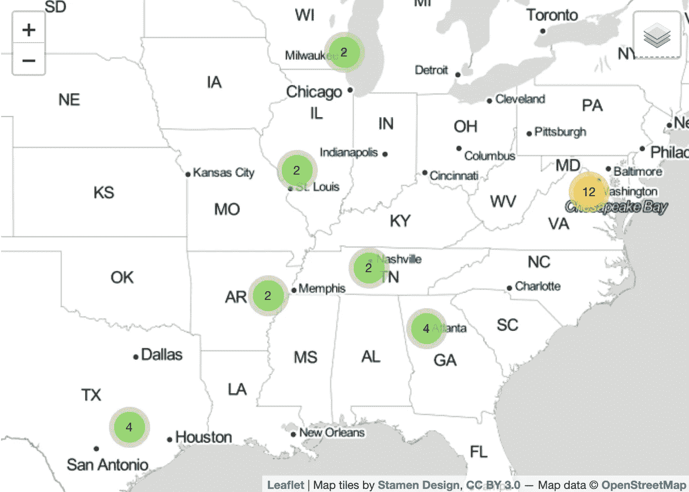
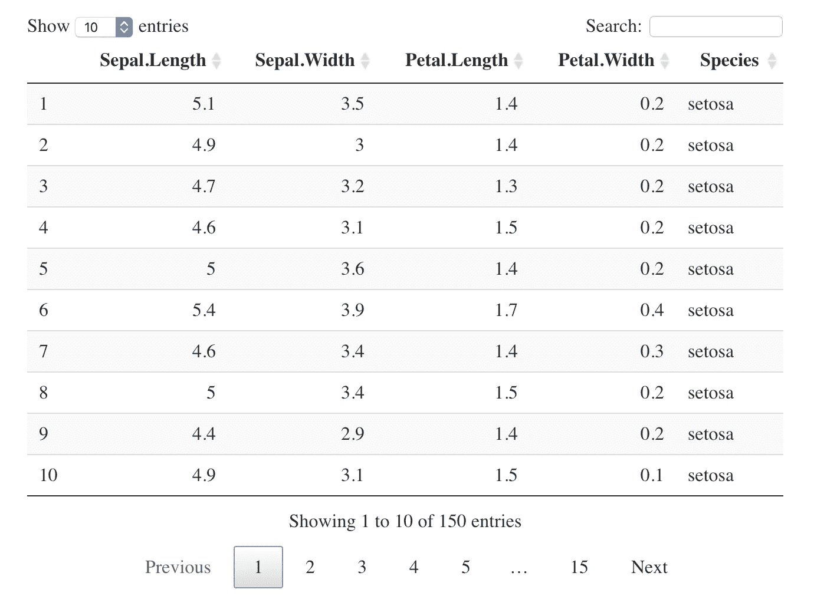
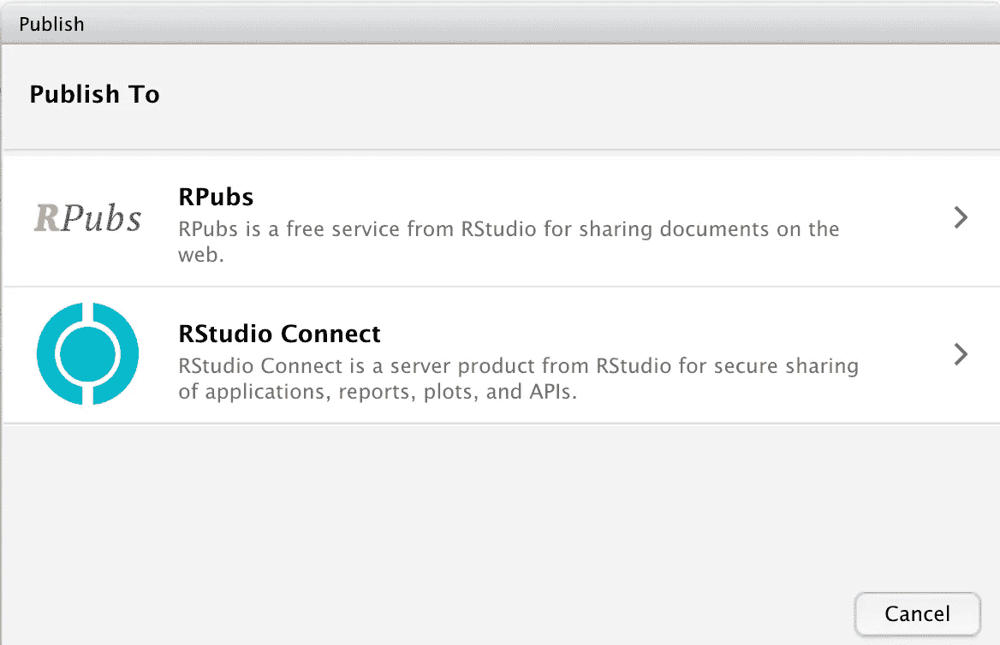

# RPubs:添加到简历中的快速项目

> 原文：<https://towardsdatascience.com/rpubs-fast-projects-to-add-to-your-resume-778d69064493?source=collection_archive---------43----------------------->

如果你以前没有数据科学方面的工作，而你正在试图获得一份工作，那么在招聘人员眼中证明你自己的最好方式就是有一个前端工作的项目。虽然一篇研究论文或另一个 Jupyter 笔记本可能有复杂和/或技术上有趣的工作，但它并没有真正吸引人们的注意力。如果你的工作是交互式的，那么敬业度会在你的简历上大大提升。不管你是 10 岁还是 50 岁的博士，当你遇到一个交互式的图表时，你都会点击它。

如果你对 R 有点熟悉，这篇文章会对你有用，让你的作品具有交互性，并发布到网上，让其他人也能看到。

# r 降价

R Markdown 是 Markdown 的一个扩展，它可以帮助您创建格式整洁的 pdf、html 文档、word 文档等等。Markdown 的原理相对简单，通过查看这个[链接](https://rmarkdown.rstudio.com/authoring_basics.html)，你可以在大约 5 分钟内学会如何创建表格、插入图片和链接、设置文本样式以及设置标题。

R Markdown 稍微复杂一点。要在 R Studio IDE 中创建 R Markdown 文档，请转到文件>新建文件> R Markdown。这将把我们带到下面的窗格，在这里您可以命名您的文档，并选择您的文档类型。现在，把它作为一个 HTML 文档，然后点击“OK”按钮。

您现在应该有一个类似下图的脚本。在文件的顶部是一些 YAML，它给出了文件的一些信息。你可以在空白处写下你的减价，你也可以用普通的 HTML 来写，因为我们将呈现一个 HTML 文档。灰色区域用反斜杠括起来，它与大多数键盘上的波浪号共用同一个键。在第一组反勾号之后，你写下你正在使用的编程语言(在我们的例子中，我们使用的是 R，但是也可以选择另一种)，然后是代码块的名称。

可以为代码块配置附加选项。常见的有:

*   `include`阻止代码和结果出现
*   `echo`阻止结果出现
*   `warning`阻止代码生成的警告出现
*   `background`改变块的背景颜色
*   `fig.width`和`fig.height`以英寸为单位控制数字的大小

最后，为了在代码顶部呈现生成的文档，在 Knit > Knit to HTML 上单击下拉箭头。这将为您提供所创建文档的视图。接下来，我们将为这个文档创建交互组件，然后在线发布它。

# Plotly

Plotly 将帮助我们用最少的代码渲染具有很多特性的迭代图。要开始使用 plotly，请在您的控制台中运行`install.packages("plotly")`，并将`library(plotly)`放在您的某个代码块中(我推荐第一个代码块)。要创建一个图，您将使用 plot_ly 函数。下面我运行了`plot_ly(data = iris, x = ~Sepal.Length, y = ~ Petal.Length, color = ~Species)`并生成了下面的图表，它能够创建截图，使用工具提示，突出显示数据点，并调整轴。

虹膜数据集的散点图

尝试重新渲染文档，您可以在输出中看到绘图。如果您已经在使用 ggplot，但不想转换为 plotly，安装 ggplotly 包，并将 ggplots 包装在`ggplotly()`函数中，以获得现有 plotly 功能。要查看更多您可能想要生成的示例，请查看[plotly.com/r/](https://plotly.com/r/)。

# 高价租船合同

尽管 highcharter 不能免费用于商业目的，但它可以用来创建许多不同风格的交互式图表。Highcharter 有助于开发比 plotly 更干净、不那么繁忙的地块。

使用如下的 hchart()函数，我们可以看到一个条形图形式的 diamonds 数据集。

`hchart(diamonds$clarity, colorByPoint = TRUE, name = "Clarity")`

钻石数据集的高查特条形图

像 plotly 一样，highcharter 的工具提示使其更有用，因为您可以看到这些条形图的准确高度或散点图上某个点的准确位置。有关 highcharter 的更多示例，我建议您查看 [highcharter 展示区](http://jkunst.com/highcharter/showcase.html)。

# 传单

传单是我个人最喜欢的映射包，开始你需要一个地理空间数据集和对 r 中管道操作符的理解。管道操作符把左边的对象作为左边函数的第一个参数。因此，以下内容是相同的:

`data %>% func1() %>% func2()`

`func2(func1(data))`

这实际上是我更喜欢 R 代码的编写方式，因为从左到右阅读要容易得多。您的代码采取了明确的步骤，并且您不必花费大量时间来查看特定参数处的嵌套函数。

活页地图是通过向管道链添加额外的功能来创建的，最终形成非常可定制的地图，这些地图可以具有多层影像、迷你地图、定制标记、路径和定制区域。如果您想快速浏览一下，我的文章[用不到 15 行代码用 R 语言制作交互式地图](/making-interactive-maps-in-r-with-less-than-15-lines-of-code-bfd81f587e12)是一个很好的起点，下面我将展示如何生成地图。

# 数据表

在大多数情况下，您希望以可视的格式呈现数据，因为这样更容易理解。如果您想要显示一个表，那么您应该使用 DT 包以交互方式来完成。下面的代码生成了下面的屏幕截图。

`datatable(iris)`

DT 包很棒，因为它使您能够在页面中显示表格数据(最小化空间)，允许您搜索数据，并允许您根据特定的列对数据进行排序。这些是查看你的表的人可能想要的特性，DT 给了他们这些功能，并且是同一个表的截图的一部分。

# RPubs

现在您已经对可以制作的交互式可视化类型有了一些概念，让我们来看看如何将您的文档发布到 RPubs。首先编织您的文档，就像您在过去的步骤中可能一直在做的那样来呈现它。渲染完成后，单击窗格右上角的发布按钮，这将生成下面的弹出窗口。

点击 RPubs，然后注册一个账户。注册后，再次单击发布按钮。值得注意的是，RPubs 上的每一个文件都是公开可见的，所以不要分享任何不应该分享的东西。

# 建议

虽然这不是你项目的一个非常重要的前端，但它比一个没有交互性的纯文本项目要好。希望这能在很短的时间内给你的投资组合增加一些东西。由于这是一个容易创建的项目，我的建议(如果你正在找工作)是对与你想工作的行业或公司相关的数据集进行分析。例如，如果你对房地产感兴趣，搜索住房数据集，如果你对为 Spotify 工作感兴趣，使用他们的 API 来获取数据。