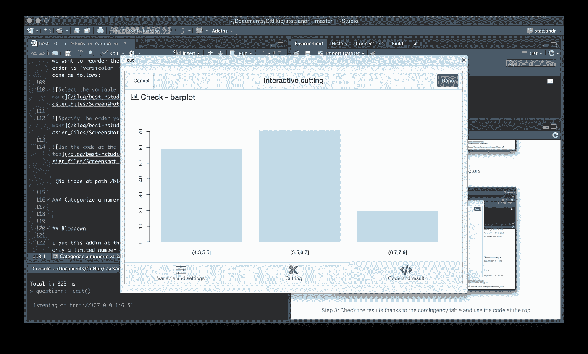

# RStudio addins，或者如何让您的编码生活更简单

> 原文：<https://towardsdatascience.com/rstudio-addins-or-how-to-make-your-coding-life-easier-6b627c7b2240?source=collection_archive---------10----------------------->

## 发现最好的 RStudio 插件，如何在实践中使用它们，以及它们如何在用 R 或 R Markdown 编写代码时帮助您


由[萨法尔·萨法罗夫](https://unsplash.com/@codestorm?utm_source=medium&utm_medium=referral)拍摄的照片

# 什么是 RStudio addins？

答虽然我已经使用 RStudio 好几年了，但我最近才发现 RStudio 插件。从那以后，我几乎每次使用 RStudio 都在使用这些插件。

什么是 RStudio addins？RStudio 插件是一些扩展，它们为从 RStudio 中执行高级 R 函数提供了一种简单的机制。更简单地说，当执行一个插件(通过单击插件菜单中的一个按钮)时，相应的代码被执行，而您不必编写代码。如果仍然不清楚，请记住，对于在 RStudio 中导入数据集的[，您有两种选择:](https://www.statsandr.com/blog/how-to-import-an-excel-file-in-rstudio/)

*   通过编写代码导入它(例如，感谢`read.csv()`函数)
*   或者，您可以通过单击环境窗格中的“导入数据集”按钮来导入它，设置导入设置，然后单击“导入”

RStudio 加载项与“导入数据集”按钮非常相似，但具有其他常见功能。因此，您可以编写代码，就像您可以通过编写代码来导入数据集一样，但是由于 RStudio 插件，您可以在不实际编写必要代码的情况下执行代码。通过使用 RStudio 插件，RStudio 将为您运行所需的代码。RStudio 插件可以简单到插入常用代码片段的函数，也可以复杂到接受用户输入以绘制图形的闪亮应用程序。RStudio 插件的优势在于，与您自己编写代码相比，它们允许您更轻松地执行复杂和高级的代码。

我相信 addins 值得所有 R 用户去尝试。初学者将有可能使用他们本来不会使用的功能，因为代码太复杂，而高级用户可能会发现它们在某些情况下有助于加快代码的编写。有关 R 中的其他提示，请参见文章“[R studio 和 R Markdown 中的提示和技巧](https://www.statsandr.com/blog/tips-and-tricks-in-rstudio-and-r-markdown/)”。

# 装置

RStudio 加载项作为 R 包分发。所以在能够使用它们之前，你需要安装它们。你可以像安装软件包一样安装一个插件:`install.packages("name_of_addin")`。一旦你安装了包含插件的 R 包，它将通过顶部的插件菜单立即在 RStudio 中可用。


RStudio 加载项工具栏

# 艾丁斯

如果您仍然不相信，请参见下面我认为最有用的插件列表，以及下面几节中的具体示例。

*   [埃斯奎斯](https://www.statsandr.com/blog/rstudio-addins-or-how-to-make-your-coding-life-easier/#esquisse)
*   [提问者](https://www.statsandr.com/blog/rstudio-addins-or-how-to-make-your-coding-life-easier/#questionr)
*   [补救措施](https://www.statsandr.com/blog/rstudio-addins-or-how-to-make-your-coding-life-easier/#remedy)
*   [Styler](https://www.statsandr.com/blog/rstudio-addins-or-how-to-make-your-coding-life-easier/#styler)
*   [蛇箱](https://www.statsandr.com/blog/rstudio-addins-or-how-to-make-your-coding-life-easier/#snakecaser)
*   [视图管道步骤](https://www.statsandr.com/blog/rstudio-addins-or-how-to-make-your-coding-life-easier/#viewpipesteps)
*   [yml 这是](https://www.statsandr.com/blog/rstudio-addins-or-how-to-make-your-coding-life-easier/#ymlthis)
*   [代表](https://www.statsandr.com/blog/rstudio-addins-or-how-to-make-your-coding-life-easier/#reprex)
*   [Blogdown](https://www.statsandr.com/blog/rstudio-addins-or-how-to-make-your-coding-life-easier/#blogdown)

请注意，此列表并不详尽，根据您在 RStudio 上进行的分析类型，您可能会发现其他列表也很有用。欢迎在文章末尾发表评论，让我(和其他读者)知道你认为值得使用的插件。

# 埃斯奎塞

是一个由法国 dreamRs 公司开发的插件。他们是这样定义的:

> *该插件允许您通过用 ggplot2 包可视化数据来交互式地浏览数据。它允许您绘制条形图、曲线、散点图、直方图、箱线图和 sf 对象，然后导出图形或检索代码以再现图形。*

有了这个插件，你可以很容易地从`[{ggplot2}](https://www.statsandr.com/blog/graphics-in-r-with-ggplot2/)` [包](https://www.statsandr.com/blog/graphics-in-r-with-ggplot2/)中创建漂亮的图形，对我来说最好的部分是你可以检索代码来复制图形。与默认的`{graphics}`包相比，`{ggplot2}`包的图形看起来确实更好，但是代码也更长更复杂。有了这个插件，您可以通过在一个用户友好的交互式窗口中拖放感兴趣的变量来从`{ggplot2}`包中绘制图形，然后在您的脚本中使用生成的代码。

为了便于说明，假设我们想要创建数据集`iris`的变量`Sepal.Length`和`Petal.Length`的散点图，并用变量`Species`给点着色。为此，请遵循以下步骤:

1.  加载数据集并重命名为: [1](https://www.statsandr.com/blog/rstudio-addins-or-how-to-make-your-coding-life-easier/#fn1)

```
dat <- iris
```

2.安装组件`{esquisse}`。这必须只做一次

```
install.packages("esquisse")
```

3.从 RStudio Addins 菜单中打开“ggplot2”生成器:


步骤 3:从 RStudio 插件菜单中打开“ggplot2”构建器

4.选择您想要处理的数据集(在本例中为`dat`，并在检查观察值和变量的数量是否正确后点击“验证导入的数据”(绿框):


步骤 4:选择数据集并验证导入的数据

5.将感兴趣的变量拖放到相应的区域。在这种情况下，我们将绘制变量`Sepal.Length`和`Petal.Length`以及基于变量`Species`的色点的散点图:


步骤 5:将变量拖放到相应的区域

6.点击窗口右下方的“>导出&编码”。您可以复制代码并将其粘贴到脚本中您想要放置的位置，也可以单击“在脚本中插入代码”将代码放置到脚本中光标所在的位置:


步骤 6:检索代码，以便在脚本中使用

如果选择第二个选项，代码应该出现在光标所在的位置。许多不同的选项和定制是可能的(例如，轴标签、颜色、图例位置、主题、数据过滤等。).为此，使用位于窗口底部的按钮(“标签和标题”、“绘图选项”和“数据”)。您可以在窗口中立即看到更改，当情节符合您的需要时，将代码导出到您的脚本中。我不会详细讨论不同类型的图和定制，但是一定要通过移动变量和定制来尝试其他类型的图，看看有什么可能。

# 提问者

`{questionr}`插件在调查分析和处理[因素变量](https://www.statsandr.com/blog/data-types-in-r/#factor)时非常有用。有了这个插件，你可以很容易地重新排序和重新编码因子变量。得益于`cut()`函数，该插件还允许轻松地将数字变量转换为因子(即，对连续变量进行分类)。像其他插件一样，安装完`{questionr}`包后，你应该会看到它出现在顶部的插件菜单中。从加载项下拉菜单中，选择是否要对因子变量进行重新排序或重新编码，或者对数值变量进行分类。

# 记录因素

我们可以使用`{questionr}`插件，而不是从`{dplyr}`包中编写`recode()`函数。

对于这个例子，假设我们想要重新编码`Species`变量以缩短因子的长度，然后将这个新变量存储为`Species_rec`:


步骤 1:选择要重新编码的变量和重新编码设置


步骤 2:指定新因素的名称


步骤 3:根据列联表检查结果，并使用顶部的代码

# 重新排序因素

类似于重新编码，我们可以通过`{questionr}`插件对因子进行重新排序。假设我们想对`Species`变量的 3 个因子重新排序，顺序是`versicolor`然后是`virginica`最后是`setosa`。这可以通过以下方式完成:


步骤 1:选择要重新排序的变量和新的变量名


第二步:指定你想要的顺序


步骤 3:使用脚本顶部的代码

# 对数字变量进行分类

`{questionr}` addin 也允许将一个数字变量转换成一个分类变量。这通常是为年龄而做的，例如，当年龄被转换成年龄组时。对于这个例子，假设我们想要创建变量`Sepal.Length`的 3 个类别:


步骤 1:选择要转换的变量和新的变量名


步骤 2:将休息次数设置为 3

(自己尝试其他切割方法，直接在窗口中查看结果。)



第三步:根据底部的柱状图检查结果


步骤 4:使用脚本中的代码

# 治疗

如果你经常用 R Markdown 写作，那么`{remedy}`插件将会极大地方便你的工作。该插件允许您添加粗体，创建列表，网址，斜体，标题(H1 到 H6)，脚注等。以一种有效的方式。我认为直接使用代码可以更快地完成这些任务，而不是通过 addins 菜单然后选择您想要的转换。然而，就我个人而言，我不可能记住所有转换的代码，通过菜单应用它比在 Google 或 Markdown cheat sheet 上搜索答案更快。

# Styler

`{styler}`插件允许通过运行`styler::tidyverse_style()`将你的代码重新格式化成更可读的格式。它对 R 脚本和 R Markdown 文档都有效。您可以重新格式化选定的代码、活动文件或活动包。我发现在共享或发布我的代码之前，这个插件特别有用，因此它尊重最常见的代码样式准则。

例如，像这样的一段代码:

```
1+1
#this is a comment
  for(i in 1:10){if(!i%%2){next}
print(i)
 }
```

变得更加简洁易读:

```
1 + 1
# this is a comment
for (i in 1:10) {
  if (!i %% 2) {
    next
  }
  print(i)
}
```

# 蛇皮箱

`{snakecaser}` addins 将一个字符串转换成蛇形样式。Snake case 样式是将由空格分隔的几个单词组成的字符串写成单词用下划线(`_`)分隔的字符串的做法。此外，它用小写字母代替大写字母。例如，以下字符串:

```
This is the Test 1
```

将被转换为:

```
this_is_the_test_1
```

snake case 样式对于变量、函数和文件名等特别有用(甚至被许多 R 用户推荐)。

# 视图管道步骤

感谢这篇文章的读者，我发现了`ViewPipeSteps`插件。此加载项允许在每个步骤后打印或查看管道链的输出。

例如，下面是一个包含数据集`diamonds`的链:

```
library(tidyverse)diamonds %>%
  select(carat, cut, color, clarity, price) %>%
  group_by(color) %>%
  summarise(n = n(), price = mean(price)) %>%
  arrange(desc(color))## # A tibble: 7 x 3
##   color     n price
##   <ord> <int> <dbl>
## 1 J      2808 5324.
## 2 I      5422 5092.
## 3 H      8304 4487.
## 4 G     11292 3999.
## 5 F      9542 3725.
## 6 E      9797 3077.
## 7 D      6775 3170.
```

如果您不确定您的管道链或想要调试它，您可以在每个步骤后查看输出，方法是突出显示您的整个管道链，然后单击 addins 菜单中的“查看管道链步骤”:


从 addins 菜单中，您可以选择将结果打印到控制台，或者在新的窗格中查看结果(就好像您在管道的每一步之后都调用了函数`View()`)。点击查看管道链步骤将打开一个新窗口，显示每个步骤的输出:


请注意，您必须使用以下命令来安装`ViewPipeSteps` addin:

```
devtools::install_github("daranzolin/ViewPipeSteps")
library(ViewPipeSteps)
```

现在，你再也没有借口使用这个管道操作符了！

# 这是


yml 这是一个容易写 YAML 标题的附加程序

`[ymlthis](https://ymlthis.r-lib.org/)` [addin](https://ymlthis.r-lib.org/) 使得为 R Markdown 和相关文档编写 YAML front matter 变得很容易。该插件将为您创建 YAML，并将其放在一个文件中，比如一个`.Rmd`文件，或者放在您的剪贴板上。

如果你想写(更复杂的) [YAML 标题](https://www.statsandr.com/blog/getting-started-in-r-markdown/#yaml-header)，这个插件特别有用。

# Reprex

如果你经常向 R 社区求助，这个 addin 可能会很有用！

重要的是要记住，当你向某人寻求帮助时，你必须通过准确清晰地概述你的问题来帮助他们。这有助于社区快速了解您的问题，从而减少响应时间。

在大多数情况下，这涉及到提供一个可再现的例子，也就是说一段代码(尽可能小和可读)再现所遇到的问题。

`{reprex}`插件允许你转换你的可重复的例子，这样它就可以很容易地在平台上共享，比如 GitHub，Stack Overflow，RStudio community 等等。您的可重复示例的布局将适应平台，您甚至可以包含关于您的 R 会话的信息。 [2](https://www.statsandr.com/blog/rstudio-addins-or-how-to-make-your-coding-life-easier/#fn2)

以下是如何一步一步地使用它:

1.  首先在 R 中创建可重复的例子(记住尽可能保持简短易读，以节省潜在帮助者的时间):


最小可重复示例

2.在插件列表中选择`{reprex}`插件:


选择{ reprex }加载项

3.选择您将发布问题的平台(如果您希望在可重现示例的末尾显示您的会议信息，请选中“附加会议信息”):


在{ reprex }加载项中设置选项

4.现在，您可以看到可重现示例的输出(右图)，但更重要的是，它已被复制到您的剪贴板中，现在可以粘贴到您选择的平台上了:


您的 reprex 被复制到您的剪贴板中

5.将您的 reprex 粘贴到您选择的平台上(这里，它作为一个问题发布在 GitHub 上):


粘贴您的代表

6.检查可重现示例的最终结果:


决赛成绩

(访问本期 GitHub [刊](https://github.com/AntoineSoetewey/statsandr/issues/12)看最终结果。)

# 博客城

我把这个插件放在列表的最后，因为只有有限数量的 RStudio 用户会对它感兴趣:维护用 R 编写的博客的人(比如这个博客)。

此加载项中最有用的功能如下:

*   新帖子:用`blogdown::new_post()`创建一个新帖子。它还可以用来创建新页面，而不仅仅是文章
*   插入图像:在博客文章中插入外部图像
*   更新元数据:更新当前博客文章的标题、作者、日期、类别和标签
*   服务站点:运行`blogdown::serve_site()`在本地实时预览你的网站

感谢阅读。我希望你会发现这些插件对你将来的 R 相关项目有用。参见 RStudio 和 R Markdown 中的其他[提示和技巧。](https://www.statsandr.com/blog/tips-and-tricks-in-rstudio-and-r-markdown/)

和往常一样，如果您有与本文主题相关的问题或建议，请将其添加为评论，以便其他读者可以从讨论中受益。

1.  您实际上不需要重命名它。然而，我经常用相同的通用名称`dat`重命名我处理的数据集，这样当我在新项目中重用以前项目的代码时，我就不必在代码中更改数据集的名称。 [↩︎](https://www.statsandr.com/blog/rstudio-addins-or-how-to-make-your-coding-life-easier/#fnref1)
2.  感谢 Josep 的[建议](https://medium.com/@josepmporra/great-post-you-could-have-a-look-to-reprex-addins-to-build-reproducible-examples-26bcdc0f8ed4)。 [↩︎](https://www.statsandr.com/blog/rstudio-addins-or-how-to-make-your-coding-life-easier/#fnref2)

**相关文章:**

*   [R markdown 入门](https://www.statsandr.com/blog/getting-started-in-r-markdown/)
*   [R studio 和 R Markdown 中的提示和技巧](https://www.statsandr.com/blog/tips-and-tricks-in-rstudio-and-r-markdown/)
*   [R 中的方差分析](https://www.statsandr.com/blog/anova-in-r/)
*   [R 中的相关系数和相关检验](https://www.statsandr.com/blog/correlation-coefficient-and-correlation-test-in-r/)
*   [如何在 GitHub 上上传你的 R 代码:MacOS 上的 R 脚本示例](https://www.statsandr.com/blog/how-to-upload-r-code-on-github-example-with-an-r-script-on-mac-os/)

【https://statsandr.com】原载于 2020 年 1 月 26 日[](https://statsandr.com/blog/rstudio-addins-or-how-to-make-your-coding-life-easier/)**。**