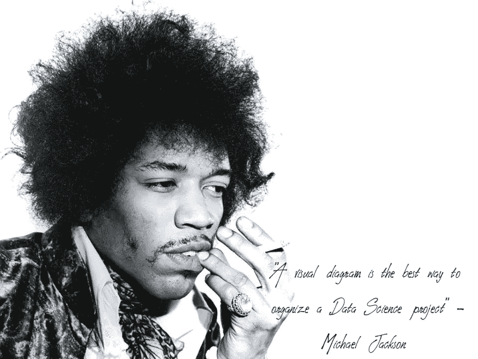
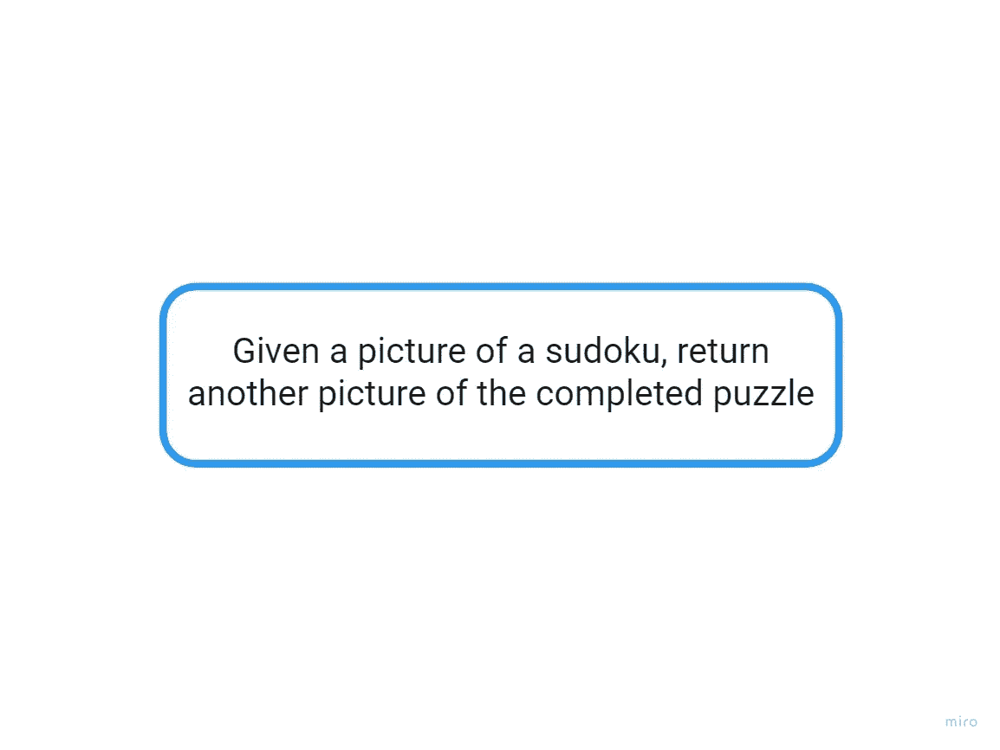
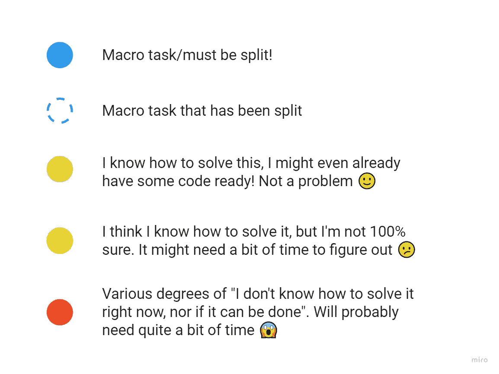
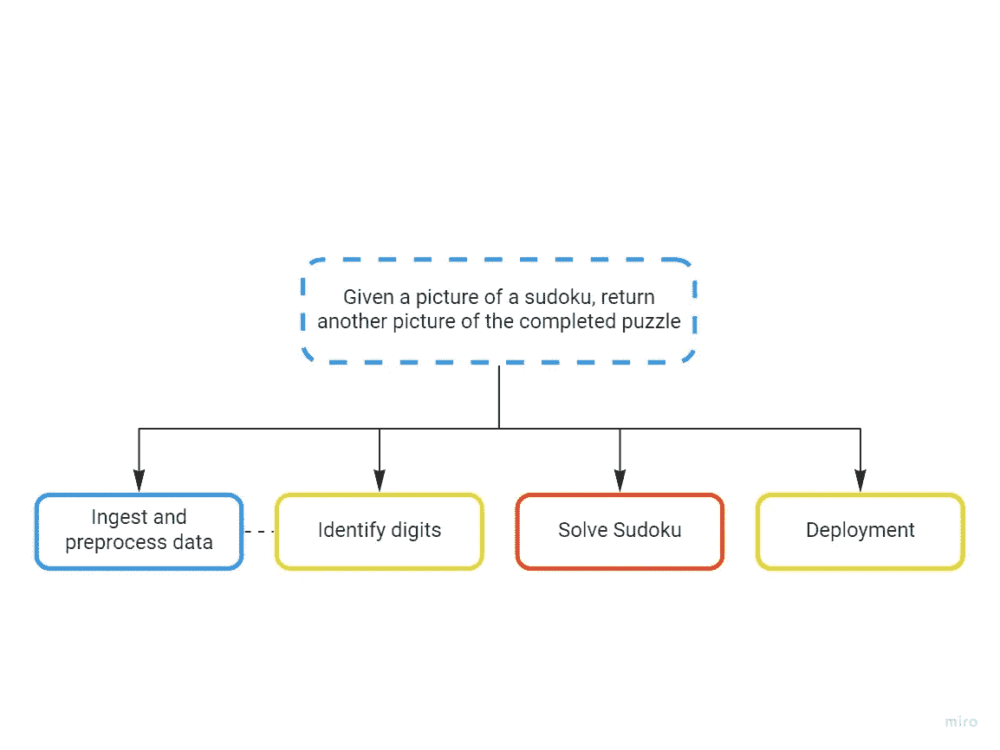

# 毁灭数独——一个数据科学项目

> 原文：<https://towardsdatascience.com/ruining-sudoku-a-data-science-project-part-1-introduction-and-project-design-160a3c5caee5?source=collection_archive---------57----------------------->

## 第 1 部分:介绍和项目设计

这就是你在本系列结束时的观感。不过，山羊胡子可不能保证。
照片由[范明](https://unsplash.com/@minhphamdesign?utm_source=medium&utm_medium=referral)在 [Unsplash](https://unsplash.com?utm_source=medium&utm_medium=referral) 拍摄

当我年轻而愚蠢的时候(我只保留了这两个特征中的一个)，我想象与人工智能一起工作包括花大量的时间设计和实现一个显示某种智能的软件，不管这意味着什么。《黑客帝国》于 1999 年上映，当时我 15 岁，很容易被那些视觉效果所打动:可以说，这部电影对我未来的生活方向产生了相当大的影响。

在我的衣柜上，但那是以后的事了。

到目前为止，我已经作为一名数据科学家工作了大约 7 年，尤其是在过去的两年半时间里，在离开学术界进入行业工作之后，我对这个主题的看法发生了重大变化。如果我必须描述我每天都在做什么，我会说我基本上花时间试图解决与*数据*有关的问题，这些问题通常需要某种*人工智能魔法*才能解决。

然而，我意识到，从外部的角度来看，接受一个请求、一个想法并将其转化为实际产品的复杂性可能并不明显。我认为人们很容易专注于*更有趣的*部分，如花哨的神经网络和奇异的数据集，而忘记数据科学项目中对其成功至关重要的所有其他方面:我指的是像*部署*、*数据预处理*以及最重要的*项目设计*，即制定从零到最终产品工作所需的路线图。

所以我认为把这个过程作为一个整体来写会很有趣:我看到了很多关于各个部分的教程(特别是关于前面提到的深度学习相关的东西)，但没有多少关于如何把这些部分放在一起，更没有多少花合理的时间来解释一些选择背后的原因或探索为什么有些道路*不应该走*。请允许我填补这个空白。

# 介绍

做或不做【一个从零开始的完整的数据科学项目】，没有尝试(其实我鼓励尝试)。
照片由[吉米·阮](https://unsplash.com/@jimmydsign?utm_source=medium&utm_medium=referral)在 [Unsplash](https://unsplash.com?utm_source=medium&utm_medium=referral) 上拍摄

我是大卫·西尔弗关于强化学习的工作的超级粉丝，我经常开玩笑说 DeepMind 的目标是通过创造在特定游戏中比任何人都好的人工智能来破坏我们其余人的游戏。

所以我想沿着这条路走下去会很有趣，尽管是从一个非常不同的角度。

想象一下，你有一个非常种族主义的老阿姨，她将气候变化归咎于移民(她否认这一点:逻辑高于她)，通过她的 facebook 账户传播各种错误信息，并且是韦斯特博罗浸信会的铁杆会员。当她在的时候，鸟儿停止歌唱。如果你不必去想象，只要把注意力放在愉快的想法上，时间最终会为你解决这个问题。

凯伦阿姨的生活中只有一个快乐的来源:每周二，每周一期的“数独 eXXtreme 4000”被送到她的邮箱里，她珍惜在那些谜题上度过的每一刻。

我们的目标是*摧毁*那种幸福。

为了做到这一点，我们将设计并实现一个系统，允许你从包含数独网格的杂志页面上拍摄一张照片，并在几秒钟内自动解决它。

# 摘要

本文是系列文章的一部分:

*   第 1 部分:介绍和项目设计
*   [第二部分:数据预处理](https://medium.com/@matteo.a.barbieri/ruining-sudoku-a-data-science-project-part-2-data-preprocessing-27a290803c48)
*   [第三部分:数字识别和数独求解器](https://medium.com/@matteo.a.barbieri/ruining-sudoku-a-data-science-project-part-3-digits-recognition-and-sudoku-solver-5271e6acd81f)
*   [第 4 部分:部署和追溯](/ruining-sudoku-a-data-science-project-part-4-deployment-and-retro-27620bbeca75)

# 你应该有个计划

就像玩乐高一样，第一步是弄清楚你需要哪些部件。
照片由[哈维·卡夫雷拉](https://unsplash.com/@xavi_cabrera?utm_source=medium&utm_medium=referral)在 [Unsplash](https://unsplash.com?utm_source=medium&utm_medium=referral) 上拍摄

当我开始一个新项目时，我会花相当多的时间来确保几个问题有明确的答案(或者至少尽可能清楚):

1.  我在做什么？这个项目的最终目标是什么？
2.  我怎样才能做到这一点？

这是一个迭代过程，从任务的高级描述开始(在我们的例子中，它类似于*“给定一张数独的图片，返回另一张完成的拼图的图片”*)，然后将其分解为更小的任务，直到它们变得清晰、原子化，这些任务可以简化为一些特定的问题，这些问题有算法形式的解决方案。

它不一定是完美的:不管你在计划方面有多好，肯定会有你忽略的东西，你必须在飞行中调整你的轨迹，在这个阶段没有必要专注于细节。只要原计划足够好，提供了一个好的起点，那就可以了。

让我们画一些形状。

# 项目分解

我很确定他在某个时候说过。
来源:照片由[米尔乔兰](https://www.flickr.com/photos/mirjoran/)在 [flickr](https://www.flickr.com/photos/mirjoran/414998754/in/photostream/) 上拍摄，由 2.0 授权 [CC](http://creativecommons.org/licenses/by/2.0/)

技术说明:我用米罗来画图表，坦白地说，这是一个非常好的发明，让青霉素*看起来像四年级学生的苏打火山。抱歉，亚历山大，这就是事实。*

如我之前所说，你的出发点是问题的定义，仅此而已。所以从一张白纸开始，你应该得到这个:

作者图片

这并不多，当然你很有可能真的知道下一步该去哪里，但是让我们一步一步来。

顺便说一下，我将使用颜色来编码任务的状态:

作者图片

下一件自然的事情当然是将任务分成第一组更小、更易管理的任务。当我开始考虑这个项目需要什么组件时，我用自下而上的方法提出了四个主要任务。

作者图片

1.  在某种程度上，我希望有一个数独的*结构化表示*，这是一个代表 81 个单元格的 9 x 9 数组，其中包含 1 到 9 之间的一个数字或者为空。有了这种格式的信息，即使我不一定知道**如何做到这一点(这就是为什么那个块有一个红色的边框)，我希望一个算法应该能够解决这个难题。**
2.  然而，为了获得该信息，需要扫描网格并识别每个单元格中存在的数字(或者检测出它是空白的)。幸运的是，如果任何数据科学都需要做一些事情，那就是臭名昭著的手写数字识别教程，所以这一部分应该被覆盖(绿色边框)。但真的是这样吗？🧙
    第三部剧透(如果一切顺利，我将在两周后出版):实际上比那要复杂一点，但是我找到了一个优雅的解决意外挫折的方法，如果我可以这么说的话，🧐.
3.  我们希望我们的系统能够处理在“自然”环境中拍摄的数独网格图像，而没有任何太强的约束。因此，我们必须对输入图像进行某种预处理，以便从杂志的整页中整齐地**裁剪**和**旋转**网格。加上促进负责数字识别的组件的工作所需的潜在的任何其他调整。
4.  最后，如果我们能够以一种良好的格式呈现作品，比如说一个网络应用程序，你上传你的图像，它会与另一张图像一起显示在一边，显示谜题的解决方案，这将是一个不错的选择。边框是黄色的，因为虽然我过去做过类似的事情，但这不是我认为自己是专家的项目的一个方面，所以我想记住，这一部分可能比我更熟悉的部分需要更多的努力或研究。

进一步扩展第 3 点描述的活动，我们得到最终(可以这么说)的细分版本:

这甚至不是我的最终形式！
作者图片

目前这已经足够好了。在整个项目中，你可能会发现有些任务比你预期的复杂或多或少，或者它们必须被进一步分割成更小的任务。你甚至可能忘记了一些你在计划时没有想到的事情。这很正常，当你从一个产品的*想法*到*实际实现*它时，这是必然会发生的。

# 接下来是什么

暂时就这样了。我们仍然只写了 0 行代码，但是可以说任何项目中最重要的部分之一已经完成了。计划就像乐队中的贝斯手，只有当它不见了的时候你才会注意到它。在接下来的文章中，我将介绍如何实现上图中列出的所有任务，从数据接收/预处理开始。一周后见！

> 你的快乐很快就会成为遥远过去的记忆，凯伦阿姨。

【1】向这些年来与我同台的所有贝斯手道歉。你知道这是事实。