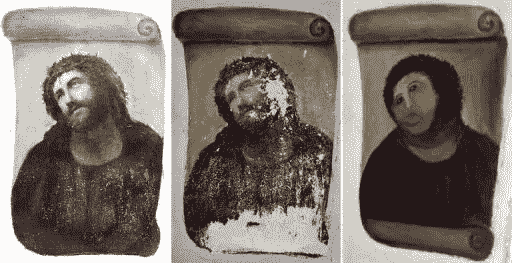
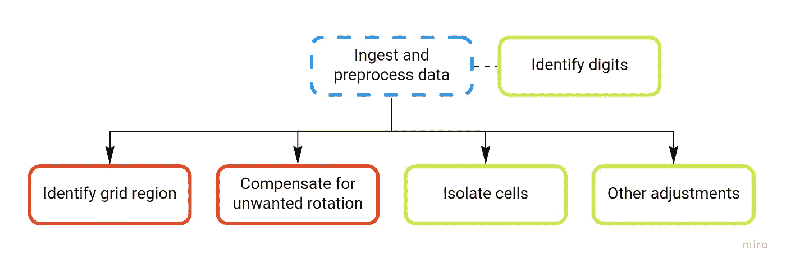
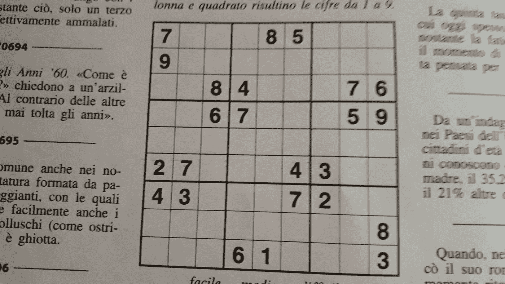
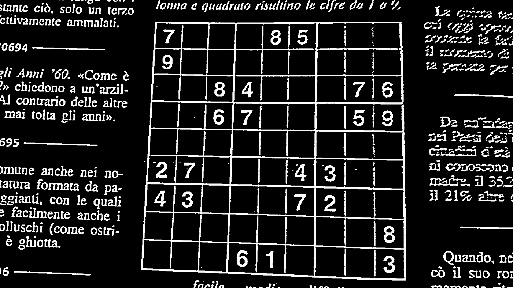
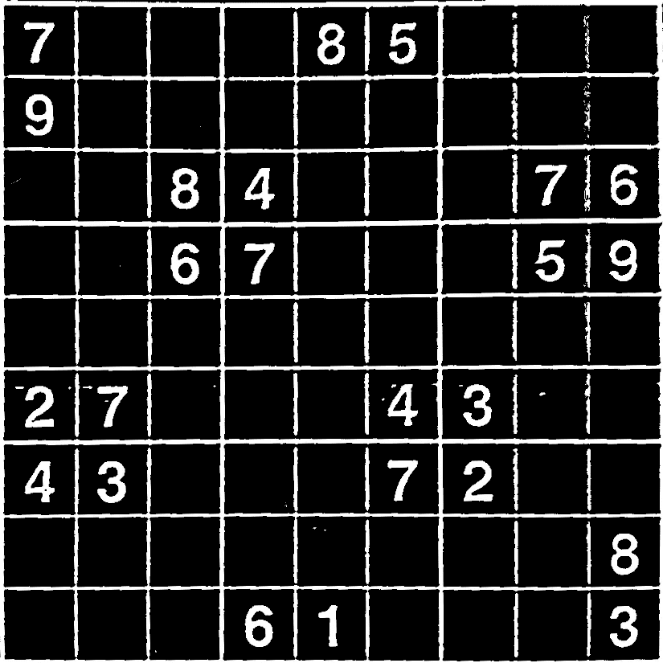
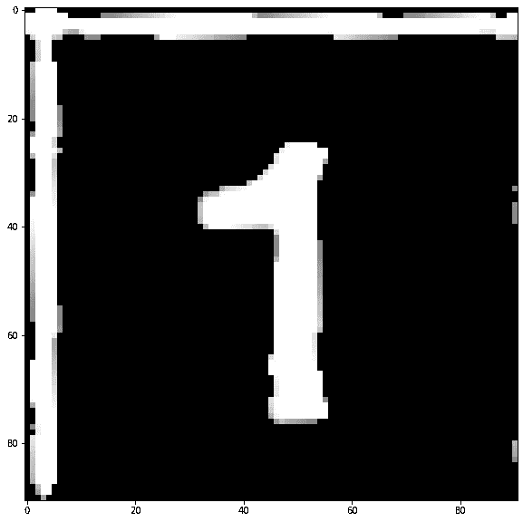
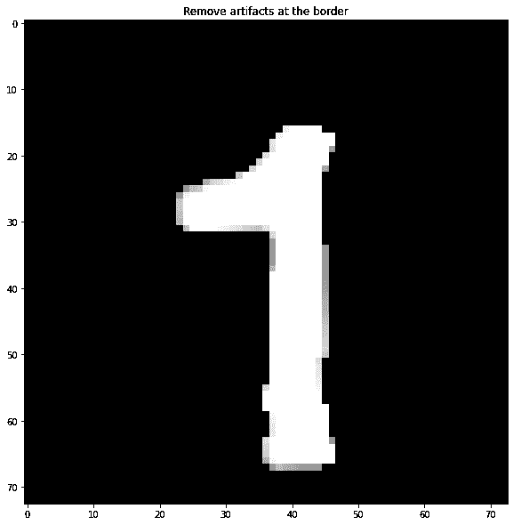
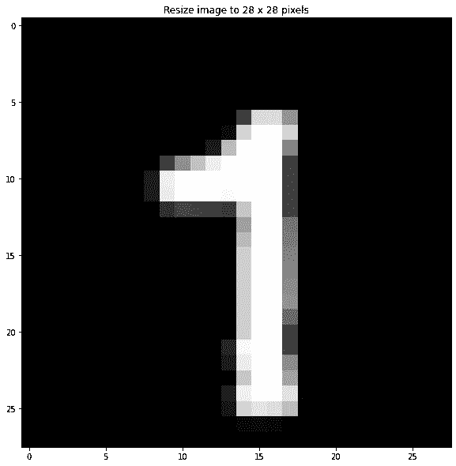

# 破坏数独——一个数据科学项目(第 2 部分:数据预处理)

> 原文：<https://towardsdatascience.com/ruining-sudoku-a-data-science-project-part-2-data-preprocessing-27a290803c48?source=collection_archive---------58----------------------->

在数据预处理中，您可以对输入图像进行调整，以便在后续步骤中使用。万一你觉得还没准备好，害怕把事情搞砸，记住这个发生的**。
[Ecce Home，前、后、后](https://www.flickr.com/photos/33255628@N00/7923536516)After by[Cea。](https://www.flickr.com/photos/33255628@N00)由 2.0 在 [CC 下授权](https://creativecommons.org/licenses/by/2.0/?ref=ccsearch&atype=rich)**

欢迎来到本系列文章的第二篇,该系列文章致力于如何利用数据科学作为惹恼一位不愉快的亲戚的借口！

# 摘要

本文是系列文章的一部分:

*   [第一部分:简介和项目设计](/ruining-sudoku-a-data-science-project-part-1-introduction-and-project-design-160a3c5caee5)
*   第 2 部分:数据预处理—您正在阅读它！
*   [第三部分:数字识别和数独解算器](https://medium.com/@matteo.a.barbieri/ruining-sudoku-a-data-science-project-part-3-digits-recognition-and-sudoku-solver-5271e6acd81f)
*   [第 4 部分:部署和追溯](/ruining-sudoku-a-data-science-project-part-4-deployment-and-retro-27620bbeca75)

在第 1 部分[中，我们经历了项目计划，也就是通过迭代地将它们分割成更小、更易管理的子任务，列出完成项目所需的所有任务。在本文中，我们将讨论在输入数据(在本例中是图像)被传递到管道的下一步，即数字分类器之前，需要对其进行什么处理。](/ruining-sudoku-a-data-science-project-part-1-introduction-and-project-design-160a3c5caee5)

# 图像预处理

数据预处理任务的分解。
作者图片

为了决定图像必须经过什么样的转换，有必要了解下一个组件(数字分类器)将需要什么样的格式。对于我们的例子，因为我们计划使用基于 MNIST 数据集的图像分类器，所以格式是 28 x 28 **灰度**图像，只包含一个数字。

如果输入图像只包含数独网格(我们将它分成 9 行 9 列)，识别 81 个单元格将是一个相对琐碎的任务*。然而，事实并非如此:理想情况下，我们希望用户能够用手机拍一张照片，然后传给应用程序。*

因此，我们需要一个额外的步骤，将网格从页面的其余内容中分离出来，补偿旋转，并裁剪边界。然而，要做到这一点，我们首先必须对图像进行一些标准调整，以便于下面的步骤。

原始输入图像。
作者图片

对图像的初始调整包括使用*高斯滤波器*和*阈值*的一些基本去噪，以去除大部分缺陷并获得*二进制图像*。我们还将*反转*颜色，因为这是用于执行几何操作的算法的要求，我们将使用该算法来检测网格并扭曲图像，使其最终成为正方形。

基本预处理(高斯滤波和阈值处理)后的输入图像。
作者图片

然后，我们必须首先确定网格所在的区域，然后应用所需的变换将其扭曲成正方形。这分两步完成，最终结果是这样的:

扭曲和裁剪后从图像中提取的网格。
作者图片

此时，将图像分割成 81 个单元格是微不足道的。任务完成[几乎]！

# 能偷多少就偷多少

关于时间管理的重要说明:上面的大部分代码不是我写的，而是取自各种来源，要么是 stackoverflow 评论，要么是 quadrillions 之一“用深度学习解决数独！”在媒体上或其他地方的教程。见鬼，我甚至不完全理解它的某些部分，我只是玩玩它，直到我足够信任它可以工作，并且在这个过程中不会烧坏我的电脑。

在这个星球上生活了 36 年，看了无数集《神秘博士》,我明白了一件事:时间是一种资源，通常情况下，你没有足够的时间。所以请允许我尽可能明确地说:

> 不要重新发明该死的轮子。

如果一个任务足够具体，很可能在某个黑暗的房间里已经有人写了一段代码来解决它。所以去抓住它，而不是花几个小时自己实现它。

# 最后一笔

快好了。我们仍然有一个问题:如果你只是通过将图像水平和垂直划分为 9 个部分来分割图像，其中一些可能会包含部分边界，如果你的数字分类器不是最擅长的，这可能会是一个问题。

看着你，*字面上任何训练有素的分类器对 MNIST* 。

因此，在我们进入有趣的部分之前，我们消耗了大量的精力，只是为了看到 Karen 阿姨脸上的笑容消失，花几行代码来识别并从网格中删除剩菜是一个好主意。

最后的预处理步骤:从原始单元格(左)中，我们首先从网格中删除可能保留的块(中)，最后将其大小调整为 28 x 28 像素(右)，因为这是我们将要使用的分类器的预期图像大小。
作者图片

# 就这些了，伙计们

暂时就这样了。你可以找到我在[这个仓库](https://github.com/matteobarbieri/sudoku)中使用的 jupyter 笔记本，然而上面的要点涵盖了所有必要的(和有趣的部分)。

下周，是时候我们打开图形处理器，让神经元滚动:没有数字会保持不被识别。

[1]我们最终将使用与略有不同的东西*，但在我计划的时候，这似乎是一个合理的选择，所以我暂时这么称呼它。*

[2]我开始尝试复杂的东西，结果每边只剪了 10%左右。很管用。