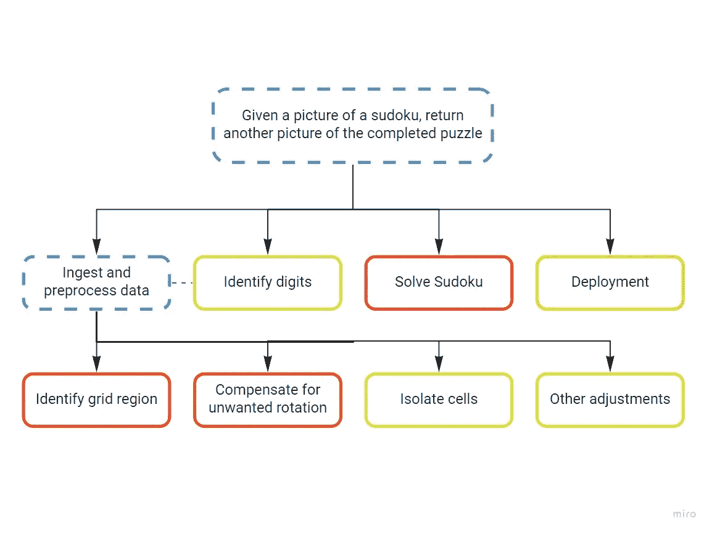
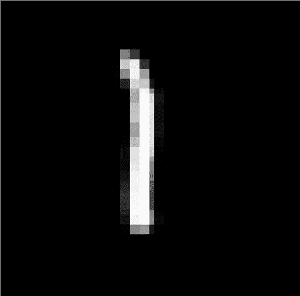

# 破坏数独——一个数据科学项目(第三部分:数字识别和数独求解器)

> 原文：<https://towardsdatascience.com/ruining-sudoku-a-data-science-project-part-3-digits-recognition-and-sudoku-solver-5271e6acd81f?source=collection_archive---------46----------------------->

数字五。或者，根据每一个训练有素的 MNIST 分类器，一个 6。或者八，或者蝙蝠侠的标志，为什么不呢。瑞安·约翰斯在 [Unsplash](https://unsplash.com?utm_source=medium&utm_medium=referral) 上拍摄的照片

好吧，这是你真正关心的一篇文章，其中 GPU 升温和损耗曲线是平坦的:今天我们将讨论该项目的两个核心部分，即如何识别九个数字中的哪一个出现在每个数独单元中，我们事先识别并分离了这些数字(查看本系列的第二篇文章中的细节)，并从那里着手解决这个难题。哦，我们还会用 2020 年的*魔法* : AI *。*

但首先，快速回顾一下我们是如何走到这一步的。

# 之前(和下周)，在这个系列中

*   [第一部分:简介和项目设计](/ruining-sudoku-a-data-science-project-part-1-introduction-and-project-design-160a3c5caee5)
*   [第二部分:数据预处理](/ruining-sudoku-a-data-science-project-part-2-data-preprocessing-27a290803c48)
*   第 3 部分:数字识别和数独求解器——你正在阅读！
*   [第 4 部分:部署和追溯](/ruining-sudoku-a-data-science-project-part-4-deployment-and-retro-27620bbeca75)

弗兰克·维西亚在 [Unsplash](https://unsplash.com?utm_source=medium&utm_medium=referral) 拍摄的照片

我们从一个相对简单的想法开始:设计并实现一个系统，该系统将一张数独网格清晰可见(但不一定对齐/居中)的图片作为输入，并返回该谜题的*解*。

我们花了相当多的时间来组织我们的工作，以便我们至少对各种任务的难度有一个粗略的想法(因此我们必须分配给每一项任务多少时间)，并且我们处理了第一个主要的工作包，数据预处理。

现在，我们相信我们的系统正确地处理了输入图像，并把网格中的 81 个单元干净整洁地分开了:是时候做有趣的事情了。

# 第二步:解决数独

如果你正在读这篇文章，你可能很擅长数学，因此会注意到我把第二步放在第一步之前，尽管 2 被一致认为大于 1。我发誓这是有原因的。

如果你还记得的话，在计划的时候，我给每一个子任务分配了一个估计的难度等级，红色代表我所知甚少或者一无所知的子任务。**解算器**就是其中之一。虽然我几乎可以肯定在 Github repo 中有一种算法形式的解决方案，但我还没有正确地搜索它，所以我不愿意想当然地在专注于数字识别任务之前研究这一部分，另一方面，我认为我知道如何解决这个问题。哦，讽刺的是。

最终项目组织结构图。颜色表示估计的难度。
作者图片

无论如何，一个简短的搜索就足以找到一个[片段](https://gist.github.com/matteobarbieri/cf1b46345fe8b69e35744ce54b52469f)，它确实做到了这一点，所以这一整节的目的只是为了强调关注你对*首先*不太有信心的地方的重要性，以便通过找到一个解决方案(比如在这种情况下)或找到一些变通办法来尽早摆脱这种不确定性。

# 第一步:识别数字

在这一点上唯一缺少的是数字分类器，一旦插入我们的系统，这个项目基本上就结束了。

我预计这是一个相对容易的部分:每个接触深度学习的人，特别是 CNN 的人，都必须经历在臭名昭著的手写数字识别数据集 *MNIST* 上训练模型的初始仪式，并且可以在睡梦中产生这样的分类器，所以我确实这样做了。

不幸的是，虽然在 MNIST 的测试集上表现得相当好，但在流水线的前一步中产生的实际图像(包含一位数字的孤立单元网格)上的结果至少可以说是相当令人失望的。当然，大多数时候它仍然是正确的，但是请记住，为了让这个系统工作，即使一个错误也会导致不正确的结果。在这个项目中，我遇到了第一个真正的障碍，不得不去处理它。

## 两步故障排除

糟透了，但这种事时有发生。为了解决这样的问题，我尝试回答以下两个问题:

1.  为什么它不起作用？
2.  我能做些什么呢？

为了回答第一个问题，并找出为什么我的表现如此糟糕(相对而言)，我分析了被错误分类的图像，注意到大多数错误发生在数字 **1** 上，它经常(错误地)被标记为 **7** 。在其他情况下，图像有某种噪声(小块非黑色像素)，预处理步骤没有去除这些噪声，这显然足以混淆模型并产生错误的预测，尽管数字本身在图像中显示得很清楚！

左侧是来自 MNIST 数据集的数字 1 的样本。在右边，从实际的数独网格中提取的 1。尽管非常相似，但在 MNIST 上训练的分类器可能无法正确分类右边的那个，而是预测为 7。作者图片

老实说，这并没有真的让我吃惊:我对 MNIST 数据集有严重的问题，[我写了一篇> 1000 字的长篇大论，为什么它是着火的垃圾](https://medium.com/@matteo.a.barbieri/why-mnist-is-the-worst-thing-that-has-ever-happened-to-humanity-49fd053f0f66)。简而言之，虽然它是对图像分类问题的一个很好的介绍，但当应用于一种与大多数在线教程中呈现的问题略有不同的问题时(数字打印的数字而不是手写的数字)，它并不真正起作用。

我设计的解决方案基于一个神圣的原则，即你应该尽最大努力训练一个数据模型，这个数据与你希望模型工作的数据尽可能相似。如果你在为你的下一个额头纹身寻找报价，请考虑前面的句子。

我所做的是使用 Python PIL 包生成一个*合成*数据集，在一个正方形画布上以略微不同的大小和位置绘制各个数字。对于每张图片，都从与杂志中使用的字体最相似的列表中选择一种字体，以提高模型的泛化能力。此外，这些图像是在模型训练时动态创建的*因此不需要磁盘空间，因为它们没有被保存。*

这种生成数据的方式，加上一些标准的数据扩充(实际上只是旋转，加上一些定制的椒盐噪声，以使其对图像中的缺陷具有抵抗力)，产生了一个模型，尽管并不完美，但产生了明显更好的结果。

还有一个小细节需要讨论:数字分类器可以识别从 0 到 9 的数字，但是数独单元格要么包含从 1 到 9 的数字**要么**为空。我发现处理这种情况的最简单的方法是首先使用一些试探法来查看单元格中是否有任何东西(通过简单地计数有多少像素与背景颜色不同，并确定一些合理的阈值)，并且只有在实际分类中有一些东西在进行时。这有一个额外的好处，即避免在无用的计算上浪费大量的时间和资源(计算白色像素比在 CNN 上运行推理要便宜得多)。

# 无聊(但是有用！)工具/物流 blabla

在我回到我的 Factorio megabase 之前，我想多说几句我在这个项目中使用的工具。

我真的不想卷入整个文本编辑器/IDE 帮派战争，已经流了太多的血。我个人使用 Vim(有大量插件，检查我的[)。vimrc](https://github.com/matteobarbieri/qol/blob/master/dotfiles/vim/.vimrc) 如果你感兴趣的话)因为我超级老了但是我对这个话题没有强烈的看法，用什么让你开心。

另一方面，最近我一直在使用一个实验跟踪/簿记工具来跟踪正在运行/已经完成的实验。即使对于像这样的超小型项目，我也建议使用它，因为它会以增加几行代码为代价，使您的生活变得更加简单。有几个工具，我个人很喜欢，也想建议使用[神圣的](https://github.com/IDSIA/sacred)(加上[综合](https://github.com/vivekratnavel/omniboard)可视化)。

最后，这是一个简单的问题，Jupyter 笔记本非常适合数据探索和快速原型制作。使用它们！

# 搞定了。

就是这样！这次是真的！流水线现在完成了，我们有了从原始输入图像到谜题解决方案的清晰路径。下周，我们将通过使用 Docker 将其打包成 web 应用程序的形式来完成该项目。

你可以在 [this Github repo](https://github.com/matteobarbieri/sudoku) 中找到这一系列文章的笔记本和代码。

七天后见！

 [## matteobarbieri/数独

### 此时您不能执行该操作。您已使用另一个标签页或窗口登录。您已在另一个选项卡中注销，或者…

github.com](https://github.com/matteobarbieri/sudoku)