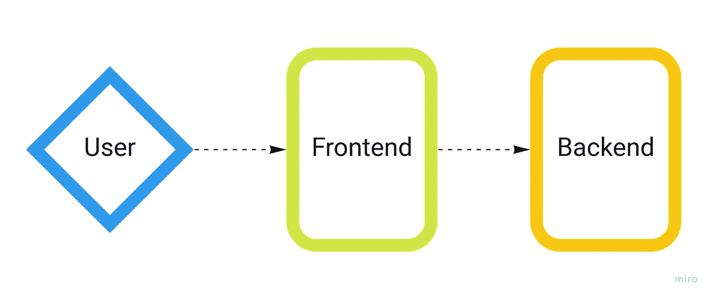

# 破坏数独——一个数据科学项目(第 4 部分:部署和恢复)

> 原文：<https://towardsdatascience.com/ruining-sudoku-a-data-science-project-part-4-deployment-and-retro-27620bbeca75?source=collection_archive---------53----------------------->

这不是我。我希望我也这么可爱。
Photo by [大家好，我是尼克🎞](https://unsplash.com/@helloimnik?utm_source=medium&utm_medium=referral)号上[的 Unsplash](https://unsplash.com?utm_source=medium&utm_medium=referral)

> 如果你偶然看到这篇文章，我强烈建议你从这个系列的第一部分开始，原因很明显。

这是他们旅程的终点(谁？)说。我们的计划是记录从一个*想法*到一个*产品*所需的活动，尽管这是一个简单且范围有限的活动，我们也这样做了。我尊重时间表！

别谢我，真正的英雄不需要那个。

# 本系列的其他文章

*   [第一部分:简介和项目设计](/ruining-sudoku-a-data-science-project-part-1-introduction-and-project-design-160a3c5caee5)
*   [第二部分:数据预处理](/ruining-sudoku-a-data-science-project-part-2-data-preprocessing-27a290803c48)
*   [第三部分:数字识别和数独解算器](/ruining-sudoku-a-data-science-project-part-3-digits-recognition-and-sudoku-solver-5271e6acd81f)
*   第 4 部分:部署和恢复—您正在阅读这篇文章！

简单回顾一下，现在我们已经完成了从图像到数独谜题答案的数据管道。今天，我们通过设置一个漂亮的基于 web 的前端来包装我们的产品，从而结束了这个循环。

然而，在我们开始之前，一个快速的前提。

# 没有独角兽这种东西

我所说的**独角兽**是指在**非常优秀的人，拥有数据科学项目所需的所有**技能，即项目管理、前端和后端开发、机器学习工程，甚至更多。

我认为自己在 Python 编程和机器学习相关的东西方面相当熟练，但是至少可以说，我对于如何最好地部署一个应用程序(比如我在本系列中所做的那个)的知识是有限的。这意味着，当然，我可以把一些可能有用的东西放在一起，而不会让整个服务器机房着火，但是很可能任何熟练的<insert-job-title-of-person-who-does-these-things>都会发现我的实现充其量是次优的。</insert-job-title-of-person-who-does-these-things>

因此，不要期望这个特定的部分是你可能找到的关于如何部署产品的最好的指南，把它作为一个快速原型，以一种整体体面的方式完成工作。

# 【不那么】动态*二人组*:前端+后端

尽管不想在这一部分花太多时间(主要是因为我在这个特定任务中缺乏专业知识，所以效率不是特别高)，但我仍然想将负责显示内容的*前端*，与负责繁重工作的*后端*(基本上是我到目前为止描述的所有代码)分开。当然这里有点矫枉过正，但它符合“真实开发应用程序”的模拟场景。最终的系统将如下所示:

用户上传一张与前端交互的图片，前端将图片传递给后端进行处理。然后，结果被传回前端并显示给用户。因为我不会画画，所以人类在这里就像钻石，因为他们都是由碳构成的。图片作者。

我选择使用 **flask** 作为后端，因为我已经很熟悉它了，它可以很好地与用 Python 编写的其余代码配合使用，我选择使用 **Node.js** 作为前端，因为我从来没有借口玩它，这似乎是一个很好的选择。

我真的不想太详细地介绍我是如何做的，因为这里真的没有什么特别聪明的地方，只是你通常对前端的 HTML/JS/CSS ( [bootstrap](https://getbootstrap.com/) )和异步请求的混合，以及后端的超级标准推理功能，加上一点点 PIL 魔法来绘制原始网格上的解决方案(即缺失的数字)。它看起来是这样的:

一个来自前端的解决了的难题的截屏。请注意，输入图像实际上是一本杂志的一整页，但是为了便于比较，我只包括了裁剪过的网格。作者图片

像往常一样，你会在这个项目的[回购](https://github.com/matteobarbieri/sudoku)中找到代码。注意，为了让系统工作，你必须自己训练一个模型(按照本系列的前一篇文章[中的说明)或者下载我训练的那个模型(在 repo 中有一个叫做`download_data.sh`的脚本可以做到这一点)。您还需要用于在输出图像上书写数字的`.ttf`字体文件(这也由脚本负责)。](/ruining-sudoku-a-data-science-project-part-3-digits-recognition-and-sudoku-solver-5271e6acd81f)

# 将所有的事情归档

如果我是负责人，我会把不通过 docker 容器或类似的东西来部署东西的任何方式都定为非法。我不是在说“你被罚款”是违法的，我说的是最起码的无期徒刑。

强制容器图片。
照片由[马克西姆·霍拉维尔](https://unsplash.com/@mxhpics?utm_source=medium&utm_medium=referral)在 [Unsplash](https://unsplash.com?utm_source=medium&utm_medium=referral) 拍摄

因此，为了使部署尽可能不痛苦，我为两个服务(后端和前端)中的每一个创建了一个*映像*，并用 **docker-compose** 编排它们。同样，这里没有什么特别的，只有标准的设置来显示正确的端口并安装包含所需数据(模型和字体)的文件夹。

就这样，我们结束了！不过，还有一件事。

# 重新流行

Sebastiano Piazzi 在 [Unsplash](https://unsplash.com?utm_source=medium&utm_medium=referral) 上拍摄的照片

这是一个很好的实践，一旦一个项目(或者甚至是它的一部分)已经完成，回顾一下什么做得好，什么做得不好，这样下次你就可以改进和做得更好。这被称为“进行*追溯*”(“追溯”的简称)。

## 什么进展顺利

我真的觉得我应该受到表扬。花大量时间做计划最终得到了回报:一旦决定了要做的事情，就只需要使用你觉得舒服的任何任务管理解决方案来组织工作了(我是一个超级酒鬼)，当然还要找时间去做。

除了我们将在下一段讨论的一个小例外，一切都进行得或多或少很顺利。

## 什么不太顺利

唯一出现一些意外挑战的部分是数字识别组件的实现。无需过多讨论细节(您可以在专门讨论该部分的文章中找到更深入的讨论)，我最初计划使用的方法并不像预期的那样有效，因此有必要找到一条替代路线。

老实说，我认为这更像是一个“学习机会”，而不是规划时的一个实际错误，因为提前预见数据或给定方法的问题是不可能的，也因为它迫使我找到一个优雅的解决方案，否则我不会想到，这是一个我将带到未来项目中的经验。

# 作者的最后一句话

我写这个系列来挑战我自己，以产生我希望你会发现是高质量的内容，带有相当数量的幽默，使它可以忍受。我试过了(显然成功了，耶，我！)每周一写一篇新文章，以避免势头减弱。

请随时通过 [LinkedIn](https://www.linkedin.com/in/barbierimatteo/) 与我联系，我总是渴望与任何对此感兴趣的人讨论数据科学相关的话题。

此外，如果你是一名数据科学家新手或想成为数据科学家的人，却不知道该怎么做才能在这个神奇的行业找到一份工作，给我写封短信:我非常乐意给你这方面的建议🙃

感谢阅读！

 [## matteobarbieri/数独

### 此时您不能执行该操作。您已使用另一个标签页或窗口登录。您已在另一个选项卡中注销，或者…

github.com](https://github.com/matteobarbieri/sudoku)  [## 马特奥·巴比耶里-数据科学家-佩尔塔里昂| LinkedIn

### 数据科学家，深度学习爱好者，Python 爱好者。我获得了计算机科学博士学位，主要研究分析…

www.linkedin.com](https://www.linkedin.com/in/barbierimatteo/)