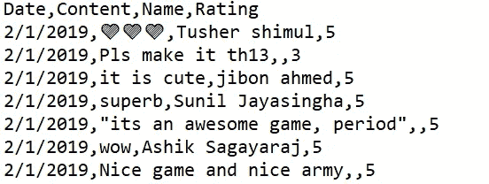
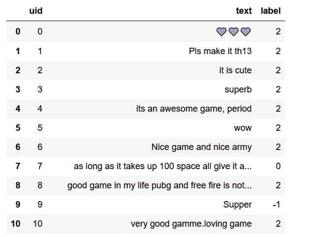

# Python 中基于规则的 App Store 评论情感分析

> 原文：<https://towardsdatascience.com/rule-based-sentiment-analysis-of-app-store-review-in-python-94d8bbfc48bb?source=collection_archive---------34----------------------->

## 利用“VADER”来识别基于用户评论的用户情绪


照片由[威廉·胡克](https://unsplash.com/@williamtm?utm_source=unsplash&utm_medium=referral&utm_content=creditCopyText)在 [Unsplash](https://unsplash.com/@williamtm?utm_source=unsplash&utm_medium=referral&utm_content=creditCopyText) 上拍摄

通过阅读这篇文章，您将学会用 Python 分析和执行基于规则的情感分析。我们将使用名为`VADER`的`Python`包，并在一款名为 Clash of Clan 的手机游戏的 app store 用户评论数据集上测试它。

基于官方文档，VADER (Valence Aware 字典和情感推理器)是:

> …一个基于词汇和规则的情绪分析工具，专门针对社交媒体中表达的情绪*。*

与传统的机器学习方法不同，`VADER`使用的方法是针对社交媒体帖子的。它可能不太适合文学或新闻文章。然而，一个主要的优点是推理时间非常快，您可以在简单的笔记本电脑上顺利运行。

本教程有 3 个部分:

1.  设置
2.  履行
3.  结论

让我们继续下一部分，开始安装必要的模块。

# 1.设置

## Python 包

你可以通过`pip install`在 Python 中轻松安装`VADER`。强烈建议您在继续安装之前创建一个虚拟环境。激活您的虚拟环境并运行以下命令。

```
pip install vaderSentiment
```

在读取数据集时，我们还需要另一个名为`pandas`的模块。通过以下命令安装它:

```
pip install pandas
```

## 资料组

转到下面的[链接](https://www.kaggle.com/moradnejad/clash-of-clans-50000-user-comments)，将整个数据集下载到项目的根目录下。您应该有一个名为`clash-of-clans.csv`的`csv`文件，其中包含以下数据。



在下一节中，我们将编写一些 Python 代码。

# 2.履行

在本教程中，我将使用`Jupyter Notebook`。话虽如此，您也可以在一个`Python`文件中正常运行它。

## 导入

在文件的顶部添加以下导入声明。

```
from vaderSentiment.vaderSentiment import SentimentIntensityAnalyzer
import pandas as pd
```

## 初始化

接下来，初始化`SentimentIntensityAnalyzer`类的一个实例。我们将在每次计算或分析文本的情感时重用这个实例。

```
analyzer = SentimentIntensityAnalyzer()
```

## 数据帧

确保`clash-of-clan.csv`和你的文件在同一个目录下。通过`read_csv`函数加载数据集。如果您将文件存储在其他位置，请修改文件的路径。

```
df_coc = pd.read_csv("./clash-of-clans.csv", encoding="utf-8")
df_coc.head()
```

您应该在控制台上看到以下输出。如果您运行的是 Python 文件而不是 Jupyter Notebook，格式可能会略有不同。


## 情感分析

你可以通过这个模块提供的`polarity_scores`函数来计算单个文本的情感。

```
vs = analyzer.polarity_scores('I felt terrible today')
print(vs)
```

您将得到一个包含 4 个键/值对的字典，如下所示:

```
{'neg': 0.508, 'neu': 0.492, 'pos': 0.0, 'compound': -0.4767}
```

供你参考，

> `pos`、`neu`和`neg`分数是属于每个类别的文本的比例(因此这些应该加起来都是 1...或者用浮动操作接近它)。如果你想对一个给定的句子进行多维度的情感测量，这些是最有用的指标。
> 
> `compound`分数是通过对词典中每个单词的化合价分数求和来计算的，根据规则进行调整，然后归一化到-1(最极端的负面)和+1(最极端的正面)之间。如果你想对一个给定的句子进行单一的一维情感测量，这是最有用的度量。称之为“标准化加权综合得分”是准确的。

通常，阈值设置如下:

*   `positive` — `compound`得分≥ 0.05
*   `negative` — `compound`得分≤ -0.05
*   `neutral` — `compound`在-0.05 和 0.05 之间

创建一个新函数，并在其中插入以下代码。这个函数接受一个输入文本，并基于复合分数返回文本的情感。情感标签包括:

*   `positive` — 2
*   `neutral` — 1
*   `negative` — 0
*   `junk`——-1

```
def calc_vader_sentiment(text):
    sentiment = 1 vs = analyzer.polarity_scores(str(text))
    compound = vs['compound'] if(compound == 0):
        sentiment = -1
    elif(compound >= 0.05):
        sentiment = 2
    elif(compound <= -0.05):
        sentiment = 0 return sentiment
```

一旦创建了上面的函数，创建一个新的由三列组成的`DataFrame`:

*   `uid` —数据的唯一标识符。我们将使用索引作为 uid
*   `text` —用户评论的文本
*   `label` —情感分析得分

运行列表理解中的`calc_vader_sentiment`函数如下

```
df = pd.DataFrame({
    'uid': list(df_coc.index.values),
    'text': df_coc['Content'],
    'label': [calc_vader_sentiment(x) for x in df_coc['Content']]
})
```

它应该需要几秒钟来计算分数，因为我们有大约 50000 行数据。通过运行下面的代码，您可以简单地查看前 10 个结果。

```
df.head(10)
```

您应该会得到以下结果。



## 保存到文件

如果你想把它保存到一个文件中，你可以通过 pandas 模块提供的`to_csv`函数来完成。根据您的偏好修改文件的名称。

```
df.to_csv("sentiment_result.csv", encoding='utf8', index=False)
```

# 3.结论

让我们回顾一下今天所学的内容。

我们首先简要介绍了`VADER`及其功能。然后，我们通过 pip install 安装了必要的模块，并从`Kaggle`下载了`clash-of-clan.csv`数据集。

之后，我们继续实现我们自己的代码，通过使用由`VADER`计算的复合分数来计算用户评论的情感分数。

除此之外，我们还学会了将最终输出保存到一个 csv 文件中，以供将来参考。

感谢你阅读这篇文章。希望在下一篇文章中再见到你！

# 参考

1.  [Vader perspection 官方 Github 页面](https://github.com/cjhutto/vaderSentiment)
2.  [来自 Kaggle 的 Clash of Clans 应用商店用户评论数据集](https://www.kaggle.com/moradnejad/clash-of-clans-50000-user-comments)