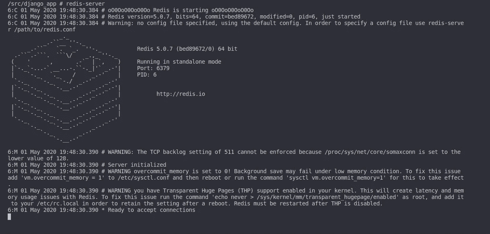
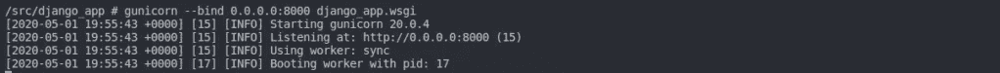
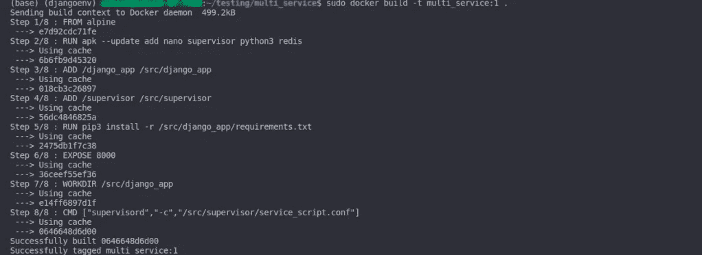
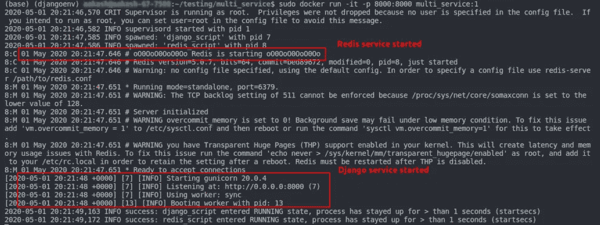
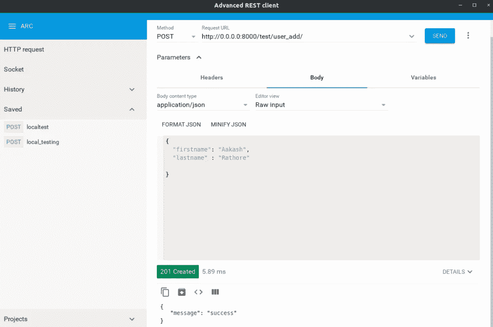
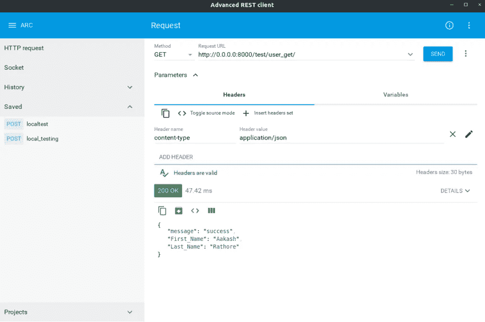

# 使用 Supervisor 在单个 Docker 容器中运行多个服务

> 原文：<https://towardsdatascience.com/run-multiple-services-in-single-docker-container-using-supervisor-b2ed53e3d1c0?source=collection_archive---------12----------------------->


您是否曾经遇到过这种情况，您希望在同一个容器中运行两个或更多的轻量级服务？

虽然 Docker 提供了一个 Docker-compose 工具，用于在多个容器中构建和运行多服务应用程序。Docker-compose 需要一个 YAML 文件来配置您的多个服务。但是有时我们希望在同一个容器中运行两个或更多的轻量级服务。

在本文中，我将解释如何使用“Supervisor”工具在同一个 docker 容器中启动多个服务。

> **那么什么是主管呢？**

管理程序是一种工具，它允许我们像操作系统一样在 Linux 中同时管理多个不同的进程。监督工具需要一个*。conf* 文件，我们在其中指定进程和与该进程相关的不同选项，如*输出日志位置、自动启动、自动重启等。*

> **我将使用的示例服务**

我将在同一个容器中运行两个不同的服务“运行 Django app 的 Gunicorn 服务器”和“Redis 服务器”。因此，在我创建的示例项目中，包含一个简单的 Django REST API，用于从 Redis 服务器添加和获取数据。在生产环境中，这两个服务在具有生产级配置的独立容器中使用。为了便于演示，我将在一个 docker 容器中运行这两个服务。

> **项目目录结构**

开始构建项目的一个好方法是拥有一个整洁清晰的项目结构。因此，考虑到这一点，我们将使用下面的代码目录结构:

```
multi_service
├── django_app
│   ├── db.sqlite3
│   ├── django_app
│   ├── manage.py
│   ├── redis_test
│   └── requirements.txt
├── Dockerfile
└── supervisor
    └── service_script.conf
```

> **在本地测试我们的服务(Django App 和 Redis)**

在 docker 中发布服务之前，首先，让我们在本地测试它们。您可以使用下面的链接从 GitHub 下载完整的项目。
网址:[https://github.com/aakash-rathore/docker_multi_services.git](https://github.com/aakash-rathore/docker_multi_services.git)

要测试 Redis 服务器，只需使用以下命令下载它:

```
Using apt package installer

$ sudo apt-get install redis-server

# Use apk add (For alpine linux)

# apk add redis
```

现在使用以下命令运行服务器:

```
$ redis-serve
```

您将看到服务正在运行:



本地 redis 服务器测试

为了在本地测试 Django 应用程序，我们将使用 Gunicorn 服务器。使用以下命令在 gunicorn 服务器中运行应用程序:

```
$ gunicorn --bind 0.0.0.0:8000 django_app.wsgi
```

该命令的输出如下所示:



在本地运行 gunicorn

> **主管配置文件**

按照上面指定的目录结构创建一个文件***【service _ script . conf】***。按照下面的配置添加 django 和 redis 服务:

```
## service_script.conf

[supervisord]  ## This is the main process for the Supervisor    
nodaemon=true  ## This setting is to specify that we are not running in daemon mode

[program:redis_script] ## This is the part where we give the name and add config for our 1st service
command=redis-server  ## This is the main command to run our 1st service
autorestart=true ## This setting specifies that the supervisor will restart the service in case of failure
stderr_logfile=/dev/stdout ## This setting specifies that the supervisor will log the errors in the standard output
stderr_logfile_maxbytes = 0
stdout_logfile=/dev/stdout ## This setting specifies that the supervisor will log the output in the standard output
stdout_logfile_maxbytes = 0

## same setting for 2nd service
[program:django_service] 
command=gunicorn --bind 0.0.0.0:8000 django_app.wsgi
autostart=true
autorestart=true
stderr_logfile=/dev/stdout
stderr_logfile_maxbytes = 0
stdout_logfile=/dev/stdout
stdout_logfile_maxbytes = 0
```

> **docker 文件创建**

现在我们将开始制作 docker 文件。添加图层的步骤如下:
***基础镜像- >安装所需工具- >添加源代码- >添加配置文件- >启动服务***
最终 Dockerfile 如下:

```
# Base Image
FROM alpine

# Installing required tools
RUN apk --update add nano supervisor python3 redis

# Adding Django Source code to container 
ADD /django_app /src/django_app

# Adding supervisor configuration file to container
ADD /supervisor /src/supervisor

# Installing required python modules for app
RUN pip3 install -r /src/django_app/requirements.txt

# Exposing container port for binding with host
EXPOSE 8000

# Using Django app directory as home
WORKDIR /src/django_app

# Initializing Redis server and Gunicorn server from supervisord
CMD ["supervisord","-c","/src/supervisor/service_script.conf"]
```

> **构建和测试**

最后，使用下面的命令构建 docker 映像:

```
$ docker build -t multi_service:1 .
```

成功构建操作后的输出:



docker 构建成功

现在使用上面构建的映像运行 docker 容器:

```
$ docker run -it -p 8000:8000 multi_service:1
```

这里 docker 容器是在非守护模式下运行的如果你想在守护模式下运行它使用 ***'-d'*** 选项，上面命令的输出:



运行 docker 的输出

让我们在 API 测试工具中测试 django 应用程序，我使用的是一个轻量级的“高级 REST 客户端”,可以在 Google Chrome 扩展商店中找到。您可以使用 Postman、Curl 或任何其他工具进行测试:

测试添加用户功能:



测试添加用户功能

测试获取用户:



测试提取用户功能

> **结论**

在本文中，我解释了如何在一个 docker 容器中运行多个服务(Django app 和 Redis server)。最后，我们还做了一些测试来检查这两个服务是否都在运行。

请在下面留下您对本文的评论，如果您在上面指定的任何步骤中遇到问题，您可以通过 [**Instagram**](https://www.instagram.com/_aakash.rathore/) 和[**LinkedIn**](https://www.linkedin.com/in/aakash-data-engineer)**联系我。**