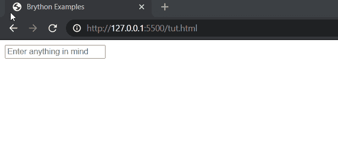
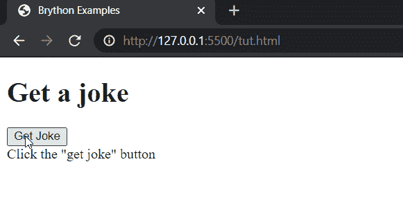
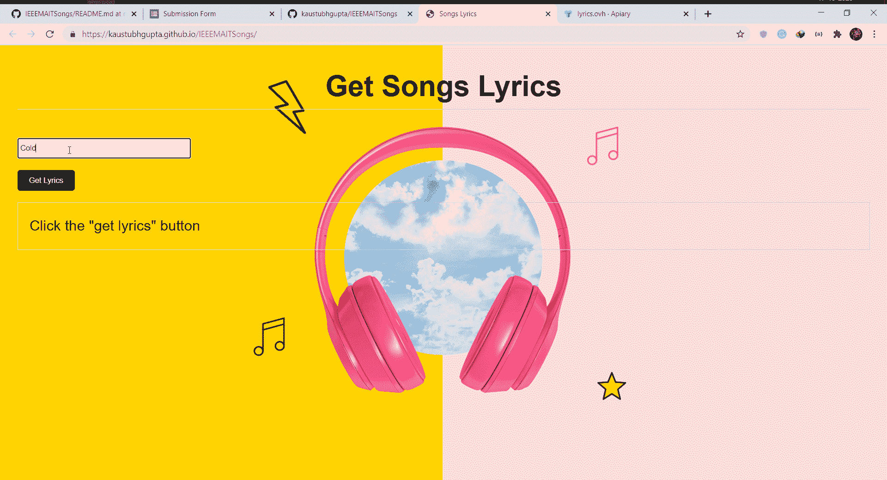

# 在网站上运行 Python 代码:探索 Brython

> 原文：<https://towardsdatascience.com/run-python-code-on-websites-exploring-brython-83c43fb7ac5f?source=collection_archive---------2----------------------->

## Python 中的 JavaScript 等效脚本

作为 Python 的长期追随者，我从未停止对这种语言的探索，每天都在寻找它的实现。在一个晴朗的日子里，我了解了旨在取代 Javascript 的 web 脚本的 Brython。它允许你在网页上直接使用 Python 脚本来处理 DOM(文档对象模型)元素和事件，全部使用我们最喜欢的语言 Python。让我们深入了解如何为你的下一个项目实现这样的脚本，以及我是如何使用这项技术赢得比赛(第二名)的！

在此之前，如果你想探索 Python 的 android 方面，那么一定要看看我在 Medium 上的 Python 系列中的 Android 应用程序。

[](/building-android-apps-with-python-part-1-603820bebde8) [## 用 Python 构建 Android 应用程序:第 1 部分

### 使用 Python 构建 Android 应用程序的分步指南

towardsdatascience.com](/building-android-apps-with-python-part-1-603820bebde8) 

由[卢卡·布拉沃](https://unsplash.com/@lucabravo?utm_source=medium&utm_medium=referral)在 [Unsplash](https://unsplash.com?utm_source=medium&utm_medium=referral) 上拍摄

# 什么是 Brython？

Javascript 被认为是支持网页交互性的网络语言。没有人想浏览可以用 HTML 和一点 CSS 构建的静态页面。Brython 提供了一种使用 Python 与网页元素进行交互的直观方式。在过去，python 也在使用 Django/Flask 的后端脚本中得到应用，允许用户快速开发可扩展的网站。而 Bython 也专注于在客户端应用这一点。从 Brython 开始，您有两种选择:

您在本地下载 Brython 包，然后将它包含在您的文件中。这可以使用 pip 来完成:

```
pip install brython
```

然后在一个空文件夹中，

```
brython-cli --install
```

或者，

直接使用 Brython CDN，它会在新的更新发布后立即更新，让您不必手动更新软件包。

```
<script src="https://cdn.jsdelivr.net/npm/brython@3.8.10/brython.min.js"> </script> <script src="https://cdn.jsdelivr.net/npm/brython@3.8.10/brython_stdlib.js"> </script>
```

# 使用 Brython 做一些基本的事情

让我们复习一些基础知识，开始开发一些很酷的项目。请注意，这要求您对 DOM 有一个基本的了解，熟悉基本的 Javascript 将是一个加分项，尽管不是必需的。在您的 IDE 中，填充一个基本的 HTML 代码，放置一个输入字段和一个带有 id 的 span 标记。另外，使用 script 标记添加 Brython CDN。它可能应该是这样的:

作者代码

现在，使用 Python 脚本将这个输入事件绑定到 span 标记。为此，我们将使用浏览器中的文档。任何类型的脚本都将封装在 text/python 类型的脚本标签中，这也可以在 body 标签下定义。需要做的另一个更改是在 body 标记()中包含 onload="brython()"。这是一个脚本，它将使我们能够实时显示文本:

作者代码

这里，我们使用了浏览器模块中的文档对象将输入(文本)的 id 绑定到函数 show_text()。这个函数使用它们的 id 将输入标记的值分配给 span 标记。这里有一个 GIF 来展示这个 HTML 页面在加载浏览器时做了什么:



作者 GIF

# 再举个例子！

让我们看另一个例子，看看如何使用 Brython 进行 API 调用，这是最令人兴奋的部分。考虑一个场景，您希望主持一个基于 web 的机器学习项目。您创建了一个模型，现在将它作为 API 在任何云平台上使用，比如 Heroku、GCP 或 AWS。作为一名 python 开发人员，您可能不太熟悉 web 开发，并且发现很难处理网站的延迟响应或缓慢加载。你可以使用 GitHub 页面轻松托管你的网站，但它不支持 flask 或 Django 框架(目前)。

为了处理这种情况，您可以轻松地创建一个基本的 HTML 网页(或者使用一点 CSS 从 bootstrap 获得帮助)，要求用户输入所需的参数，然后您的 Brython 脚本向您的模型主机发出请求，您在网页上显示结果。这将有利于网站托管在 GitHub 上，使管理代码库更容易，而且它将一直运行。让我们来看一下创建一个 API 调用来返回一个随机笑话的脚本:

作者代码

首先，查看该文件的输出:



作者 GIF

这里，get joke 按钮被绑定到 API 调用函数，该函数对服务器进行 AJAX 调用，返回结果，然后呈现给显示标签。

# 获胜的剧本

我得到的问题陈述是从给定的 API 中获取歌词，并在网络上显示出来。它需要音乐艺术家作者和我们想要歌词的标题/歌曲名。下面是同样的 GIF:



作者 GIF

如果你想探究这个的源代码，那么这里有 [GitHub 库链接](https://github.com/kaustubhgupta/IEEEMAITSongs)。

# 结论

我们看到了如何使用 Brython 将基于 python 的脚本直接实现到网页中。毫无疑问，就速度、可用性、代码的可维护性和理解性而言，目前 Javascript 是不可替代的。这些 python 脚本需要熟悉 DOM，而只有使用 JS 才能更好地练习和理解 DOM。这最适合那些希望在 web 上展示其后端和前端 python 技能的人。很多人都用 Pygame 和海龟库做过游戏、图形。你可以在谷歌上了解更多。

这就是我的观点，在 medium 上关注我可以收到更多类似这些有趣文章的通知。说完了，合十礼！

## **更新:Brython 的高级使用案例—**

[](https://www.analyticsvidhya.com/blog/2021/07/python-on-frontend-ml-models-web-interface-with-brython/) [## Python 在前端:使用 Brython 的 ML 模型 Web 界面

### 本文作为数据科学博客简介的一部分发表，机器学习是一个迷人的领域…

www.analyticsvidhya.com](https://www.analyticsvidhya.com/blog/2021/07/python-on-frontend-ml-models-web-interface-with-brython/) 

一些链接:

[](/github-action-that-automates-portfolio-generation-bc15835862dc) [## 自动化项目组合生成的 GitHub 动作

### 使用 Python 和基本前端的 Dockerized GitHub 动作。

towardsdatascience.com](/github-action-that-automates-portfolio-generation-bc15835862dc) [](/is-family-group-that-bad-results-will-shock-you-573f64e194be) [## 家庭团体有那么糟糕吗？结果会让你震惊

### 分析 WhatsApp 群聊&构建网络应用

towardsdatascience.com](/is-family-group-that-bad-results-will-shock-you-573f64e194be) [](https://www.linkedin.com/in/kaustubh-gupta-612767ab/) [## Kaustubh Gupta -机器学习作家- upGrad | LinkedIn

### 嗨，我是一名 Python 开发人员，能够进行 Web 抓取、Selenium 自动化、数据科学、后端 Web 开发…

www.linkedin.com](https://www.linkedin.com/in/kaustubh-gupta-612767ab/)