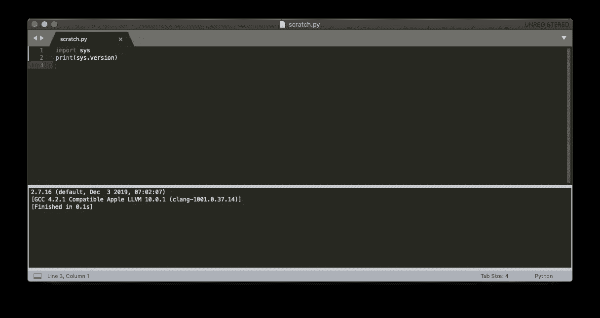
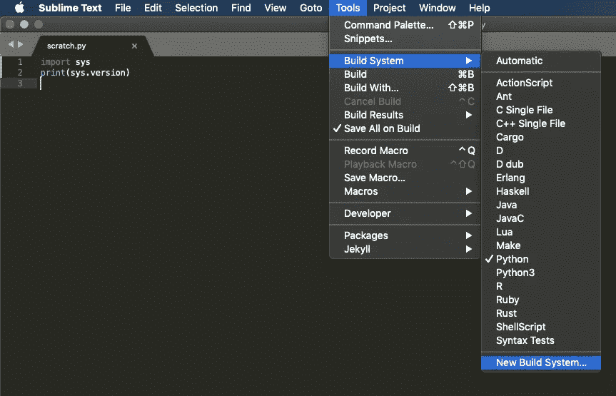
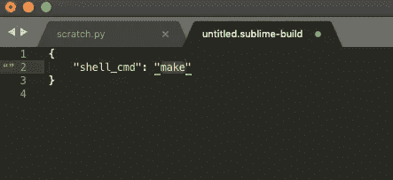
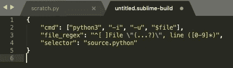
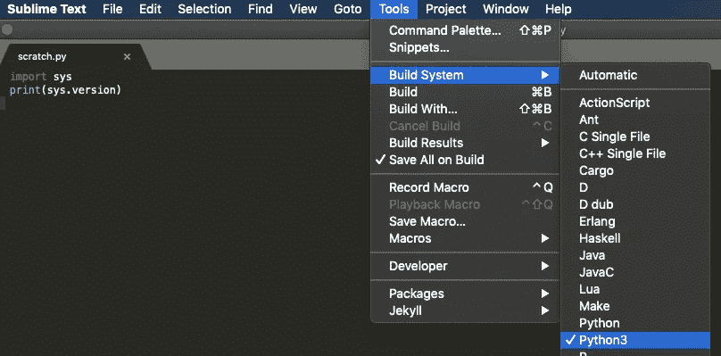
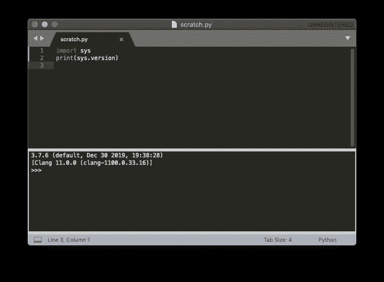

# 在 Sublime Text (Mac)上运行 Python 3

> 原文：<https://towardsdatascience.com/run-python3-on-sublime-text-5949e55450b2?source=collection_archive---------0----------------------->

## 只需要一分钟


弗洛里安·奥利佛在 [Unsplash](/?utm_source=unsplash&utm_medium=referral&utm_content=creditCopyText) 上拍摄的背景照片

Sublime Text 是编程中使用最广泛的轻量级文本编辑器之一。如果你是一个 Python 程序员，你可能没有运行你喜欢的 Python 版本。本教程解释了如何运行 Python 3.7 获得 Sublime 文本。

如果你喜欢视频教程，这是我的 YouTube 视频:

# 检查您的 Sublime 文本使用的是哪个版本

创建新的 Python 文件。我把我的**命名为 scratch.py。在运行 Python 代码之前，将文件保存为. py 扩展名是很重要的。**否则，你将无法执行 Python 代码。此外，拥有一个临时 Python 文件来运行快速代码总是好的。

现在键入以下代码:

```
import sys
print(sys.version)
```

要运行代码，请按下*命令 B* 或转到工具- >构建。



如你所见，我的崇高文本运行的是 Python 2.7。要将此更改为 Python 3.7，我们必须添加一个“**构建系统。**”

# 添加 Python 3 作为构建系统

转到工具->构建系统->新建构建系统..

注意，在我的构建系统列表中，我有 Python 和 Python 3。Python 自动来，运行 2.7。Python3 是我们要添加的。



一旦你点击**新建构建系统…** 你将被带到一个名为 **untitled.sublime-build 的新窗口。**



我们需要更改花括号之间的文本。首先删除括号中的代码。接下来复制并粘贴以下代码:

```
"cmd": ["python3", "-i", "-u", "$file"],     
"file_regex": "^[ ]File \"(...?)\", line ([0-9]*)",     
"selector": "source.python"
```



您可能需要按 Tab 键来缩进第二行和第三行。现在按下*命令 S* 保存文件。将该文件重命名为您希望称为构建系统的名称。简明易懂的东西。我把我的命名为 **Python3** 。**注意，不要改扩展名，必须是。宏伟的建筑。也不要改变路径。** Sublime Text 默认会把它放在正确的路径上。

一旦你点击保存，关闭文件，这样你就回到了你的 **scratch.py** 文件。现在转到 Tools - > Build System，选择 Python3(或任何您命名的构建系统)。如果你没有看到你的新构建系统，你可能需要退出 Sublime Text 并重新打开它。



现在运行相同的代码来测试您使用的 Python 版本。



这就对了，Python 3.7 开始运行了。编码快乐！

如果你想看我在 Sublime Text 中运行 python 3 的视频教程，请点击这个链接:[https://youtu.be/IprbE2C_rsE](https://youtu.be/IprbE2C_rsE)v