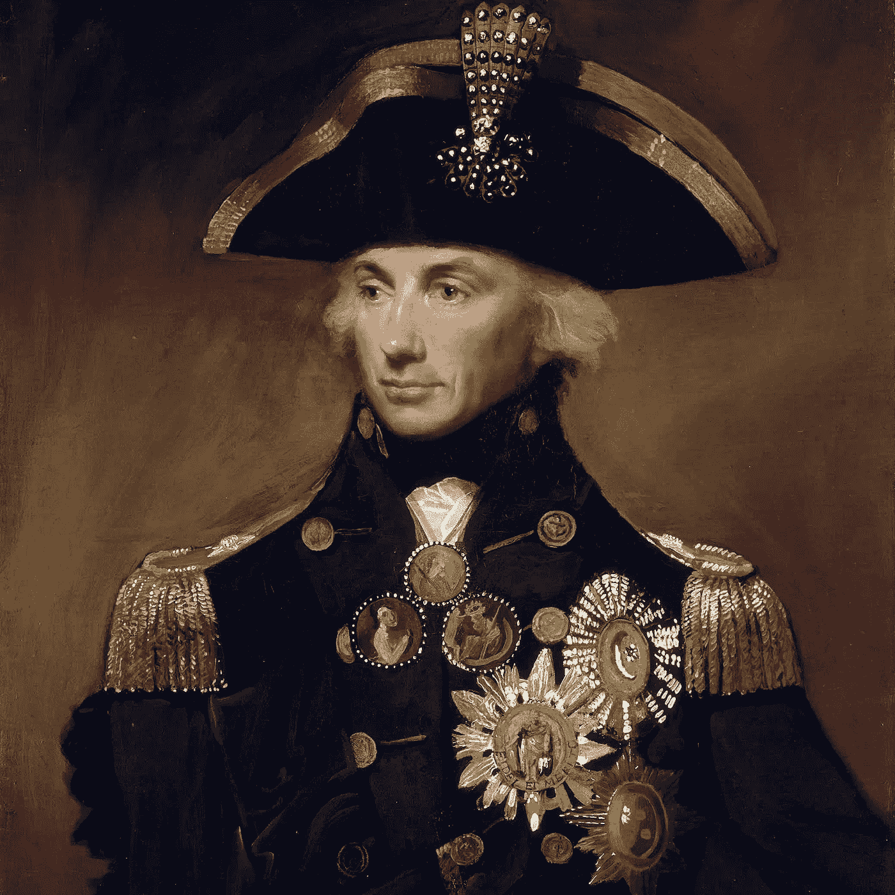
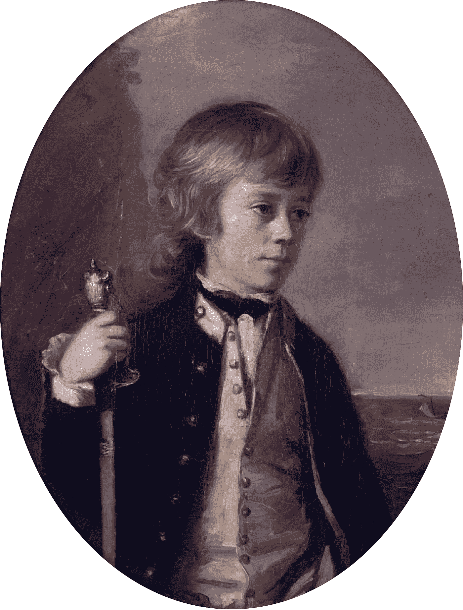
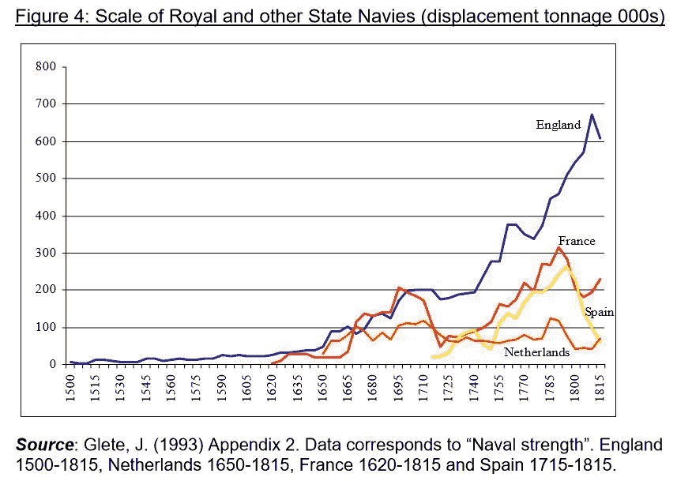

# 像海军上将一样管理您的数据科学团队…

> 原文：<https://towardsdatascience.com/run-your-data-science-team-like-an-admiral-f2f313a837fe?source=collection_archive---------36----------------------->

## 管理一个数据科学团队很难！我们需要从任何可能的地方获取灵感，纳尔逊海军的文化就是一个起点。

勒穆埃尔·弗朗西斯·阿博特的《纳尔逊肖像》

> “如果把自己的船放在敌人的船旁边，任何一个船长都不会做错什么” ***霍雷肖·纳尔逊上将，特拉法尔加战役前，1805 年***

现在请容忍我。我承认这种比较听起来有点牵强。事实上，对西洋镜迷来说，这听起来有点像“法老的商业秘密” **[1]。**然而，我想说服你，关于领导力的一些事情是基本的，作为管理(或渴望管理)数据团队的人，我们应该从更远的地方寻找如何建立团队文化的灵感。追随胜利者通常是值得的，对吗？

首先，我们应该明白纳尔逊既聪明又勇敢。他在特拉法尔加战役前夕的胜利计划是将他的战船排成两行，向法国人发起冲锋。差不多就是这样。他把击沉法国船只的决定权留给了各个指挥官，只要他们认为合适。最终，英国赢得了一场令人震惊的胜利，确保了英国是世界上占主导地位的海上力量——直到大约一个世纪后美国真正开始行动。

这些都很有趣，但这和数据科学有什么关系呢？

首先，让我们看看隐含的领导风格。尼尔森没有为他的队长们提供一份需要完成的任务清单，也没有试图对他们的时间进行微观管理。相反，他告诉他们“只要你在和敌人战斗，你就是在做正确的事情，我会支持你”。换句话说，他提供了一个广泛的目标，并允许他们做任何他们需要做的事情来实现它。

现在，如果你雇佣了合适的人，你的数据科学家将会变得聪明、积极和独立。也许你决定效仿纳尔逊的做法，为自己制定一个远大的目标:

> “如果数据科学家将模型投入生产，他们不会犯很大的错误” ***一些数据科学负责人，在 2019 年的某个时候***

听起来很棒，对吧？发布指令，然后让一群聪明人想出如何做实际工作。与此同时，你可以早点离开，去高尔夫球场(美国)或酒吧(英国)。

要理解为什么这种方法本身行不通，我们可以回到纳尔逊和他的海军。纳尔逊在海军文化的背景下发布了他的命令，这种文化基于一套共享的技能、经验和信仰。他知道他可以相信他的队长会实现他的目标，因为他知道他们如何思考和战斗。

那么这种共享文化是由什么组成的呢？这些与数据科学相关吗？这是我看到的七个相似之处:

1.  **技能很重要**

在纳尔逊的时代，成为一名海军军官的训练要从 12 岁开始。这些孩子在现役战斗舰上服役，在那里他们与一名更有经验的下级军官(他自己通常是青少年)搭档，后者会向他们展示真正的诀窍。

海军军官候补生亨利·威廉·拜恩顿 13 岁(1780 年)。是的，像这样的孩子被放在了火线上。

我找不到这些海军军官候补生的伤亡率，很大程度上是因为似乎没有人对记录它感兴趣。可以说，当幸存者到达指挥位置时，他们从很小的时候就已经积累了大量的技术知识。

你的数据科学团队必须了解大量技术和事实材料。我们将在另一篇文章中回到技术到底是什么。现在让我们说它是软件技能、统计学和机器学习的某种结合。数据科学负责人的部分工作是确保团队拥有这些技能。传统上，这意味着从组织外部雇佣人员。然而，随着数据科学在大型组织中的地位越来越稳固，它也成为毕业生轮换计划或类似计划中年轻内部候选人的热门选择。确保合适的人得到合适的培训是这项工作的一个重要部分。最后，就像尼尔森的队长一样，你必须确信你团队中的每个人都知道并理解一个共享的知识体系。

**2。练习，练习，练习**

特拉法尔加战役之前，法国被封锁。这就是英国对拿破仑大陆封锁的回应——你们没有封锁我们，是我们封锁了你们！英国船只连续几个月滞留在海上，扰乱了法国的贸易。这实际上是把法国军舰困在港口里。到特拉法尔加战役时，英国水手只是更擅长航海，并不是因为他们有什么天生的优势，而仅仅是因为他们做得更多。

数据科学团队的成员必须通过研究数据科学来提高数据科学水平。这听起来微不足道，但它提出了平衡的难题。你必须推动人们获得适合他们的体验。有些任务是人们想做的，因为他们以前做过，并且擅长做。然后是人们想做的任务，因为他们以前从未做过，希望 ***让*** 擅长它们。最后，有些任务没人想做，因为它们很无聊。不管怎样，你必须确保合适的人得到合适的体验，并且所有必要的工作都完成了。最后，就像英国船上的船长站在海上一样，你需要对你团队的经验充满信心。

**3。扁平层级**

纳尔逊用莎士比亚的短语“一帮兄弟”来形容他和他的高级队长的关系。他似乎认为自己是平等者中的第一人，历史学家认为这表明了“为国家服务的社会平等”。纳尔逊总是在重大交战前咨询一群船长，以检查和改进他的计划。

作为数据科学的负责人，你必须与团队的高级成员保持良好、开放的关系。他们会知道你不知道的事情，会有你没有的经历。你需要利用这些知识。然而，扁平层级的危险在于，你最终会得到“偶然的层级”，在这种层级中，有人最终会占据主导地位。如果这是一个*# iamverysmart***【3】***的人，他肯定，肯定知道所有的答案，那么你试图培养的开放文化正在被摧毁。在这种情况下，你只需要让某个人成为临时领导，这个人必须具备维持开放性的必要个性。这可能不是那个认为应该是他们的人！我们要达到的目的是尼尔森成功实现的。没有人怀疑纳尔逊拥有舰队的最终指挥权，船长对他们的船只负有责任。然而，这种层级是足够扁平的，以至于计划可以被共同讨论和改进。*

***4。成功孕育成功***

*胜利很重要。在特拉法尔加战役之前，英国海军赢得了一系列战役:1794 年 6 月 1 日的辉煌战役、1795 年的格罗依战役、1797 年的圣文森特角战役、1797 年的坎伯唐战役、1798 年的尼罗河战役和 1801 年的哥本哈根战役。到了 1805 年，他们预计会赢，而且他们确实赢了。*

*作为个人，你的数据科学家应该已经有了“精英”心态。他们可能已经在大学、学术界，或者更好的是在工作场所取得成功，发展了这一点。你的工作是将这转化为精英 ***团队*** 的心态。最后，当项目开始出错时，你会看到人们做非凡的事情，因为“交付是我们的工作”。在这种文化中，一个失败的项目是不可想象的。然后，这种成功反馈到团队是成功团队的共同信念中，这产生了更多的努力工作以带来更多的成功，如此循环。正如纳尔逊的海军一样，成功的文化孕育着更多的成功。*

***5。精英管理规则***

*好吧，我们不应该过分强调这一点。按照现代标准，纳尔逊和他同时代的人都是“男性，脸色苍白”。然而，以下是对他们背景的描述:*

> *“作为一个乡村牧师的儿子，他(纳尔逊)来自从下层绅士到中产阶级的广泛社会阶层，正是这些阶层为皇家海军提供了如此多的军官。他可能会与他同时代的国旗名单圣文森特，邓肯，康华里，基思，加德纳，甘比尔，科林伍德，和兄弟 Bridport 和胡德；圣文森特的父亲是一个省律师，邓肯的邓迪教务长，加德纳的一名军官，甘比尔的巴哈马副总督，科林伍德的一个商人，和胡德的另一个牧师。***【5】****

*当大陆海军由贵族子弟领导的时候，英国海军是根据功绩从中产阶级中提拔的。*

*您的数据科学团队必须保持不变。不管你喜不喜欢，你正处于一场激烈的资源争夺战中。如果你是一个面向内部的团队，会有一堆人想要外包你。如果你是对外面对，会有几十个饥渴的竞争对手。像尼尔森一样，你需要你能得到的最好的人，不考虑任何其他因素。*

***6。卡在***

*1757 年 3 月 14 日，海军上将约翰·宾被行刑队处决。根据军事法庭的说法，面对敌人，他“没有尽最大努力”。历史学家认为，Byng 被处决是为了解决启蒙运动观点和更古老、更血腥的战争观点之间的争论，启蒙运动认为战争现在是关于科学的兵力部署(在这种情况下，按照命令在优势敌人面前撤退是合理的行动过程)。更简洁地说，按照伏尔泰的说法，他被处决是为了“鼓励其他人”。不管是什么原因，从 Byng 时代到 Trafalgar 时代及以后，皇家海军的行动经常带有极端侵略性。宁可死在敌人手中，也不要被行刑队羞辱。*

*当然，你不希望你的数据科学家表现出极端的攻击性。你可能也不会被允许执行其中的任何一个——尽管这听起来很诱人。然而，在每个数据科学项目的某个时候，你会将已经完成的工作抛在身后，不得不依靠你的能力去做一些新的事情。这可能很可怕，但这是工作的一部分！你的团队文化必须鼓励大胆的“能行”精神，鼓励人们迈出未知的第一步。就像纳尔逊的海军一样，当事情看起来很困难时退缩是不能容忍的。*

***7。资源决定成败***

*资源对纳尔逊海军的影响可以用下面的图表来概括:*

**

**事实证明，钱很重要。详细讨论见[4]。**

*实际上，到特拉法尔加时代，英国人已经比他们的大陆对手多花了两个半世纪。他们有更多的船，更多的枪和更多的战士。这是他们不断获胜的一个重要原因。*

*在数据科学的旧时代，传说你可以给一个聪明人一支圆珠笔，一个新的记事本和一台计算机。然后你可以退一步，期待他们创造奇迹。那个世界已经结束了——如果它曾经存在过的话。你的团队在一个由大型科技巨头、经验丰富的外部咨询公司和专注的初创企业提供的 API 组成的宇宙中工作。它将受到可支配资源的限制，受限于工时、计算资源以及花费在数据质量和数量上的资源。因此，你需要对什么是可能的持现实态度，并将你要解决的问题与你必须投入的资源相匹配。最后，就像尼尔森一样，比你的直接竞争对手规模更大会有所帮助——如果这不可能，至少在相同的支出水平上。*

*这就是为什么你的数据科学团队应该像尼尔森的海军一样的七个原因。归根结底，这不是你为团队设定的广泛目标。这是容易的部分。难的是建立你设定目标的文化和环境，所以你可以相信你的团队会成功实现。*

***脚注***

***【1】**如果你不是一个西洋镜迷，你几乎肯定应该是。这是一部英国情景喜剧，在 channel4.com 和网飞播出。《法老的商业秘密》这一集的精彩之处在于，它讲述了一个主角试图让他的白痴商业书籍[出版](https://www.youtube.com/watch?v=Zg6j9mlw7Wo)。*

*请看弗朗兹·库切的《为了政党还是国家:爱德华时代英格兰的民族主义和流行保守主义的困境》。是的，我知道纳尔逊不是爱德华七世时代的人，但第一章涵盖了之前的几年。毕竟是历史书。*

***【3】**#我很聪明的人们的闪避诱发震中当然是[https://www.reddit.com/r/iamverysmart/](https://www.reddit.com/r/iamverysmart/)*

***【4】**皇家海军从 1653 年特克萨尔战役胜利到 1805 年特拉法尔加战役胜利的全要素生产率。帕特里克·卡尔·奥布莱恩*

***【5】**纳尔逊与英国海军:航海术、领导力、独创性。*北美罗杰**

***【6】**男子气概、军国主义和十八世纪文化，1689-1815。朱莉娅·巴尼斯特*