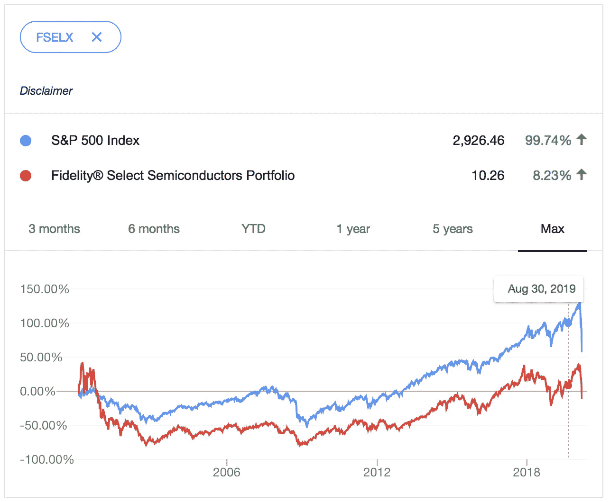
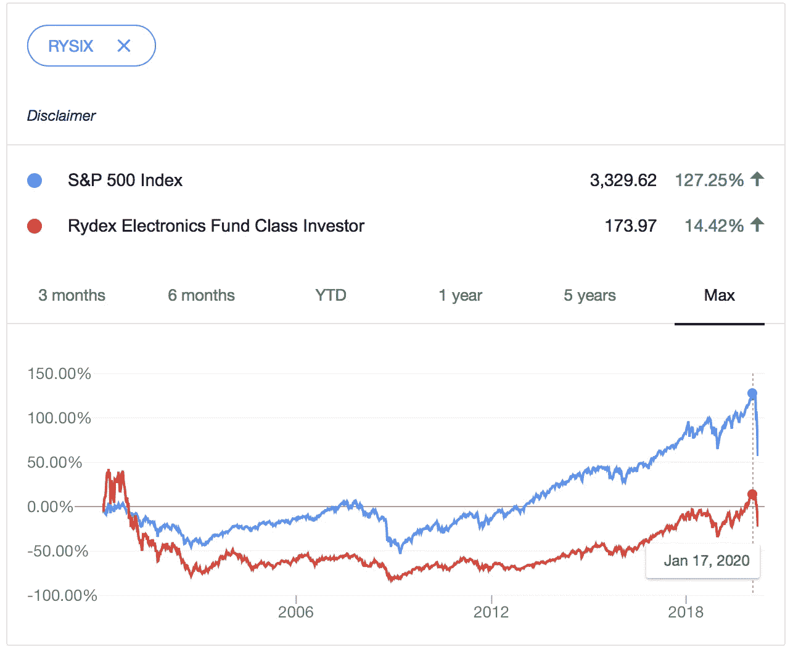
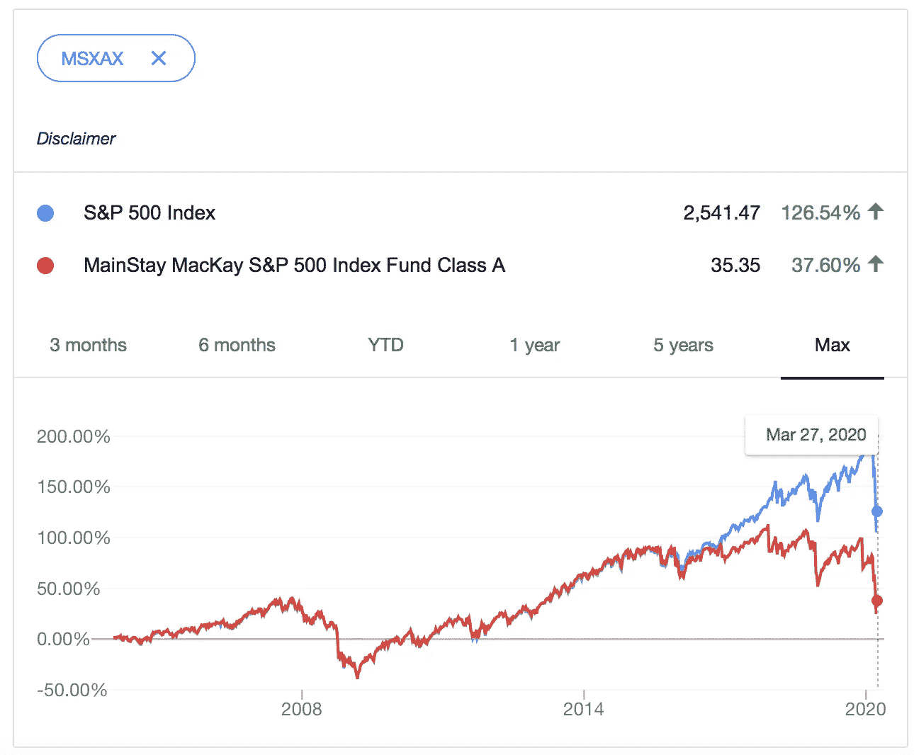
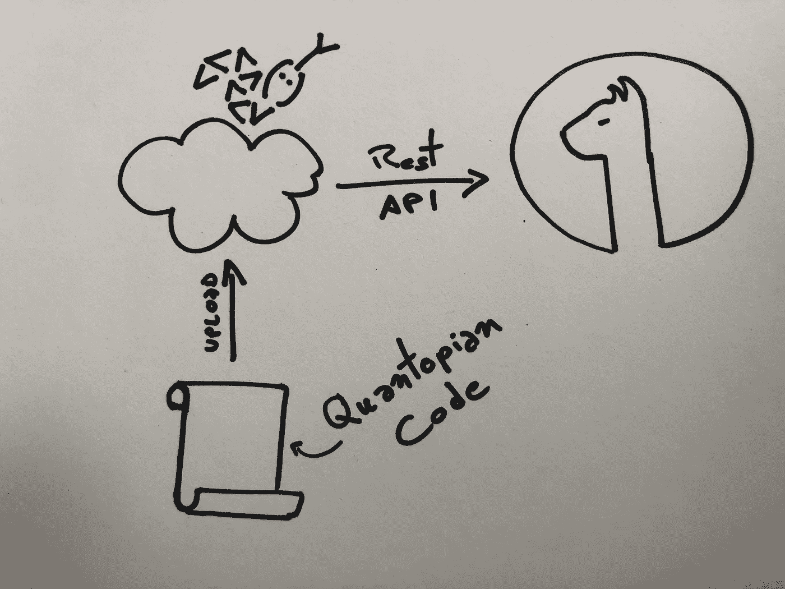
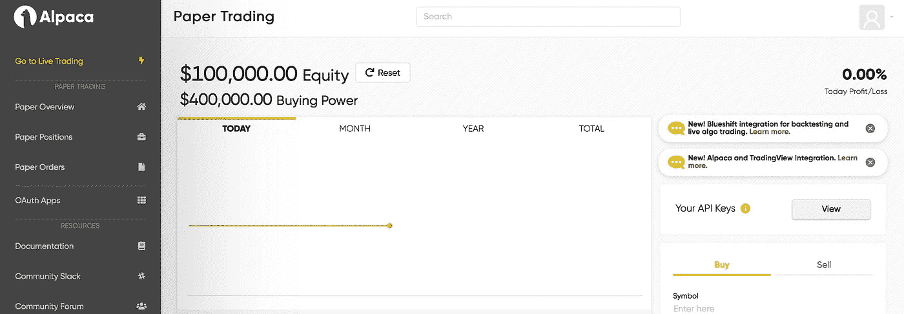
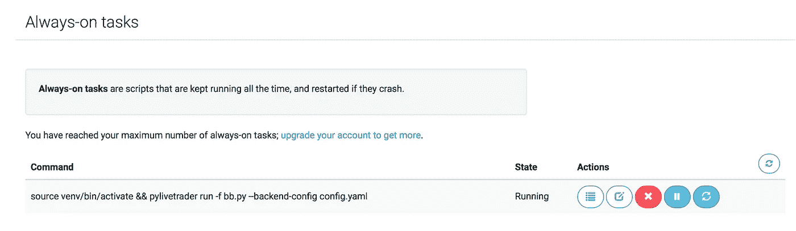

# 运行你的第一个交易算法！

> 原文：<https://towardsdatascience.com/run-your-first-trading-algorithm-46dbd5b1cb7c?source=collection_archive---------24----------------------->

## 编码或选择一个算法，回测它，并使用羊驼中的纸张或货币帐户运行它。


菲利普·格利克曼在 [Unsplash](https://unsplash.com?utm_source=medium&utm_medium=referral) 上的照片

**免责声明:本文内容不构成理财建议。这只是一个关于如何为交易机器人建立基础设施的教程。**

# 动机

一张图片胜过千言万语。请看下面 S&P500 指数和一些组成 ML 401k 投资组合的共同基金的表现比较，并做出你自己的结论。

(*来源:*[*https:/finance . Yahoo . com*](https://finance.yahoo.com))



S&P500 vs FSELX



S&P500 对雷西斯



S&P500 对 S&P500？

正如你所看到的，这些共同基金的表现与 S&P500 相比并没有那么好。除此之外，获取这些基金的业绩/风险指标并不简单。夏普比率，最大下降，阿尔法，贝塔——祝你好运。

> 我们不应该盲目地依赖公司来管理我们的财务。归根结底，这是我们的未来，我们对此最感兴趣。

但是谁有时间管理投资组合呢？这就是我们需要自动化的原因。

让我们看看如何部署我们的第一个交易算法。

# 建筑

你需要:

*   **量子密码。**自己写或者在社区搜索。那里有很多好东西，但鉴于目前新冠肺炎市场的波动性，我建议采取市场中性策略(小市场相关性，小贝塔)。
*   **PythonAnywhere 账户**(你需要 5 美元/月的计划):[https://www.pythonanywhere.com/](https://www.pythonanywhere.com/user/cunha/)
*   **羊驼账号**(免费！)
    [https://alpaca . markets](https://alpaca.markets)



我应该成为一名艺术家。

# 建立基础设施

1.  **羊驼**

一旦您创建并验证了您的羊驼账户，点击“转到纸质账户”并点击“您的 API 密钥”中的“查看”按钮。记下 key_id、secret_key 和 base_url。



2. **PythonAnywhere**

**创建虚拟环境**


《时代》杂志 2015 年虚拟现实封面催生了一个经典迷因。Pic: @PellyNV

我们先用 python 3.6 创建一个虚拟环境，安装 *pylivetrader。*

> Pylivetrader 是让羊驼理解量子算法的软件包。这个包允许您获得 Quantopian 和 Alpaca 的算法订单执行的回溯测试功能，所有这些都与 PythonAnywhere 粘合在一起，同时在云中不间断地运行。

在创建和升级你的账户(最便宜的计划)后，你需要用 Python 3.6 创建一个虚拟环境并安装 *pylivetrader。*

在 PythonAnywhere 上打开 bash 并键入以下命令:

```
$ python3.6 -m venv venv
$ source venv/bin/activate
(venv)$ pip install pylivetrader
```

**注意 *pylivetrader* 将只与 Python 3.6 一起工作。**

安装在虚拟环境中的所有包只能在同一个虚拟环境中访问，这里称为' *venv* '。' *venv* '内部的 Python 版本也将被限制为 3.6(在这种特殊情况下)；然而，您仍然可以使用' *venv* '之外的其他 python 版本。为此，只需输入 deactivate。

```
(venv)$ deactivate
```

您可以通过键入以下内容直接跳回虚拟环境:

```
$ source venv/bin/activate
```

**上传量子算法**

关闭 bash 并转到“*文件*”，创建一个名为 *algo.py 的新空文件，并粘贴以下代码:*

```
from pylivetrader.api import order_target, symbol

def initialize(context):
    context.i = 0
    context.asset = symbol('AAPL')

def handle_data(context, data):
    # Compute averages
    # data.history() has to be called with the same params
    # from above and returns a pandas dataframe.
    short_mavg = data.history(context.asset, 'price', bar_count=100, frequency="1m").mean()
    long_mavg = data.history(context.asset, 'price', bar_count=300, frequency="1m").mean()

    # Trading logic
    if short_mavg > long_mavg:
        # order_target orders as many shares as needed to
        # achieve the desired number of shares.
        order_target(context.asset, 100)
    elif short_mavg < long_mavg:
        order_target(context.asset, 0)
```

保存并关闭它。我们需要一个配置文件来访问羊驼；还记得 api_key 和 secret 吗？我们现在需要它们。

创建一个名为 *config.yaml* 的新文件，并添加以下定义 *:*

```
key_id: 'your key_id'
secret: 'your secret'
base_url: [https://paper-api.alpaca.markets](https://paper-api.alpaca.markets)
```

保存并关闭它。我们差不多完成了:最后要做的事情是安排一个将在云中不间断运行的任务。

转到“任务”，一直向下滚动到“*始终在线任务*”，然后键入以下命令:

```
source venv/bin/activate && pylivetrader run -f algo.py --backend-config config.yaml
```

稍后，任务将开始运行:



最后，进入你的羊驼纸账户，检查订单是否通过。

一旦你准备好用真钱开始，为你的钱帐户获得 api 密钥和秘密，并更新 config.yaml 文件。

# 结论

在本文中，我们使用 PythonAnywhere 和 Alpaca 完成了运行 Quantopian 算法的步骤。

根据您的算法，您可能需要包含更多的导入以使其工作。您可以在这里找到每种情况下需要导入的包的列表:

[https://alpaca . markets/docs/alpaca-works-with/zip line-to-pylivetrader/](https://alpaca.markets/docs/alpaca-works-with/zipline-to-pylivetrader/)

最后，如果你决定运行你的羊驼货币账户，我强烈建议使用市场中性算法(空头和多头头寸比例相等)。我的苹果股票布林线交易算法一直很好地应对了冠状病毒危机引起的波动。可以在这里查看:[https://towards data science . com/back testing-bollinger-bands-on-apple-stock-using-quanto pian-6be 2e 4824 f 43](/backtesting-bollinger-bands-on-apple-stock-using-quantopian-6be2e4824f43)

我希望你喜欢这篇文章！请不要犹豫评论或分享您的结果。

谢谢

***来自《走向数据科学》编辑的提示:*** *虽然我们允许独立作者根据我们的* [*规则和指导方针*](/questions-96667b06af5) *发表文章，但我们不认可每个作者的贡献。你不应该在没有寻求专业建议的情况下依赖一个作者的作品。详见我们的* [*读者术语*](/readers-terms-b5d780a700a4) *。*