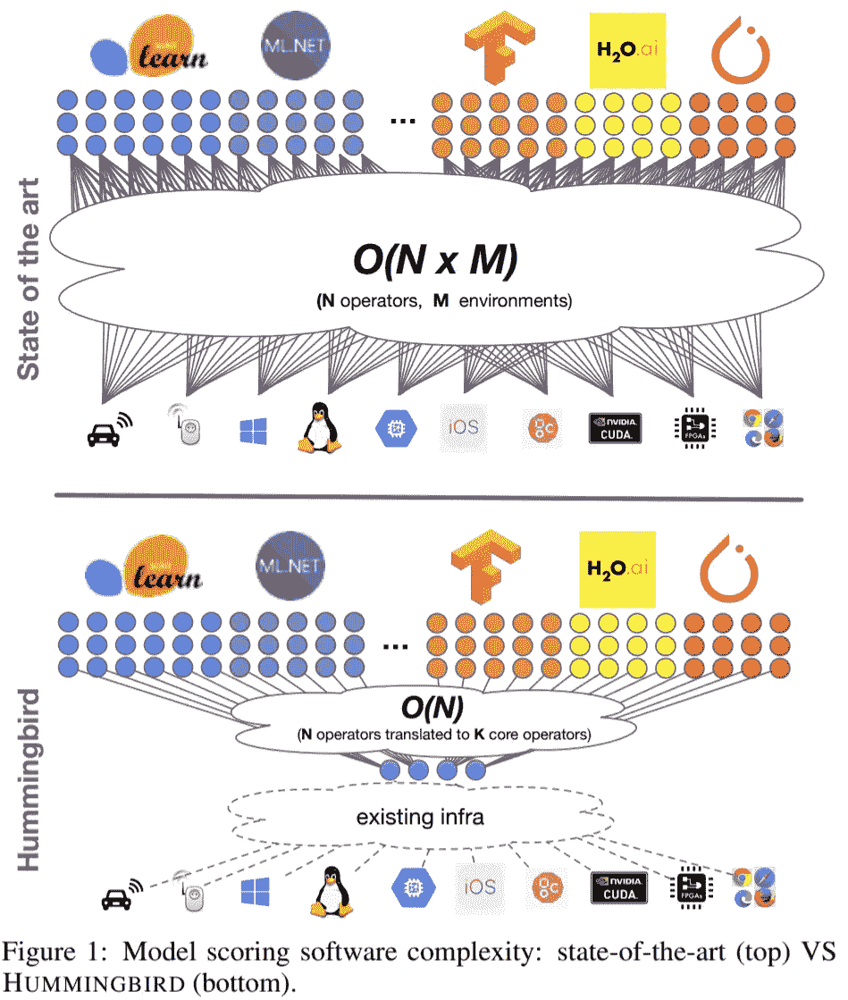
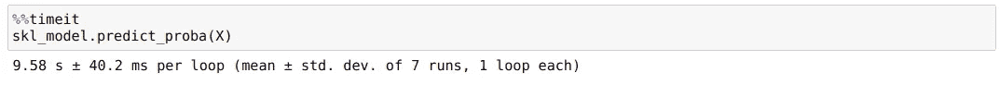
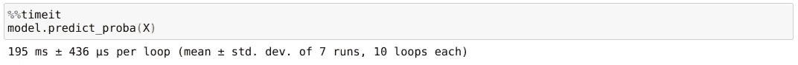
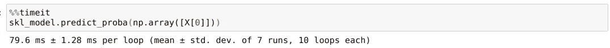
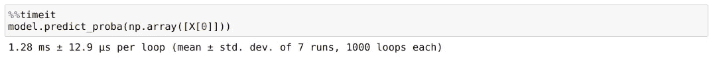
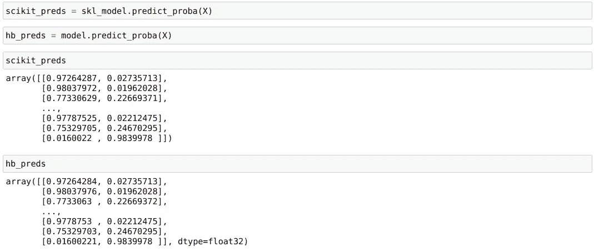

# 如何将你的 ML 模型预测速度提高 50 倍？

> 原文：<https://towardsdatascience.com/run-your-machine-learning-predictions-50-times-faster-3ad2f4ee5819?source=collection_archive---------9----------------------->


图片由来自 [Pixabay](https://pixabay.com/?utm_source=link-attribution&utm_medium=referral&utm_campaign=image&utm_content=3388999) 的[斯蒂芬·凯勒](https://pixabay.com/users/KELLEPICS-4893063/?utm_source=link-attribution&utm_medium=referral&utm_campaign=image&utm_content=3388999)拍摄

## 使用蜂鸟只用了 2 行代码

随着这么多计算和服务框架的出现，开发人员将一个模型投入[生产](/take-your-machine-learning-models-to-production-with-these-5-simple-steps-35aa55e3a43c)的压力与日俱增。如果哪种模型在我的数据上表现最好的问题还不够，现在的问题是选择什么框架来服务于用 Sklearn 或 LightGBM 或 [PyTorch](/moving-from-keras-to-pytorch-f0d4fff4ce79) 训练的模型。每天都有新的框架加入进来。

那么，对于一个数据科学家来说，是否有必要学习一个不同的框架，因为一个数据工程师对此很熟悉，或者相反，一个数据工程师是否需要学习一个数据科学家喜欢的新平台？

再加上这些不同框架提供的速度和性能因素，问题突然变得更加复杂。

所以，当我最近在 Github 上偶然看到[蜂鸟](https://github.com/microsoft/hummingbird)项目时，我感到惊喜，这个项目旨在回答这个问题，或者至少朝着正确的方向迈出了积极的一步。

# 那么，蜂鸟是什么？



*根据他们的文件:*

> *Hummingbird* 是一个用于将训练好的传统 ML 模型编译成张量计算的库。*蜂鸟*允许用户无缝地利用神经网络框架(如 [PyTorch](https://pytorch.org/) )来加速传统的 ML 模型。
> 
> 得益于*蜂鸟*，用户可以受益于:
> 
> (1)在神经网络框架中实现的所有当前和未来的优化；
> 
> (2)原生硬件加速；
> 
> (3)具有支持传统和神经网络模型的独特平台，并且具有所有这些
> 
> (4)无需重新设计他们的模型。

更简单地说:现在，您可以将用 Scikit-learn 或 [Xgboost](/lightning-fast-xgboost-on-multiple-gpus-32710815c7c3) 或 LightGBM 编写的模型转换成 PyTorch 模型，并在推理时获得 Pytorch 的性能优势。

*到目前为止，这里是蜂鸟支持的* [操作者的列表](https://github.com/microsoft/hummingbird/wiki/Supported-Operators)还会有更多。

# 简单的例子

我们可以从安装蜂鸟开始，简单如:

```
pip install hummingbird-ml
```

为了使用 hummingbird，我将从一个小型随机[分类](/the-5-classification-evaluation-metrics-you-must-know-aa97784ff226)数据集的最小示例开始。我们首先创建一个包含 100，000 行的样本数据集，并在此基础上使用 RandomForestClassifier。

```
import numpy as np
from sklearn.ensemble import RandomForestClassifier
from hummingbird.ml import convert# Create some random data for binary classification
from sklearn import datasetsX, y = datasets.make_classification(n_samples=100000, n_features=28)# Create and train a model (scikit-learn RandomForestClassifier in this case)skl_model = RandomForestClassifier(n_estimators=1000, max_depth=10)
skl_model.fit(X, y)
```

hummingbird 帮助我们的是通过使用简单的命令将这个 sklearn 模型转换成 PyTorch 模型:

```
# Using Hummingbird to convert the model to PyTorch
model = convert(skl_model, 'pytorch')
print(type(model))
--------------------------------------------------------
hummingbird.ml._container.PyTorchBackendModel
```

现在，我们可以使用以下代码将新的 Pytorch 模型加载到 GPU:

```
model.to('cuda')
```

这太棒了。因此，我们可以从 sklearn 模型转换为 PyTorch 模型，这应该在 GPU 上运行得更快。但是增加多少呢？

让我们来看一个简单的性能对比。

# 比较

## 1.成批处理方式

我们将首先使用 sklearn 模型来预测整个训练数据集，并检查它所花费的时间。



我们的新 PyTorch 型号也可以做到这一点:



那就是 9580/195 ~ 50x 的加速。

## 2.单实例预测

我们在这里预测一个例子，看看这个模型在实时环境中的表现。sklearn 模型:



vs. Pytorch 模型



这也是 79.6/1.6 ~ 50 倍的加速比。

# 小警告

我经历的一个小警告是，sklearn 模型和蜂鸟 PyTorch 模型的预测并不完全相同。

例如，下面是我从两个模型中得到的预测:



是的，有时，它们在第 7 位数字上不同，这可能是转换过程的一个函数。我认为它不会改变最终的 1 或 0 预测太多。我们还可以检查:

```
scikit_1_0 = scikit_preds[:,1]>0.5 
hb_1_0 = hb_preds[:,1]>0.5 
print(len(scikit_1_0) == sum(scikit_1_0==hb_1_0))
------------------------------------------------------------
True
```

因此，在这种情况下，两个模型对 100，000 行的整个数据集给出了完全相同的 1 或 0 预测。

所以我想没关系。

# 结论

微软的开发人员仍在致力于添加更多的操作符，从模型到特性工程，如代码中的`MinMaxScaler`或`LabelEncoder`，我希望他们能进一步开发和改进这个项目。如果你感兴趣，这里是发展的路线图。

虽然 Hummingbird 还不完美，但它是第一个能够运行经典 ML 推理 DNN 框架的系统，并证明它们足够成熟，可以用作通用编译器。当涉及到在高吞吐量或延迟时进行预测时，我会尝试将它包含在我的开发工作流中。

你可以在我的 [GitHub](https://github.com/MLWhiz/data_science_blogs/tree/master/hummingbird) 库找到这篇文章的代码以及我所有的文章。

## 继续学习

如果你想了解更多关于构建机器学习模型并将其投入生产的知识，这个关于 AWS 的[课程可以满足你的要求。](https://coursera.pxf.io/e45BJ6)

谢谢你的阅读。将来我也会写更多初学者友好的帖子。在[媒体](https://medium.com/@rahul_agarwal?source=post_page---------------------------)关注我，或者订阅我的[博客](http://eepurl.com/dbQnuX?source=post_page---------------------------)了解他们。一如既往，我欢迎反馈和建设性的批评，可以通过 Twitter [@mlwhiz](https://twitter.com/MLWhiz?source=post_page---------------------------) 联系

此外，一个小小的免责声明——这篇文章中可能会有一些相关资源的附属链接，因为分享知识从来都不是一个坏主意。