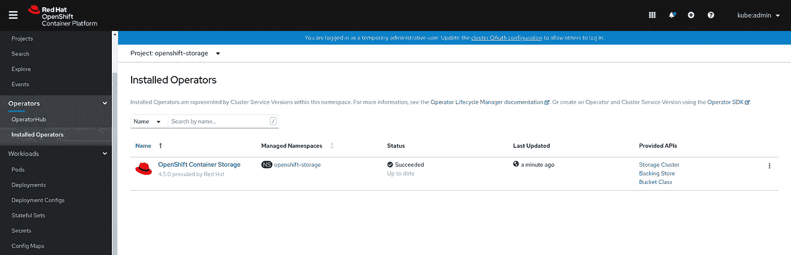
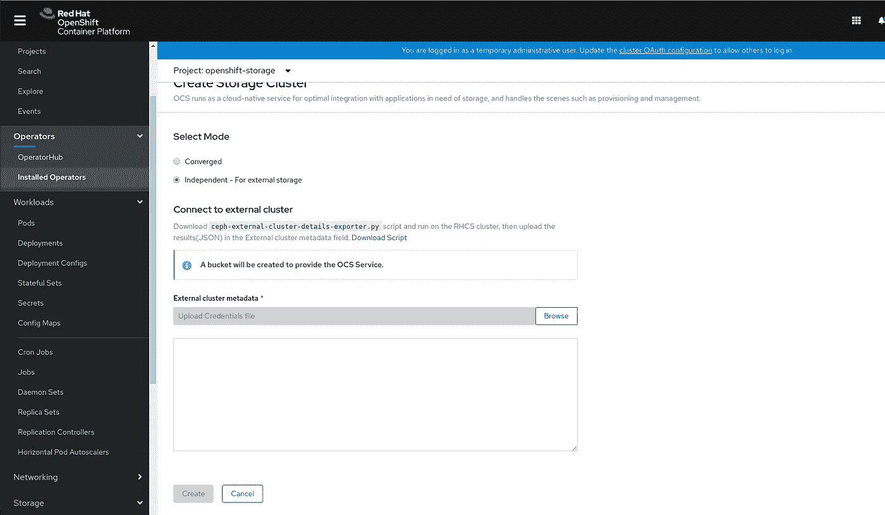
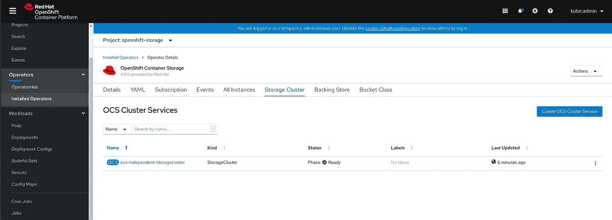
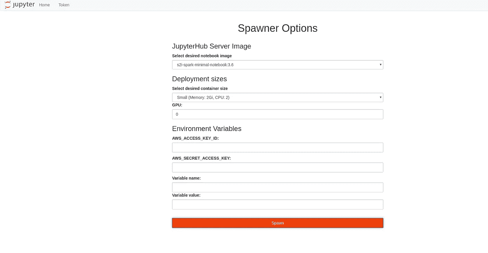

# 使用 OpenDataHub、OCS 和外部 Ceph 集群运行 Spark 数据处理工作负载

> 原文：<https://towardsdatascience.com/run-your-spark-data-processing-workloads-using-opendatahub-ocs-and-an-external-ceph-cluster-8922f166f884?source=collection_archive---------32----------------------->


[ev](https://unsplash.com/@ev?utm_source=medium&utm_medium=referral) 在 [Unsplash](https://unsplash.com?utm_source=medium&utm_medium=referral) 上的照片

Kubernetes 已经成为事实上的标准容器编排平台。通过这种方法，组织试图围绕 Kubernetes 收集所有的应用程序和平台，以利用其稳定性、敏捷性和简单性。在 Kubernetes 中运行您的整个堆栈将允许您拥有一个单一的 API 和一种通用语言，无论是用于需要部署的应用程序、数据库还是存储引擎。

几年前，人们认为，为了获得更高的大数据工作负载性能，您的应用程序需要主要基于闪存介质的高性能本地磁盘。将计算和存储放在一起带来了自身的挑战，主要是在出现故障和升级时，因为组织必须将它们作为一个整体来对待。

今天，我们看到许多数据处理引擎，如 Spark、Presto 等使用 S3 作为存储后端。使用 S3 处理大数据工作负载有多种原因:

*   S3 是一个面向吞吐量的存储系统，可以支持来回传输大量数据
*   S3 是基于 HTTP 的，当必须开发一个连接器来访问它时，它是非常可移植的
*   S3 拥有自己的智能数据管理功能，如存储桶生命周期、存储类别、版本控制等，可以减轻最终用户的数据管理负担

今天，我想和你重点谈谈如何使用 S3 存储后端在 Kubernetes 上运行你的数据处理引擎。为此，让我们简单介绍一下我们将要使用的平台:

*   Ceph —将用作 Openshift 集群外部的 S3 网关
*   Openshift 集装箱存储—将为我们提供类似 Kubernetes 的功能来处理我们的 S3，将在稍后讨论
*   开放式数据中心——将用作我们的 spark 集群和 Jupyter 笔记本电脑的数据处理供应器，以运行我们的 Spark 工作负载

# 先决条件

*   正在运行的 Openshift 4.5 集群
*   正在运行的 RHCS 4.1 集群
*   这两者之间的网络连接

我们要部署的第一个组件是 OCS (Openshift Container Storage ),它将成为我们 S3 存储后端的 Kubernetes 管理平台。使用昨天发布的 OCS 4.5，您可以将外部 Ceph 集群连接到 OCS 管理平面，以利用其资源。这种部署方法称为“独立模式”,主要用于正在处理的工作负载和容量超过 OCS 内部模式处理能力的情况。(内部模式将在 Openshift 上运行您的 Ceph 集群，这对于中小型数据工作负载非常有用)。

让我们连接到 Openshift 集群，进入`Operator Hub`选项卡，并安装 OCS 操作符。该运营商将部署我们的 OCS 管理平台，并将连接到外部 Ceph 集群:



安装好操作员后，让我们创建一个独立的集群，为此我们点击`Create Storage Cluster`和`independent mode`。这将要求在我们的 Ceph 集群上运行一个脚本，该脚本将收集将 OCS 连接到我们的外部 Ceph 集群所需的所有信息。该脚本将抛出一个 JSON 文件到 STDOUT，请将它粘贴到代码片段中。



创建集群后，我们应该让它处于`Ready`状态:



现在我们已经准备好了 S3 后端，让我们创建一个`Object Bucket Claim`,这样我们的 Spark 应用程序就可以使用它来处理数据。OBC(对象桶声明)是一种将桶视为 Kubernetes 持久卷声明的方式。这个对象对于 OCS 是唯一的，并且减轻了开发人员跟踪其凭证、bucket 名称和端点 URL 的需要。要创建 bucket claim，只需转到 Openshift 控制台中的`Object Bucket Claims`(存储选项卡下)，创建一个 OBC 并选择 RGW 存储类作为目标。


这种自动化将在我们的外部 Ceph 集群中创建一个用户和一个存储桶，并将所有信息存储在 ConfigMaps 中，并将机密存储在我们的 Openshift 集群中。凭据将存储为机密，而存储桶名称、存储桶端口和端点 URL 将存储为 ConfigMap。

为了验证确实创建了 bucket，让我们使用`radosgw-admin`命令访问我们的 Ceph 集群并列出我们拥有的 bucket:

```
$ radosgw-admin bucket list | grep spark
    "spark-bucket-1143d1c8-e321-496a-821c-9c1b89297685"
```

我们看到我们有一个由 OBC 创建的存储桶，现在让我们尝试获取有关我们创建的存储桶的更多信息:

```
$ radosgw-admin bucket stats --bucket spark-bucket-1143d1c8-e321-496a-821c-9c1b89297685
{
    "bucket": "spark-bucket-1143d1c8-e321-496a-821c-9c1b89297685",
    "num_shards": 11,
    "tenant": "",
    "zonegroup": "c6f894d0-256a-425f-92ec-b5c41366c1cb",
    "placement_rule": "default-placement",
    "explicit_placement": {
        "data_pool": "",
        "data_extra_pool": "",
        "index_pool": ""
    },
    "id": "9cdf5d28-ceb4-4629-b507-13509f8c99ab.84164.2",
    "marker": "9cdf5d28-ceb4-4629-b507-13509f8c99ab.84164.2",
    "index_type": "Normal",
    "owner": "ceph-user-bbX0Qdrn",
    "ver": "0#1,1#1,2#1,3#1,4#1,5#1,6#1,7#1,8#1,9#1,10#1",
    "master_ver": "0#0,1#0,2#0,3#0,4#0,5#0,6#0,7#0,8#0,9#0,10#0",
    "mtime": "2020-09-17 14:15:12.993277Z",
    "max_marker": "0#,1#,2#,3#,4#,5#,6#,7#,8#,9#,10#",
    "usage": {},
    "bucket_quota": {
        "enabled": false,
        "check_on_raw": false,
        "max_size": -1,
        "max_size_kb": 0,
        "max_objects": -1
    }
}
```

我们看到还创建了一个新用户(在`Owner`部分下)。现在，让我们验证我们的信息是否如保证的那样位于我们的 Openshift 集群中。让我们描述一下我们称为`spark-bucket`的 OBC 对象:

```
$ oc describe secret spark-bucket

Name:         spark-bucket
Namespace:    amq-streams
Labels:       bucket-provisioner=openshift-storage.ceph.rook.io-bucket
Annotations:  <none>
Type:  Opaque
Data
====
AWS_ACCESS_KEY_ID:      20 bytes
AWS_SECRET_ACCESS_KEY:  40 bytes
```

我们看到，我们将访问密钥和秘密密钥作为秘密存储在 Openshift 集群中。现在让我们做同样的事情，描述配置图，看看我们是否有其余的信息:

```
$ oc describe cm spark-bucketName:         spark-bucket
Namespace:    amq-streams
Labels:       bucket-provisioner=openshift-storage.ceph.rook.io-bucket
Annotations:  <none>Data
====
BUCKET_NAME:
----
spark-bucket-1143d1c8-e321-496a-821c-9c1b89297685
BUCKET_PORT:
----
8080
BUCKET_REGION:
----
us-east-1
BUCKET_SUBREGION:
----BUCKET_HOST:
----
10.32.0.3
Events:  <none>
```

太好了！我们已经获得了所需的信息，这样我们的 Spark 应用程序就可以到达我们的 S3 后端。让我们创建一个名为`odh`的新项目，它将存储`Open Data Hub`工作负载。

```
$ oc new-project odh
```

之后，我们将安装 Open Data Hub operator，这样我们就可以启动和配置我们的 Spark 集群:


在我们成功安装了 ODH 操作符之后，我们将创建一个`Open Data Hub`定制资源，它将提供所有需要的对象供我们使用。创建 CR 后，将为您的`Jupyter Hub`笔记本创建一条路线，从`s2i-spark-minimal-notebook:3.6`映像创建一个新笔记本。



创建这个笔记本将创建一个 spark 集群，其中的每一个 pod 都充当一个 Spark executor。这还将创建一个笔记本数据库，用于存储笔记本中保存的所有信息。这是与您的用户 1:1 的关系，所以下次您登录时，您将看到相同的笔记本。

现在让我们看看豆荚是否真的被创造出来了:

```
$ oc get podsNAME                                    READY   STATUS      RESTARTS   AGE
jupyterhub-1-2bglz                      1/1     Running     0          17m
jupyterhub-1-deploy                     0/1     Completed   0          17m
jupyterhub-db-1-72fbr                   1/1     Running     0          17m
jupyterhub-db-1-deploy                  0/1     Completed   0          17m
jupyterhub-nb-kube-3aadmin              2/2     Running     0          14m
opendatahub-operator-6c96795b8b-kmhhh   1/1     Running     0          19m
spark-cluster-kube-admin-m-9w69r        1/1     Running     0          14m
spark-cluster-kube-admin-w-wb54g        1/1     Running     0          14m
spark-cluster-kube-admin-w-x5zn9        1/1     Running     0          14m
spark-operator-74cfdf544b-mrdzf         1/1     Running     0          17m
```

太好了！我们有自己的基础设施。现在让我们验证我们的`Jupyter Notebook`是持久的:

```
$ oc get pv

NAME                                       CAPACITY   ACCESS MODES   RECLAIM POLICY   STATUS   CLAIM                                STORAGECLASS                              REASON   AGE
pvc-6ec75973-a17a-44d6-b308-42cc4c4664fd   1Gi        RWO            Delete           Bound    odh/jupyterhub-db                    ocs-independent-storagecluster-ceph-rbd            43m
pvc-b3064182-ef7c-434f-a3f3-10c8f198a7d8   2Gi        RWO            Delete           Bound    odh/jupyterhub-nb-kube-3aadmin-pvc   ocs-independent-storagecluster-ceph-rbd            39m
```

作为奖励，ODH 运营商将为我们的笔记本电脑数据库连接一个 PVC，该 PVC 取自存储在我们外部 Ceph 集群中的 RBD 池，我们在一个系统中获得了两个存储协议，多么令人兴奋！

让我们简单介绍一下我们的 Spark 工作负载。在这个工作负载中，我们将上传一个包含学生成绩的 CSV 文件到我们的 S3 存储桶。这个 CSV 文件包含了学生的名字，以及他们在 4 个年级的分数，也就是最后的成绩。我们的目标是使用火花处理为每个等级收集频率。

让我们来看看我们的 Jupyter 笔记本:

对我们在这里看到的做一点解释:

*   在第一阶段，我们检查 spark 集群中的连通性，输出以 Spark 执行器的名字打印，可以与 pods 运行相关联。
*   稍后，我们使用`wget`将 CSV 文件下载到我们的本地笔记本中，并将其保存在我们的 DB 中
*   我们使用`boto`库，以便使用从我们的 bucket claim 收集的信息将 CSV 文件上传到我们的 S3 bucket
*   然后，我们使用相同的变量来设置 Spark `s3a`连接器使用的配置
*   我们从我们的 S3 桶中读取 CSV 文件并打印分数。注意了！我们有一个错误的值，即第 9 个单元格中的“A ”,这会影响我们数据的可靠性
*   我们清理这个值，最后建立一个等级频率图

# 结论

我们看到了如何利用 Openshift 平台，以一种简单、可访问的方式运行我们的 Spark 处理工作负载。利用 OCS 的优势，我们简化了处理 S3 存储后端的方式，并获得了双存储协议存储引擎解决方案来存储我们的数据集和笔记本电脑的数据库。希望你喜欢这个演示，下次再见:)