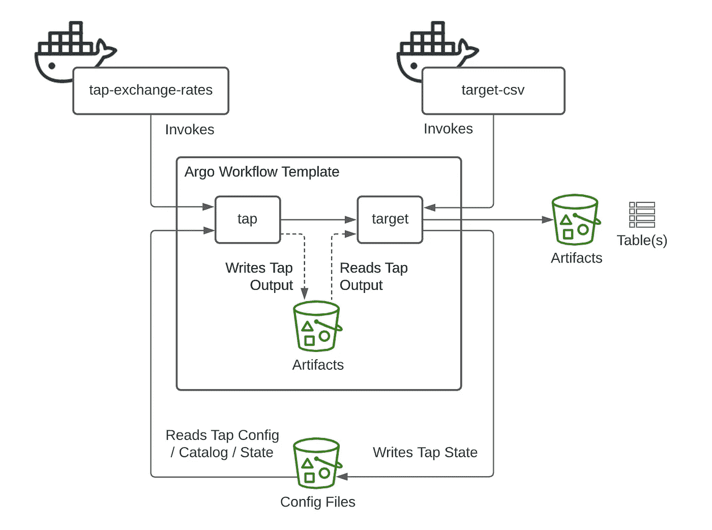
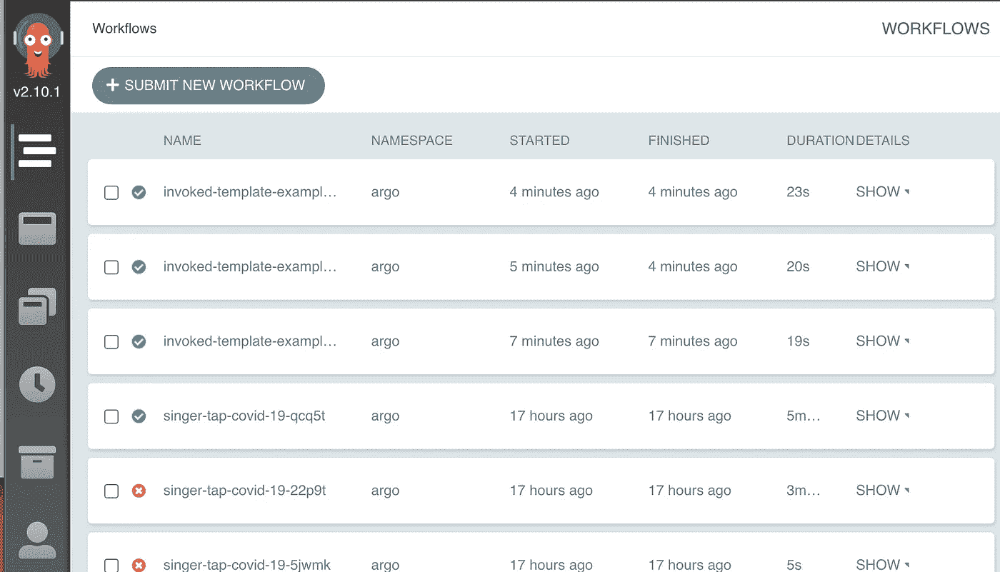
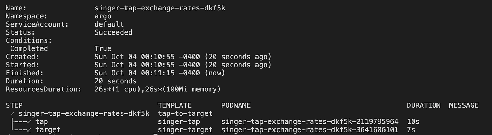
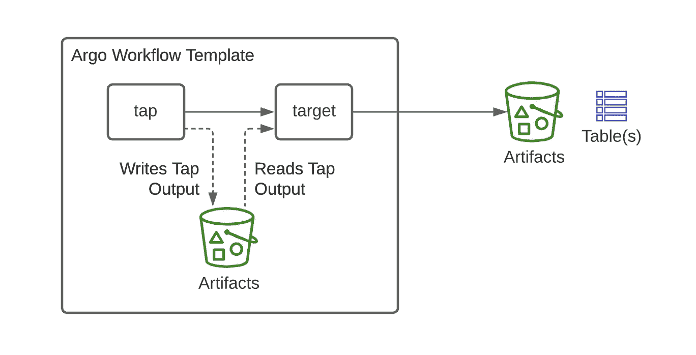
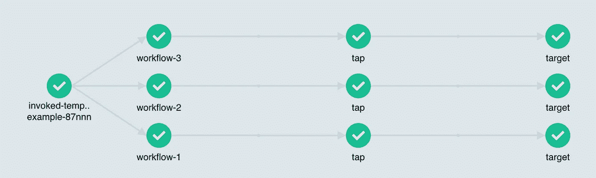

# 使用 Argo 和 Singer.io 在 Kubernetes 上运行数据复制管道

> 原文：<https://towardsdatascience.com/running-a-data-replication-pipeline-on-kubernetes-with-argo-and-singer-io-2fab5b0bad?source=collection_archive---------21----------------------->

近年来，数百个数据团队已经迁移到 ELT 模式，利用 Stitch 或 FiveTran 等 SaaS 工具将数据可靠地加载到他们的基础设施中。根据我的经验，这些 SaaS 产品非常出色，可以显著加快您的生产时间。然而，许多人没有预算，或者没有需要适应的定制应用程序，或者只是喜欢使用自己的工具。

在这些情况下，一个解决方案是部署`singer.io`tap 和 targets——可以在任意源和目的地之间执行数据复制的 Python 脚本。Singer 规范是流行的 [Stitch SaaS](http://www.stitchdata.com) 的基础，它也被许多独立顾问和数据项目所利用。

Singer 管道是高度模块化的。您可以通过管道将任何分支连接到任何目标，以构建符合您需求的数据管道。尽管这使得它们非常适合 Docker 化管道，但我发现很难找到通过 Kubernetes 或 Docker 部署 Singer 管道的例子。最终，我们利用 Argo 工作流和容器化的歌手抽头和目标建立了一个管道。


没有 Argo 和 Kubernetes 的容器编排。图片来自 [Unsplash](https://unsplash.com/photos/kyCNGGKCvyw) 的 [CHUTTERSNAP](https://medium.com/u/a86c1db73ac?source=post_page-----2fab5b0bad--------------------------------) 。

本文从较高的层面介绍了工作流，并提供了一些示例代码来启动和运行一些共享模板。我假设你对 [Docker](https://docker.com) 、 [Kubernetes](https://kubernetes.io/) 和 [Singer](https://singer.io) 规范有些熟悉。即使你是这些技术的新手，我也会试着指出一些有用的资源，为你指明正确的方向。

# 为什么要自己卷？

ETL 不是任何人进入数据科学或工程的原因。几乎没有创造力，大量的维护，直到出了问题才得到认可。幸运的是，像 [Stitch](http://www.stitchdata.com) 和 [FiveTran](http://www.fivetran.com) 这样的 SaaS 工具已经将数据复制变成了小团队可以利用的商品。

数据复制的“已解决”性质使数据科学家更容易拥有端到端的项目，从而使数据工程师能够考虑“平台”而不是单点解决方案。StitchFix 在这方面有一个很棒的帖子。)这个市场的参与者认识到，真正与众不同的是“围绕”集成脚本的东西:例如，GitLab 的 [Meltano](https://meltano.com) 项目已经找到了一个合适的位置，成为[集成过程](https://www.dataengineeringpodcast.com/meltano-data-integration-episode-141/)的“跑步者”，而不是数据复制服务的逻辑。

## **歌手轻拍目标**

当不存在受支持的连接器时——比方说，对于内部应用程序——第三方服务不会为您做太多事情。这时候 [Singer.io](https://singer.io) 规范就派上用场了。Singer 管道有两个组成部分:

*   **tap** 连接到服务，提取数据，然后使用 JSON 发出标准化的模式和记录流
*   **目标**读取 tap 的记录流并将其加载到仓库中

这种 tap 和 target 的分离分离了“提取”步骤和“加载”步骤。因此，一个拥有 10 个数据源和 1 个数据仓库的组织需要管理 10 个从 tap 到 target 的管道。但是，如果他们迁移这个数据库，他们只需要“换出”目标；他们不会对任何水龙头做任何改动。

## **Kubernetes 和 Argo 工作流程**

然而，如果没有编排层，这些管道一文不值。我们致力于在 Kubernetes 上运行管道，这使我们来到了 Argo，一个用于编排并行“工作流”的开源引擎。它是其他编排工具(如 Airflow 或 Prefect)的替代工具，一个关键的区别在于它对容器的固有关注。这个数据委员会的演讲提供了一个与 Airflow 的很好的比较，特别是:[Kubernetes——Argo 的本地工作流编排](https://www.datacouncil.ai/talks/kubernetes-native-workflow-orchestration-with-argo)。

我们对我们的解决方案非常满意，但它并不适合所有人。调试 Kubernetes 作业可能比在专用 EC2 实例上调试 Python 脚本更具挑战性。然而，这种方法的回报是三重的:

1.  部署的简易性和可移植性
2.  容器内脚本/环境的标准化
3.  其他数据基础设施也可以很容易地进行容器化和部署

说到这里，让我们试一试吧！

# **教程**

在本教程中，我们将首先使用 Argo 和 MinIO 存储为工件和配置文件设置一个本地 Kubernetes 集群，然后我们将部署一个 Singer tap-to-target 工作流。最后，我们将讨论增强和扩展。

我们可以深入讨论这些领域中的任何一个，但是我会尽量让它变得浅显易懂，把对“生产”考虑的进一步讨论留到最后。本教程有以下先决条件:

1.  Docker 桌面。安装在本地，并打开 Kubernetes 功能。(如果您有另一个集群，也应该没问题。)
2.  掌舵。我们将安装 Argo 和 MinIO 来运行本教程。

首先，我们将使用两个最简单的 singer.io 包——`tap-exchangeratesapi` 和`target-csv`——来演示这是如何工作的。下面的图片会让你对我们的发展方向有所了解:



完整的工作流模板。图片作者。

## **设置 Kubernetes、Argo 和 MinIO**

在第一部分中，我们需要设置一个 Kubernetes 集群、Argo 工作流、一个工件存储库和几个存储桶。最简单的方法是使用 Docker for Desktop，它是多平台的，可以在其中部署一个 Kubernetes 集群。这也使本地开发变得更加容易，因为您可以构建容器并部署到本地集群，而无需推到外部容器存储库。

**安装 Docker 桌面并启用 Kubernetes**

你需要有一个 Kubernetes 集群，你有管理权限，可以用`kubectl`部署资源。如果你已经有了，那么你可以跳过这一节。如果你没有，最简单的方法就是使用 Docker for Desktop。你会想要遵循 Docker 网站上的文档。

1.  为桌面安装 Docker。[ [Mac](https://docs.docker.com/docker-for-mac/install/)
2.  启用 Kubernetes。[ [Mac](https://docs.docker.com/docker-for-mac/kubernetes/)
3.  将 Docker 的资源分配提升到至少 12 GB，以确保 MinIO 部署有足够的空间。(见附近图片。)
4.  测试`kubectl`命令。[ [Mac](https://docs.docker.com/docker-for-mac/kubernetes/#use-the-kubectl-command)
5.  安装最新的 Argo CLI。[ [Mac](https://github.com/argoproj/argo/releases)


您可能需要增加默认资源来容纳 MinIO。图片作者。

**安装 Argo 工作流程**

要安装 Argo，您可以遵循他们的[ [快速入门指南](https://argoproj.github.io/argo/quick-start/) ]，或者简单地使用下面的命令在您的集群中创建一个`argo`名称空间并部署“快速入门”资源。

```
kubectl create ns argokubectl apply \
   -n argo    \
   -f https://raw.githubusercontent.com/argoproj/argo/stable/manifests/quick-start-postgres.yaml
```

您现在应该有一个 Argo 服务器和一些 Argo 使用的新 Kubernetes 资源类型，包括“Workflow”和“CronWorkflow”。要查看 Argo Workflows UI，您可以将 Kubernetes 端口转发到您的本地主机，并在浏览器中查看它。

```
kubectl -n argo port-forward deployment/argo-server 2746:2746
```



Argo 工作流为检查作业提供了一个有用的用户界面。图片作者。

**设置 MinIO 存储器**

Argo 工作流可以通过使用“工件”将文件传入或传出容器。对于本地部署，配置工件传递的一个简单方法是通过 Kubernetes 部署 [MinIO](https://min.io/) 。Argo 有很多关于如何与亚马逊 S3 等其他服务建立这种关系的指南，但是你可以跟随下面的内容快速部署 MinIO。

注意，您需要安装`helm`(本质上是一个 Kubernetes 包管理器)。在 Mac 上，你可以使用 Homebrew 命令:`brew install helm`。然后，运行以下命令来添加 MinIO helm 图表:

```
helm repo add minio [https://helm.min.io/](https://helm.min.io/)helm repo update
```

接下来，您需要将 MinIO 部署到 Argo 名称空间中。这可能需要一两分钟，请耐心等待。

```
helm install argo-artifacts minio/minio \
    -n argo                             \
    —-set service.type=LoadBalancer     \
    --set defaultBucket.enabled=true    \
    --set defaultBucket.name=artifacts  \
    --set persistence.enabled=false     \
    --set fullnameOverride=argo-artifacts
```

您现在应该有一个工件服务器在运行，但是它是空的！我们必须创建一个工件桶，以及一个用于 singer 配置和输出的桶。要使用下面的命令，您需要 MinIO CLI 工具，您可以使用:`brew install minio/stable/mc`安装该工具。

```
mc config host add argo-artifacts-local [http://localhost:9000](http://localhost:9000) YOURACCESSKEY YOURSECRETKEYmc mb argo-artifacts-local/artifacts
mc mb argo-artifacts-local/singer
mc mb argo-artifacts-local/outputs
```

如果您喜欢通过 UI 创建 bucket，那么您可以转到端口 9000 — `kubectl -n argo port-forward service/argo-artifacts 9000:9000` —然后创建一个`artifacts`和`singer` bucket。(请注意，默认凭据是 YOURACCESSKEY 和 YOURSECRETKEY。)

**将 Argo 和 MinIO 一起映射**

最后，我们需要告诉 Argo 默认的工件存储库在哪里，这样它就知道工件映射到哪个存储桶，并有适当的秘密进行认证。你可以遵循其他地方的说明但是为了简单起见，我建议将这个“补丁”应用到我整理的资源中。

```
wget -o patch.yml [https://raw.githubusercontent.com/stkbailey/data-replication-on-kubernetes/master/argo/argo-artifact-patch.yml](https://raw.githubusercontent.com/stkbailey/data-replication-on-kubernetes/master/argo/argo-artifact-patch.yml)kubectl patch configmap workflow-controller-configmap \
    -n argo \
    --patch “$(cat patch.yml)”
```

为了确保第一部分中的所有内容都能正常工作，请尝试运行 Argo 示例库中的“工件传递”示例。

```
argo submit -n argo [https://raw.githubusercontent.com/argoproj/argo/master/examples/artifact-passing.yaml](https://raw.githubusercontent.com/argoproj/argo/master/examples/artifact-passing.yaml) --watch
```

## **蓉城工作流程**

你已经得到了库贝内特斯，你已经得到了阿尔戈:让我们不要再等了！运行以下命令:

```
argo submit \
    -n argo \
    --watch \
    [https://raw.githubusercontent.com/stkbailey/data-replication-on-kubernetes/master/argo/tap-exchange-rate-workflow.yml](https://raw.githubusercontent.com/stkbailey/data-replication-on-kubernetes/master/argo/tap-exchange-rate-workflow.yml)
```

您应该会在终端中看到一个工作流启动。(或者，您可以转到该链接，复制文本并将其粘贴到 Argo Workflows 的“新工作流”UI 中。)如果您收到类似于`failed to save outputs: timed out waiting for condition`的错误消息，请尝试再次运行该工作流程——可能是 MinIO 设置未完成。



寻找那些漂亮的绿色对勾。图片作者。

您应该看到一个两步工作流创建和完成。现在，检查“输出”存储桶，看看有什么可用。

```
mc ls argo-artifacts-local/singer/outputs/tap-exchange-rates/
```

在大多数 Singer 工作流中，管道的输出实际上是加载到数据库中的数据——但是在这里，我们将 tap 输出导出到一个文件中，该文件由目标压缩并输出到 MinIO 中。

**剖析工作流程**

现在，让我们从头开始，看看 Argo 工作流刚刚发生了什么。

1.  它启动了一个`tap-to-target`多步骤工作流，由两个子步骤组成:`tap`和`target`步骤。
2.  它启动了`tap`子步骤，并传入一些配置文件，这些文件被映射到`/tmp/config.json`。当 tap 步骤完成时，`/tmp/tap_output.txt`处的输出文件存储在默认的 MinIO 工件库中。
3.  然后启动`target`子步骤，将配置和 tap 输出映射到容器文件系统中。当目标运行时，输出(来自 CSV 目标)被映射到`outputs` MinIO 桶。



模板逻辑。虽然“target-csv”目标会输出一个表，但大多数目标会将数据加载到数据库中。图片作者。

我不会深入到[工作流文件本身](https://raw.githubusercontent.com/stkbailey/data-replication-on-kubernetes/master/argo/tap-exchange-rate-workflow.yml)，因为 Argo 上有很多很棒的文档。关于数据复制，有趣的是，这个过程是高度标准化的——无论您的 tap 或目标是什么，您基本上都是交换配置文件或容器地址。

**码头歌手**

在 Argo 级别模板化工作流也需要在容器级别模板化 Singer taps。让我们暂时把 Kubernetes 放在一边，专注于一个典型的歌手管道。这是一个线性过程:

1.  点击输入:点击配置文件、目录文件、状态文件
2.  点击输出:提取数据的文本输出(Singer 格式)
3.  目标输入:目标配置文件，tap 的文本输出
4.  目标输出:加载或导出的数据(例如，到数据库或 CSV 文件)和一个“状态”文件，其中包含有关上次提取的元数据

我们可以将容器本身视为黑盒，只要我们知道如何输入适当的输入和输出。为了使本教程简单，我预先创建了`tap`和`target`容器供我们使用。要进行测试，请运行以下命令:

```
docker run -e START_DATE=2020-08-01 stkbailey/tap-exchange-rates
```

不涉及太多细节，我们将 singer `tap-abc`或`target-xyz`命令封装在一个 Runner 对象中，该对象定义了在哪里查找必要的文件。(它可以在 Github 的 [singer-container-utils](https://github.com/immuta/singer-container-utils) 获得。)剥那只猫皮的方法有很多种，但重要的是要让它在多次轻拍中容易重现。

我们不会深究细节，但是每个 Docker 容器在初始化时都在运行一个 Python `entrypoint.py`脚本。入口点脚本的要点是:

1.  确定适当的输入文件所在的路径。
2.  基于文件可用性构建可执行命令。
3.  运行命令并将输出写入文件。

它*比直接运行 tap 的开销更大，但是当你有多个容器要运行时，这种抽象会让生活变得更容易。*

**模板化工作流程**

总而言之:这种方法有价值的原因是因为您可以轻松地将“工作流”模板化，这样任何可以输出 Singer 格式数据的容器都可以替换为一行模板代码(以及一个配置文件)，这样您就有了一个新的工作流。

希望不难看出，通过一些额外的调整和一些保护良好的 S3 桶，这可以变成一个相当健壮的架构。一旦设置完成，您只需更改图像位置来添加新的 tap 容器。有一个很好的 UI 来检查日志和重新启动作业，并且很容易用 Slack 通知和附加作业来扩展模板。

我在附带的 [GitHub repo](https://github.com/stkbailey/data-replication-on-kubernetes) 中创建了几个例子，包括带有`tap-covid-19` Singer tap 的例子、`WorkflowTemplate`例子和可以每小时或每天运行的`CronWorkflow`规范。



只需对模板进行最少的编辑，即可同时运行多个拍子和目标。图片作者。

# **讨论**

尽管建立这种架构对我来说很愉快，但它需要对基础设施、容器和 Singer 规范本身非常熟悉。你可能会发现 [Pipelinewise](https://transferwise.github.io/pipelinewise/#:~:text=PipelineWise%20is%20a%20collection%20of,environment%20without%20the%20extra%20hassle.) 或 [Meltano](https://meltano.com/) 可以用更少的开销和更多的附加功能为你做同样的工作。或者，您可能会发现您可以利用 Argo 和这些工具来管理数据复制。

作为一名数据科学家，有很多考虑因素。这些问题包括:

*   我是否有足够的预算来支付这笔费用(Stitch / Fivetran)？这些工具能满足我所有的数据复制需求吗？
*   更简单的(单节点)架构是否可行，比如 Meltano？我有其他需要管弦乐队的工作吗？
*   Kubernetes 架构是否适合公司基础设施的其他部分？
*   为什么不用气流或者提督？
*   我是否拥有(或可以借用)设置和管理 Kubernetes 集群的基础设施专业知识？

我们的团队选择构建这种架构是因为:

*   我们(还)没有企业服务的预算，但发现我们需要运行定制的 tap。
*   我们已经习惯了容器化的应用程序。
*   我们公司基础设施的其余部分在 Kubernetes 上运行，并利用其他 Argo 产品，使协作更加容易。
*   我们有其他项目，如数据质量工作，我们需要一个平台来运行，我们以前没有与气流或完美的专业知识。

感谢阅读。乐于在 [LinkedIn](https://www.linkedin.com/in/stkbailey/) 或[歌手 Slack 频道](https://singer-slackin.herokuapp.com/)与他人联系。

# **其他资源**

*   歌手入门[ [博客](https://github.com/singer-io/getting-started)
*   打造歌手 Tap —信息图[ [博客](https://www.stitchdata.com/blog/how-to-build-a-singer-tap-infographic/) ]
*   记录歌手抽头的参考脚本[ [GitHub](https://github.com/immuta/singer-container-utils)