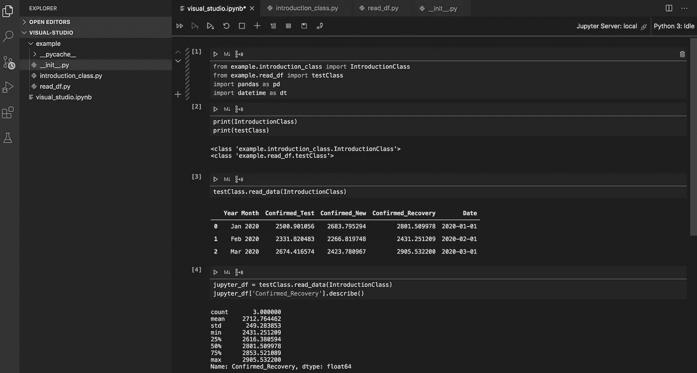
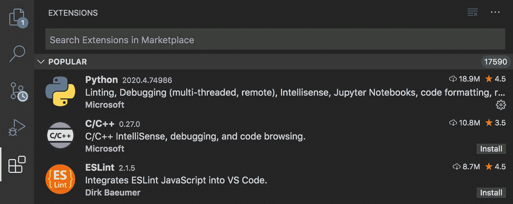
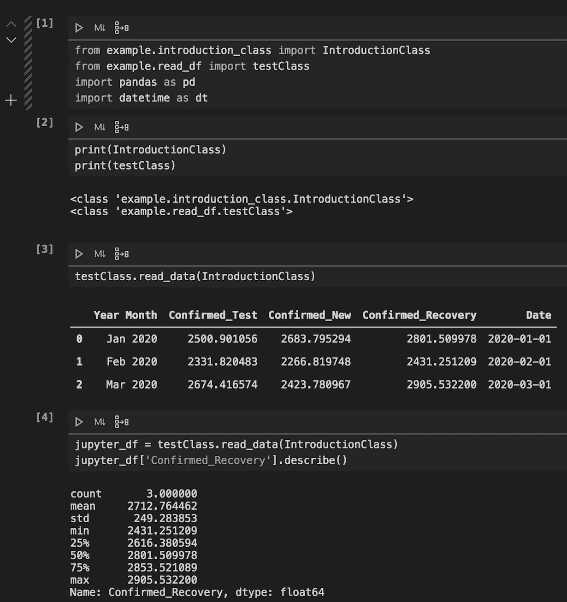

# 用 Visual Studio 代码运行 Jupyter 笔记本

> 原文：<https://towardsdatascience.com/running-a-jupyter-notebook-in-visual-studio-d5a4ede0c509?source=collection_archive---------33----------------------->

## 数据科学家如何运行 Jupyter 笔记本的指南。ipynb 文件与您的。py 文件

Jupyter 笔记本引用中的虚拟数据示例。Visual Studio 中的 py 文件。作者在 [Visual Studio 代码](https://code.visualstudio.com/?wt.mc_id=DX_841432) [1]上截图。

# 目录

1.  **什么是 Visual Studio 代码？**
2.  **什么是 Jupyter 笔记本？**
3.  **为什么对数据科学家有好处？**
4.  **关于数据集**
5.  **我该如何开始(教程)？**
6.  **导入类**
7.  **结论**
8.  **参考文献**

# 什么是 Visual Studio 代码？

[Visual Studio Code](https://code.visualstudio.com/?wt.mc_id=DX_841432)(VS Code)[1]是一个免费的、简单的平台，开发者使用它来存放、编辑和执行他们的代码。但是最近，越来越多的数据科学家已经利用这个文件和代码管理平台来处理他们的。py 和。ipynb 文件。

# 什么是 Jupyter 笔记本？

Jupyter Notebook 是数据科学家测试 Python 代码、模型和结果的研究环境和平台。它以扩展名保存。ipynb”，并且可以被执行，包含在其中执行代码的单独的单元。

# **为什么对数据科学家有好处？**

拿着数据科学的理学硕士学位，以及体验各种数据科学和机器学习课程，我已经在我熟悉的 Jupyter 笔记本里变得太舒服了。以我的经验来看，Visual Studio 代码已经成为我在编程 Python 和实现机器学习模型时提高效率的工具。以下是数据科学家应该使用 Visual Studio 代码的主要原因:

*   更加擅长面向对象编程
*   在一个位置管理您的文件夹、文件和数据
*   查看你的笔记本。py 文件的同时
*   从数据科学家过渡到机器学习工程师
*   转换你的研究。ipynb 文件生产就绪。py 文件

# 关于数据集

数据集是在谷歌表单中创建的虚拟数据。它是为了模拟 2020 年冠状病毒疫情数据集的类似领域而开发的。这些字段包括日期、区域、记录计数和虚拟类别。遵循本教程时，不同的数据集，如真实的[冠状病毒数据集](https://www.kaggle.com/sudalairajkumar/novel-corona-virus-2019-dataset) [2]只能用于教育和学术研究目的。该数据包含可以更好地表示的日期特性，这是本教程中实现的代码的目标。

# **我该如何开始(教程)？**

启动 Visual Studio 代码的第一步是从[这里](https://code.visualstudio.com/?wt.mc_id=DX_841432)【1】下载必要的包。它将是您计算机上的一个应用程序，是一个可视化和执行代码的平台。从这里开始，如果您选择使用 Python 作为您的主要编程语言，请在市场中搜索该扩展，如下所示。您还可以从这里克隆您的 GitHub 库，并开始发出 pull 请求和终端命令。对于我的例子，我选择创建一个新文件夹，其中包含三个 Python 文件的子文件夹和一个独立的 Jupyter 笔记本文件。我写出来的文件系统是:

*visual-studio-code - >示例->(_ _ py cache _ _)->_ _ init _ _。py、introduction_class.py 和 read_df.py*

*visual-studio-code->visual _ studio _ code . ipynb*

为您的 VS 代码选择 Python 扩展。作者在 [Visual Studio 代码](https://code.visualstudio.com/?wt.mc_id=DX_841432)【1】上截图。

# **导入类**

在我的例子中，我有帮助描述和显示如何设置你的数据科学算法的类。这些类的目标只是返回一个带有转换日期时间特性的 pandas 数据帧，以及一个可以被算法接收的数据帧。而我的 __init__。py 文件为空，不出所料，my introduction_class.py 包含一个类' IntroductionClass ':

来源于[GitHub](https://github.com/mprzybyla123/visual-studio)【2】上的作者

下面是我的 read_df.py。如你所见，我使用 pandas 从一个. csv 文件中读取数据帧。我也从[pandas](https://pandas.pydata.org/)【3】执行了一个简单的日期时间转换。“年/月”列被转换为包含月、月、年中某一天的“日期”。然后，我从 head 函数返回数据帧的前 5 行。这个类作为一个简单的例子来说明什么可以被导入到你的 Jupyter 笔记本中。

来源于[GitHub](https://github.com/mprzybyla123/visual-studio)【2】上的作者

导入的最后一部分包含在 Jupyter 笔记本本身中，“visual_studio_code.ipynb”。这个文件导入了两个 python 类。py 文件，其中包括“IntroductionClass”和“testClass”。下面，这些类在导入后被调用。它们返回预期的数据帧，第一个新的 Jupyter 笔记本代码由一个 pandas 函数操作，该函数描述了一个带有常用统计信息的数据帧列，在本例中是“确认恢复”字段。

从第一个例子开始，然后练习从。py 文件，您可以为生产创建更好的可伸缩且高效的代码。您可以跨职能工作，用面向对象的代码实现您的算法，然后以 Jupyter 笔记本的形式更好地测试和可视化您的数据框架，两全其美。

从继承的 visual_studio_code.ipynb 文件。py 文件。作者在 [VIsual Studio 代码](https://code.visualstudio.com/?wt.mc_id=DX_841432) [1]上截图。

# **结论**

成为你的数据科学游戏的顶端可能是压倒性的和复杂的，但我相信通过新的和熟悉的工具，你可以提高你的技能，也可以变得更加擅长机器学习工程。我相信 Visual Studio 代码就是这些工具之一。

它帮助我导入 Python 类和函数，这些类和函数用于为可能的机器学习模型塑造我的数据框架。它可以作为一个平台，将您的 GitHub 存储库代码与您的 research Jupyter 笔记本并行设计。它是通向数据科学、数据工程和机器学习的优秀桥梁。

# 参考

我的 Visual Studio 代码设置是使用虚拟数据集创建的。要素/字段/列也是虚拟属性。图片是我自己对 VS 代码主文件管理平台的截图。我的 VS 代码截图中可视化的数据和指标不得用于任何医疗目的。它是静态的、非真实的，并且不依赖于准确性。它纯粹是为了教程的目的而开发的。

[1] M.Przybyla，[视觉工作室代码](https://code.visualstudio.com/?wt.mc_id=DX_841432) (2020)

[2] M.Przybyla， [GitHub](https://github.com/mprzybyla123/visual-studio) (2020)

[3]熊猫-发展，[熊猫](https://pandas.pydata.org/) (2020)