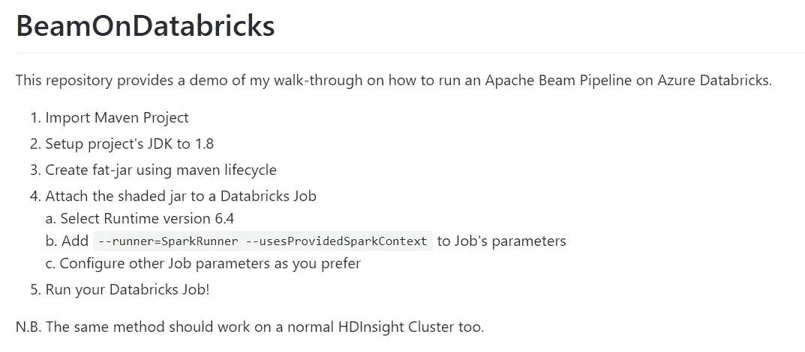

# 在 Azure Databricks 上运行 Apache Beam 数据管道

> 原文：<https://towardsdatascience.com/running-an-apache-beam-data-pipeline-on-azure-databricks-c09e521d8fc3?source=collection_archive---------27----------------------->

简要介绍如何在 Databricks 上执行 Apache Beam 管道



[Github 资源库](https://github.com/Stefn93/BeamOnDatabricks)链接到本文

# 介绍

当我们想到数据并行管道时，Apache Spark 立即浮现在脑海中，但也有一些更有前途、更新颖的模型能够实现相同的结果和性能。

这就是 [Apache Beam](https://beam.apache.org/get-started/beam-overview/) 的情况，它是一个开源的统一模型，用于定义批处理和流数据并行处理管道。它提供了以一种方便的方式定义数据管道的可能性，使用其分布式处理后端之一作为运行时( [Apache Apex](https://apex.apache.org/) 、 [Apache Flink](https://flink.apache.org/) 、 [Apache Spark](http://spark.apache.org/) 、 [Google Cloud Dataflow](https://cloud.google.com/dataflow) 以及许多其他)。


作者图片

[Apache Beam 的强大功能](https://beam.apache.org/documentation/runners/capability-matrix/)在于更高层次的抽象，这可以防止程序员学习多个框架。
目前，Apache Beam 的使用主要局限于谷歌云平台，尤其是谷歌云数据流。

然而，当转移到其他平台时，可能很难找到一些有用的参考资料和例子来帮助我们运行 Apache Beam 管道。

这就是为什么我想告诉你我如何在 Databricks 上运行 Apache Beam 管道的经验。

# 让我们建立我们的阿帕奇光束管道

注意:这个演练的代码可以在 [this Github repository](https://github.com/Stefn93/BeamOnDatabricks) 获得。

我决定从官方的 [Apache Beam 的 Wordcount](https://github.com/apache/beam/blob/master/runners/spark/src/main/java/org/apache/beam/runners/spark/examples/WordCount.java) 例子开始，改变一些细节，以便在 Databricks 上执行我们的管道。

官方代码只是从 [Google 云存储](https://cloud.google.com/storage)中读取一个公共文本文件，对输入文本进行字数统计，并将输出写入给定的路径。为了简化这个过程，我们将通过简单地从代码内模拟的字符串中读取输入文本来代替这些操作，最后将字数统计结果打印到标准输出中。

输入字符串将被定义为列表:

然后我们创建一个简单的[光束自定义 DoFn 变换](https://beam.apache.org/documentation/programming-guide/#core-beam-transforms)来打印我们的结果:

我们最终的管道将是这样的:

我们现在有了一个可以在本地模式下执行的工作射束管道。
如果您尝试运行它，您应该看到它打印成您的标准输出:

```
20/06/01 13:14:13 INFO transforms.PrintFN: against: 1
20/06/01 13:14:13 INFO transforms.PrintFN: and: 1
20/06/01 13:14:13 INFO transforms.PrintFN: of: 2
20/06/01 13:14:13 INFO transforms.PrintFN: troubles: 1
20/06/01 13:14:13 INFO transforms.PrintFN: nobler: 1
20/06/01 13:14:13 INFO transforms.PrintFN: arrows: 1
20/06/01 13:14:13 INFO transforms.PrintFN: suffer: 1
20/06/01 13:14:13 INFO transforms.PrintFN: sea: 1
20/06/01 13:14:13 INFO transforms.PrintFN: The: 1
20/06/01 13:14:13 INFO transforms.PrintFN: Or: 1
20/06/01 13:14:13 INFO transforms.PrintFN: not: 1
20/06/01 13:14:13 INFO transforms.PrintFN: slings: 1
20/06/01 13:14:13 INFO transforms.PrintFN: that: 1
20/06/01 13:14:13 INFO transforms.PrintFN: is: 1
20/06/01 13:14:13 INFO transforms.PrintFN: arms: 1
20/06/01 13:14:13 INFO transforms.PrintFN: Whether: 1
20/06/01 13:14:13 INFO transforms.PrintFN: a: 1
20/06/01 13:14:13 INFO transforms.PrintFN: fortune: 1
20/06/01 13:14:13 INFO transforms.PrintFN: take: 1
20/06/01 13:14:13 INFO transforms.PrintFN: question: 1
20/06/01 13:14:13 INFO transforms.PrintFN: To: 1
20/06/01 13:14:13 INFO transforms.PrintFN: mind: 1
20/06/01 13:14:13 INFO transforms.PrintFN: to: 3
20/06/01 13:14:13 INFO transforms.PrintFN: outrageous: 1
20/06/01 13:14:13 INFO transforms.PrintFN: or: 1
20/06/01 13:14:13 INFO transforms.PrintFN: tis: 1
20/06/01 13:14:13 INFO transforms.PrintFN: in: 1
20/06/01 13:14:13 INFO transforms.PrintFN: the: 2
20/06/01 13:14:13 INFO transforms.PrintFN: be: 2
```

# 现在，让我们转到数据块

现在，我们想在 Databricks 实例上执行我们的管道。为了实现这一点，我们需要修改代码中的一些东西。首先，我们修改我们的 *WordCountOptions，*，它必须扩展 *SparkContextOptions 类*。为了操作光束的 *SparkContext* ，这些光束选项是必要的。Databricks 集群有自己的 SparkContext，这对检索至关重要，以便扩展应用程序。一旦我们检索到 SparkContext，我们可以直接将其注入到 Beam 的 *SparkContextOptions* 中，如下所示:

有了这个 Beam 代码的最终版本，我们现在可以在 Azure 中启动我们的 Databricks 工作区，并继续创建一个新的作业。
我们将我们的项目打包到一个 fat jar 中(在本例中，我将使用标准的 maven 生命周期来打包我的应用程序)，并通过单击“Upload Jar”将它上传到我们的作业中。

请注意，如果您的 [*pom.xml*](https://github.com/Stefn93/BeamOnDatabricks/blob/master/pom.xml) 文件中有任何 *Spark* 依赖项，请记住将它们标记为" **provided** " **，**，因为我们的 Databricks 集群将通过执行上下文将它们提供给我们的应用程序。


Jar 上传

指定主类后，使用这些将由 *SparkContextOptions:* 解析的参数是很重要的

```
--runner=SparkRunner --usesProvidedSparkContext
```

最后，我们可以通过点击*编辑*来设置将与我们的作业相关联的集群:


集群配置

这样，我们在 Databricks 运行时版本 *6.4* 上定义了一个“ [*新的自动化集群*](https://docs.microsoft.com/en-us/azure/databricks/clusters/) ”和 2 个工人。如果您愿意，您还可以创建一个“交互式集群”，这样您可以更好地控制集群的执行。

现在，我们可以走了！
如果您的工作看起来与下图相似，只需点击“*立即运行*”，然后等待其终止。


运行 Apache Beam 管道的 Databricks 作业示例


终止后的执行状态

请注意，如果您已经用 *python* 编写了您的 Beam 管道，那么让它在数据块上工作的过程应该看起来或多或少是相同的:
只需记住将数据块' *SparkContext* 注入到 Beam 中，并使用正确的参数集执行您的管道。

我希望你喜欢我关于如何在 Azure Databricks 上运行 Apache Beam 管道的演练*,如果你找到了关于这个主题的更多有用的见解，请随时联系我！*