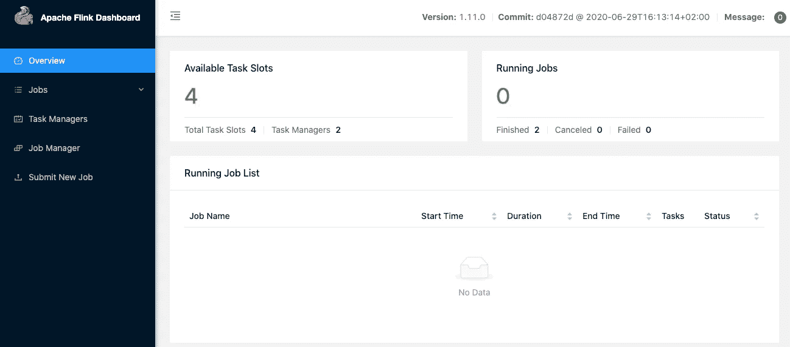
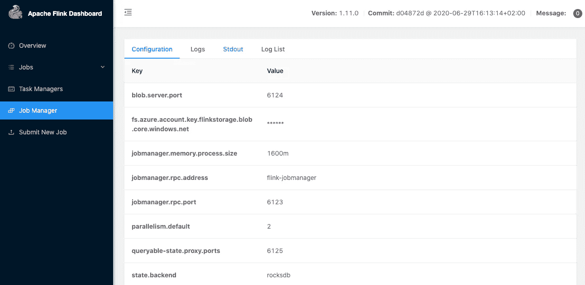
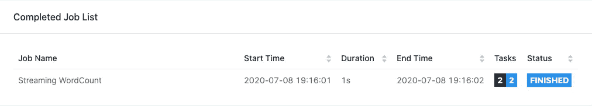

# 在 Azure Kubernetes 服务上使用 RocksDB 运行 Apache Flink

> 原文：<https://towardsdatascience.com/running-apache-flink-with-rocksdb-on-azure-kubernetes-service-904181d79f72?source=collection_archive---------29----------------------->

最近，我在研究如何部署一个使用 RocksDB 作为后端状态的 Apache Flink 集群，发现缺少关于这个主题的详细文档。我能够从 Flink 文档和一些堆栈溢出的帖子中拼凑出如何部署它，但是没有一个清晰的指南。我写这篇文章的目的是展示一个从 Flink 1.11.0 开始如何做到这一点的逐步指南。对于 AWS 部署，只需稍加修改即可遵循本指南。我会注意到这些变化。

# 先决条件

在开始阅读本指南之前，您应该已经订阅了 Azure，并且拥有一个正在运行 blob store 的存储帐户。如果你需要帮助来设置和运行这些服务，请参见本文底部的链接部分，那里有关于如何设置这些服务的 Azure 指南的链接。

如果你还没有安装 flink、azure-cli 和 docker，也可以下载它们的链接。

# 步骤 1:构建自定义 Docker 映像

为 Flink 后端状态使用 Azure Blob 存储或 AWS S3 存储需要一个额外的插件 jar，该插件 jar 没有内置到基本 Flink docker 映像中。要添加所需的 jar，首先需要从 GitHub 下载 apache/flink-docker repo。

[](https://github.com/apache/flink-docker) [## apache/flink-docker

### 这个 repo 包含用于为 Apache Flink 构建 Docker 映像的 Docker 文件，并用于构建“官方”映像…

github.com](https://github.com/apache/flink-docker) 

下载完 repo 后，导航到包含您要部署的 Flink 版本的文件夹。在我的例子中，我想使用 1.11，然后如果你计划使用 scala 代码，导航到你正在使用的 scala 版本的目录。我使用 scala 2.12，所以对我来说这个文件夹是`scala_2.12-debian`。如果你使用 java 或者 python，我相信你可以使用任何一个版本。在这个文件夹中，你应该会看到两个文件:`Dockerfile`和`docker-entrypoint.sh`。我们将要编辑的文件是 Dockerfile。在文本编辑器中打开它，并在`COPY docker-entrypoint.sh`行的正上方添加以下几行。

**对于 Azure Blob 存储:**

```
# install Flink Azure FS Hadoop plugin
RUN mkdir ./plugins/azure-fs-hadoop
COPY ./flink-azure-fs-hadoop-1.11.0.jar ./plugins/azure-fs-hadoop/
```

**对于 AWS S3，您有两个选项 Presto 和 Hadoop:**

转眼间:

```
# install Flink S3 FS Presto plugin
RUN mkdir ./plugins/s3-fs-presto
COPY ./flink-s3-fs-presto-1.11.0.jar ./plugins/s3-fs-presto/
```

Hadoop:

```
# install Flink S3 FS Hadoop plugin
RUN mkdir ./plugins/s3-fs-hadoop
COPY ./flink-s3-fs-hadoop-1.11.0.jar ./plugins/s3-fs-hadoop/
```

接下来从 Flink 1.11.0 文件夹导航到`/opt/`目录，将后端所需的 jar 复制到你编辑的 docker 文件所在的目录。对于 Azure，这个 jar 是 flink-Azure-fs-Hadoop-1 . 11 . 0 . jar

现在，使用以下命令构建 Docker 映像并将其推送到 DockerHub，用您的 DockerHub 用户名替换 hunterkempf，并更改标签以反映 flink、scala 和您添加到其中的插件的版本:

```
docker build --tag hunterkempf/flink:1.11.0_scala_2.12_fs_azure .
docker push hunterkempf/flink
```

# 步骤 2: Kubernetes 部署

 [## Flink Kubernetes 设置

### 这个页面描述了如何在 Kubernetes 上部署 Flink 作业和会话集群。信息本页描述部署…

ci.apache.org](https://ci.apache.org/projects/flink/flink-docs-release-1.11/ops/deployment/kubernetes.html#appendix) 

首先，转到 Flink Kubernetes 设置页面并创建以下内容。yaml 文件，并从附录中复制/粘贴。

*   flink-configuration-config map . YAML
*   jobmanager-service.yaml
*   作业管理器-会话-部署. yaml
*   任务管理器-会话-部署. yaml

**flink-configuration-config map . YAML**

您需要在`flink-conf.yaml`部分添加以下几行:

此示例针对名为:flinkstorage 的存储帐户中名为:flinkblob 的 blob 存储区。您还需要获取存储帐户的访问密钥，并将其粘贴到 fs . azure . account . Key . flink storage . blob . core . windows . net 之后:

```
state.backend: rocksdbstate.checkpoints.dir: wasbs://flinkblob@flinkstorage.blob.core.windows.net/flink/fs.azure.account.key.flinkstorage.blob.core.windows.net: 
```

**job manager-session-deployment . YAML 和 task manager-session-deployment . YAML**

将`image: flink:1.11.0-scala_2.11`替换为您在第 1 部分中为 jobmanager-session-deployment 和 taskmanager-session-deployment 创建的 docker 映像的名称。

**连接到 AKS 集群**

运行这两个命令来连接到 AKS 集群

```
az aks install-cli
az aks get-credentials --resource-group myResourceGroup --name myAKSCluster
```

**将 Flink 部署到 AKS**

从创建 yaml 文件的目录中，运行以下命令

```
kubectl create -f flink-configuration-configmap.yaml
kubectl create -f jobmanager-service.yaml
kubectl create -f jobmanager-session-deployment.yaml
kubectl create -f taskmanager-session-deployment.yaml
```

现在你应该有一个 Flink 集群运行在 AKS 上，使用 Azure Blob 存储作为 RocksDB 后端。

**查看 Flink 仪表盘**

要访问 Flink 仪表盘，请运行以下命令:

```
kubectl get pods
```

这将返回类似下面的内容

```
NAME                               READY   STATUS    RESTARTS   AGEflink-jobmanager-5f857bf45d-n4mbt    1/1     Running   0        38sflink-taskmanager-68854b7998-2zkd6   1/1     Running   0        31sflink-taskmanager-68854b7998-vvm5m   1/1     Running   0        31s
```

复制 flink-jobmanager pod 的名称，并将其用于以下命令，用您的值替换`5f857bf45d-n4mbt`

```
kubectl port-forward flink-jobmanager-5f857bf45d-n4mbt 8081:8081
```

现在打开 [http://localhost:8081](http://localhost:8081/) ，您应该会看到 Flink 仪表盘



要检查您的配置，请单击左侧的作业管理器选项卡



您应该会看到类似的东西，您的设置在键值标记中列出。

为了测试部署，您可以从位于`examples/streaming/`文件夹中的 Flink 1.11.0 文件夹上传一个测试 jar



运行流式字数统计作业花了 1 秒钟，没有为我返回任何错误。如果出现内部服务器错误，请检查作业管理器日志，查看错误堆栈跟踪。

# 链接:

这里有一些有用的链接供进一步阅读

Azure 文档:

[](https://docs.microsoft.com/en-us/cli/azure/install-azure-cli?view=azure-cli-latest) [## 安装 Azure CLI

### Azure CLI 可安装在 Windows、macOS 和 Linux 环境中。它也可以在 Docker 中运行…

docs.microsoft.com](https://docs.microsoft.com/en-us/cli/azure/install-azure-cli?view=azure-cli-latest) [](https://docs.microsoft.com/en-us/azure/aks/kubernetes-walkthrough-portal) [## 在 portal - Azure Kubernetes 服务中创建一个 AKS 集群

### Azure Kubernetes Service (AKS)是一个托管的 Kubernetes 服务，可以让您快速部署和管理集群。在…

docs.microsoft.com](https://docs.microsoft.com/en-us/azure/aks/kubernetes-walkthrough-portal) [](https://docs.microsoft.com/en-us/azure/storage/common/storage-account-create?tabs=azure-portal) [## 创建存储帐户- Azure Storage

### Azure 存储帐户包含所有 Azure 存储数据对象:blobs、文件、队列、表和磁盘。的…

docs.microsoft.com](https://docs.microsoft.com/en-us/azure/storage/common/storage-account-create?tabs=azure-portal) [](https://docs.microsoft.com/en-us/azure/storage/blobs/storage-quickstart-blobs-portal) [## 快速入门-使用 Azure 门户创建 blob-Azure 存储

### 在这个快速入门中，您将学习如何使用 Azure 门户在 Azure 存储中创建容器，以及上传和…

docs.microsoft.com](https://docs.microsoft.com/en-us/azure/storage/blobs/storage-quickstart-blobs-portal) 

Flink 文档:

 [## Flink Kubernetes 设置

### 这个页面描述了如何在 Kubernetes 上部署 Flink 作业和会话集群。信息本页描述部署…

ci.apache.org](https://ci.apache.org/projects/flink/flink-docs-release-1.11/ops/deployment/kubernetes.html#deploy-session-cluster) [](https://ci.apache.org/projects/flink/flink-docs-release-1.11/try-flink/local_installation.html) [## 本地 Flink 安装

### 按照以下几个步骤下载最新的稳定版本并开始使用。为了能够运行 Flink，唯一的…

ci.apache.org](https://ci.apache.org/projects/flink/flink-docs-release-1.11/try-flink/local_installation.html) [](https://ci.apache.org/projects/flink/flink-docs-stable/ops/filesystems/azure.html) [## Azure Blob 存储

### Azure Blob Storage 是微软托管的服务，为各种用例提供云存储。

ci.apache.org](https://ci.apache.org/projects/flink/flink-docs-stable/ops/filesystems/azure.html)  [## 状态后端

### 部署&操作状态&容错状态在数据流 API 中编写的后端程序通常保持状态…

ci.apache.org](https://ci.apache.org/projects/flink/flink-docs-release-1.11/ops/state/state_backends.html#the-rocksdbstatebackend) [](https://ci.apache.org/projects/flink/flink-docs-release-1.11/ops/config.html) [## 配置

### 部署和操作配置所有的配置都在 conf/flink-conf.yaml 中完成，这应该是一个平面的…

ci.apache.org](https://ci.apache.org/projects/flink/flink-docs-release-1.11/ops/config.html) 

码头工人:

[](https://www.docker.com/products/docker-desktop) [## 用于 Mac 和 Windows 的 Docker 桌面

### 5 月 28 日上午 9 点 PDT / GMT -7 了解更多关于 Docker 的…

www.docker.com](https://www.docker.com/products/docker-desktop)