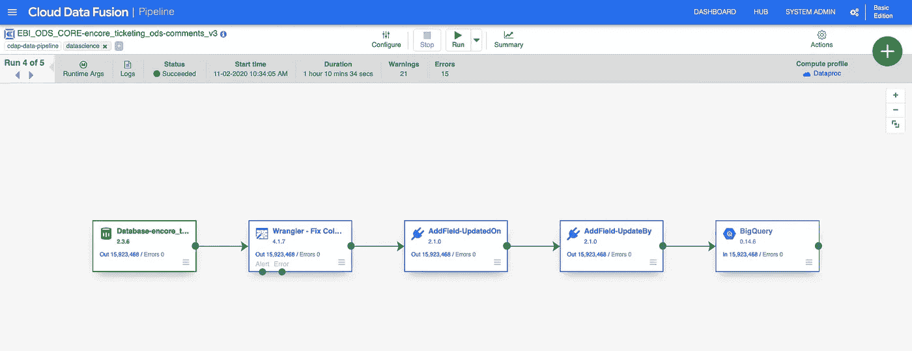
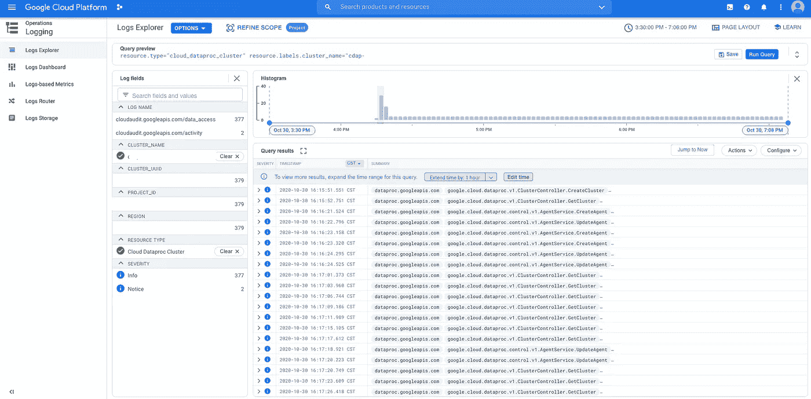
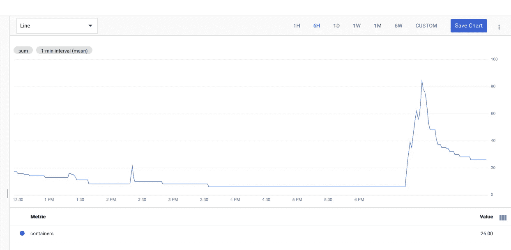

# “大规模”运行谷歌的云数据融合批处理管道

> 原文：<https://towardsdatascience.com/running-googles-cloud-data-fusion-batch-pipelines-at-scale-f1064b869dff?source=collection_archive---------30----------------------->

## [理解大数据](https://towardsdatascience.com/tagged/making-sense-of-big-data)

## 为数据科学工作流测试云数据融合

将数据从遗留 sqlserver 转移到 BigQuery 的典型 CDF 管道。作者图片

TLDR:当通过 REST api 大规模提交批量云数据融合(CDF)管道时，在每次调用之间暂停几秒钟，让 CDF 跟上进度。

背景:作为我们参与的迁移的一部分，我们的数据科学团队正在将数百个遗留的 MS Sqlserver ODS 表迁移到 BigQuery 中。虽然我们的工程团队正在处理实际的迁移，但我们(DS 团队)希望我们自己能够快速地在 GCP 构建、原型制作和迁移我们的模型，而无需等待我们的工程团队所承担的所有质量和范围广泛的要求。进入[谷歌的云数据融合](https://cloud.google.com/data-fusion)。基于 [CDAP](https://cdap.io/) ，这是对我们团队问题的一个很好的解决方案:我们希望定期将遗留表复制到 BigQuery 中，以服务于我们的模型。我们，数据科学团队，完全控制调度和范围，CDF“无代码”接口使所有团队成员可以直接利用 spark 的能力。遵循一些简单的标准，很容易添加额外的管道。

问题:在迁移开始时，我们确定了要复制到 BigQuery 的所有表和源——基本上是迁移的范围。我们有大约 100 个表，我们构建了 1 个管道来迁移 1 个表，所以总共有大约 100 个管道。管道运行的节奏在每日和每月之间变化，大多数表介于两者之间。有一段时间一切都很好，直到我们构建了一个需要 60 个表同时加载的模型。我不会解释为什么我们要构建一个需要 60 个表的模型，而是强调这个需求是如何对云数据融合的可伸缩性进行有趣的测试的。

在这一点上，我们都同意 CDF 不是同时执行 60 个管道的最佳工具，每个管道迁移一个表，其中许多在 10 分钟内完成，但这是我们发现自己所处的情况。CDF 不太适合这项任务，原因有很多，其中一个原因是，它需要 60 个小型 MR/spark 集群来完成大部分 10 分钟的迁移任务。实际上，这些 MR/spark 集群(GCP 的 dataproc，AWS 的 e MR)的配置时间只有 2-3 分钟，成本实际上并不多。我们首先构建了一个管道列表，遍历该列表，并从 GCE VM 通过 CDAP 的 REST api 在 bash 脚本中执行它们。虽然我们最终异步调度了这些任务，但是我们想证明我们可以同时执行这些任务，并且 CDF 可以根据我们的需求进行扩展。

我们最初的发现令我们失望。我们的脚本通过 REST api 在一秒左右的时间内执行了启动管道命令，在 60 个管道中，有 25 个失败了，几乎没有日志。当我们解析 CDF 的 App Fabric 服务日志时，我们遇到了一个有趣的错误:

> *2020–10–30 22:27:34，715—WARN[pool-10-thread-1:I . c . c . I . a . s . runrecordcorrectorservice @ 148]—修复了 25 个状态为[正在启动、正在运行、已暂停]的运行记录，但程序实际上并未运行*
> 
> *2020–10–30 22:27:34，716—INFO[pool-10-thread-1:I . c . c . I . a . s . runrecordcorrectorservice @ 103]—更正了 25 条状态为[正在启动、正在运行、已暂停]的运行记录，这些记录没有实际运行的程序。这类程序很可能已经崩溃或被外部信号杀死*

一个 dataproc 集群，它托管了我们的一个失败的管道，成功的和失败的管道的集群在日志方面是相同的。作者图片

纱线容器数与时间。在下午 6 点以后，可以看到成功创建了 dataproc 集群。作者图片

虽然 CDF 收到了 60 个“执行管道”api 调用，但它错过了 25 个运行记录。有趣的是，当我们查看 dataproc 日志时，我们发现它成功地创建了 60 个集群。也就是说，我们观察到成功创建的集群，甚至是托管失败管道的集群——这帮助我们认识到，我们在创建 dataproc 集群时没有可伸缩性问题，而是在创建 CDF“主”时有问题。问题在于 CDF 的簿记/跟踪，而不是 dataproc 集群的创建。作为数据科学家，而不是工程师或架构师，我们对这是如何工作的知识有限，但我们假设当我们在大约 1 秒钟内用 60 个 api 调用淹没系统时，我们过载了使用的任何跟踪数据库。我们再次尝试在每个 api 调用之间添加一些填充。我们发现，等待大约 10 秒钟会导致所有 60 个管道执行调用被成功提交和执行。虽然不是最优雅的解决方案，但它为我们完成了工作，因此我们可以考虑其他事情，这在数据科学中非常重要。

更新:我们已经探索并正在我们的工程团队的 Cloud Composer 实例上执行和调度这些带有气流的管道，但是当昂贵而复杂的编排资源不可用时，上面概述的方法仍然是一个可靠的选择。