# 在 15 分钟内在云上运行 Jupyter 笔记本电脑#Azure

> 原文：<https://towardsdatascience.com/running-jupyter-notebook-on-the-cloud-in-15-mins-azure-79b7797e4ef6?source=collection_archive---------9----------------------->

## 文章做到了标题所说的。在 Azure 笔记本电脑(免费或付费)上运行 Jupyter 笔记本电脑，成本很低。

为了更便宜、更快、更好地运行最好的数据科学模型，我寻找了多种途径来编译复杂的代码。我经常在我的 Github 上运行深度学习、神经网络(RNN，CNN)、自然语言处理(NLP)和高级机器学习(ML)的模型。在我以前的文章中，我比较了[数据科学家在云上运行笔记本](https://medium.com/datadriveninvestor/jupyter-notebook-crashed-so-i-deployed-my-data-science-project-in-the-cloud-in-15-minutes-for-56edc0ac4d0d)的多种选择，现在我正在深入研究我最喜欢的一种选择——[Azure 笔记本](https://notebooks.azure.com/)！

在云上运行 Jupyter Notebook 的最大优势之一是，你可以拥有一台*十年前的 PC/MAC* ，它无法在本地运行最新的深度学习算法，但仍然能够在云上部署最先进的机器学习模型，只要你在本文的帮助下设置它。请继续阅读！

通过 Azure 云的计算有无限的潜力

在线云计算的核心问题是我们对云感到不舒服。配置、IP、存储选项、计算选择和连接的变化让我们不知所措。

> 我要为一个数据科学家破译云。

云是一个难以驾驭的空间，但是，通过一点点帮助，你将得到你想要的东西——一种运行 Jupyter 笔记本电脑的极其廉价和高效的方法。我将努力做到以下几点:

1.  在 Azure 笔记本上设置 Jupyter 笔记本
2.  激活并导航 Azure 门户
3.  设置 Azure 数据科学虚拟机(DSVM)
4.  将 DSVM 连接到 Azure 笔记本电脑

这可能是一个漫长的阅读，但是，如果你的意图与我的一致，你会满意的。

# 免费获得高级 Azure 服务:

快速补充说明:大多数追求相同目标的人都在一个知名教育机构的项目中工作。所以，我建议你利用 **Azure 的学生福利**，这样你就可以免费获得 100 美元的学分——只需使用你所在学院提供给你的电子邮件。我喜欢我们生活的这个时代，云计算比一罐可乐还便宜，所以去 [Azure for Students](https://azure.microsoft.com/en-in/free/students/) 免费激活你的学生账户吧。这是一个简单的过程，不会超过几分钟。感谢我[以后](https://paypal.me/anishmahapatra)。

# 1.在 Azure 笔记本上设置 Jupyter 笔记本

我在这里 为我的数据科学家同事 [**写了一个详细的分步过程，你可以按照它来设置并理解在线设置 Jupyter 笔记本的细微差别。**](https://medium.com/datadriveninvestor/jupyter-notebook-crashed-so-i-deployed-my-data-science-project-in-the-cloud-in-15-minutes-for-56edc0ac4d0d)

 [## Jupyter 笔记本崩溃了，所以我在 15 分钟内就把我的数据科学项目部署到了云中(对于…

### 你可以用一个很老很老的系统免费进行奇特的数据科学研究——只要动动脑筋，从这个博客中获得帮助。

medium.com](https://medium.com/datadriveninvestor/jupyter-notebook-crashed-so-i-deployed-my-data-science-project-in-the-cloud-in-15-minutes-for-56edc0ac4d0d) 

它的本质如下所述:

1.  打开 [Azure 笔记本](https://notebooks.azure.com/)，登录并开始一个*新项目*
2.  打开一个*新笔记本*并选择运行它的内核
3.  选择*自由层*选项作为计算
4.  导入所需数据并在 Jupyter 笔记本上运行*和*

你现在应该有一个可以在云上运行的 Jupyter 笔记本了。上述空闲层中的基本配置是 1GB 存储和 4GB RAM。在这篇博客的后面，我们将致力于增加存储、内核、内存和计算能力。

# 2.激活并导航 Azure 门户

您用来制作 Azure 笔记本的帐户可以在此处登录 Azure 门户[。你现在应该可以看到 Azure 仪表盘和门户了。现在让我们快速浏览一下我们可能关心的元素和术语:](https://portal.azure.com/#home)

*   微软 Azure 是微软创建的云计算服务，用于通过微软管理的数据中心构建、测试、部署和管理应用程序和服务。
*   **虚拟机(VM)** :虚拟机是计算机系统的仿真。这本质上就像在云中拥有一台计算机，但是，您不是管理硬件，而是根据自己的需要租用系统。为什么？
    这大大降低了计算成本。正如我在之前的[博客](https://medium.com/datadriveninvestor/jupyter-notebook-crashed-so-i-deployed-my-data-science-project-in-the-cloud-in-15-minutes-for-56edc0ac4d0d)中提到的，这意味着总成本约为 1500 美元——2000 美元的硬件可以在你十年前的笔记本电脑上运行，而成本只是它的一小部分。我说的分数是指固体构型低于 30/小时。

通过 Azure 云服务( [Pixabay](https://pixabay.com/) )释放您电脑的真正潜力

*   **云服务**:云计算是计算机系统资源的*按需可用性*，尤其是数据存储和计算能力，无需用户直接主动管理。本质上，你只需在服务被使用时付费。
*   **弹性**:云适应性强。
    -运行简单的数据清理和特征工程步骤？
    →太好了！你可以使用免费的或较低层次的(更便宜的)作为计算。
    -运行需要更多计算的复杂模型？
    →又棒了！只需升级系统规格，运行模型一个小时，然后再次转移到较低层。
*   **Blob 存储**:Azure 存储的奇特术语。这是一个针对存储结构化和非结构化数据而优化的文件系统，您可以在 Jupyter 笔记本中使用它进行分析。

请记住，这个博客并没有教你如何利用 Azure 的所有功能，它专注于帮助数据科学项目，特别是通过 Azure 笔记本部署在云上的 Jupyter 笔记本。如果你感兴趣，我强烈建议你花些时间阅读微软的伟大文档。

# 3.设置 Azure 数据科学虚拟机(DSVM)

导航到 [Azure 门户网站](https://portal.azure.com/#home)，你应该会看到一个类似这样的屏幕:

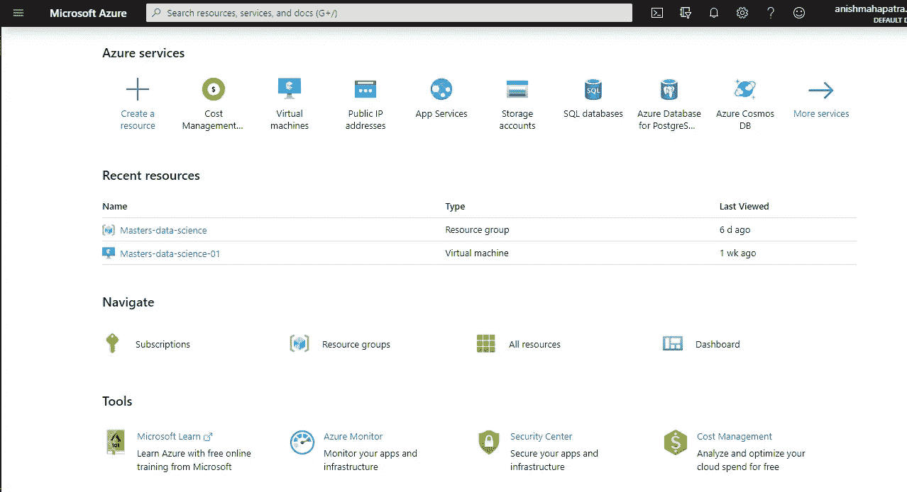

Azure 门户主页

我们现在将创建一个虚拟机来连接 Azure 笔记本。该接口将是一个 Jupyter 笔记本，其中的计算将出现在 Azure 服务上。如下所示创建一个资源。

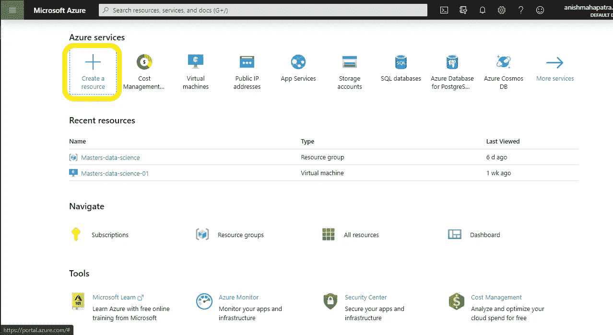

创建资源

搜索 Data Science Virtual Machine for Linux(Ubuntu)并选择它。

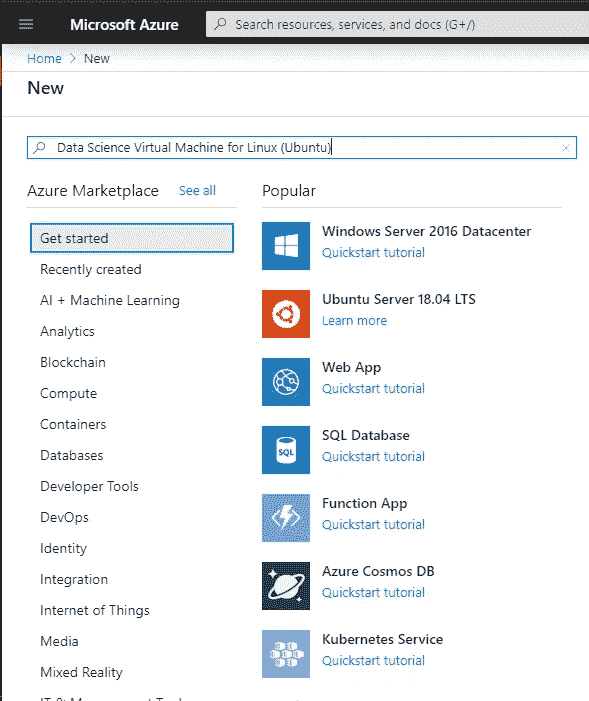

搜索**Data Science Virtual Machine for Linux(Ubuntu)**

您现在应该会看到一个类似于下图的屏幕。

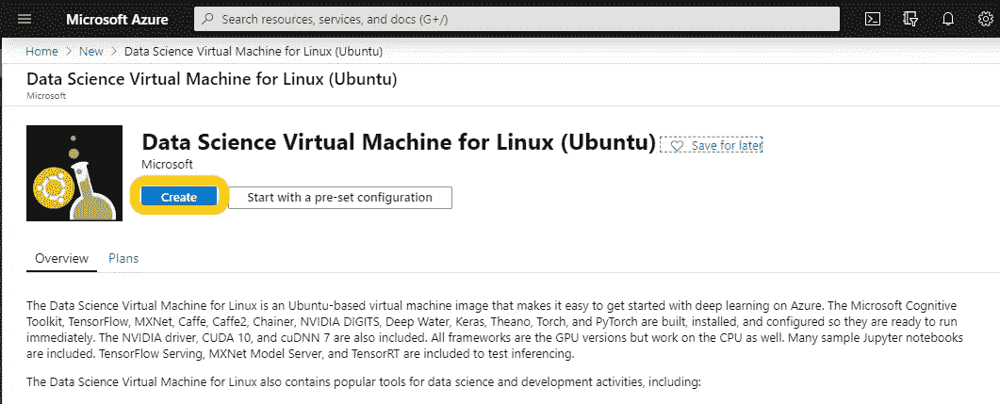

继续创建一个基于 Linux 的数据科学虚拟机

您可以根据需要配置设置。我已经填写了一个基本的样本，你可以遵循。不要被价格吓倒，因为如果你决定整个月都运行这个系统，价格是被提到的。我们将运行虚拟机几个小时，而不是几天，因此，这将是一个非常小的一部分成本，您可以在继续之前查看。如果你使用 Azure 的学生订阅，那么你可以免费获得一年 100 美元。就算你不是，也是极其实惠的。

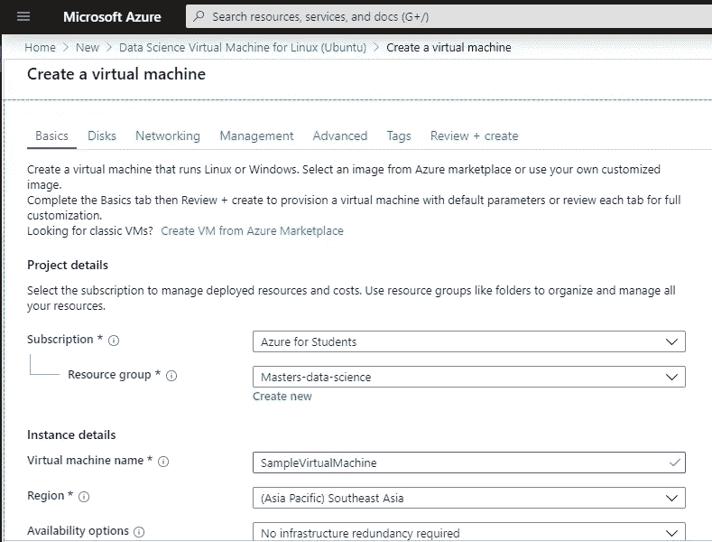

示例配置— 1

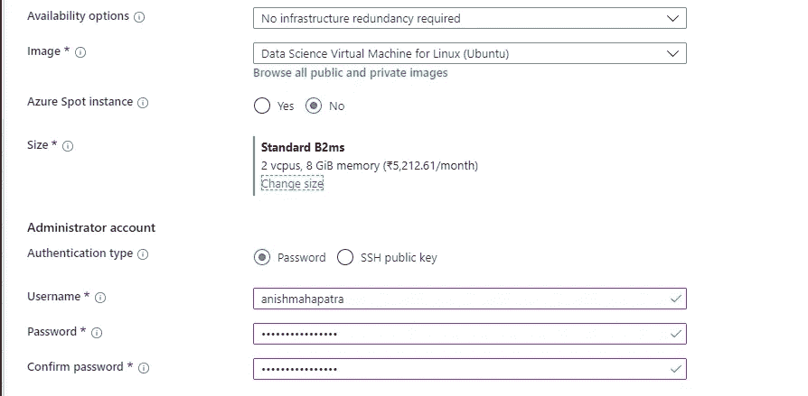

示例配置— 2

现在选择审查+创建。最重要的是，您应该看到 Data Science 虚拟机每小时的成本。对于上面的示例配置(这与 2020 年的一些最新笔记本电脑一样好)，**设置成本仅为 1/小时**。难以置信！根据你的需求，你甚至可以使用 GPU 进行深度学习建模，大约 50 英镑/小时。

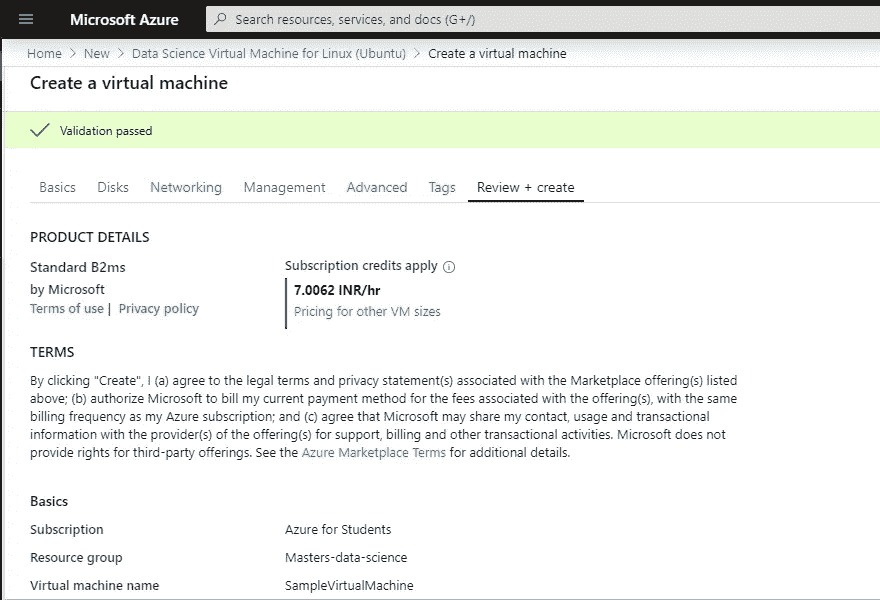

所选样本配置的每小时价格(印度卢比)

如果你对所有提到的规范感到满意，只需点击**创建**按钮，我们就可以开始了。否则，返回并重新配置规范。

该页面应该导航到一个新页面，这需要几秒钟或几分钟的时间(取决于设置虚拟机的配置)

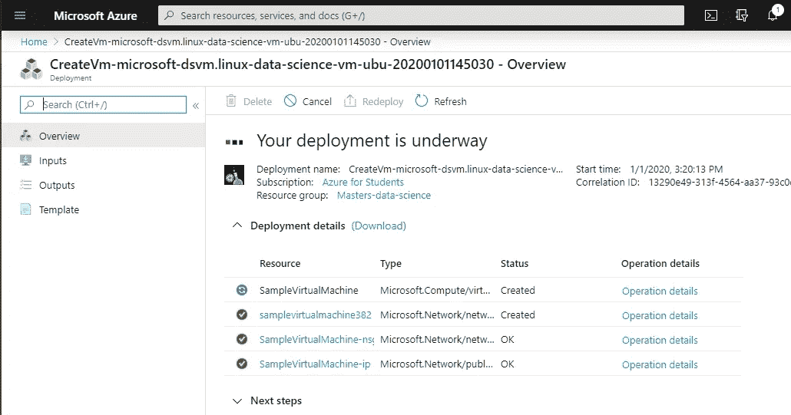

部署正在进行中

部署后，您可以看到以下屏幕。

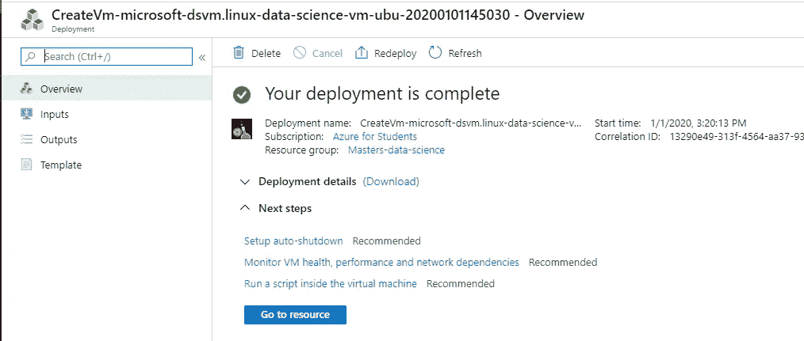

部署成功！

在这里，我建议您设置自动关闭并在本地计算机上下载部署细节。我还建议保留管理员用户名和密码的备份，以备将来参考。

**注意**:运行一个虚拟机是要花钱的。不使用时，选择**停止**按钮停止。如果虚拟机运行不正常，您可以重新部署它。

如果您点击**转到资源**按钮，您可以看到相关选项。

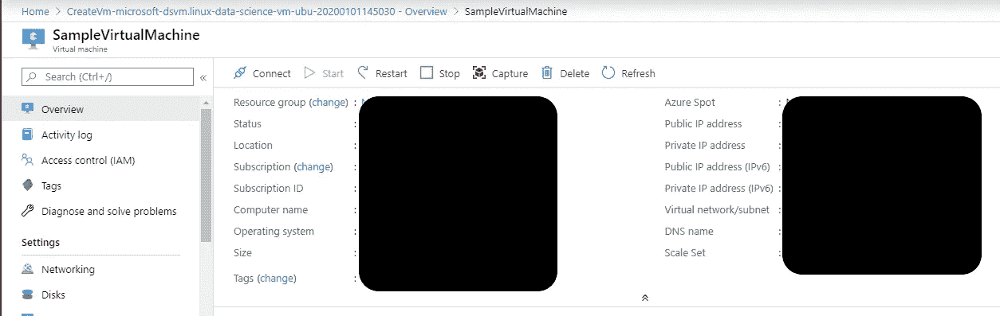

示例虚拟机，您可以在其中重启、停止和删除 Data Science 虚拟机

干得好！现在，您已经使用想要使用的配置设置了 Data Science 虚拟机。

# 4.将 DSVM 连接到 Azure 笔记本电脑

将数据科学虚拟机与 Jupyter 笔记本( [Pixabay](https://pixabay.com/illustrations/artificial-intelligence-brain-hand-4631712/) )连接

让我们总结一下你迄今为止做得非常出色的事情:

*   我们有运行在云上的 Jupyter 笔记本: [Azure 笔记本](https://notebooks.azure.com/)设置好了，我们已经可以在自由层上运行 Jupyter 笔记本了

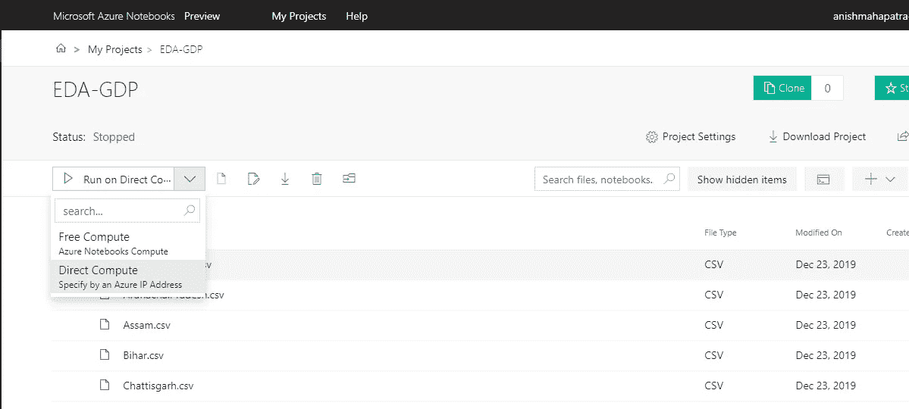

您有一个项目准备好在 [Azure 笔记本电脑上计算](https://notebooks.azure.com/)

*   我们已经建立了一个数据科学虚拟机，具有我们需要的存储和计算能力。

如果你前往 Azure 门户网站，你应该会看到**最近资源**下的资源，如图所示。

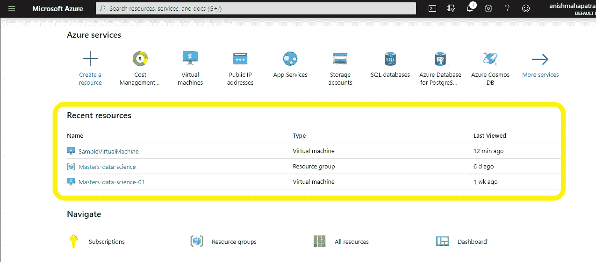

现有资源下的 SampleVirtualMachine

到目前为止你做得很好！我们现在将继续进行我们已经进行了这么久的步骤:将我们的 Azure 笔记本与我们的 Azure Compute 连接起来。

转到您的 Azure 笔记本，选择在 Direct Compute 上运行的选项，如下所示。

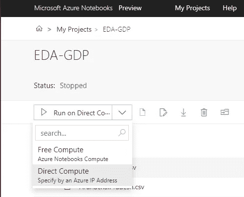

选择直接计算

您现在应该会看到一个选项来验证您的 Azure 虚拟机凭据，如下所示。

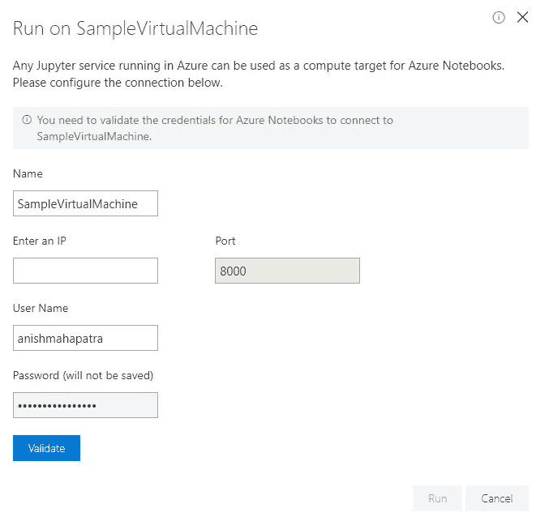

只需输入您之前为虚拟机提供的管理员用户名和密码

对于 IP，您可以返回到虚拟机的设置页面，并复制公共 IP，如下所示。

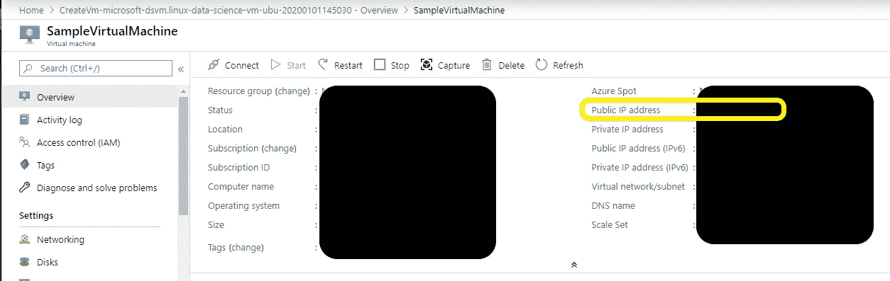

使用给定的公共 IP 来运行 Jupyter 笔记本

我看到的一个常见错误如下所示。

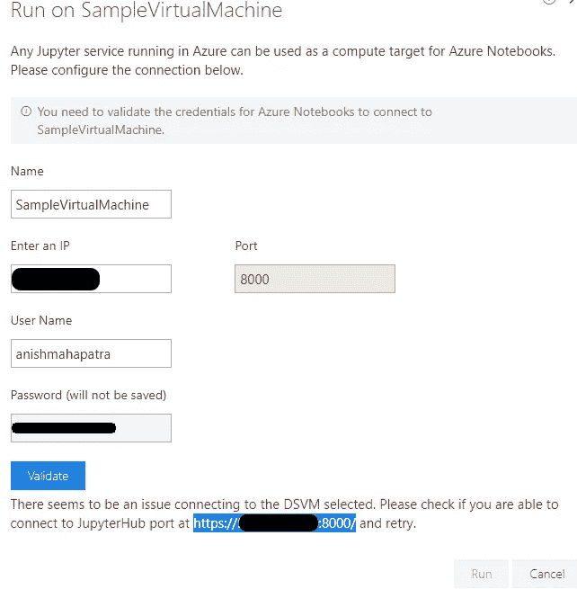

DSVM 出错

只需选择突出显示的链接并将其粘贴到您的浏览器中。我相信这个错误的发生是因为我们没有一个安全的连接，但是没关系，因为我们是唯一使用它的人，所以个人部署不需要太多的安全性。但是，如果您正尝试为企业部署这一功能，我建议您联系您的 IT 部门，以确保遵循信息安全实践。

粘贴链接应该会将您带到一个要求您提供凭据的页面。您可以输入 DSVM 凭据并登录。

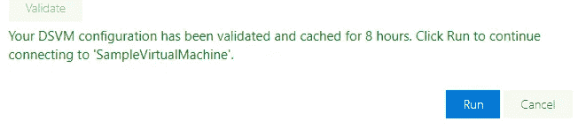

部署成功！现在，只需点击**运行**！

现在，刷新 Azure 笔记本页面，再次尝试**直接计算**选项，点击**运行**！

您现在已经成功地在云端部署了您的 Jupyter 笔记本电脑。

干得好。( [Pixabay](https://pixabay.com/photos/thumbs-up-okay-good-well-done-2056022/) )

# 结论:

 [## Anish Mahapatra -数据科学家-穆适马公司| LinkedIn

### 我正在努力理解数学、商业和技术如何帮助我们在未来做出更好的决策…

www.linkedin.com](https://www.linkedin.com/in/anishmahapatra/) 

正如所承诺的，您已经在 15 分钟内成功地在云上运行了 Jupyter Notebook。我花了很多时间研究，并且非常喜欢写这篇文章。如果这对你有帮助，给我点爱！😄我也写关于千禧一代的[生活方式](https://medium.com/@anishmahapatra/the-millennial-burn-out-is-real-a0acebff25ae)、[咨询](https://medium.com/@anishmahapatra/my-top-5-learnings-as-a-consultant-accc5989ec34)、[聊天机器人](https://chatbotslife.com/how-you-can-build-your-first-chatbot-using-rasa-in-under-15-minutes-ce557ea52f2f)和[金融](https://medium.com/@anishmahapatra/the-investment-guide-for-smart-noobs-9d0e2ca09457)！如果您对此有任何问题或建议，请随时通过 LinkedIn[联系我](https://www.linkedin.com/in/anishmahapatra/)或关注我[这里](https://medium.com/@anishmahapatra)，我很想听听您的想法！