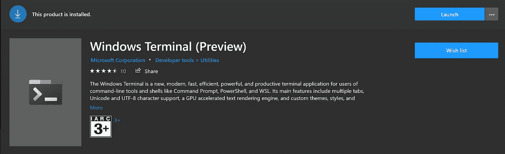
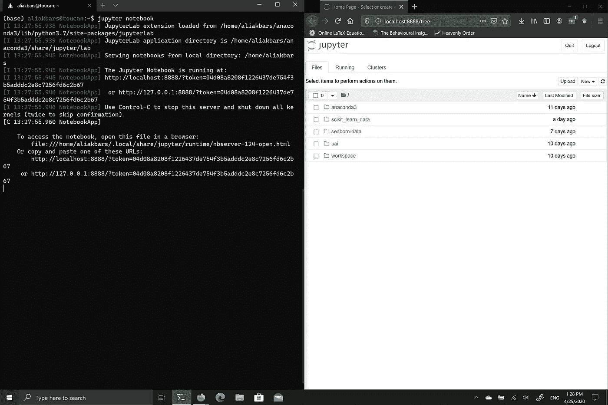

# 在 WSL 上运行 Jupyter 笔记本，同时在 Windows 上使用浏览器

> 原文：<https://towardsdatascience.com/running-jupyter-notebook-on-wsl-while-using-firefox-on-windows-5a47ebfae4c1?source=collection_archive---------6----------------------->

## 体验 Ubuntu 或 Mac 的指南

如果您像我一样是一名数据科学家，最近刚刚迁移(回到)Windows，您可能会发现启动并运行系统很困难，尤其是当您想要使用 bash terminal 的强大功能时。你会立刻意识到你为苹果电脑支付的价格可能真的是值得的。你得到了两个世界的好处:基于 GUI 的应用程序可以正常工作，而基于 CLI 的应用程序可以加快速度。

虽然使用 Windows subsystem for Linux (WSL)可以帮助我让好的 ol' bash 终端工作，但它不能在运行 Jupyter Notebook 时提供相同的现成体验。我也错过了好的终端，比如 Mac 上的 [iTerm2](https://www.iterm2.com/) 或者 Ubuntu 上的 [Terminator](https://gnometerminator.blogspot.com/) 。你可以找到人们使用类似 [Hyper](https://hyper.is/) 的变通方法，甚至可以回到旧的 [tmux](https://github.com/tmux/tmux/wiki) ，但我发现前者很迟缓，而后者没有 iTerm2 或终结者那么容易。在本帖中，我将向您介绍 [Windows 终端](https://github.com/microsoft/terminal)。

它很简单，相当快，类似 iTerm2。*很好。*

# 设置 Windows 终端

您可以从 Microsoft Store 安装它。您可能需要首先更新您的 Windows。别担心，等待是值得的。



最低要求是 Windows 10 build 1903 | Image by author

完成了吗？

*免责声明:我假设你已经用你最喜欢的发行版安装了 WSL。如果你还没有，那就按照* [*这个指南*](https://docs.microsoft.com/en-us/windows/wsl/install-win10) *。这种情况下，我用的是 Ubuntu 18.04。*

接下来，打开您的 Windows 终端。默认情况下，您应该会看到 Windows PowerShell。使用 Windows 终端，你可以打开多个标签，从 Windows PowerShell、命令提示符、你选择的 WSL 甚至 Azure Cloud Shell 切换。如果你想让 bash 成为你的默认设置，点击 Ctrl+，或者点击向下的 v 形图标，然后点击“设置”。

找到“defaultProfile”并将值更改为“profiles”>“defaults”>“list”中的“guid”。

```
{
    "defaultProfile": **"{c6eaf9f4-32a7-5fdc-b5cf-066e8a4b1e40}"**,
    ...
    "profiles":
    {
        "defaults":
        {
            ...
        },
        "list":
        [
            {
                "guid": "**{c6eaf9f4-32a7-5fdc-b5cf-066e8a4b1e40}**",
                "hidden": false,
                "name": "Ubuntu-18.04",
                "source": "Windows.Terminal.Wsl",
                **"startingDirectory": "//wsl$/Ubuntu-18.04/home/<username>"**
            },
            ...
        ]
    },
    ...
}
```

注意，我还向 WSL 添加了**“starting directory”**。

使用默认设置，您可以通过按 Alt+Shift+D 打开一个新的窗格。现在你不再需要 Hyper 了，是吗？

# 配置 Jupyter 笔记本

我假设你已经在这里安装了 Python 和 Jupyter Notebook。如果没有，我推荐使用 [Anaconda](https://www.anaconda.com/products/individual) 来安装它们。提醒您，这将安装在您的 WSL 中。

接下来，使用以下命令生成笔记本配置:

```
jupyter notebook --generate-config
```

然后您将在中看到一个 Python 文件。朱庇特文件夹。使用您最喜欢的文本编辑器编辑它们。

```
code ~/.jupyter/jupyter_notebook_config.py
```

通过更改该行来禁止通过 redicect 文件启动浏览器(默认值为 **True** ):

```
c.NotebookApp.use_redirect_file = False
```

WSL 的好处是可以直接从 bash 打开 Windows 程序。因此，要让您的 Jupyter 笔记本在浏览器中打开一个选项卡，您可以在 bash 中将它们添加为$BROWSER。我这里用的是火狐，但是你可以换成你自己喜欢的浏览器。也就是说，可以编辑~/。bashrc，并添加以下行:

```
export BROWSER='/mnt/c/Program Files/Mozilla Firefox/firefox.exe'
```

*瞧吧！*



从 WSL 运行 Jupyter 将会在 Windows | Image by author 上调用您的浏览器

/mnt/c 意味着您可以直接从 bash 访问 Windows 上的文件！很整洁不是吗？因此，在这种情况下，我们在 Windows 上使用 Firefox。没有必要在 WSL 上安装 Firefox 甚至 X11。现在，你可以像在 Ubuntu 或 Mac 上一样启动你的笔记本了。

*希望你觉得这有用！*