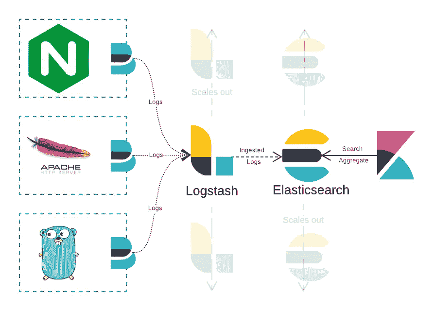
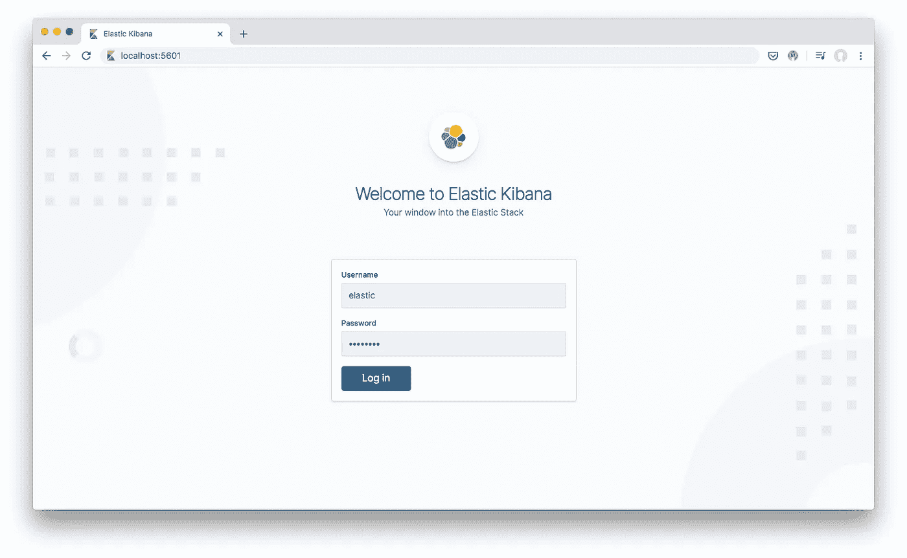
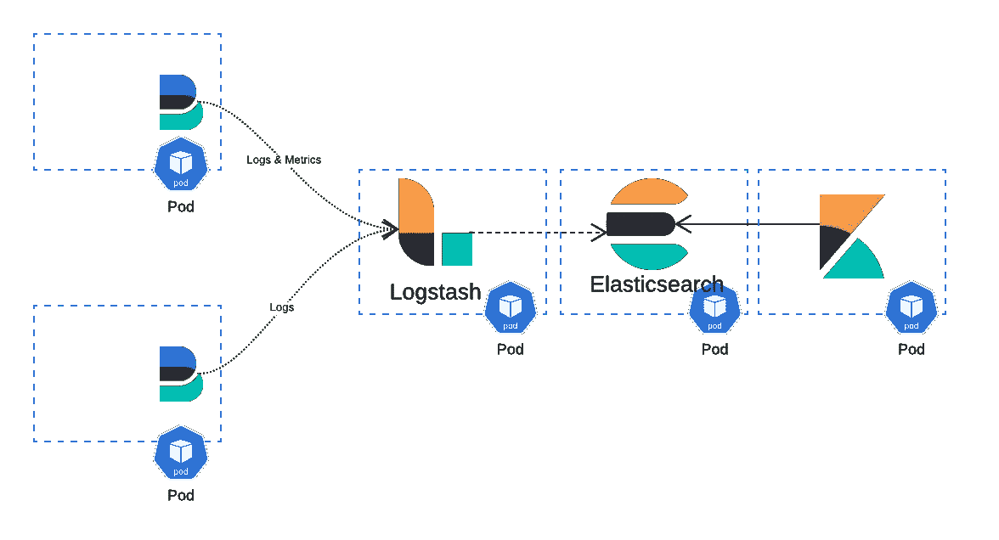

# 在 Docker 上运行、保护和部署弹性堆栈🐳

> 原文：<https://towardsdatascience.com/running-securing-and-deploying-elastic-stack-on-docker-f1a8ebf1dc5b?source=collection_archive---------4----------------------->

## 在 Docker 上为小规模生产部署和开发构建和配置弹性堆栈(ELK)

## 什么是弹性叠加？

Elastic Stack(又名 **ELK** )是您组织的集中式结构化日志记录的当前首选堆栈。它**收集**、**吸收**、**存储**您的服务日志(以及指标),同时**使它们可搜索&可聚集&可观察**。然后，基于这些数据构建警报和仪表板。



活动中的弹性堆栈。

## 运行弹性堆栈

在本帖中，我们将使用 Docker&Docker-Compose**编写**、**配置**、**安全**、**部署**弹性堆栈。我们将构建的内容可用于 docker 主机上的**开发**和**小规模生产部署**。

*   为每个组件构建一个映像。
*   参数化配置&避免硬编码凭证。
*   将 Elasticsearch 设置为可扩展的生产单节点集群。
*   设置安全性和加密。
*   在容器外保存秘密、证书和数据。
*   在 Docker-Compose 中将所有内容组合在一起。

**要跳过逐步教程**你可以查看我的 [Elastdocker](https://github.com/sherifabdlnaby/elastdocker) 模板库，用一个命令在 Docker **上旋转弹性堆栈。**

[](https://github.com/sherifabdlnaby/elastdocker) [## sherifabdlnaby/elastdocker

### 用像 Curator，Rubban，ElastAlert 这样的工具进行预警。弹性堆栈(又名 ELK) Docker 组成，预配置…

github.com](https://github.com/sherifabdlnaby/elastdocker) 

```
git clone [https://github.com/sherifabdlnaby/elastdocker.git](https://github.com/sherifabdlnaby/elastdocker.git)
cd elastdocker
make setup & make elk
```

> Elastdocker template 具有更完善的配置和更好的安全性，以及经常与 Elastic Stack 一起使用的监控和工具。为了简单起见，本教程中省略了这些额外的内容。

# 步伐

1.  为我们的堆栈创建 Docker 映像(使用我们的配置)。
2.  创建一个设置容器来生成 Elasticsearch 密钥库和证书。
3.  使用 Docker-Compose 将堆栈放在一起。
4.  开始运送日志！🎉

# 1.为我们的堆栈创建 Docker 图像。

让我们从制作根目录`elk`开始，创建五个独立的文件夹；`elasticsearch`、`logstash`、`kibana`、`setup`和`secrets`目录。

另外，在根目录下创建一个`.env`文件来保存我们的参数。

## 弹性搜索

在`./elasticsearch`目录中创建`Dockerfile`并添加以下内容:

然后我们还将`elasticsearch.yml`添加到`./elastichsearch/config/` 目录中，这个文件将在容器启动时加载以配置 elasticsearch。

*   注意`${ELASTIC_XXX}`配置将从容器的环境变量中设置，我们稍后将在运行时传递这些变量。

**Logstash** 在`./logstash`目录下创建`Dockerfile`并添加以下内容:

将`logstash.yml`添加到`logstash/config`目录中。

将`logstash.conf`添加到`logstash/pipeline`目录中。

从 Beats = to => Elasticsearch 转发数据的简单管道。

## 基巴纳

在`kibana`目录中创建`Dockerfile`并添加以下内容:

将`kibana.yml`添加到`kibana\config`目录:

# 2.创建一个设置容器来生成 Elasticsearch 密钥库和认证

我们需要创建一个容器来生成 Elasticsearch 密钥库，其中包含 Elasticsearch 的用户(和超级用户)密码，以及其他凭证(例如，如果您使用 S3 插件，就像 AWS 密钥一样)。
该密钥库由 Elasticsearch docker 映像中的`*elasticsearch-keystore*` *创建。*

**2.1** 增加`setup-keystore.sh`到`/setup`

这个脚本创建一个 Keystore 并将其写入`/secrets/elasticsearch.keystore`，然后将`$ELASTIC_PASSWORD`添加为默认超级用户`elastic`，稍后我们将使用`docker-compose`将`$ELASTIC_PASSWORD`传递给安装容器。

**2.2** 增加`setup-certs.sh`到`/setup`

该脚本创建一个自签名的单个 PKCS#12 密钥库，其中包括节点证书、节点密钥和 CA 证书。

**2.3** 在根目录下创建`docker-compose.setup.yml`将启动安装容器。

这个`docker-compose`创建了一个临时容器，它使用我们之前编写的脚本生成密钥库和证书。

使用以下命令运行:

```
docker-compose -f docker-compose.setup.yml run --rm keystore
docker-compose -f docker-compose.setup.yml run --rm certs
```

这将创建容器，并在完成时删除它们以节省空间。将其输出保存到`/secrets`目录。

# 3.使用 Docker-Compose 将堆栈放在一起。

最后，创建主`docker-compose.yml`文件，将所有内容放在一起。

Docker-Compose 文件中有什么？

1.  我们声明 Elasticsearch 的容量将持久存储数据。
2.  我们声明传递给 Elasticsearch 的秘密密钥库，它包含凭证(目前只有超级用户密码，但是以后可以通过扩展`setup-keystore.sh`脚本来保存许多其他凭证)
3.  我们声明 ELK 的 3 个服务(Elasticsearch、Logstash 和 Kibana)
    传递构建图像和运行容器所需的环境变量，召回所有包含`${ELASTIC_XXX}`配置的配置文件，您必须在这里看到它们被传递。注意，我们也没有在`Docker-Compose`文件中硬编码它们的值，而是在`.env`文件中声明所有内容，这样它就保存了所有参数。
4.  我们还声明了 Elasticsearch 的推荐设置，如`ulimit`和`ES_JAVA_OPTS`，并为堆栈组件设置了堆大小。

**将所有参数添加到** `**.env**` **文件**

## 启动堆栈

运行以下命令:

**设置(仅运行一次)**

```
docker-compose -f docker-compose.setup.yml run --rm keystore
docker-compose -f docker-compose.setup.yml run --rm certs
```

**启动弹性堆栈**

```
docker-compose up -d
```

**前往**[localhost:5601](http://localhost:5601)
**用户名** : `elastic`
**密码** : `changeme`



登录弹性基巴纳

# 4.开始运送日志！🎉

您现在可以开始将日志和指标发送到 Elastic Stack。
1。[使用 Filebeat 从服务中发送日志](http://localhost:5601/app/kibana#/home/tutorial_directory/logging)。
2。[使用 Metricbeat 从服务中发送指标。](http://localhost:5601/app/kibana#/home/tutorial_directory/metrics)
直接到 Elasticsearch 或者用 Logstash 摄取。并在 Kibana 的发现窗口中浏览它们。

> 有许多指南可以帮助你将原木运送到弹性堆上。

# 从这里去哪里？

我们还可以进一步增强这种组合，我们可以启用自我监控，或添加 Prometheus Exporters 以使用 Grafana 监控堆栈，除了我们启用的内部节点传输加密之外，还可以为 HTTP 层启用 SSL，为映像添加健康检查，使用 ElastAlert 或 Curator 等工具来利用堆栈，向集群添加更多节点。

## 使用 [Elastdocker](https://github.com/sherifabdlnaby/elastdocker) 代替。

[Elastdocker](https://github.com/sherifabdlnaby/elastdocker) 是一个模板库，拥有我们刚刚制作的更复杂版本的弹性堆栈设置，包括上面提到的所有要点。

[](https://github.com/sherifabdlnaby/elastdocker) [## sherifabdlnaby/elastdocker

### 用像 Curator，Rubban，ElastAlert 这样的工具进行预警。弹性堆栈(又名 ELK) Docker 组成，预配置…

github.com](https://github.com/sherifabdlnaby/elastdocker) 

## 缩放弹性堆栈

这种设置可以处理少量生产工作负载，但最终需要扩展。

*   您需要将栈组件解耦，以便独立地部署到不同的 docker 主机上。
*   您可能需要添加额外的 Elasticsearch 节点。
*   您可能需要横向扩展 Logstash。
*   将当前设置转换为 Kubernetes 设置，改为使用**窗格**和**图表**。(前提是你的组织里有 k8。)



分解成吊舱的弹性堆栈的可能 K8S 部署

**您可以看看托管弹性堆栈产品。**

本帖使用的代码:[https://github.com/sherifabdlnaby/medium-elastic-stack](https://github.com/sherifabdlnaby/medium-elastic-stack)