# 在 Docker 容器中运行 Spark NLP，用于命名实体识别和其他 NLP 特性

> 原文：<https://towardsdatascience.com/running-spark-nlp-in-docker-container-for-named-entity-recognition-and-other-nlp-features-8acdb662da5b?source=collection_archive---------28----------------------->

## 在 Docker 环境下使用 Spark NLP 和 Jupyter notebook 进行自然语言处理


作者照片

如[1]所述，[自然语言处理(NLP)](https://en.wikipedia.org/wiki/Natural_language_processing) 是语言学、计算机科学、信息工程、人工智能等许多研究领域共有的一个共同研究子领域。NLP 通常关注计算机和人类自然语言之间的交互，特别是如何使用计算机来处理和分析自然语言数据(例如，文本、语音等)。).NLP 中的一些主要挑战包括语音识别、自然语言理解(例如，文本理解)和自然语言生成。

机器学习在文本理解中的早期应用之一是电子邮件和垃圾消息检测[1]。随着深度学习的推进，许多新的高级语言理解方法已经问世，如深度学习方法 [BERT](https://arxiv.org/abs/1810.04805) (使用 MobileBERT 进行问答的例子见[2】)。

NLP 中另一个流行的方法是[命名实体识别(NER)](https://en.wikipedia.org/wiki/Named-entity_recognition) 。NER 的主要目的是提取[命名实体](https://en.wikipedia.org/wiki/Named_entity)(例如，个人姓名、组织名称、地点名称、产品名称等。)来自[非结构化文本](https://en.wikipedia.org/wiki/Unstructured_data)。有许多支持 NER 的开源 NLP 库/工具，如 NLTK 和 SpaCy [3]。最近，Spark NLP [4]得到了越来越多的关注，因为它提供了更完整的受支持的 NLP 特性列表[5][6]。

在我看来，Spark NLP [4]的开发是基于 Ubuntu Linux 和 OpenJDK 的。因此，由于 Colab 使用 Ubuntu 操作系统，所以在 Colab 中直接设置 Spark NLP 的环境(参见[指令和代码示例](https://github.com/JohnSnowLabs/spark-nlp-workshop/blob/master/tutorials/blogposts/3.NER_with_BERT.ipynb))。然而，我注意到很难在 Mac 上为 Spark NLP 设置一个本地环境，原因如下:

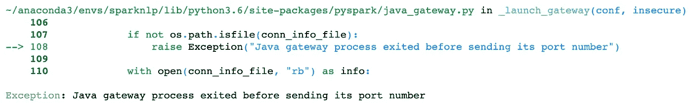

为了避免这个问题，本文演示了如何建立一个 Docker 环境[7]来运行 NER 的 Spark NLP 和 Docker 容器中的其他 NLP 特性。这样的 Docker 环境可以作为建立 Spark NLP [微服务](https://en.wikipedia.org/wiki/Microservices)平台的基础。

# 1.Docker 简介

如[7]中所述，Docker 是一种工具，它允许我们在沙箱(称为*容器*)中轻松部署应用程序(例如 Spark NLP)，以在任何 Docker 支持的主机操作系统(即 Mac)上运行。

Docker 的基本概念是:

*   Dockerfile:
*   Docker 图像
*   码头集装箱

## 1.1 文档文件

一个[*Docker file*](https://docs.docker.com/engine/reference/builder/)【7】是一个简单的文本文件，包含一个用于创建 Docker 映像的命令列表(类似于 Linux 命令)。这是一种自动化 Docker 图像创建过程的方法。

## 1.2 Docker 图像

一个 [docker 映像](https://jfrog.com/knowledge-base/a-beginners-guide-to-understanding-and-building-docker-images/)【7】是一个只读模板，包含一组用于创建 docker 容器的指令，该容器可以在 Docker 平台上运行。它提供了一种打包应用程序和预配置服务器环境的便捷方式。

Docker 映像是从 Docker 文件构建的。

## 1.3 码头集装箱

容器是包含代码及其所有依赖项的标准软件包，因此应用程序可以从一个计算环境快速可靠地运行到另一个计算环境。一个 [Docker 容器](https://www.docker.com/resources/what-container)【7】是一个轻量级的、独立的、可执行的软件包，它包含了应用程序的一切，比如代码、运行时、系统工具、系统库和设置。

Docker 容器是从 Docker 映像构建的。

# 2.用 Jupyter 笔记本为 Spark NLP 设置 Docker 环境

设置 Docker 环境以使用 Jupyter notebook 运行 Spark NLP 的过程包括以下步骤:

*   安装 Docker
*   在 Docker Hub 注册
*   创建 Dockerfile 文件
*   建立码头形象
*   启动码头集装箱
*   推送 Docker 图像
*   拉动 Docker 图像

## 2.1 安装 Docker

不同平台安装 Docker 的说明网上有: [Mac](https://docs.docker.com/docker-for-mac/install) ， [Linux](https://docs.docker.com/install/linux/docker-ce/ubuntu) 和 [Windows](https://docs.docker.com/docker-for-windows/install) 。

一旦 docker 安装完成，我们可以使用以下 Docker 命令和相应的输出来验证安装:

```
docker --version
Docker version 19.03.8, build afacb8b
```

## 2.2 在 Docker Hub 注册

类似于 [Github](https://github.com/) 分享源代码文件， [Docker Hub](https://hub.docker.com/) 就是分享 Docker 镜像。为了共享本地机器上的 docker 映像，需要将本地机器上的 docker 映像推送到 Docker Hub 服务器，以便其他人可以从 Docker Hub 获取 Docker 映像。

需要先去 [Docker Hub](https://hub.docker.com/) 注册才能使用 Docker Hub 服务。

## 2.3 创建 Dockerfile

为了构建新的 Docker 映像，首先需要创建一个 Docker 文件。

为了简化运行 Spark NLP workshop 的过程， [John Snow LABS](https://www.johnsnowlabs.com/spark-nlp) 提供了一个[Spark NLP workshop Docker file](https://github.com/JohnSnowLabs/spark-nlp-workshop/blob/master/Dockerfile)，用于在 Docker 容器中运行 workshop 示例。

为了在 Docker 容器中构建一个新的 Docker 映像来运行 Spark NLP 和 Jupyter notebook，我基于 Spark NLP workshop Dockerfile 文件创建了一个新的[Docker 文件](https://github.com/yzzhang/machine-learning/blob/master/deep_learning/nlp/spark-nlp-docker/Dockerfile)【8】，并做了以下修改:

*   删除了教程和相关的笔记本和数据文件
*   用 Spark NLP 2.5.1 替换 Spark NLP 2.4.5
*   已调整 docker hub 用户名
*   调整了 docker 容器中的主目录名
*   添加了命令行*卷*选项，将主机上的当前工作目录映射到 Docker 容器中的主目录
*   移除 Jupyter 笔记本配置

## 2.4 建立码头工人形象

使用新的 Docker 文件[8]，可以按如下方式构建新的 Docker 映像:

```
docker build -t zhangyuefeng123/sparknlp:1.0 .
```

构建完成后，应该会显示以下 docker 命令和 Docker 图像标记:

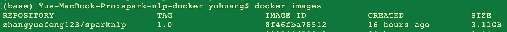

## 2.5 启动码头集装箱

一旦新的 Docker 映像准备就绪，就可以使用下面的命令启动一个新的 Docker 容器，使用 Jupyter notebook 运行 Spark NLP:

```
docker run -it --volume $PWD:/home/yuefeng -p 8888:8888 -p 4040:4040 zhangyuefeng123/sparknlp:1.0
```

如果一切顺利，应该会显示以下输出:

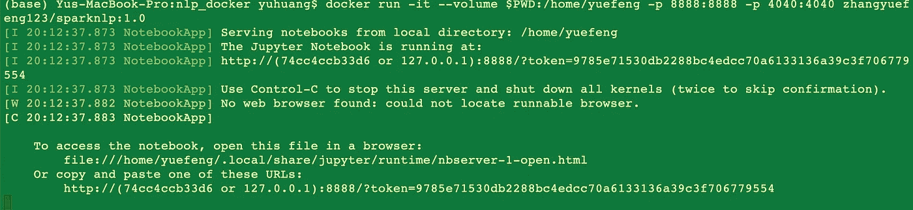

## 2.6 推送 Docker 图像

为了与他人共享本地主机上的 Docker 映像(如*zhangyue feng 123/spark NLP:1.0*)，需要将映像推送到 Docker Hub，如下所示:

```
docker push zhangyuefeng123/sparknlp:1.0
```

以下是 Docker Hub 推送 Docker 图片的结果:


## 2.7 拉动 Docker 图像

如果具有预期功能的 Docker 映像(例如，*zhangyue feng 123/spark NLP:1.0*)已经存在于 Docker Hub 中，则它可以被拉到本地主机上以供重用，而不是从 Dockerfile 构建新的 Docker 映像，如下所示:

```
docker pull zhangyuefeng123/sparknlp:1.0
```

# 3.使用 Docker 容器中的 Jupyter 笔记本运行 Spark NLP

一旦一个新的 Docker 容器开始运行(详见第 2.5 节)，我们可以复制生成的 URL，如下所示，并将其粘贴到 Web 浏览器中，以启动 Jupyter notebook Web 界面:

```
http://127.0.0.1:8888/?token=9785e71530db2288bc4edcc70a6133136a39c3f706779554
```

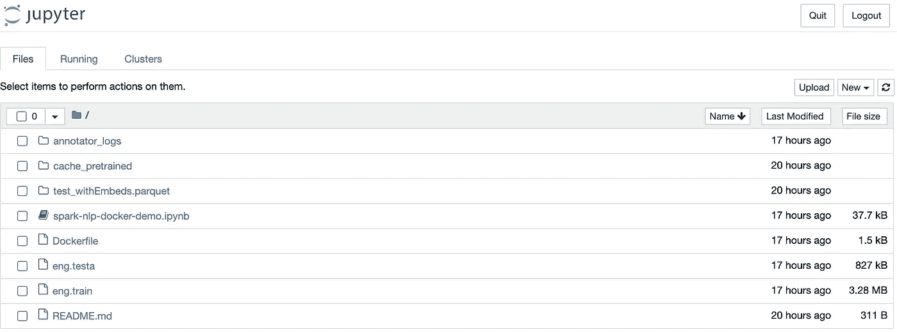

一旦 Jupyter 笔记本启动，我们就可以像往常一样使用它(详见下一节)。

# 4.将 Spark NLP 用于 NER 和其他 NLP 功能

为了验证 Docker container 中运行的 Jupyter notebook 具有相同的预期功能，我创建了一个新的 Jupyter notebook*Spark-nlp-Docker-demo . ipynb，并使用它来*执行[6]中的主要代码片段，以将 Spark NLP 应用于 ner 和其他 NLP 功能。

首先，下面的代码导入所需的 pyspark 和 spark NLP 库，然后启动一个 Spark 会话，在 Spark 上运行 Spark NLP:

```
from pyspark.sql import SparkSession
from pyspark.ml import Pipelineimport sparknlp
from sparknlp.annotator import *
from sparknlp.common import *
from sparknlp.base import *spark = sparknlp.start()
```

官方 [CoNLL2003 数据集](https://github.com/JohnSnowLabs/spark-nlp/tree/master/src/test/resources/conll2003)的训练和测试数据集被下载用于演示目的；

```
from urllib.request import urlretrieveurlretrieve('[https://github.com/JohnSnowLabs/spark-nlp/raw/master/src/test/resources/conll2003/eng.train'](https://github.com/JohnSnowLabs/spark-nlp/raw/master/src/test/resources/conll2003/eng.train'),
           'eng.train')urlretrieve('[https://github.com/JohnSnowLabs/spark-nlp/raw/master/src/test/resources/conll2003/eng.testa'](https://github.com/JohnSnowLabs/spark-nlp/raw/master/src/test/resources/conll2003/eng.testa'),
           'eng.testa')
```

下面的代码用于读取定型数据集并显示前 500 条记录。训练数据集遵循训练集中用于训练 NER 模型的注释的标准格式。

```
with open("eng.train") as f:
    c=f.read()print (c[:500])
```

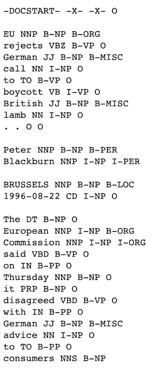

训练数据集可以以更易读的格式加载:

```
from sparknlp.training import CoNLLtraining_data = CoNLL().readDataset(spark, './eng.train')
training_data.show(3)
training_data.count()
```

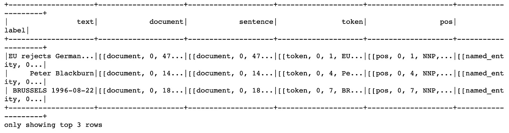

以下代码加载预训练的 BERT 嵌入模型，并使用它将测试数据集转换为 BERT 嵌入格式(即，将每个单词编码为 768 维向量)。

```
bert_annotator = BertEmbeddings.pretrained('bert_base_cased', 'en') \
 .setInputCols(["sentence",'token'])\
 .setOutputCol("bert")\
 .setCaseSensitive(False)\
 .setPoolingLayer(0)test_data = CoNLL().readDataset(spark, './eng.testa')test_data = bert_annotator.transform(test_data)
test_data.show(3)
```

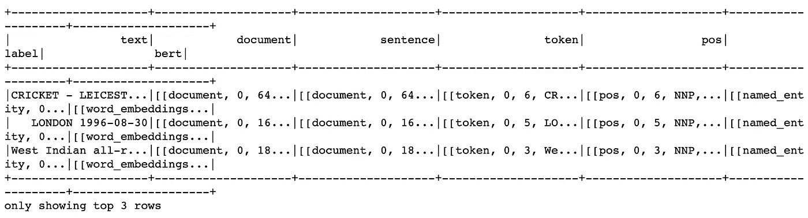

下面的代码显示了句子的标记、相应的 BERT 嵌入和相应的带标签的 NER 标签。

```
test_data.select("bert.result","bert.embeddings",'label.result').show()
```

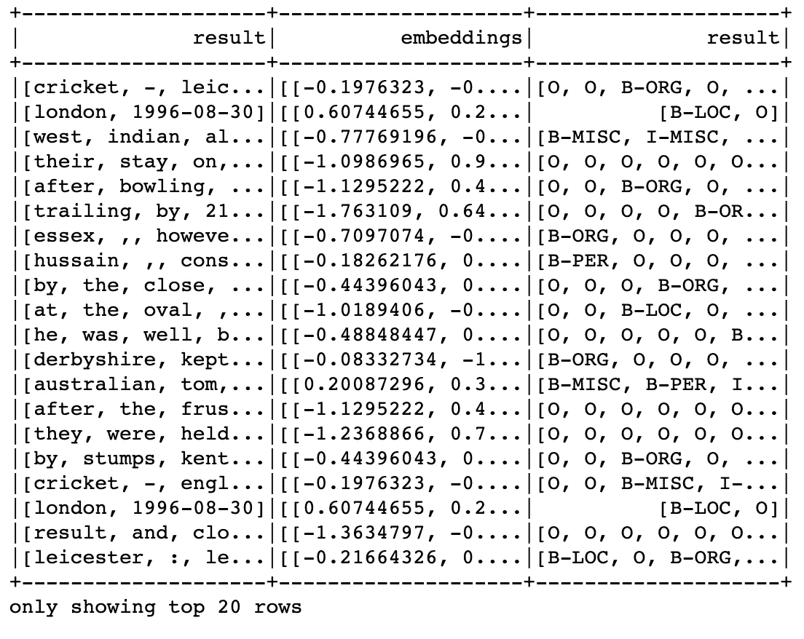

以下代码首先将测试数据集中的 1，000 条记录保存到一个 Parquet 文件中，然后创建一个基于 Tensorflow 的字符级 CNN-DLSTM 模型 *NerDLApproach* ，使用经过训练的 BERT 嵌入模型 *bert_annotator* 和 NerDLApproach 模型形成一个管道，最后使用训练数据集中的 1，000 条记录和 Parquet 文件中保存的 1，000 条测试记录来训练管道。

```
test_data.limit(1000).write.parquet("test_withEmbeds.parquet")nerTagger = NerDLApproach()\
  .setInputCols(["sentence", "token", "bert"])\
  .setLabelColumn("label")\
  .setOutputCol("ner")\
  .setMaxEpochs(1)\
  .setLr(0.001)\
  .setPo(0.005)\
  .setBatchSize(8)\
  .setRandomSeed(0)\
  .setVerbose(1)\
  .setValidationSplit(0.2)\
  .setEvaluationLogExtended(True) \
  .setEnableOutputLogs(True)\
  .setIncludeConfidence(True)\
  .setTestDataset("test_withEmbeds.parquet")pipeline = Pipeline(
    stages = [
    bert_annotator,
    nerTagger
  ])ner_model = pipeline.fit(training_data.limit(1000))
```

然后，经过训练的管道可用于预测测试数据集的 NER 标签(参见下面的前 20 行结果):

```
predictions = ner_model.transform(test_data)
predictions.select('token.result','label.result','ner.result').show(truncate=40)
```

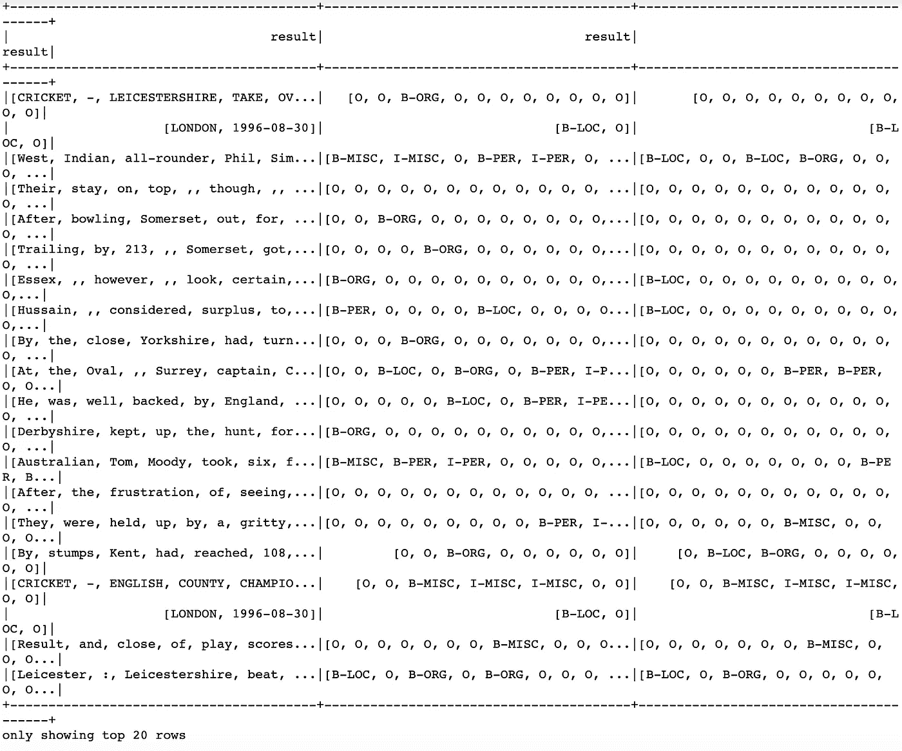

标记为 NER 标签的前 20 行标记和相应的预测 NER 标签可以以更可读的格式显示:

```
import pyspark.sql.functions as Fpredictions.select(F.explode(F.arrays_zip('token.result','label.result','ner.result')).alias("cols")) \
.select(F.expr("cols['0']").alias("token"),
        F.expr("cols['1']").alias("ground_truth"),
        F.expr("cols['2']").alias("prediction")).show(truncate=False)
```

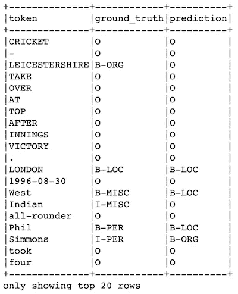

以下代码显示了如何使用预训练的管道为给定的句子生成 NER 标记。

```
from sparknlp.pretrained import PretrainedPipelinepretrained_pipeline = PretrainedPipeline('recognize_entities_dl', lang='en')text = "The Mona Lisa is a 16th century oil painting created by Leonardo. It's held at the Louvre in Paris."result = pretrained_pipeline.annotate(text)list(zip(result['token'], result['ner']))
```

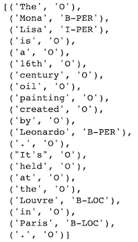

不同的预训练模型可用于形成新的管道:

```
import json
import os
from pyspark.ml import Pipeline
from sparknlp.base import *
from sparknlp.annotator import *
import sparknlpdef get_ann_pipeline ():

    document_assembler = DocumentAssembler() \
        .setInputCol("text")\
        .setOutputCol('document') sentence = SentenceDetector()\
        .setInputCols(['document'])\
        .setOutputCol('sentence')\
        .setCustomBounds(['\n']) tokenizer = Tokenizer() \
        .setInputCols(["sentence"]) \
        .setOutputCol("token") pos = PerceptronModel.pretrained() \
          .setInputCols(["sentence", "token"]) \
          .setOutputCol("pos")
    embeddings = WordEmbeddingsModel.pretrained()\
          .setInputCols(["sentence", "token"])\
          .setOutputCol("embeddings") ner_model = NerDLModel.pretrained() \
          .setInputCols(["sentence", "token", "embeddings"]) \
          .setOutputCol("ner") ner_converter = NerConverter()\
          .setInputCols(["sentence", "token", "ner"])\
          .setOutputCol("ner_chunk") ner_pipeline = Pipeline(
        stages = [
            document_assembler,
            sentence,
            tokenizer,
            pos,
            embeddings,
            ner_model,
            ner_converter
        ]
    ) empty_data = spark.createDataFrame([[""]]).toDF("text") ner_pipelineFit = ner_pipeline.fit(empty_data) ner_lp_pipeline = LightPipeline(ner_pipelineFit) return ner_lp_pipeline
```

以下代码使用上述函数创建一个新管道，然后使用它为给定的句子生成各种注释/标记:

```
conll_pipeline = get_ann_pipeline ()
parsed = conll_pipeline.annotate ("Peter Parker is a nice guy and lives in New York.")
parsed
```

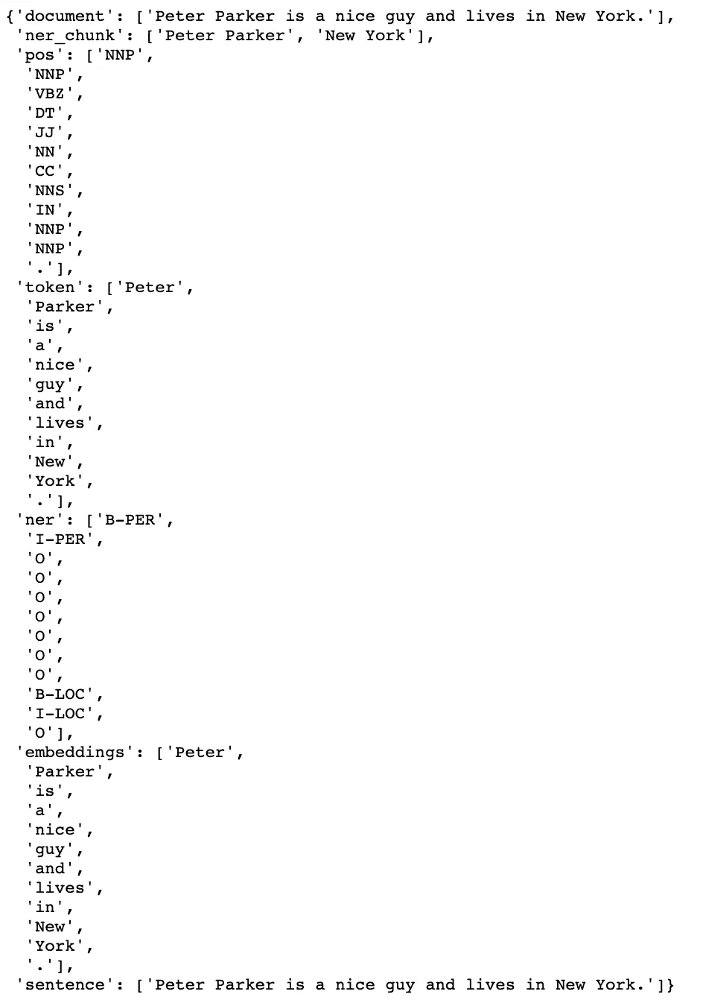

# 5.摘要

Spark NLP [4]越来越受欢迎，因为它在一个系统中支持更多的 NLP 功能。Spark NLP 是在 Ubuntu Linux 系统上用 OpenJDK 开发的。根据我的经验，我注意到很难为 Spark NLP no Mac 设置一个本地环境，这是由于一个已知的异常“*异常:Java 网关进程在发送其端口号*之前退出”。

为了避免这个安装问题，在本文中，我演示了如何设置一个 Docker 环境来运行 Spark NLP 和 Jupyter notebook for NER 以及 Docker 容器中的其他 NLP 功能。

我使用[6]中的代码示例验证了 Mac 上 Spark NLP 的 Docker 环境。

Spark NLP 的 Docker 环境有潜力作为建立 Spark NLP [微服务](https://en.wikipedia.org/wiki/Microservices)平台的基础。

Docker 文件和 Docker 的 Jupyter 笔记本都可以在 Github [8]中获得。

# 参考

1.  Y.张，利用 word2vec-keras 进行自然语言处理的深度学习
2.  Y.张，[面向移动设备的自然语言处理深度学习](/deep-learning-for-natural-language-processing-on-mobile-devices-3024747a7043)
3.  南李，[利用 NLTK 和 SpaCy 进行命名实体识别](/named-entity-recognition-with-nltk-and-spacy-8c4a7d88e7da)
4.  [火花 NLP](https://nlp.johnsnowlabs.com/)
5.  动词 （verb 的缩写）科贾曼，[Spark NLP 简介:基础和基本组件](/introduction-to-spark-nlp-foundations-and-basic-components-part-i-c83b7629ed59)
6.  动词 （verb 的缩写）科贾曼，[命名实体识别(NER)与 BERT 在 Spark NLP 中](/named-entity-recognition-ner-with-bert-in-spark-nlp-874df20d1d77)
7.  页（page 的缩写）适合初学者的 docker
8.  Y.张，[Github 中的 Dockerfile 和 Jupyter 笔记本](https://github.com/yzzhang/machine-learning/tree/master/deep_learning/nlp/spark-nlp-docker)