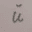
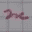
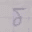
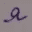
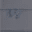
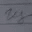
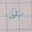
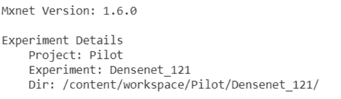
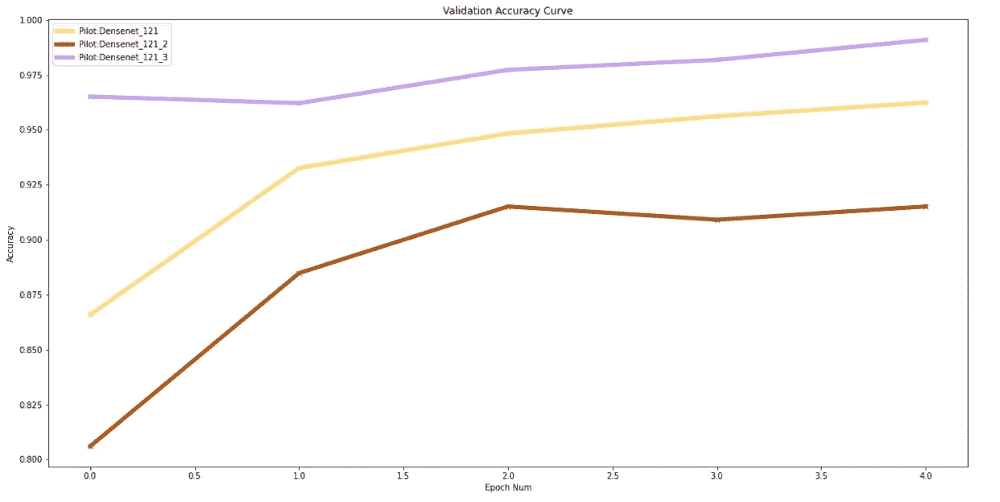
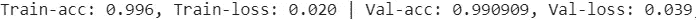

# 使用 Monk AI 的俄语字母分类

> 原文：<https://towardsdatascience.com/russian-alphabets-classification-using-monk-ai-4df7d1ad8542?source=collection_archive---------54----------------------->

## 让计算机视觉应用变得简单有效


鸣谢:图片来自 F[licker](https://www.flickr.com/)的 [Polyrus](https://www.flickr.com/photos/fotorus/)

# 目录:

1.  介绍
2.  关于数据集
3.  设置 Monk 和先决条件
4.  下载数据集
5.  创建项目和实验
6.  方法
7.  选择最佳模型
8.  结论

# 简介:

对我们来说，对手写信息进行分类是一件容易的事情，但对计算机来说，这是一项令人不安和令人畏惧的工作。手写字符分类通常是一项具有挑战性的任务，因为任何字符都有无数种书写方式。

尽管神经网络已经重新定义了这项任务，但它在开发这种分类器方面也发挥了巨大的作用，前提是为它提供了大量的数据来进行训练。

在这个特别的博客中，我们将探索俄语字母表，并以手写形式对它们进行分类。

# 关于数据集:

在数据集中，我们有 14190 个彩色图像分布在 3 个图像文件夹中，包括所有 33 个类别的俄语字母表。

第一个文件夹具有条纹背景(具有很少的水平线和/或垂直线)，第二个文件夹具有白色背景，第三个文件夹具有图形类型背景(具有许多有序的水平线和垂直线)。

以下是数据集中的一些图像:



数据集的样本图像

以下是用于预测目的的俄语字母及其相应的数字:

а=>1, б=>2, в=>3, г=>4, д=>5, е=>6, ё=>7, ж=>8, з=>9, и=>10, й=>11, к=>12, л=>13, м=>14, н=>15, о=>16, п=>17, р=>18, с=>19, т=>20, у=>21, ф=>22, х=>23, ц=>24, ч=>25, ш=>26, щ=>27, ъ=>28, ы=>29, ь=>30, э=>31, ю=>32, я=>33

所以不要担心，即使我们没有得到这篇文章，我们也会留下一些俄罗斯字母的印象！
完整的数据集由 Olga Belitskaya 准备并上传，可以在这里找到:

[](https://www.kaggle.com/olgabelitskaya/classification-of-handwritten-letters) [## 手写信件的分类

### 俄罗斯字母的图像

www.kaggle.com](https://www.kaggle.com/olgabelitskaya/classification-of-handwritten-letters) 

现在让我们开始设置僧侣和一些先决条件。

# 设置 Monk 和先决条件

我们从安装 monk 库开始。

1.)我们在这里使用过 colab，所以这里是同样的安装过程。

```
#Installation process for colab
pip install -U monk-colab
```

虽然我们可以在[僧库](https://github.com/Tessellate-Imaging/monk_v1)探索其他的安装方式。

2.)将它添加到系统路径(每个终端或内核运行都需要)

```
import sys
sys.path.append("monk_v1/");
```

# 下载数据集

接下来，我们将从 Kaggle 直接获取数据集到 colab。为此，我们必须首先从 Kaggle 创建一个 API 令牌。

转到您的 Kaggle 个人资料>>我的帐户>>向下滚动到 API 部分>>单击创建新的 API 令牌(记住，如果以前使用过，请使所有其他令牌过期)

点击这个之后，kaggle.json 文件将被安装到您的系统中。
接下来，再次进入数据集页面，在新笔记本选项的右侧，我们可以找到一个图标来复制 API 命令。此命令将用于下载数据集。
现在，在 google colab 中上传 kaggle.json 文件，如下所示。

```
! pip install -q kaggle
from google.colab import files
files.upload()
#Upload the kaggle.json file here
```

此外，使用 API 命令下载数据集。

```
! mkdir ~/.kaggle
! cp kaggle.json ~/.kaggle/
! chmod 600 ~/.kaggle/kaggle.json#Download the full dataset zip file to Colab
! kaggle datasets download -d 'olgabelitskaya/classification-of-handwritten-letters'
```

现在，解压缩这个文件并创建一个新文件，将所有数据集存储在一个地方。

```
#Unzip the downloaded zip file and put it under a new files section! unzip -qq sample.zip
import zipfile
zip_ref = zipfile.ZipFile('classification-of-handwritten-letters.zip', 'r')
zip_ref.extractall('files')
zip_ref.close()
```

完成后，我们导入这些库和适当的后端。

```
import os
import sys
sys.path.append("monk_v1/");
sys.path.append("monk_v1/monk/");#Importing MXNet Gluon API backend
from monk.gluon_prototype import prototype
```

我在这里使用了 **MXNet Gluon API** 作为后端，只用一行代码我们就可以选择我们想要的后端，不用担心以后会遇到不同的语法。使用 monk 库可以做到这一点，只需使用一种语法，我们就可以跨不同的框架工作，如 PyTorch、MXNet、Keras、TensorFlow。

# 创建项目和实验

为了创建项目名和实验名，我们使用了 prototype 函数。我们现在可以在一个项目下创建多个实验，并在各个方面进行比较。

```
#Setup Project Name and Experiment Namegtf = prototype(verbose=1);
gtf.Prototype("Pilot", "Densenet_121");
```



新项目形成！

# 方法

模型训练的方法:

我们没有连接三个图像文件夹，这将允许我们一起训练整个数据集。
我们构建鲁棒模型的方法是首先通过使用受背景影响最小的图像(即第二图像文件夹)来训练模型。
此外，该文件夹相当大(包含大量图像)，因此它可以在开始时有效地训练模型，并且我们可以通过更简单的数据了解模型的表现。

这将在一定程度上确保模型是否学会提取所需的特征，并且我们可以通过分析相同的图来验证这一点。
如果观察到模型已经学会正确地提取特征，那么我们可以用包含图形类型背景图像的下一个文件夹继续训练模型，即使这个文件夹足够大，因此希望它使模型学会忽略背景。

最后，我们用包含剥离背景的图像来更新和训练模型。

这种方法使我们能够找出数据集的哪一部分没有被正确分类，如果结果不令人满意，我们可以分析所有图，确定模型在哪里表现不佳，并专注于该部分。

开发模型的方法:
1。)首先，选择后端(MXNet 胶子)，选择一些可能适合这个特定任务的基本模型。
2。)选择不太密集的变体，并比较它们的性能。

```
#Analysing basic models
analysis_name = "analyse_models";models = [["resnet34_v2", False, True],["densenet121", False, True],["vgg16", False, True],["alexnet",False,True],["mobilenetv2_1.0",False , True]];epochs=5
percent_data=15
analysis = gtf.Analyse_Models(analysis_name, models, percent_data, num_epochs=epochs, state="keep_all");
```

3.)为模型调整参数。这是开发一个好模型最关键的部分。

```
#Shuffle the datagtf.update_shuffle_data(True);#For densenets batch size of 2 and 4 did not work well, batch size of 8 worked just fine , after which validation loss starts to increasegtf.update_batch_size(8);#learning rate 0.1 and 0.05 were not working well ,lr lesser than that didn't vary much w.r.t val and training loss .0.01 best choice#Though optimizers like Adam and its variants are very fast at converging but the problem with them are they sometimes get stuck at local optima's.#Whereas famous optimizers linke SGD and SGD plus momentum are slower to converge , but they dont get stuck at local optima easily.#Here after analysing all these optimizers , sgd worked better.#sgd was the best optimizer even for densenetsgtf.optimizer_sgd(0.01);gtf.Reload();
```

在调整参数时，这种分析非常重要。

4.)使用相同的调整参数，尝试相同模型的更密集的变体。

```
#Comparing DenseNets for different depth of densenet variants.analysis_name = "analyse_models";
models = [["densenet121", False, True], ["densenet161", False, True], ["densenet169", False, True],["densenet201", False, True]];
epochs=10
percent_data=15
analysis = get.Analyse_Models(analysis_name, models, percent_data, num_epochs=epochs, state="keep_none");
```

如果我们直接选择密集网络，可能会因为梯度爆炸/递减而表现不佳，最终我们可能根本不会考虑这个选项。

# 选择最佳模型

在所有这些努力之后，当暴露于看不见的数据时，很容易找出哪个模型能给你最好的结果。在这种情况下，结果是 Densenet，所选择的 dense net 的适当深度是 121，这足以给出期望的结果。
Resnets 架构在经过调优后的整体性能上排名第二。Mobilenets 可能会表现得非常好，尽管这需要花费大量的训练时间和空间来完成这个特殊的任务。



这里的三个图是相同的模型，但是具有更新的数据。Densenet_121_3 在完整数据
上进行训练。该图表明该模型在所有三种数据集上都学习得相当好。
我们从我们的模型中获得了难以超越的验证性能。



最终模型

该模型看起来不像是过度拟合的，并且在对新图像进行分类时表现良好，确保该模型可以运行。
如果我们可以对现有模型进行任何改进的话，那就是集中精力改进/增加带有图形类型背景的图像。如果我们仔细观察，在那些图像被更新和模型被训练之后，模型的性能下降了一点。
这是另一个可以探索的工作领域。

# 结论

我们已经使用各种架构执行了迁移学习，使用定义明确的方法构建了一个可靠的分类器。尽管这里有一点需要注意，创建项目和实验使我们很容易管理和比较实验/模型。

此外，我们可以使用很少的代码行执行如此多的复杂操作。如果我们采用传统的方法，在模型之间进行这样的比较将会花费我们不希望的代码，这可能很难调试。当我们使用 monk 库时，更新数据集和重新训练模型也是一项基本任务。

还提到在某些领域可以做更多的工作，进一步提高模型的性能和可靠性。

我们还使用一些测试图像进行了推断，请访问下面的代码链接查看它们。

对于整个代码:

[](https://github.com/Sanskar329/Russian-Letters) [## sanskar 329/俄语字母

### 这个项目是关于分类俄语字母。总共有 33 类俄语字母。的目标是

github.com](https://github.com/Sanskar329/Russian-Letters) 

或者可以在[图像分类动物园](https://github.com/Tessellate-Imaging/monk_v1/blob/master/study_roadmaps/4_image_classification_zoo/Classifier%20-%20Russian%20Alphabets%20Dataset.ipynb)查看代码。

对于更多此类应用:

[](https://github.com/Tessellate-Imaging/monk_v1/tree/master/study_roadmaps/4_image_classification_zoo) [## 镶嵌成像/monk_v1

### Monk 是一个低代码深度学习工具，是计算机视觉的统一包装器。— Tessellate-Imaging/monk_v1

github.com](https://github.com/Tessellate-Imaging/monk_v1/tree/master/study_roadmaps/4_image_classification_zoo) 

Monk 教程:

[](https://github.com/Tessellate-Imaging/monk_v1/tree/master/study_roadmaps) [## 镶嵌成像/monk_v1

### 模块 1:入门路线图第 1.1 部分:Monk 入门第 1.2 部分:Monk 的基本特性第 1.3 部分…

github.com](https://github.com/Tessellate-Imaging/monk_v1/tree/master/study_roadmaps) 

如果这篇文章能帮助你学到新的东西，请分享！

感谢阅读！