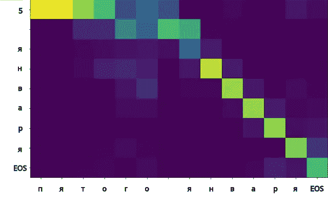

# 面向 STT 和 TTS 的俄语文本规范化

> 原文：<https://towardsdatascience.com/russian-text-normalization-for-stt-and-tts-a6d8f03aaeb9?source=collection_archive---------49----------------------->

包括 STT(语音到文本)和 TTS(文本到语音)在内的许多语音相关问题都需要将抄本转换成真实的“**口语**”形式，即说话者所说的准确单词。这意味着在一些**书写的**表达式成为我们的抄本之前，它需要被**规范化**。换句话说，文本必须分几个步骤进行处理，包括:

*   转换数字:`1984 год`->*тысячадевятьсотвосемьдесятчетвёртыйгод*；
*   展开缩写:`2 мин. ненависти`->*двеминутыненависти*；
*   拉丁符号的转写(多为英文):`Orwell` - > `Оруэлл`
    等等。


在这篇文章中，我想总结一下我们在俄语语音数据集 [Open_STT](https://github.com/snakers4/open_stt) 中的文本规范化方法，简单介绍一下我们使用的思想和工具。

作为锦上添花，我们决定与社区共享我们的 seq2seq 标准化器。它实际上是通过一行程序调用的，只要看看我们的 github [库](https://github.com/snakers4/russian_stt_text_normalization)就知道了。

```
norm = Normalizer() 
result = norm.norm_text('С 9 до 11 котики кушали whiskas')>>> 'С девяти до одиннадцати котики кушали уискас'
```

# 关于任务的更多信息

那么，怎么了？理论上，如果很难将缩写扩展为完整的形式，缩写就不会如此常用:每个人都知道“Dr .”代表“医生”。事实上，这并不简单，一些母语人士的直觉是理解所有细微差别的必备属性。

想知道兔子洞有多深，请看下面的例子:

*   `2е` - *второе(ые)/the 第二*，**但是**t5】-*двае*/两个 e；
*   `2 части` - *две* части/two 部分，**但**-нет*второй*части/no 第二部分；
*   `длиной до 2 км`-длинойдо*двух*километиов/长达两公里，**但**-ееемдо*вто*
*   `= 2/5`-равно*двепятых*/等于五分之二，**但是**`д. 2/5`-дом*двадробьпять/house*二建五甚至-*двапять*/二建五。

缩写和首字母缩略词也是一个问题:同一个缩写可以根据语境(`г` - *город* 或 *год* )或说话人(`БЦ` - *б ц* 或 *бизнес центр* ？).想象一下一个令人头痛的音译是什么:不知何故，它相当于学习另一种语言。上述所有问题对口语形式来说都是特别具有挑战性的。

# 统计管道

人们很容易迷失在这无尽的变化中:你沉浸在搜索和处理越来越多新案件的无尽循环中。在某些时候，最好停下来回忆一下帕累托原则或 20/80 法则。我们可以处理大约 20%的最流行的案例，覆盖大约 80%的整个语言，而不是解决一般的任务。

第一个 Open_STT 版本的方法更加残酷:如果你看到一个数字，就把它改成一个默认的基数。作为对 STT 应用程序的攻击，这个决定甚至是合理的。通过将`2020 год`转换为 *две тысячи двадцать год* ，你只丢失了 1-2 个字母，而忽略一个完整的数字会导致三个单词的错误。

渐渐地，我们添加了某种形式的上下文依赖。现在`год`这个词前面的数字变成了序数`2020`最后变成了 *две тысячи двадцатый* 。因此，我们的“手动”统计管道出现了——我们找到最流行的组合，并将它们添加到规则集中。

# 序列到序列网络

在某种程度上，序列到序列(seq2seq)架构显然非常适合我们的任务。事实上，seq2seq 与手动管道工作得一样好，甚至更好:

*   将一个序列转换为另一个序列—选中；
*   模型上下文依赖关系—检查；
*   找到最合适的规则来转换序列—检查；



> *序列“5 января".”的注意力得分图为了生成“пятого”模型的结尾，不仅考虑了单词“5 ”,还考虑了单词“января".”的后续字符*

作为基础，我们从这里的开始，在 PyTorch [上实现 seq2seq。要了解更多关于这个架构的信息，请阅读原版指南，它非常棒。更详细地说:](https://bastings.github.io/annotated_encoder_decoder/)

*   我们的模型是 Char 级的；
*   源词典包含俄语字母+英语+标点+特殊记号；
*   目标词典—仅俄语字母+标点符号。

你拥有的多样化和高质量的数据越多，你的模型训练得就越好——这是常识。如果你曾经试图为英语语言找到这样的数据，那么你知道这是非常简单的。此外，甚至还有数字规范化的开源解决方案。至于俄语，一切就更复杂了。

因此，训练数据是以下各项的组合:

*   开源规范化数据— [俄语文本规范化](https://www.kaggle.com/c/text-normalization-challenge-russian-language/overview) —大部分是书籍，部分用规则集规范化；
*   使用我们的手动管道处理的随机网站的过滤[数据；](https://spark-in.me/post/parsing-common-crawl-in-four-simple-commands)
*   一些使模型更加健壮的扩展——例如，任意位置的标点和空格、大写、长数字等。

# 火炬报

除了解决这个问题，我们还想测试一些新的有趣的工具，比如 TorchScript。
TorchScript 是 PyTorch 提供的一个很棒的工具，可以帮助你从 Python 中导出你的模型，甚至可以作为 C++程序独立运行。

简而言之，PyTorch 中有两种使用 TorchScript 的方式:

1.  硬核，那需要完全沉浸到 TorchScript 语言中，一切后果自负；
2.  轻柔，使用开箱即用的`torch.jit.script`(和`torch.jit.trace`)工具。

事实证明，对于比官方[指南](https://pytorch.org/tutorials/beginner/Intro_to_TorchScript_tutorial.html)中介绍的更复杂的模型，您必须重写几行代码。然而，这不是火箭科学，只需要一些小的改变:

*   打字要多注意；
*   想办法重写不支持的函数和方法。

有关更详细的指南，请查看 [a 通道柱](https://t.me/snakers4/2418)。

# 例子

综上所述，查看几个归一化结果。以下所有句子均取自测试数据集，即该模型未见过这些示例中的任何一个:

*   `norm.norm_string("Вторая по численности группа — фарсиваны — от 27 до 38 %.")`

*'вторая·численности·фарсиваны·двадцати·тридцативосьмипроцентов.'*

*   `norm.norm_string("Висенте Каньяс родился 22 октября 1939 года")`

*'висентеканьясродилсядвадцатьвторогооктябрятысячадевятьсоттридцатьдевятогогода'*

*   `norm.norm_string("играет песня «The Crying Game»")`

*песнязэ*

*   `norm.norm_string("к началу XVIII века")`

*‘началувосемнадцатоговека’*

*   `norm.norm_string("и в 2012 году составляла 6,6 шекеля")`

*тысячидвенадцатом·составлялашестьцелых·шестьдесятыхшекеля'*

*原载于 2020 年 3 月 4 日*[*https://spark-in . me*](https://spark-in.me/post/russian_text_normalization)*。*