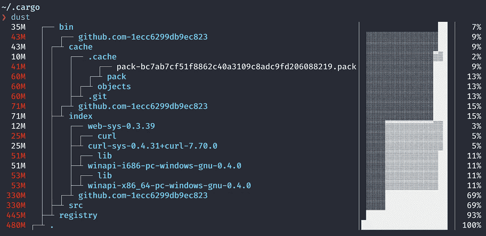
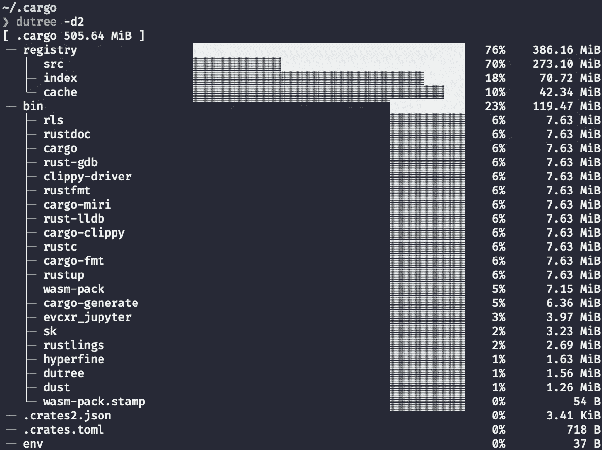
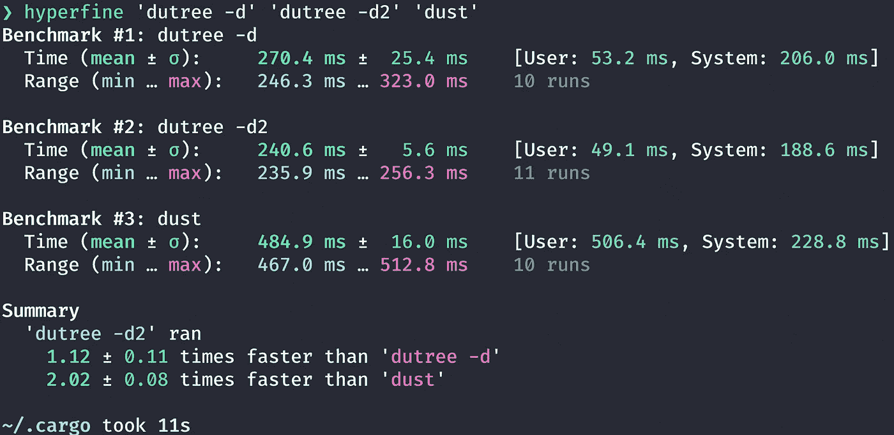
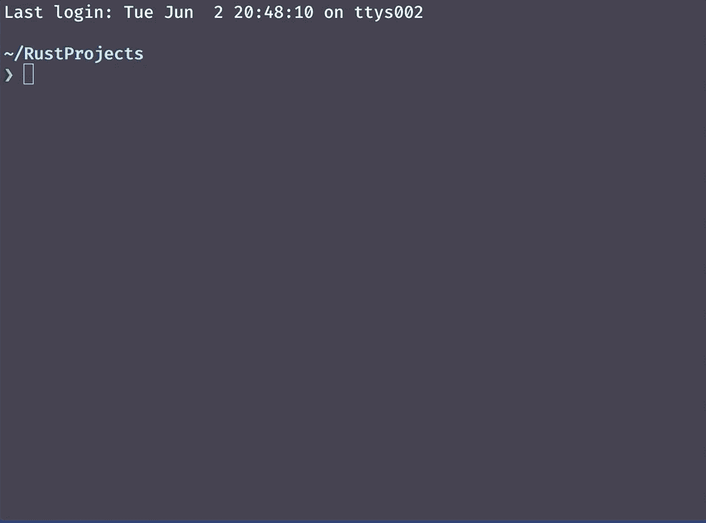
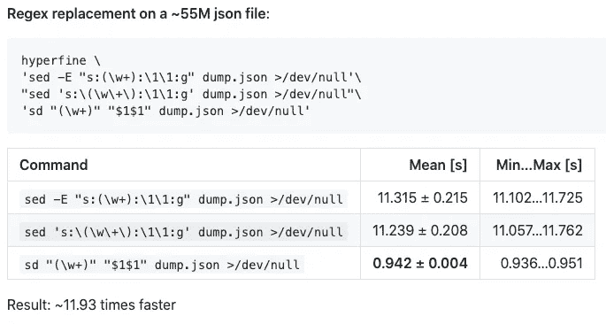
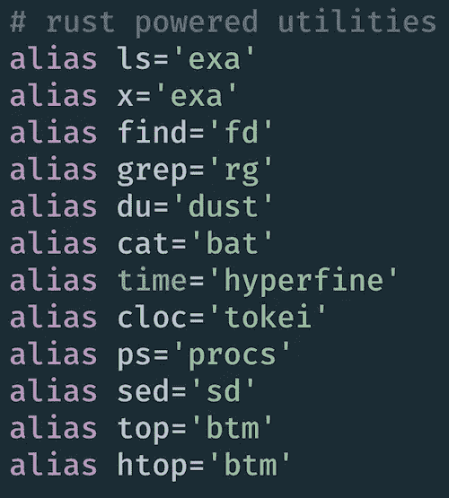
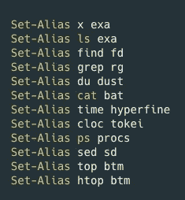

# Rust-Powered 命令行实用程序可提高您的工作效率

> 原文：<https://towardsdatascience.com/rust-powered-command-line-utilities-to-increase-your-productivity-eea03a4cf83a?source=collection_archive---------9----------------------->

## 您腰带下的现代快速工具


作者图片

```
**Table of Contents**[**Introduction**](#74de)1\. [du alternatives: dust and dutree](#d923)
  ∘ [dust](#97b0)
  ∘ [dutree](#9641)
2\. [time alternative: hyperfine](#bb52)
3\. [A fuzzy finder: skim](#e9fc)
4\. [sed alternative: sd](#5960)
5\. [top/htop alternatives: ytop and bottom](#0dd0)
6\. [A Bonus Tip](#69a8)[**Conclusion**](#1fb3)
```

# 介绍

上个月，我写了一篇[文章](/awesome-rust-powered-command-line-utilities-b5359c38692)分享七个 Rust 驱动的命令行实用程序。

这些都是现代化的快速工具，您可以每天使用您的终端。

自从发表那篇原始文章以来，我一直在寻找更多的 Rust 驱动的命令行实用程序，并且我发现了更多的精华，今天我很高兴与大家分享。

这些工具将帮助您高效完成终端工作。

我推荐安装 Rust。当你安装 Rust 时，它会把 Cargo 作为工具链之一安装。你可以在货物上安装生锈的动力工具。

如果你想开始学 Rust，这篇[文章](/you-want-to-learn-rust-but-you-dont-know-where-to-start-fc826402d5ba)可以帮你入门。

让我们开始吧。

# `du`替代品:`dust`和`dutree`

## `dust`

在 Linux 中，`du`命令估计文件空间的使用情况。`dust`和`dutree`是铁锈动力`du`的替代品。

对我来说很难使用`du`命令。例如使用`du`，列出文件和文件夹，并计算包括我使用的子文件夹在内的总大小:

```
$ du -sk * | sort -nr
```

[Dust](https://github.com/bootandy/dust) 给你一个目录的即时概览，它的磁盘空间和命令更简单。

例如

```
$ dust
$ dust <dir>
$ dust <dir>  <another_dir> <and_more>
$ dust -p <dir>  (full-path)
```

你可以在这里找到所有的用法。



~/的灰尘结果。货物目录。作者图片

在上图中，可以看到 app 目录占用了 57MB(29%)，目标目录占用了 139 MB (71%)的磁盘空间。

可以带货安装`dust`。

```
$ cargo install du-dust
$ dust --help
```

你可以在这里找到其他装置[。](https://github.com/bootandy/dust#install)

## `dutree`

`[dutree](https://github.com/nachoparker/dutree)`是分析磁盘使用情况的另一个`du`选择。

可以带货安装`dutree`。

```
$ cargo install dutree
```

可以通过`dutree --help`找到用法。

`dutree`也有简单的命令选项。例如，您可以使用`-d`选项显示不同目录深度的目录。

```
$ dutree -d // the default is 1
$ dutree -d2 // show directories up to depth 2
```



dutree 结果。作者图片

# `time`备选:`hyperfine`

在 Linux 中，`time`命令显示给定命令运行需要多长时间。它对于测试脚本和命令的性能非常有用。

假设您有两个脚本或命令在做同样的工作。您可以使用`time`命令来比较这些脚本所需的时间。

[hyperfine](https://github.com/sharkdp/hyperfine) 是一款 Rust 驱动的、`time`替代命令行基准测试工具。

用货物安装:

```
$ cargo install hyperfine
```

如果使用`--warmup N`运行`hyperfine`，超精细将在实际测量前执行 N 次预热。

```
// warmup run
$ hyperfine --warmup 3 'dutree -d' 'dutree -d2' 'dust'
// actual run
$ hyperfine 'dutree -d' 'dutree -d2' 'dust'
```



超精细结果。作者图片

# 一个模糊查找器:`skim`

模糊查找器帮助您快速搜索和打开文件。是`grep`的互动版。

`[skim](https://github.com/lotabout/skim)`是铁锈中的模糊查找器。(`[fzf](https://github.com/junegunn/fzf)`是一个用 Go 语言编写的模糊查找器，也是一个很好的选择。)

可以用 Cargo 安装。

```
$ cargo install skim
```

其他安装请参见本页。

您可以搜索文件。

```
$ sk
$ file-name
```


使用 sk 命令进行文件搜索

或者使用`grep`在文件中查找一行。

```
sk --ansi -i -c 'grep -rI --color=always --line-number "{}" .'
```



使用 sk 命令进行线搜索

# `sed`备选:`sd`

在 Linux 中，可以使用`[sed](https://www.gnu.org/software/sed/manual/sed.html)`进行基本的文本替换。

可以用货物安装`sd`。

```
cargo install sd
```

[sd](https://github.com/chmln/sd) 使用更简单的语法。

使用标清:

```
$ sd before after
```

而使用 sed:

```
$ sed s/before/after/g
```

用`sd`替换换行符和逗号:

```
$ sd '\n' ','
```

并且用`sed`:

```
$ sed ':a;N;$!ba;s/\n/,/g'
```

`sd`是不是[比`sed`快](https://github.com/chmln/sd#benchmarks)。



图像来自[标清](https://github.com/chmln/sd#benchmarks)

# `top/htop`替代品:`ytop`和`bottom`

`htop`在 Linux 中是一个交互式的进程查看器。`[ytop](https://github.com/cjbassi/ytop)`和`[bottom](https://github.com/ClementTsang/bottom)`是图形过程监视器。

您可以将它们与货物一起安装:

```
$ cargo install ytop
$ cargo install bottom
```

您可以使用`btm`运行`bottom`。


底层在行动。作者图片

# 额外的小费

当您使用另一台计算机、服务器或系统时，您将使用 Linux 命令。即使您正在使用 Rust 提供的替代工具，继续使用 Linux 命令也是一个好主意。

我建议创建别名。

在我的`.zshrc`中，我有以下内容:



作者在 my .zshrc. Image 中的别名

如果您是 Powershell 用户:



Powershell 中的别名

# 结论

我希望你开始使用这些生锈的工具。你会发现它们非常快，看起来很现代。如果你知道更多，请告诉我！

**通过** [**成为**](https://blog.codewithshin.com/membership) **的会员，可以完全访问媒体上的每一个故事。**


[https://blog.codewithshin.com/subscribe](https://blog.codewithshin.com/subscribe)

[](/learning-rust-by-converting-python-to-rust-259e735591c6) [## 通过将 Python 转换成 Rust 来学习 Rust

### Rust 基础入门教程

towardsdatascience.com](/learning-rust-by-converting-python-to-rust-259e735591c6) [](/awesome-rust-powered-command-line-utilities-b5359c38692) [## 7 个强大的 Rust 驱动的命令行工具

### 适合每个开发人员的现代 Linux 命令

towardsdatascience.com](/awesome-rust-powered-command-line-utilities-b5359c38692) [](/you-want-to-learn-rust-but-you-dont-know-where-to-start-fc826402d5ba) [## 你想学 Rust 但是不知道从哪里开始

### Rust 初学者的完整资源

towardsdatascience.com](/you-want-to-learn-rust-but-you-dont-know-where-to-start-fc826402d5ba)