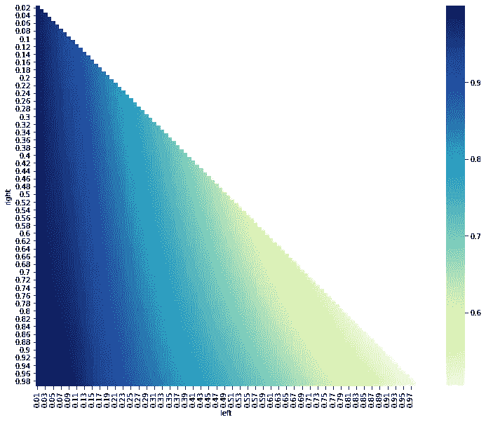
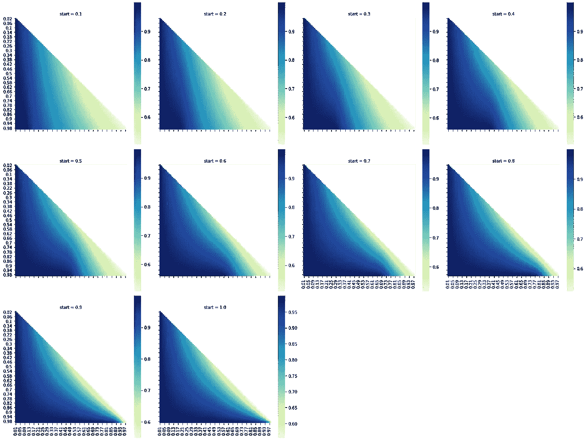
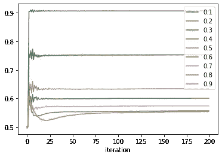
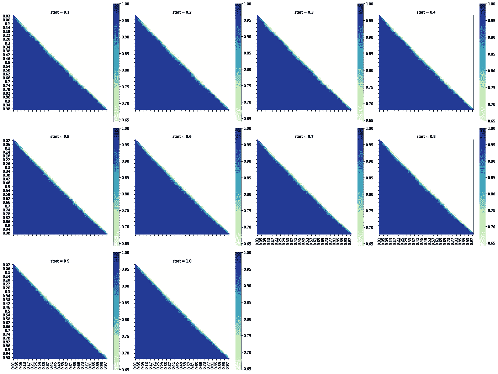
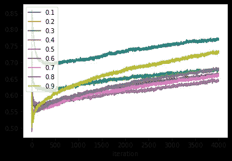
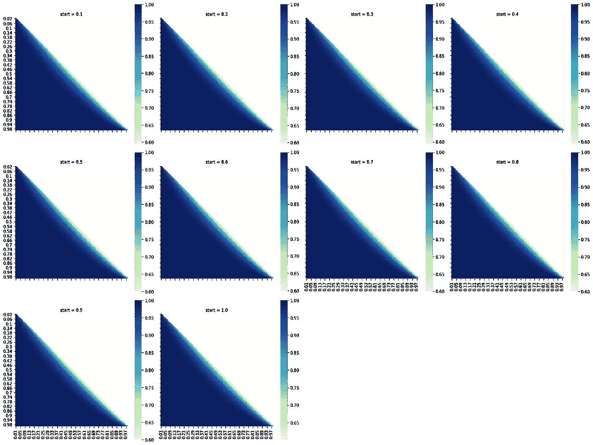
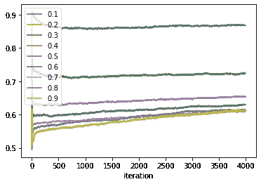

# 生锈的强盗

> 原文：<https://towardsdatascience.com/rusty-bandit-724a9a7a3606?source=collection_archive---------48----------------------->

## 用铁锈建造多臂强盗

为什么不像其他数据科学家一样使用 Python 呢？Python 适合前端工作，但是所有强大的数据科学算法在后端使用更快的东西。为什么不是 C++？很多人避免使用 C++的原因是一样的；做一些严重不安全的事情太容易了。为什么不是 Java 或者 Scala？JVM 上没有任何东西赢得任何速度竞赛。

但是为什么会生锈呢？因为它几乎和 C++一样快，而且没有很多缺点。Rust 对内存和线程安全近乎偏执。可变性必须显式指定，这鼓励程序员谨慎使用。一个变量在任何时候最多只能有一个可变引用，编译器会积极地检查这一点。线程也以类似的细节进行检查。最终的结果是这种语言很难做傻事(至少对于 IDE 来说)，而且几乎所有的错误都在编译时被发现。作为一个额外的好处，编译器的错误消息是非常有用的，这是编程世界中几乎独一无二的特性。

但是 Rust 不是数据科学语言，也不打算是。C++也不是，它正在愉快地支撑 Tensorflow、XGBoost、PyTorch 和 LightGBM 的后端。Rust 可能会有类似的未来，运行 Keras 优雅的语法所隐藏的所有杂乱的矩阵计算。

除此之外，它就在那里。学习生锈是一个挑战，这是一个足够好的理由。

随着预备工作的结束，本文的剩余部分将由三部分组成。第一部分将快速介绍多臂土匪问题。第二篇将描述我是如何设计和编码 [Ratel](https://github.com/DanielMorton/ratel) ，一个用于执行多臂强盗实验的 Rust 程序。第三部分将讨论其中一个实验的结果。

(注意程序名。多臂强盗式学习包括探索(做出新的选择)和利用(做出相同的、明智的选择)的结合。我想不出有哪种动物比[蜜獾](https://en.wikipedia.org/wiki/Honey_badger)或南非荷兰语 **ratel** 更擅长探险或开发。


CT Cooper /公共领域

# **多臂土匪**

独臂强盗是老虎机的一个古老俚语。对于独臂强盗，用户拉动杠杆或手臂，希望获得奖励，同时让机器偷一点自己的钱作为特权。一个多臂强盗有几个可以拉的 am，每一个都按照某种概率分布产生一个奖励。好消息是，在大多数应用程序中，多臂匪徒比拉斯维加斯的胜算更大。坏消息是，每只手臂的奖励分配是秘密的，而且很可能会保持秘密。

多臂 bandit 学习的目标不是找到每个臂的分布，而仅仅是具有最高平均奖励的臂。概括地说，只有一种方法可以做到这一点；拉所有的手臂很多次，直到你有一个合理的准确测量他们的平均值。这不完全是一个算法。该算法决定如何选择臂。我们有几个选择。

**贪婪算法(完全利用)**

对每个臂进行初始猜测。这通常是可能值的已知范围的高端。随机选择初始臂，并基于输出更新对该臂的猜测。随后的猜测选择迄今为止平均回报率最高的那只手臂，任何平局都是随机打破的。

这是一个不错的策略，但如果最初几次猜测不走运，它确实有选择次优手臂的风险。我将在第三部分量化这种风险；现在举个例子就够了。

假设有两臂，一臂支付 1 25%的时间，另一臂支付 1 75%的时间。其余时间他们支付 0。每只手平均支出的最初猜测都是 1。偶然地，第二只手臂的前四次拉动支付 0，而第一只手臂的前四次拉动支付 3 次 0 和 1 次 1。我们对第二只手臂的平均回报率 0.2 的估计，现在低于第一只手臂的实际平均回报率 0.25。遵循一个贪婪的策略，我将继续拉臂 1，几乎没有机会纠正我最初的错误。

这似乎是一个极端的例子；二号臂连续出现四个 0 的几率不到 1%。在现实生活中，bandit arms 的返回之间的分布通常要小得多，并且贪婪算法找到坏的局部最大值的机会相应地更大。

**ε-贪婪算法(探索与剥削)**

贪婪算法陷入局部最大值的唯一方式是次优 arm 的估计回报高于最优 arm 的估计回报。实际上，这只会在实验的相对早期发生；给定足够的时间，[大数定律](https://en.wikipedia.org/wiki/Law_of_large_numbers)保证最佳的手臂将有最好的估计。“足够的时间”这个短语在数学中是一个有趣的短语；这可能是一段非常非常长的时间。此外，多种武器的匪徒通常在“生产”阶段接受训练，需要及时达到最佳或接近最佳的性能。我们没有“足够的时间”

进入ε-贪婪算法。它与贪婪算法只有一点不同。在某种概率ε(0.01 和 0.1 是流行的，但它因问题而异)下，ε-贪婪算法将拉出一个随机臂。如果贪婪算法做出了错误的选择，这允许最佳手臂回到游戏中，同时在大多数时间仍然基于当前知识做出最佳猜测。

要想变得更复杂，就要逐渐降低ε的值。

**乐观算法**

到目前为止，我讨论的两种算法都只使用了 bandit arm 支出的平均值。如果我们想用方差的信息。最佳非参数估计来自霍夫丁不等式，并给出了我们的估计:


理查德·萨顿和安德鲁·巴尔托，《强化学习:导论》，第二版。

在该公式中，Q_t(a)是臂 a 值的当前估计平均值，t 是试验次数，N_t(a)是臂 a 被拉动的次数，c 是用户定义的常数。该算法挑选具有最高置信上限的臂。这具有类似于ε值递减的ε贪婪算法的效果，只是不需要手动选择初始ε或衰减规则。仍然需要选择 c 的值。

# **Ratel**

一个多兵种武装土匪模拟器可以拆分成两部分；土匪本身和球员，或代理人。在 Python、C++或 Java 中，这两个组件都可以编码为类。Rust 的面向对象设置本身没有类，而是依赖于[结构](https://doc.rust-lang.org/book/ch05-01-defining-structs.html)，它携带有组织的数据集合，以及[特征](https://doc.rust-lang.org/book/ch10-02-traits.html)，它包含可以为结构实现的方法。Structs 非常类似于 [C++ structs](http://www.cplusplus.com/doc/tutorial/structures/) ，而 traits 类似于 [Java 接口](https://www.javatpoint.com/interface-in-java)。与通常的编码概念一样，这将通过一个例子变得更加清晰。

**强盗**

我的基本强盗特征如下，包括一个好强盗需要的所有功能。

```
*/// A trait for common members of the Bandits* pub trait Bandit<T: ToPrimitive> {
    */// The number of arms of the Bandit* fn arms(&self) -> usize;

    */// The arm with the highest average reward.* fn best_arm(&self) -> usize;

    */// The maximum average reward of all the arms.* fn max_reward(&self) -> f64 {
        self.mean(self.best_arm())
    }

    */// The average reward of a given arm.* fn mean(&self, arm: usize) -> f64;

    */// The average rewards of all the arms.* fn means(&self) -> Vec<f64> {
        (0..self.arms()).map(|arm| self.mean(arm)).collect()
    }

    */// The reward from a pull of a given arm.* fn reward(&self, arm: usize) -> T;

    */// The standard deviation of a given arm.* fn std(&self, arm: usize) -> f64;

    */// the standard deviations of all the arms.* fn stds(&self) -> Vec<f64> {
        (0..self.arms()).map(|arm| self.std(arm)).collect()
    }
}
```

可以定义的方法有。那些需要来自特定结构类型的数据的将在实现中定义。一个土匪需要的数据，简单来说就是每个手臂的概率分布。下面是每个臂都具有二项分布的情况。

```
use rand_distr::Binomial;*/// A bandit whose arms distribute rewards according to binomial distributions.* pub struct BinomialBandit<*'a*> {
    */// Vector of number of trials of a* `yes-no` *experiment.* nums: &*'a* Vec<u32>,

    */// Vector of experiment success probabilities.* probs: &*'a* Vec<f64>,

    */// The bandit arm with highest reward.* best_arm: usize,

    */// Distributions of the arms.* distributions: Vec<Binomial>,
}
```

该结构需要是公共的，因为它将在其当前模块之外被引用。Rust 中的对象有多个隐私级别；使用最严格的限制几乎总是一个好主意。

这段代码中可能让新手感到困惑的其他部分是&符号`&`和`'a`的使用。前者表示值是引用，类似于指针。在这个结构中，`nums`和`prob`不是向量本身，而仅仅是向量的内存地址。奇怪的小`'a`符号控制着这些引用的寿命，并确保它们不会比它们所指向的向量活得更长。Rust 不允许悬空指针。

二项式分布由试验次数和每次试验的成功概率定义。存储定义参数和分布向量似乎是多余的，事实也的确如此。按照目前的设计，这些发行版不能返回它们的参数，所以值得额外的空间来单独保存它们。

定义自定义构造函数通常会有所帮助。为此，请实现结构。

```
impl<*'a*> BinomialBandit<*'a*> {
    */// Initializes a new Bandit where each arm distributes rewards according to a binomial
    /// distribution.* pub fn *new*(nums: &*'a* Vec<u32>, probs: &*'a* Vec<f64>) -> BinomialBandit<*'a*> {
        assert_eq!(nums.len(), probs.len());
        assert!(probs.val_max() <= 1.0);
        assert!(probs.val_min() >= 0.0);
        assert!(nums.val_min() > 0);
        let dist = nums
            .iter()
            .zip(probs)
            .map(|(&n, &p)| Binomial::*new*(u64::*from*(n), p).unwrap())
            .collect();
        let best_arm = nums
            .iter()
            .zip(probs)
            .map(|(&n, &p)| f64::*from*(n) * p)
            .collect::<Vec<f64>>()
            .arg_max();
        BinomialBandit {
            nums,
            probs,
            best_arm,
            distributions: dist,
        }
    }
}
```

这大部分是不言自明的。一些基本的断言语句确保我不会加载垃圾。然后，这两个向量被压缩并迭代，以创建分布向量。可能需要注释的一位代码是`u64::from(n)`。现代编程语言，至少是编译过的各种语言，似乎正在脱离自动类型转换的思想，Rust 也不例外。用一个整型数除以一个浮点型数是行不通的。这可能对类型安全有好处，但是也有强制使用难看的显式类型转换语句的缺点。

在这一点上，我只是有一个土匪坐在周围不能做太多。为了解决这个问题，我需要为 BinomialBandit 结构实现 Bandit 特征。这包括在 Bandit 中定义依赖于结构数据的五个方法。

```
impl<*'a*> Bandit<u32> for BinomialBandit<*'a*> {
    *///Returns the number of arms on the bandit.* fn arms(&self) -> usize {
        self.nums.len()
    }

    *///Returns the arm with highest average reward.* fn best_arm(&self) -> usize {
        self.best_arm
    }

    */// Computes the expected return of each arm.* fn mean(&self, arm: usize) -> f64 {
        f64::*from*(self.nums[arm]) * self.probs[arm]
    }

    */// Determines the reward for pulling a given arm.* fn reward(&self, arm: usize) -> u32 {
        self.distributions[arm].sample(&mut thread_rng()) as u32
    }

    */// Computes the standard deviations of each arm.* fn std(&self, arm: usize) -> f64 {
        (f64::*from*(self.nums[arm]) * self.probs[arm] * (1.0 - self.probs[arm])).sqrt()
    }
}
```

最初的 Bandit 特性将输出类型留给了单独的实现。在这里，我指定 BinomialBandit 的业务是给出无符号整数奖励。如果你看一下高斯-班迪特，你会看到它在漂浮。

**代理人**

正如有多种类型的强盗一样，也有多种类型的代理。我为三种算法中的每一种设计了一个代理结构，用于寻找最优策略和一个包含它们都需要的功能的通用代理特征。和强盗一样，我将首先描述代理特征。

```
*/// A trait for common members of the Agents.* pub trait Agent<T: ToPrimitive> {
    */// The action chosen by the Agent.* fn action(&self) -> usize;

    */// The number of arms in the Bandit the Agent is playing.* fn arms(&self) -> usize {
        self.q_star().len()
    }

    */// The Agent's current estimate of the value of a Bandit's arm.* fn current_estimate(&self, arm: usize) -> f64 {
        self.q_star()[arm]
    }

    */// The Agent's current estimate of all the Bandit's arms.* fn q_star(&self) -> &Vec<f64>;

    */// Reset the Agent's history and give it a new initial guess of the Bandit's arm values.* fn reset(&mut self, q_init: Vec<f64>);

    */// Update the Agent's estimate of a Bandit arm based on a given reward.* fn step(&mut self, arm: usize, reward: T);

    */// Calculate the update of the Agent's guess of a Bandit arm based on a given reward.* fn update(&mut self, arm: usize, reward: T) -> f64 {
        self.stepper().step(arm) * (reward.to_f64().unwrap() - self.q_star()[arm])
    }

    */// Returns a reference to the Agent's step size update rule.* fn stepper(&mut self) -> &mut dyn Stepper;
}
```

与 bandit 特性一样，大部分功能已经被填充。唯一需要讨论的方法是`update`。所有的代理都通过一个类似于随机梯度下降的规则来更新他们的估计。取当前奖励和估计的平均奖励之间的差，并通过该值的某个倍数(类似于学习率)来调整估计值。究竟是什么规则决定了“学习率”取决于用户；一个好的选择是调和递减率，它使估计的平均值成为样本平均值。可用的步进器类别在`utils`的`stepper`模块中。

在 trait 的开头，有必要明确声明代理使用的任何类型`T`都必须可转换为浮点型。

看一看 EpsilonGreedy 结构将有助于向我们展示如何使用代理特征。

```
*/// Agent that follows the Epsilon-Greedy Algorithm.
///
/// A fixed (usually small) percentage of the
/// time it picks a random arm; the rest of the time it picks the arm with the highest expected
/// reward.* pub struct EpsilonGreedyAgent<*'a*, T> {
    */// The current estimates of the Bandit arm values.* q_star: Vec<f64>,

    */// The Agent's rule for step size updates.* stepper: &*'a* mut dyn Stepper,

    */// The fraction of times a random arm is chosen.* epsilon: f64,

    */// A random uniform distribution to determine if a random action should be chosen.* uniform: Uniform<f64>,

    */// A random uniform distribution to chose a random arm.* pick_arm: Uniform<usize>,
    phantom: PhantomData<T>,
}
```

该结构最重要的组件是`q_star`，它包含了每条臂平均值的估计值。其余的大部分都有助于更新。我已经讨论过`stepper`，`epsilon`仅仅是选择随机臂的频率，两个均匀分布决定何时以及如何选择随机臂。最后一个参数`phantom`是一个必需的引用，以确保该结构被视为使用了`T`类型的东西，否则该结构只由实现特征使用。

我们如何实现 EpsilonGreedyAgent 的代理？见下文。

```
impl<*'a*, T: ToPrimitive> Agent<T> for EpsilonGreedyAgent<*'a*, T> {
    */// The action chosen by the Agent. A random action with probability* `epsilon` *and the greedy
    /// action otherwise.* fn action(&self) -> usize {
        if self.uniform.sample(&mut thread_rng()) < self.epsilon {
            self.pick_arm.sample(&mut thread_rng())
        } else {
            self.q_star.arg_max()
        }
    }

    */// The Agent's current estimate of all the Bandit's arms.* fn q_star(&self) -> &Vec<f64> {
        &self.q_star
    }

    */// Reset the Agent's history and give it a new initial guess of the Bandit's arm values.* fn reset(&mut self, q_init: Vec<f64>) {
        self.q_star = q_init;
        self.stepper.reset()
    }

    */// Update the Agent's estimate of a Bandit arm based on a given reward.* fn step(&mut self, arm: usize, reward: T) {
        self.q_star[arm] += self.update(arm, reward)
    }

    */// Returns a reference to the Agent's step size update rule.* fn stepper(&mut self) -> &mut dyn Stepper {
        self.stepper
    }
}
```

**游戏**

为了进行实验，代理人和强盗必须相互作用。交互由一个`Game`结构管理，该结构包含一个`Agent`、一个`Bandit`，以及使它们交互的计数器和方法。

```
*///Structure to make the Agent interact with the Bandit.* pub struct Game<*'a*, T: AddAssign + Num + ToPrimitive> {
    */// Agent learning about bandit.* agent: &*'a* mut dyn Agent<T>,
    *///Bandit used by agent.* bandit: &*'a* dyn Bandit<T>,
    */// Records wins and losses from each arm pull. Win means pulling the best arm.* wins: RecordCounter<u32>,
    */// Records rewards from each arm pull.* rewards: RecordCounter<T>,
}
```

基本结构不言自明。除了`Agent`和`Bandit`之外，它还包含计数器来记录`wins`(挑选最佳手臂)和`rewards`(所有手臂拉动的结果)。)

实现更有趣一点。

```
impl<*'a*, T: AddAssign + Copy + Num + ToPrimitive> Game<*'a*, T> {
    */// Initializes a Game with an Agent, Bandit, and new counters.* pub fn *new*(agent: &*'a* mut dyn Agent<T>, bandit: &*'a* dyn Bandit<T>) -> Game<*'a*, T> {
        assert_eq!(agent.arms(), bandit.arms());
        Game {
            agent,
            bandit,
            wins: RecordCounter::*new*(),
            rewards: RecordCounter::*new*(),
        }
    }

    */// Returns the number of bandit arms.* pub fn arms(&self) -> usize {
        self.bandit.arms()
    }

    */// Agent chooses an arm to pull and updates based on reward.* fn pull_arm(&mut self) {
        let current_action = self.agent.action();
        self.wins
            .update((current_action == self.bandit.best_arm()) as u32);
        let reward = self.bandit.reward(current_action);
        self.rewards.update(reward);
        self.agent.step(current_action, reward);
    }

    */// Resets Game. Resets Agent with new initial guess and resets counters.* pub fn reset(&mut self, q_init: Vec<f64>) {
        self.agent.reset(q_init);
        self.rewards.reset();
        self.wins.reset();
    }

    */// Returns vector of rewards.* pub fn rewards(&self) -> &Vec<T> {
        self.rewards.record()
    }

    */// Run game for a certain number of steps.* pub fn run(&mut self, steps: u32) {
        for _ in 1..=steps {
            self.pull_arm()
        }
    }

    */// Returns vector of wins.* pub fn wins(&self) -> &Vec<u32> {
        self.wins.record()
    }
}
```

通常，大多数类方法都是简单的 setters 和 getters。最有趣的两个方法是`pull_arm`和`run`。第一个选择一个动作，检查它是否是最好的，然后返回奖励和它是否是最好的。第二个通过拉手臂进行完整的实验，拉的次数是实验需要的次数。

这些都是进行多臂强盗实验所需要的基础。Ratel 代码的其余部分要么是将实验放在一起的胶水，要么是产生输出的代码。任何人在自己的工作中使用这个模块都必须编写自己的版本，所以我不会详细讨论我的代码。在下一部分，我将讨论我的一个实验。

# **两两伯努利盗匪**

当考虑任何复杂的系统时，从简单开始是值得的。最简单的多臂强盗只有两臂，最简单的概率分布可以说是伯努利分布。一个以某个概率 p 返回，零以概率 1-p 返回。给定两条臂，一条左臂和一条右臂，具有不同概率的伯努利输出(否则它将是微不足道的),使用 a)贪婪算法，b)ε-贪婪算法找到最佳臂的可能性有多大？(乐观算法更适合连续分布；这里就不考虑了。)随着概率的变化，这种可能性如何变化？

我以 0.01 为增量，从 0.01 到 0.99 取概率的全范围。用概率 p 测试臂 A，用概率 q 测试臂 B，然后反过来用概率 q 测试臂 A，用概率 B 测试臂 B，这是没有好处的，所以我可以通过总是给左臂更小的概率来将情况的数量减半。我还有 4851 种组合可以尝试。同时，我还将尝试不同的初始值，从 0.1 到 1.0，增量为 0.1。现在有 48510 种组合。

这就是在 Rust 工作真正开始有回报的地方。如果我一直从事 Python 的工作，这将是我一个月以来最后一次给你写信。Rust 的速度大约快 100 倍，这意味着我甚至可以在一夜之间运行大型实验。

贪婪算法收敛非常快；200 次迭代足以获得所有组合的精确结果。这让我可以将每个实验运行 100000 次。对于六核 i7 处理器(总共 12 个线程)，贪婪算法实验运行大约 3.5 小时。



选择初始猜测值为 0.1 的最佳臂的概率。斧头是每只手臂奖励 1 的几率。

实验中最低可能的初始猜测是双臂 0.1。如果我以此开始，那么当只有一个臂具有高概率时，贪婪算法选择正确臂的概率是高的，在这种情况下，问题是非常容易的，或者两个臂都具有低概率，在这种情况下，它们的相对差异仍然是显著的。当左臂达到 0.7 的概率时，选择最佳手臂的机会几乎等于零。

随着最初猜测的增加，情况会有所改善。对于臂概率的所有选择，每次初始猜测增加 0.1，挑选最佳臂的可能性增加，或者至少不减少。当最初的猜测达到 0.7 时，低概率成功的区域是一个小长条，其中两臂的概率都很高，并且它们的概率差很低(三角形对角线的较低部分)



为每个初始猜测值选择最佳臂的概率。随着最初猜测的增加，选择最佳手臂的可能性也会增加。

寓意是，对于贪婪算法，初始猜测是重要的，应该尽可能地高。在这种情况下，这很容易，因为已知分布是伯努利分布。随着分布信息的减少，一个好的初步猜测将会变得更加困难。

另一个教训是，即使有很好的猜测，也有贪婪算法不那么好的情况。在这个玩具的例子中，很容易限定，如果不是完全量化，坏的区域，但随着更多的武器或更复杂的分布，奢侈品将不再可用。

一个显而易见的问题是，是否有可能通过更长的运行获得更高的准确性；200 次迭代不算多。事实证明这已经足够了。绘制实验的子集，其中两臂的概率仅相差 0.01(取左臂为 0.1、0.2、0.3 等)，很明显，在第 100 次迭代之前达到了收敛。这是贪婪算法得到的最好结果。



**ε贪婪**

有没有更好的策略？是的，尽管这是有代价的。除了最极端的情况之外，选择一个概率较低的随机臂几乎可以得到最佳结果。然而，ε-贪婪算法有两个缺点。首先，成功的概率有一个硬上限，小于 1.0。如果以概率ε选择随机臂，则可以以最多(1-ε)+ε/(臂数)的概率选择最佳臂。随着臂的数量变大，这接近 1-ε，这是保持ε小的动机。

第二个问题是ε-greedy 需要更长的时间来收敛，ε值越小，收敛时间越长。

**ε= 0.1**

我从ε= 0.1 开始。对于两个手臂，选择最佳手臂的概率应该最大为大约 0.95。和贪婪算法一样，我尝试了 10 个不同的初始值，范围从 0.1 到 1.0。每次运行由 4000 次迭代组成，我运行了 10000 次(是贪婪算法的十分之一)。实验进行了大约 7.5 个小时。



为每个初始猜测值选择最佳臂的概率。选择最佳臂的可能性很大程度上与最初的猜测无关。

首先要注意的是，对最初猜测的依赖几乎已经消除。仅这一点就成为对 epsilon-greedy 有利的重要论据。第二，除了对角线上最窄的细长条，所有的臂组合都有接近其最大值的精度。第三，正如预期的那样，最大精度没有贪婪算法那么高。即使有一个警告，这仍然是一个比以前的结果有所改善。

在代理商仍然难以选择正确手臂的地区，有更多的好消息。学习还没有饱和。进一步的迭代可能会产生更好的结果。绘制与上面相同的实验子集表明胜率还没有稳定下来。再重复 4000 次，我会得到更好的结果。



长期胜率。

**ε= 0.01**

如果我尝试更低的ε值会发生什么？当ε的值等于 0.01 时，我得到的结果具有贪婪算法和ε-贪婪算法的大部分优点，并且ε更大。除了ε的变化之外，该实验的所有参数与上述相同。

再次，有最大可能的精度，但现在是 0.995。同样，结果在很大程度上独立于最初的猜测。再一次，除了两臂的概率相似的相当窄(尽管稍微宽)的子集之外，对于所有的子集都达到了这种精度。



那么窄的范围呢？有没有可能更多的迭代会带来更好的结果。是的，但是它将需要更多。精度仍在提高，但速度比ε= 0.1 时慢得多。



长期胜率

# **结论**

Ratel 可以做许多改进。目前，只有两种概率分布支持土匪，高斯和二项式，但增加其他将是微不足道的。类似地，还可以添加更复杂的代理算法。一个稍微小一点的改进是允许来自多个发行版家族的 bandit arms，尽管我所知道的大多数应用程序并不要求这样。

在实现的代理中，似乎最成功的整体是ε贪婪的，ε值较低。贪婪算法在臂可以被容易地区分的情况下工作得最好。ε-greedy 在除了最难区分的情况之外的所有情况下都是成功的。

也许最重要的结论是，Rust 作为建模和仿真语言表现良好。