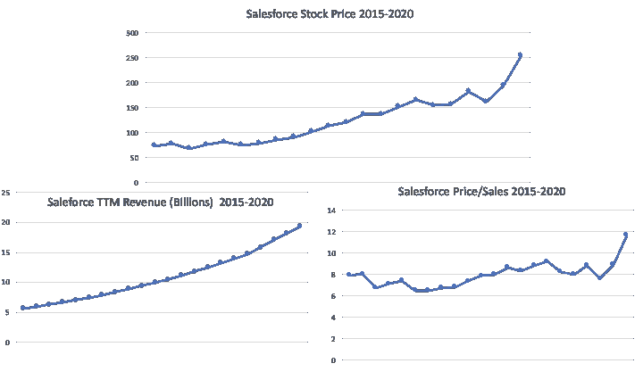
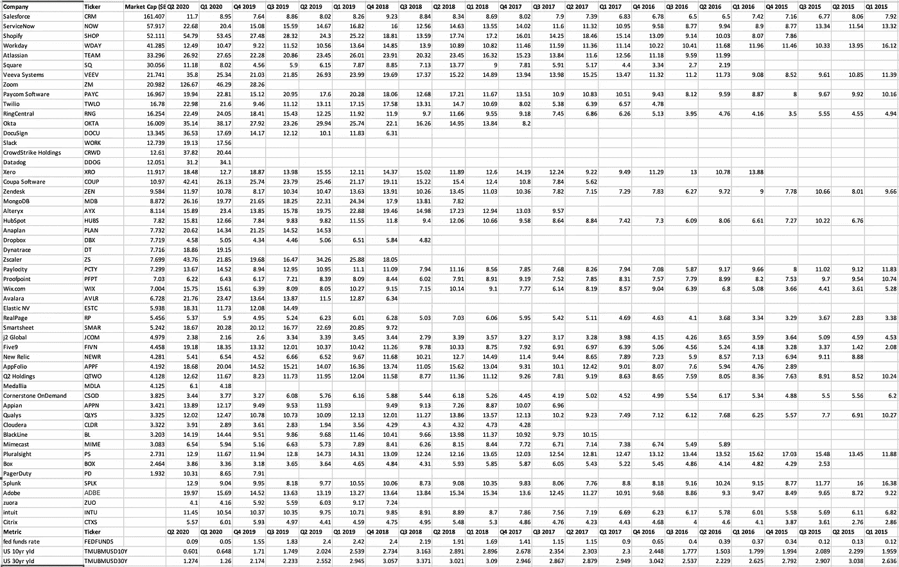
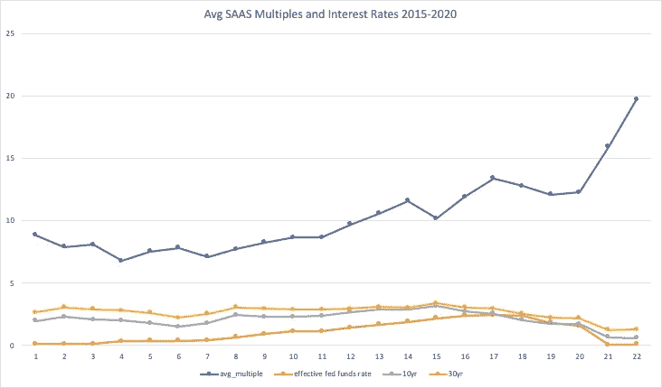
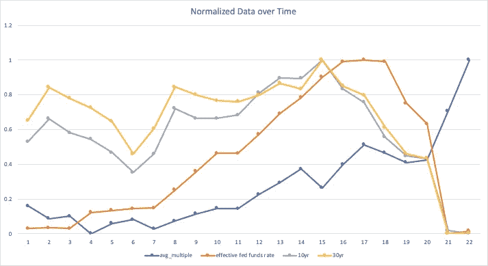
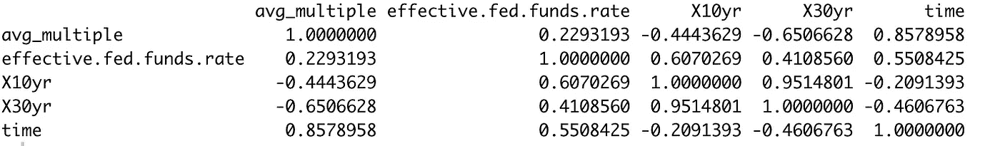
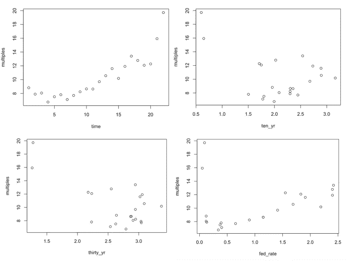
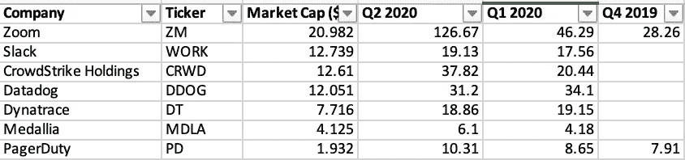
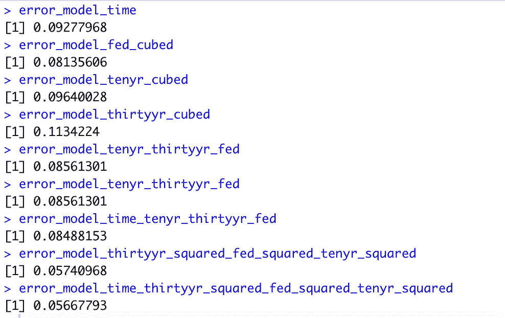
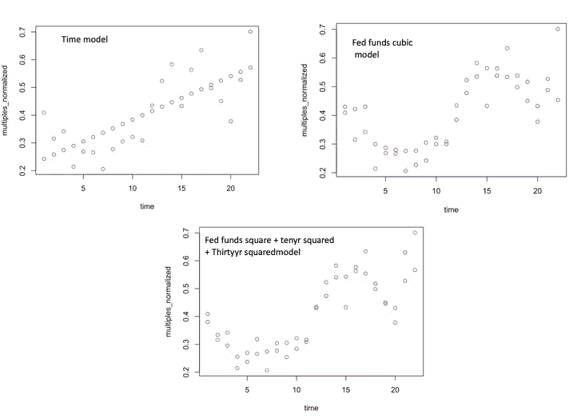

# SaaS 收入倍数、利率和 R 中的建模

> 原文：<https://towardsdatascience.com/saas-revenue-multiples-and-modeling-in-r-29ce10905488?source=collection_archive---------35----------------------->

## 证明利率不能完全解释 SaaS 估值的 6 个简单步骤


莎伦·麦卡琴在 [Unsplash](https://unsplash.com?utm_source=medium&utm_medium=referral) 上的照片

软件公司似乎每年都变得更有价值，在股票市场中也变得更加重要。就在本周，典型的[软件即服务](https://en.wikipedia.org/wiki/Software_as_a_service) (SaaS)公司 sales force[加入道琼斯工业平均指数。它现在是指数的第三大组成部分。自 Covid 危机以来，这些公司的价值增长甚至加速了。](https://abcnews.go.com/Business/salesforce-amgen-honeywell-added-reshuffled-dow/story?id=72594614#:~:text=In%20a%20major%20reshuffling%2C%20Salesforce,the%20S%26P%20Dow%20Jones%20Indices.)

看看 Salesforce 的数据，很明显，其不断增长的估值很大一部分来自于不断增加的收入。Salesforce 和其他 SAAS 公司只是不断赚更多的钱。



数据位于[https://github . com/taubergm/SaaS _ interest _ rates/blob/master/sales force . CSV](https://github.com/taubergm/saas_interest_rates/blob/master/salesforce.csv)

然而，这不是唯一的因素。看公司的价格销售比，或者股票“倍数”。在过去的 5 年里，它徘徊在 8 左右，今年飙升至近 12。这种变化让我们许多人想知道，SAAS 的估值是否超前了？

要回答这个问题，才华横溢的风险投资家查马斯·帕里哈皮蒂亚(Chamath Palihapitiya)有一个答案——低利率。

这让我想知道，仅仅使用利率我们能在多大程度上模拟科技公司的估值？如果我们将所有 SAaS 公司放在一起平均，我们能忽略收入增长、利润、客户获取、终身价值、留存以及其他构成经典 SaaS 模型的指标吗？

我试图用 r 中的一些基本建模技术来回答这个问题。该项目的代码和数据都可以在这里找到。这个练习在简单模型的陷阱和我们对软件公司估值的假设方面提供了一些很好的教训。

## 1 —收集数据

首先，我收集了一份美国所有最大的 SaaS 上市公司的名单。Mike Sonders 有一个很棒的[列表](https://www.mikesonders.com/largest-saas-companies/)，我不得不补充一些他漏掉的。接下来，我收集了这些公司的历史价格销售比数据(又名“倍数”)。这方面的最佳来源是[宏观趋势](https://www.macrotrends.net/stocks/charts)，它有大量的金融信息。

最后，我记录了同期的几个利率指标。我第一次从[圣路易斯联邦储备银行网站](https://fred.stlouisfed.org/series/FEDFUNDS)获得有效联邦基金利率。然后，我决定用 10 年期和 30 年期美国国债的收益率来衡量可能更好，因为这将反映对未来利率的预期。使用 [marketwatch](https://www.marketwatch.com/investing/bond/tmubmusd10y?countrycode=bx) 很容易收集这些信息。数据收集的最终结果是一个大矩阵。



数据位于[https://github . com/taubergm/SaaS _ interest _ rates/blob/master/SaaS _ mt2 . CSV](https://github.com/taubergm/saas_interest_rates/blob/master/saas_mt2.csv)

每一列代表一个收益季度，每一个值代表一个价格销售比。底部是利率，以百分比来衡量。

## 1 —数据探索和目测

首先，我想看看利率和 SaaS 倍数之间是否有任何明显的视觉关系。由于数据已经在 Excel 中，很容易绘制出平均 SaaS 公司 P/S 比率(蓝色)与 10 年期收益率、30 年期收益率和有效联邦基金利率的关系。



数据在[https://github . com/taubergm/SaaS _ interest _ rates/blob/master/SaaS _ averages . CSV](https://github.com/taubergm/saas_interest_rates/blob/master/saas_averages.csv)

看起来确实有很好的相关性，但是不同的尺度很难区分。使用[标准化](https://www.statisticshowto.com/probability-and-statistics/normal-distributions/normalized-data-normalization/)数据的相同曲线图如下。



现在这种关系已经不那么明显了。快速检查一下，SaaS 倍数似乎与 30 年期国债收益率呈显著负相关，与 10 年期国债的负相关程度较低。倍数似乎也与联邦基金利率有一定关系，但不是很明显。在 R 中确认这一点很容易。

```
saas_averages = read.csv(‘saas_averages.csv’)cor(saas_averages)
```



最令人惊讶的是，倍数膨胀与时间的简单推进有多么密切的关系。将 SaaS 倍数与一个基本递增序列进行比较，我得到的相关性为 0.86！我生成了简单的图表，将这些变量相互比较，看看我是否遗漏了什么。

```
plot(time, multiples)
plot(ten_yr, multiples)
plot(thirty_yr, multiples)
plot(fed_rate, multiples)
```



## 2 —归一化其他输入

直接比较平均值的一个问题是它们隐藏了一些信息。在这种情况下，较年轻的 SaaS 公司往往会以非常高的市盈率进行交易，这可能是由于炒作和较高的收入增长的综合作用。这些公司偏向于最近几个季度的平均倍数。



为了避免这种偏差，我对每个公司的 P/S 数据进行了标准化，以便对所有行进行同等加权。

```
normalize <- function(x) {
 return ((x — min(x, na.rm = TRUE)) / (max(x,na.rm = TRUE) — min(x,na.rm = TRUE)))
}saas_multiples_normalized = t(apply(saas_multiples_data, 1, normalize))# average quarters and reverse order to increasing in time
saas_multiples_normalized_average = rev(colMeans(saas_multiples_normalized, na.rm = TRUE))
```

现在，有了干净的数据和一些关于我在寻找什么的直觉，是时候建立一些基本的模型了。

## 3 —构建模型

R 语言通过“lm”函数使构建线性模型变得轻而易举。使用“lm ”,很容易构建简单的公式，以查看他们如何密切跟踪真实的 SaaS 数据。我决定构建各种利率指标之间的各种多项式关系，看看哪一个表现最好。下面是一些模型。

```
model_time = lm(multiples_normalized ~ time)model_fed_cubic = lm(multiples_normalized ~ poly(fed_rate,3))model_tenyr_cubic = lm(multiples_normalized ~ poly(ten_yr,3))model_thirtyyr_cubic = lm(multiples_normalized ~ poly(thirty_yr,3))model_tenyr_thirtyyr_fed = lm(multiples_normalized ~ thirty_yr + ten_yr + fed_rate)model_time_tenyr_thirtyyr_fed = lm(multiples_normalized ~ thirty_yr + ten_yr + time + fed_rate)model_thirtyyr_squared_fed_squared_tenyr_squared = lm(multiples_normalized ~ poly(thirty_yr,2) + poly(fed_rate,2) + poly(ten_yr,2))model_time_thirtyyr_squared_fed_squared_tenyr_squared = lm(multiples_normalized ~ time + poly(thirty_yr,2) + poly(fed_rate,2) + poly(ten_yr,2))
```

这些模型中的每一个都代表了时间、30 年期收益率、10 年期收益率、联邦基金利率和标准化 SaaS 倍数的某种多项式组合

## 4 —测试模型

我构建的许多模型都是不必要的复杂。例如，没有明显的理由为什么联邦基金利率、30 年期收益率和 10 年期收益率的多项式之和应该表现良好。不过，这是我观察到的。也许这是一个过度拟合的经典案例，或者也许在短期和长期利率预期之间存在某种更深层次的关系。

使用 R“预测”函数可以很容易地计算出这些模型的质量。然后使用“rmse”函数计算预测值和实际 SaaS 平均值之间的均方根误差。

```
predicted_model_time = predict(model_time)
predicted_model_fed_cubic = predict(model_fed_cubic)
predicted_model_tenyr_cubic = predict(model_tenyr_cubic)
predicted_model_thirtyyr_cubic = predict(model_thirtyyr_cubic)
predicted_model_tenyr_thirtyyr_fed = predict(model_tenyr_thirtyyr_fed)predicted_model_time_tenyr_thirtyyr_fed = predict(model_time_tenyr_thirtyyr_fed)predicted_model_thirtyyr_squared_fed_squared_tenyr_squared = predict(model_thirtyyr_squared_fed_squared_tenyr_squared)predicted_model_model_time_thirtyyr_squared_fed_squared_tenyr_squared = predict(model_time_thirtyyr_squared_fed_squared_tenyr_squared)error_model_time = rmse(multiples_normalized, predicted_model_time)error_model_fed_cubic = rmse(multiples_normalized, predicted_model_fed_cubic)error_model_tenyr_cubic = rmse(multiples_normalized, predicted_model_tenyr_cubic)error_model_thirtyyr_cubic = rmse(multiples_normalized, predicted_model_thirtyyr_cubic)error_model_tenyr_thirtyyr_fed = rmse(multiples_normalized, predicted_model_tenyr_thirtyyr_fed)error_model_tenyr_thirtyyr_fed = rmse(multiples_normalized, predicted_model_tenyr_thirtyyr_fed)error_model_time_tenyr_thirtyyr_fed = rmse(multiples_normalized, predicted_model_time_tenyr_thirtyyr_fed)error_model_thirtyyr_squared_fed_squared_tenyr_squared = rmse(multiples_normalized, predicted_model_thirtyyr_squared_fed_squared_tenyr_squared)error_model_time_thirtyyr_squared_fed_squared_tenyr_squared = rmse(multiples_normalized, predicted_model_model_time_thirtyyr_squared_fed_squared_tenyr_squared)
```

复杂模型表现最好。同样，这可能是由于过度拟合。真正的考验是使用这些模型来预测未来的数据。



## 5 —目视验证

我从上一节中选择了一些表现较好的模型，并查看了它们的公式

***模型 _ 时间= 0.01568 *时间+ 0.22692***

**T5【模型 _ fed _ 立方= 0.2984 * fed+0.2884 * fed—0.2989 * fed+0.4073**

***model _ thirtyyr _ squared _ fed _ squared _ tenyr _ squared***

***=-1.80371 *三十 _ 年+0.22576 *三十 _ 年+0.02209 *年+0.29625 *年+1.72330 *十 _ 年—0.23045 *十 _ 年+ 0.40729***

记住这些公式后，我将它们与实际的 SaaS 数据进行对比，看看它们看起来如何。归一化的 Saas 倍数是红点，模型预测是蓝点。



代码位于[https://github . com/taubergm/SaaS _ interest _ rates/blob/master/SaaS _ mt . R](https://github.com/taubergm/saas_interest_rates/blob/master/saas_mt.R)

## 6 —结论和最终想法

我认为公平地说，科技股和利率之间的关系并不完全清楚。虽然以较低的速率扩展 SaaS 倍数有直观的意义，但我们需要一些非常复杂的多项式模型来很好地拟合数据。我曾听金融大师说过类似“降息 0.5 个百分点会导致 2 个百分点的倍数扩张”之类的话。虽然这在某些情况下是正确的，但它肯定不是一条绝对的定律。

现在，有许多可能的原因导致我没能在利率和倍数之间找到一个好的、清晰的关系。也许没有足够多的公司来进行汇总，所以企业的个体差异使事情扭曲得太多了。也许这种关系并不是线性的。在联邦基金利率接近于零的情况下，市盈率非常高，但在经济繁荣、利率接近 2%时，市盈率也很高。也许我的分析遗漏了更大的宏观层面的变量，包括投资者情绪。事实上，从这些粗略数据来看，SaaS 多次波的最佳单一预测因子是时间。牛市的每一个季度都会扩大倍数，超出利率本身的预测。技术人员都希望有一些数量上的原因，让他们变得如此富有如此之快。也许就像我们的动物精神一样，真正的原因是无法量化的。