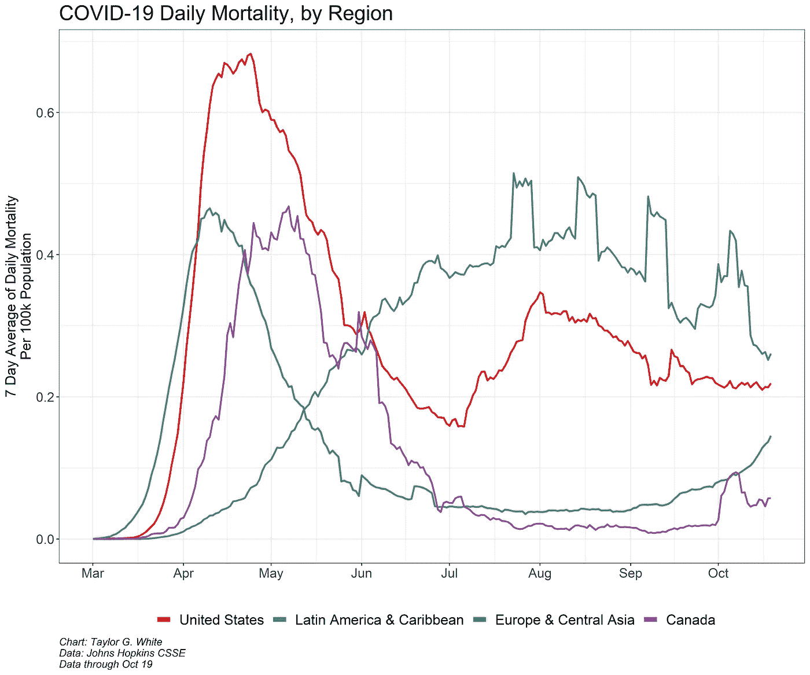

# 为疲软的经济牺牲生命

> 原文：<https://towardsdatascience.com/sacrificing-lives-for-a-weak-economy-e2aae2115ee1?source=collection_archive---------51----------------------->

## 美国如何在科维德战争中犯下大错

在美国，新冠肺炎疫情战争已经进行了七个月，距离总统大选还有两周。我们现在有大量数据来评估和评价各国在抗击病毒方面的表现。美国对疫情采取了随意的应对措施，没有明确的国家计划，州和地方领导人采取了不一致的策略。这种领导力的缺乏导致了疲软的经济和令人难以置信的高死亡率。

下图显示了疫情到目前为止的时间表。欧洲首次出现重大疫情，死亡率高峰出现在 4 月 10 日，美国的高峰出现在两周后的 4 月 24 日，加拿大的高峰出现在两周后的 5 月 7 日。拉丁美洲在夏季晚些时候经历了高峰期。在可怕的初始爆发后，疫情在欧洲和加拿大基本平息。然而，美国制定了不同的路线。

美国许多州没有阻止病毒的传播，而是选择保持经济开放。政治领导人[淡化了病毒的风险](https://www.npr.org/sections/latest-updates-trump-covid-19-results/2020/10/02/919432383/how-trump-has-downplayed-the-coronavirus-pandemic)，鼓励人们不受干扰地生活。结果是，美国的死亡率远高于其他富裕国家，其曲线类似于较贫困的拉丁美洲地区。美国的人均国内生产总值甚至比最富裕的拉丁美洲国家还要高四倍——我们本应该拥有抗击这种病毒的资源。

COVID 怀疑论者认为减缓病毒传播的努力从根本上被误导了。他们说这种病毒是[就像流感](https://www.kqed.org/news/11814749/bakersfield-doctors-dubious-covid-19-test-conclusions-spread-like-wildfire)(它不是)，即使它是致命的，[经济比拯救生命更重要](https://www.usatoday.com/story/news/nation/2020/03/24/covid-19-texas-official-suggests-elderly-willing-die-economy/2905990001/)。选择对抗病毒的州长的批评者喜欢指出瑞典是一个在对抗病毒方面无所作为的国家的光辉榜样，然而人们似乎仍然乐在其中。数字显示宽松的方法并没有奏效。

下图显示了新冠肺炎的死亡率，以及 COVID 对 30 个最富裕国家的经济影响。经济影响是 2020 年的预计经济增长与没有 COVID 的情况下可能发生的情况之间的差异。国际货币基金组织预计，美国经济遭受的损失将比中位数国家少 22%，但我们的死亡率比中位数高 457%。这种死亡率/增长权衡至少是不利的，特别是因为这些国家中有四分之一既有较低的死亡率，又有较好的经济结果。如果死亡率达到中值，美国本可以挽救超过 170，000 人的生命，这需要[更早的行动和更好的协调](https://ncdp.columbia.edu/custom-content/uploads/2020/10/Avoidable-COVID-19-Deaths-US-NCDP.pdf)。

最好的方法是积极的早期反应。考虑三个成功国家的行动:[南韩](https://www.wsj.com/articles/lessons-from-south-korea-on-how-to-manage-covid-11601044329)、[日本](https://www.nytimes.com/2020/06/06/world/asia/japan-coronavirus-masks.html)和[德国](https://www.vox.com/21495327/covid-19-germany-coronavirus-cases-deaths)。每个国家在早期都暴露于源于中国和意大利爆发的一连串病例。坚持戴口罩、社交距离/活动限制、大量检测以及隔离和接触者追踪的综合措施使得这些国家能够阻止病毒的传播。结果显示，韩国以第二低的死亡率和第二好的经济结果高居榜首。尽管人口老龄化，但日本的死亡率排名第三，财政状况排名第五。德国的死亡率和增长率高于中值，表现远好于其西方邻国。

另一方面，对数据的合理解读表明，瑞典的宽松政策并不是一个值得效仿的好榜样。下表显示，瑞典及其北欧邻国拥有相似的经济和人口统计数据。区别在于瑞典对 COVID 的反应最小，最大[严格指数](https://www.bsg.ox.ac.uk/research/research-projects/coronavirus-government-response-tracker)比其邻国低 35%。结果是，瑞典的死亡率是邻国挪威、芬兰和丹麦的七倍，而牺牲却没有带来经济效益。

瑞典的邻国在财富、典型的经济增长、贸易开放度以及城市中心人口比例方面都不相上下。最大严格程度反映了政府对 COVID 采取卫生相关和经济措施的程度。瑞典奉行宽松的政策，这是最低的严格性。

毫不奇怪，新冠肺炎疫情成为一个热门的政治问题，因为努力减缓疾病将有经济成本。理性的人可能不同意这种平衡行为，但公共话语很快变成了兜售阴谋论和 T2 坏科学的怀疑论者。像德国这样的国家向我们展示了本来可以怎样，用[科学和理性的辩论](https://www.wsj.com/articles/local-practical-apolitical-inside-germanys-successful-coronavirus-strategy-11588325403)推动更好的结果。今年 11 月，美国需要让其领导人保持同样高的期望。

*本文使用的代码和数据可以在* *这里找到* [*。*](https://github.com/tgwhite/Public_Policy/blob/master/Projects/COVID-19%20Mismanagement/scripts/analyze_covid_economy_clean.r)

***编者注:*** [*走向数据科学*](http://towardsdatascience.com/) *是一份以数据科学和机器学习研究为主的中型刊物。我们不是健康专家或流行病学家，本文的观点不应被解释为专业建议。想了解更多关于疫情冠状病毒的信息，可以点击* [*这里*](https://www.who.int/emergencies/diseases/novel-coronavirus-2019/situation-reports) *。*