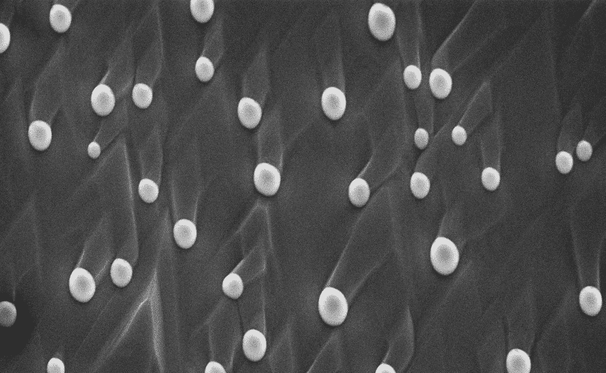
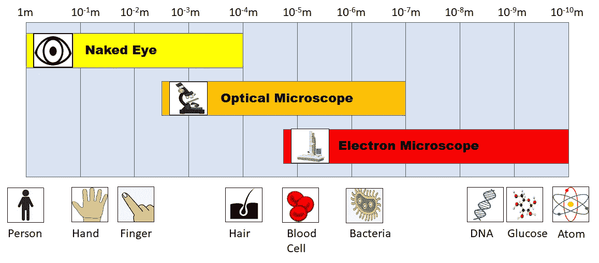
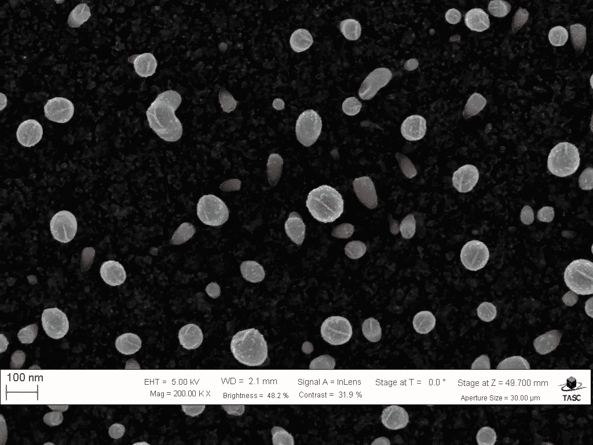
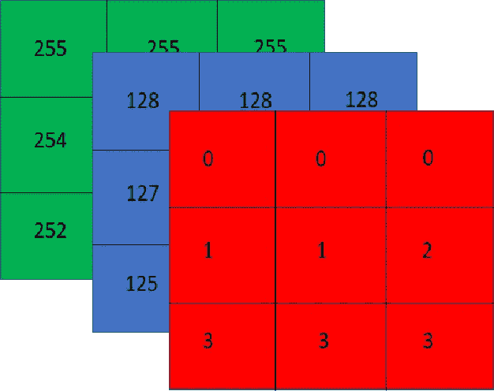
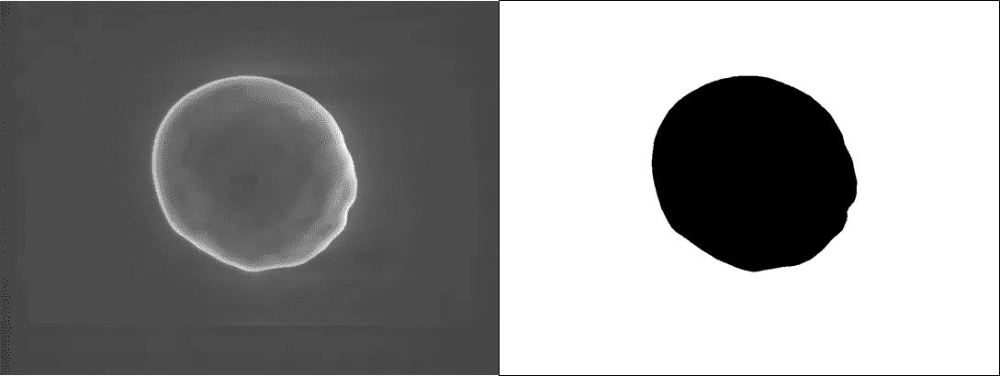
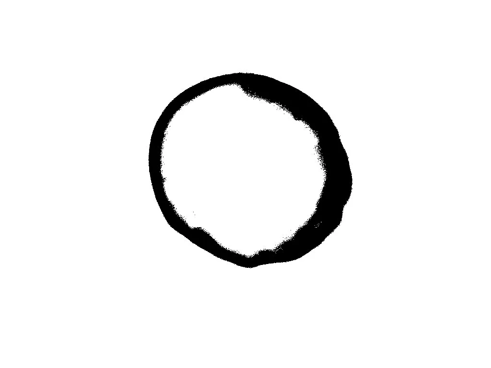
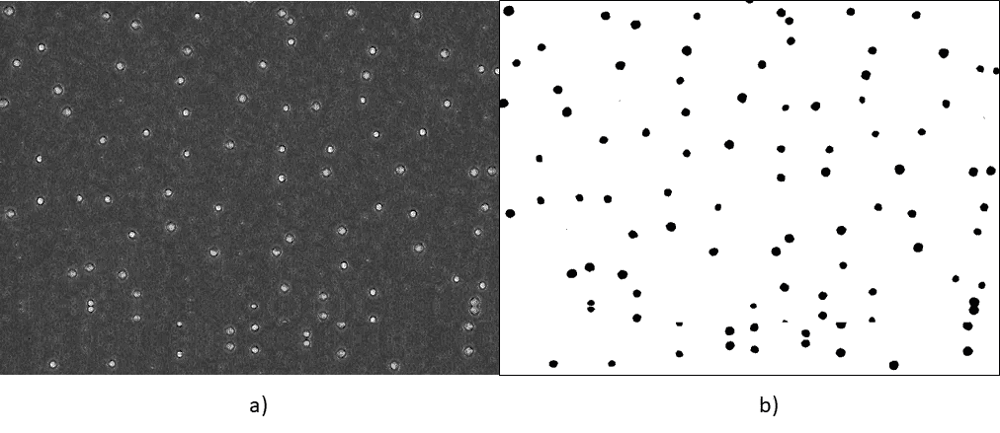
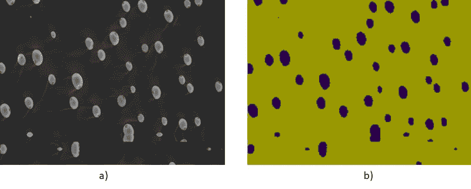
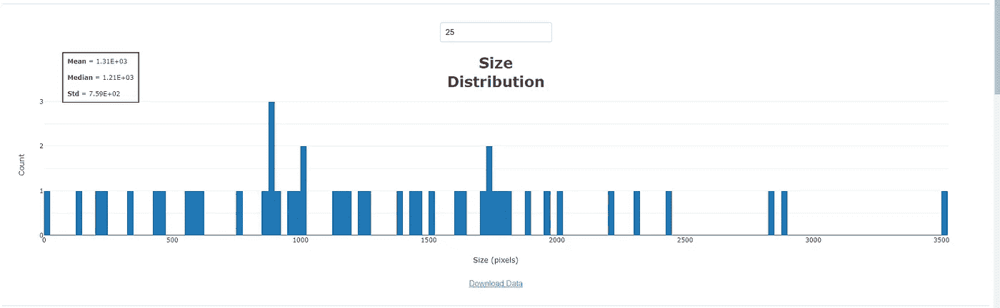

# SAEMI:电子显微镜图像的尺寸分析

> 原文：<https://towardsdatascience.com/saemi-size-analysis-of-electron-microscopy-images-1-4bb9cd47ad3c?source=collection_archive---------33----------------------->

来源: [CNR-IOM](https://b2share.eudat.eu/records/80df8606fcdb4b2bae1656f0dc6db8ba) ( [抄送](https://creativecommons.org/licenses/by/4.0/))

## 第 1 部分，开发电子显微镜图像定量分析工具

本文是我的系列文章的第 1 部分，详细介绍了 SAEMI 的使用和开发，这是我创建的一个 web 应用程序，用于执行电子显微镜图像的高通量定量分析。你可以点击这里查看应用[，点击这里](https://saemi.herokuapp.com/)查看其 github [。此外，查看第 2 部分](https://github.com/lwang94/sem_size_analysis)[这里](/saemi-size-analysis-of-electron-microscopy-images-7ab55bd979ac)(在这里我给出了如何使用该应用程序的步骤)和第 3 部分[这里](/saemi-size-analysis-of-electron-microscopy-images-36c9f61d52ed)(在这里我回顾了我的图像分割模型的训练过程)。在本文中，我将讨论开发 SAEMI 背后的动机、它在科学研究中的用途以及如何使用该应用程序的快速概述。

# 电子显微镜

20 世纪初，法国物理学家路易·德布罗意(Louis de Broglie)提出了一个革命性的命题:电子很像光，既可以充当粒子，也可以充当波。这种波粒二象性的想法现在是当代量子力学的基础，并导致了许多现代技术的发展，如个人电脑和智能手机，磁共振成像和 x 光等医疗设备，以及光纤互联网。

然而，从德布罗意强有力的陈述中得出的一项鲜为人知的技术是电子显微镜。它的相对默默无闻有很多原因，尽管这可能是因为它们过于昂贵，并且只在实验室环境中使用。尽管如此，它们在实验室环境中的价值是不可低估的。

与光学显微镜类似，电子显微镜允许研究人员观察世界上肉眼看不到的微小部分。然而，由于电子的波长比光短得多，研究人员可以使用电子显微镜来解析比传统光学显微镜更小数量级的特征。光学显微镜可以放大 20，000 倍，而电子显微镜可以放大 100 万倍以上。

在图 1 中，我们可以看到与传统光学显微镜相比，电子显微镜可以实现不同的长度范围。虽然光学显微镜可分辨的特征确实令人印象深刻(导致我们对细菌、疾病和细胞生物学的现代理解)，但电子显微镜可获得的特征将我们对世界的理解提高到了一个全新的水平。

图一。光学和电子显微镜长度标尺。作者制作的图像。

在化学和材料研究中，电子显微镜(EM)已被证明对于理解新型纳米材料的组成和结构至关重要，其用途从氢燃料电池发电到微芯片制造。在生物医学领域，EM 也允许研究人员探测光学显微镜无法观察到的生物物体的特征，如蛋白质、DNA 结构或树突细胞。随着科学研究越来越关注长度尺度越来越小的物质世界，EM 作为纳米尺度物体的表征工具变得越来越有价值。

# 那么问题出在哪里？

尽管 EM 拥有令人惊叹的能力，但这并不意味着它没有问题。虽然 EM 可以在前所未有的长度范围内快速提供颗粒的定性分析，但对 EM 图像进行**定量**分析可能会变得繁琐而耗时。例如，考虑下图:

图 2 一组纳米颗粒的电子显微镜图像。来源: [CNR-IOM](https://b2share.eudat.eu/records/80df8606fcdb4b2bae1656f0dc6db8ba) ( [抄送](https://creativecommons.org/licenses/by/4.0/))

要定量确定像图像中粒子的平均大小这样简单的事情，您必须首先手动标记所有的粒子(或者至少是它们的良好代表)。然后你必须计算每个粒子的像素数，从这个数中可以计算出每个粒子的平均面积(以像素为单位)。

一种常用于帮助定量分析 EM 图像的工具是 [ImageJ](https://imagej.net/Welcome) 。ImageJ 是一个开源平台，使用 javascript 来帮助研究人员分析科学图像。有了它，研究人员可以使用多边形选择工具来定义图像的特定区域，然后单击一个按钮，就可以计算出定义区域内的像素数量。虽然这些工具很有帮助，但必须手动定义图像内的区域仍然妨碍了一次分析许多 EM 图像的高通量方法。

缺乏用于定量图像分析的自动化工具是因为传统上，很难将图像输入计算机，然后让计算机理解它在看什么。虽然一个人可以看到一幅图像并立即从背景中识别出前景物体，但计算机只能得到一个代表特定点颜色强度的像素值矩阵。这如图 3 所示，其中图像显示为像素值的三个堆叠 2D 阵列(或单个 3D 阵列)。第一 2D 阵列通常代表红色通道，而第二和第三阵列分别代表蓝色和绿色通道。正是这些 2D 阵列中的像素值之间的密集复杂关系层通知了前景对象与背景的分离。因此，开发一种方法来分割 EM 图像中的不同粒子(也可以很好地推广)不是一件容易的事。

图 3 表示图像的像素阵列。作者制作的图像。

# 作为解决方案的深度学习

幸运的是，并不是所有的希望都破灭了。深度学习是一类机器学习算法，近年来，它推动了计算机视觉的极限。通过使用基于深度学习的模型，研究人员已经能够在自动驾驶汽车、面部识别系统和 3D 模型构建等技术上取得突破。特别是，深度学习模型已经允许计算机不仅可以自动对图像进行分类，还可以将它们分割成不同的组成部分。

对于 EM 图像，深度学习可用于分割图像的组成部分，以便像素可被分类为背景像素或粒子像素。这在下面的图 5 中示出，白色表示背景像素，黑色表示粒子像素。

图 5 纳米粒子的 EM 图像及其通过深度学习的分割。来源: [CNR-IOM](https://b2share.eudat.eu/records/80df8606fcdb4b2bae1656f0dc6db8ba) ( [抄送](https://creativecommons.org/licenses/by/4.0/))

注意，深度学习模型将图像从范围从 0 到 255 的像素值的 3D 阵列(对于具有 8 位像素值的图像)转换为像素值为 0 或 1 的 2D 阵列。通过降低阵列的复杂性并对其进行限制，以便只保留最相关的特征，可以明确地进行更多的定量分析，而不用担心“噪声”。例如，如果我们希望量化 EM 图像中有多少像素被粒子占据，我们只需计算 1(粒子像素的值)在我们的分段 2D 阵列中出现的频率。

相比之下，如果我们使用一个更简单的方法，如[二值化](https://felixniklas.com/imageprocessing/binarization)。对图 5 中的 EM 图像进行二值化的结果将产生如图 6 所示的图像。与使用深度学习来分割图像不同，在图 6 中简单地计算 1(黑色像素)的频率将导致非常不准确的分析。因此，需要更复杂的分析模式来获得准确的结果。

图 6 使用二值化分割图 5 中的 EM 图像的结果。作者制作的图像。

# 尺寸分布的测量

现在我们有了一个很好的分割图像，我们想要进行什么样的定量分析呢？

量化 EM 图像以促进科学研究的最简单但也是最有效的方法之一是找出样品中颗粒的尺寸分布。例如，我们为了健康而服用的许多药物必须具有一定的尺寸，以便靶向特定的器官并穿透我们的细胞壁。同样，对于许多化学合成来说，反应物必须在一定的尺寸范围内，否则它们会太大而不能发生反应。

其他更复杂的过程也可能在纳米尺度上独特地依赖于尺寸。[金属和金属氧化物纳米颗粒中的量子尺寸效应](https://www.tandfonline.com/doi/abs/10.1080/00018730110117451?journalCode=tadp20)通常决定了它们的光子和光电性质。由于金属纳米粒子的大小与其吸收特定波长光的能力有着错综复杂的联系，研究人员经常会调整他们的光电设备(如太阳能电池、led、光纤激光器等)。)通过简单地改变这些设备中使用的纳米颗粒的尺寸。

然而，为了成功地调整所有这些有趣的属性，必须首先确定样本的大小。在上面的图 5 中，计算分割图像阵列中 1(粒子像素)的频率对于计算机程序来说是一项微不足道的任务。由于大多数 EM 图像也有相关的比例尺，因此可以通过简单地将该频率乘以像素到纳米/微米的转换比率来确定颗粒的面积。这将导致图 5 中纳米颗粒尺寸的定量测量。

然而，当图像中有许多粒子时，确定尺寸分布需要稍多的步骤。简单地计算图像中 1 的频率将会发现所有粒子的大小都是一个单独的斑点，而不是单个的实体。为了确保保持每个粒子的个性，您可以给图像中每个 1 的连接区域一个唯一的标签。这被称为[连通分量标记](https://en.wikipedia.org/wiki/Connected-component_labeling)。例如，考虑下面的 2D 阵列:

> [ [ 1，0，0，1，1 ]，
> ，【0，0，0，1，1】，
> ，
> ，【1，0，0，0，0】，
> ，【0，0，0，1，1】]

为 1 的每个连接区域分配一个唯一的标签将产生以下数组:

> [[ 1，0，0，2，2 ]，
> ，[ 0，0，0，2，2 ]，
> ，[ 3，3，0，0，0 ]，
> ，[ 3，0，0，0，0，0 ]，
> ，[ 0，0，0，4，4 ] ]

获得大小分布仅仅是计算每个独特的标记在阵列中出现的频率。因此，在上面的例子中，粒子 1 具有一个像素的大小，粒子 2 具有四个像素的大小，粒子 3 具有三个像素的大小，粒子 4 具有两个像素的大小。

# 把所有的放在一起

为了给研究人员提供一种获得 EM 图像中纳米颗粒尺寸分布的定量测量方法，我利用深度学习开发了 [SAEMI](http://saemi.herokuapp.com) ，这是一款利用深度学习计算 EM 图像中纳米颗粒尺寸分布的 web 应用程序。

为了使用该应用程序，首先上传一张图像，随后调整其大小，以确保输入像素的数量与我用于训练深度学习模型的像素数量相匹配。这是使用双线性插值来完成的，双线性插值使用沿两个轴的线性插值来将一个网格值(在这种情况下是像素值)映射到另一个不同大小的网格值上。

一旦完成，图像就被输入到我的深度学习模型中，该模型是根据从 NFFA-欧洲拍摄的一组 EM 图像进行训练的。由于这个图像集只包含原始的 EM 图像(我们的 *x* 值)，我不得不提供我自己的基本事实标签( *y* 值)。这是使用上述的 [opencv-python](https://pypi.org/project/opencv-python/) 算法和 ImageJ 图像分析工具的组合来完成的。在下面的图 6 中，您可以看到一个原始 EM 图像及其对应的地面实况标签的示例。

图 6 a)原始电磁图像。来源:[CNR-IOM](https://b2share.eudat.eu/records/80df8606fcdb4b2bae1656f0dc6db8ba)([CC-BY](https://creativecommons.org/licenses/by/4.0/))b)EM 图像的地面真实标签。

经过我训练好的模型，结果是一个二元预测。这个二进制预测是由 0 和 1 组成的 2D 值数组，其中 0 表示背景像素，1 表示粒子像素。这种预测的一个例子如图 7 所示。

图 8 a)原始 SEM 图像。来源: [CNR-IOM](https://b2share.eudat.eu/records/80df8606fcdb4b2bae1656f0dc6db8ba) ( [CC-BY](https://creativecommons.org/licenses/by/4.0/) ) b)通过深度学习模型馈入后的预测二值图像。金色代表像素值 0，紫色代表像素值 1

最后，通过计数 2D 阵列中 1 的每个连接区域并报告它们的频率来进行定量分析。大小分布随后显示为直方图，并可以下载为. csv 文件，以供研究人员在认为合适时进行进一步分析。下图 9 显示了图 8 所示 EM 图像的直方图。

图 9 图 8 的纳米颗粒尺寸分布直方图。截图来自 [SAEMI](http://saemi.herokuapp.com)

所有这些计算，从调整图像大小到使用深度学习分割图像，再到确定颗粒尺寸分布，都是通过点击按钮和最少的输入来执行的。通过利用深度学习的能力，可以以高效和高通量的方式进行 EM 图像的定量分析。

在我系列的[第 2 部分](/saemi-size-analysis-of-electron-microscopy-images-7ab55bd979ac)中，我将更详细地介绍如何使用该应用程序，在我系列的[第 3 部分](/saemi-size-analysis-of-electron-microscopy-images-36c9f61d52ed)中，我将更深入地研究训练深度学习模型的过程，以及如何使用深度学习来分割图像。敬请关注，如果你碰巧参与了纳米尺度的研究，请查看我的[应用](https://saemi.herokuapp.com/)，亲自测试一下。随时欢迎反馈！