# SAEMI:电子显微镜图像的尺寸分析

> 原文：<https://towardsdatascience.com/saemi-size-analysis-of-electron-microscopy-images-36c9f61d52ed?source=collection_archive---------54----------------------->


来源: [CNR-IOM](https://b2share.eudat.eu/records/80df8606fcdb4b2bae1656f0dc6db8ba) ( [抄送](https://creativecommons.org/licenses/by/4.0/))

## 第三部分，训练电子显微镜的分割模型

本文是我的系列文章的第 3 部分，详细介绍了 SAEMI 的使用和开发，这是我创建的一个 web 应用程序，用于执行电子显微镜图像的高通量定量分析。你可以点击这里查看应用[，点击这里](https://saemi.herokuapp.com/)查看其 github [。此外，请查看第 1 部分](https://github.com/lwang94/sem_size_analysis)[这里](/saemi-size-analysis-of-electron-microscopy-images-1-4bb9cd47ad3c)(我在这里谈论创建该应用程序背后的动机)和第 2 部分[这里](/saemi-size-analysis-of-electron-microscopy-images-7ab55bd979ac)(我在这里给出如何使用该应用程序的演示)。在这篇文章中，我将讲述我如何训练一个深度学习模型来分割电子显微镜(EM)图像，以便对纳米颗粒进行定量分析。

# 选择数据集

为了训练我的模型，我使用了来自[NFFA-欧洲](https://b2share.eudat.eu/records/80df8606fcdb4b2bae1656f0dc6db8ba)的数据集，其中包含来自意大利的里雅斯特 [CNR-IOM](https://www.iom.cnr.it/) 的 20，000 多张扫描电子显微镜(SEM)图像。这是唯一一个我可以免费访问的大型 EM 图像数据库，正如你所想象的，大多数 EM 图像都有很强的版权问题。该数据库包括 20，000 多张 SEM 图像，分为 10 个不同的类别(生物、纤维、薄膜涂层表面、MEMS 器件和电极、纳米线、颗粒、图案化表面、多孔海绵、粉末、尖端)。然而，对于我的训练，我将训练图像限制为仅取自粒子类别，该类别包含不到 4000 张图像。

其中一个主要原因是，对于几乎所有其他类别，实际上没有办法从图像中获得有用的尺寸分布。例如，考虑图 1a 所示的纤维的 EM 图像。分割图像后，我可以计算图像中每根纤维的大小，但你也可以清楚地看到纤维延伸出图像。因此，我计算的尺寸仅限于电子显微镜图像，我无法单独从图像中提取纤维的长度。

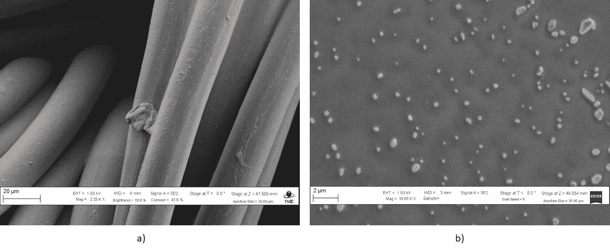

图 1 a)来自数据集的纤维的 EM 图像 b)来自数据集的颗粒的 EM 图像。来源: [CNR-IOM](https://b2share.eudat.eu/records/80df8606fcdb4b2bae1656f0dc6db8ba) ( [抄送](https://creativecommons.org/licenses/by/4.0/))

将其与图 1b 中颗粒的 EM 图像进行比较，其中图像中显示的尺寸显然是整个颗粒的尺寸。不仅如此，这一类别中的图像往往具有最小程度的遮挡，这使得标记和训练更加容易。

在粒子类别中，所有的图像都是 768 像素高，1024 像素宽。大多数粒子的形状大致为圆形，一些图像中有数百个粒子，而另一些图像中只有一个粒子。由于放大倍数的不同，像素中颗粒的尺寸也有很大差异，范围从 1 微米到 10 纳米。下图 2 显示了数据集中一些粒子图像的示例:

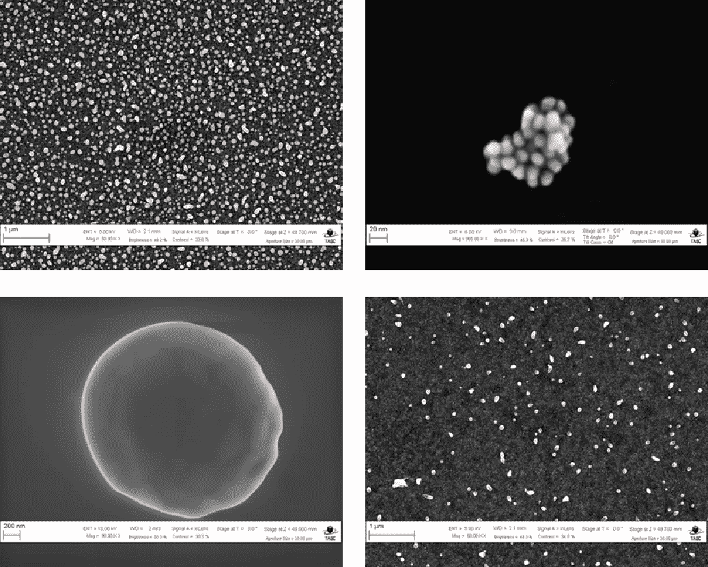

图 2 4 在数据集中发现的颗粒的电子显微镜图像。来源: [CNR-IOM](https://b2share.eudat.eu/records/80df8606fcdb4b2bae1656f0dc6db8ba) ( [抄送](https://creativecommons.org/licenses/by/4.0/))

# 移除横幅

为了开始训练过程，首先必须对原始图像进行预处理。在很大程度上，这意味着删除包含图像元数据的横幅，同时保留尽可能多的有用图像数据。为了做到这一点，我使用了一种叫做“反射填充”的技术。实际上，我用顶部和底部的倒影替换了横幅区域。这方面的一个例子如图 3 所示，反射以红色突出显示。

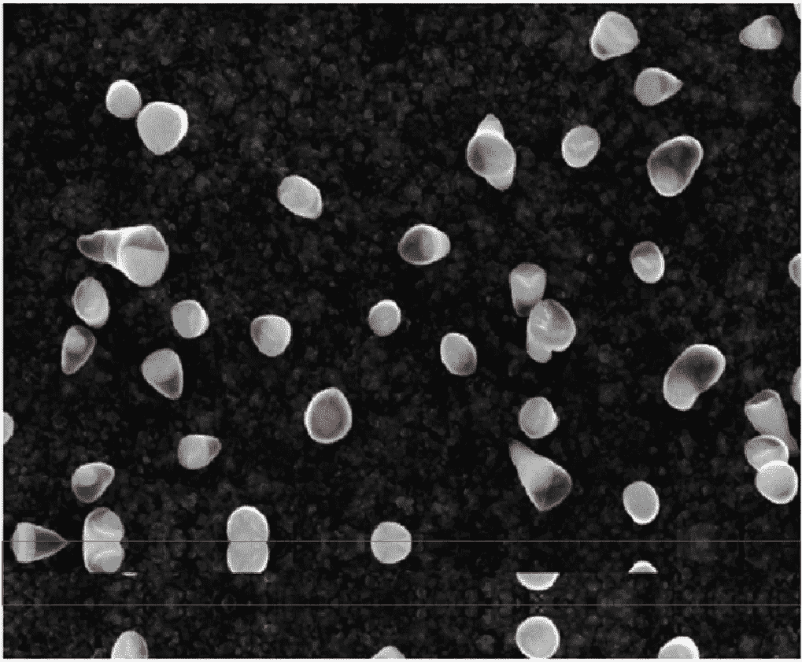

图 3 反射填充的例子。来源:[CNR-IOM](https://b2share.eudat.eu/records/80df8606fcdb4b2bae1656f0dc6db8ba)([CC-BY](https://creativecommons.org/licenses/by/4.0/))

然而，为了执行这个转换，我首先必须使用 OpenCV 检测横幅区域。首先，我用我的图像创建了一个二进制蒙版，其中所有高于 250 的像素值都变成了 255，所有低于阈值的像素值都变成了 0。下面显示了用于执行此操作的代码以及图 4 中的结果。

```
import cv2# convert image to grayscale
grayscale = cv2.cvtColor(img, cv2.COLOR_BGR2GRAY)# create binary mask based on threshold of 250
ret, binary = cv2.threshold(gray, 250, 255, cv2.THRESH_BINARY)
```

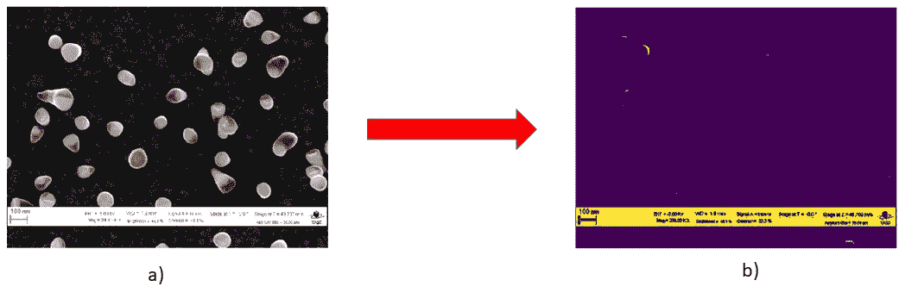

图 4 a)原始图像 b)二值化后的图像

虽然阈值处理在寻找横幅区域方面已经相当有效，但我仍然可以检测到图像中不属于横幅的一些元素。为了确保只检测到横幅区域，而没有其他区域残留，我在阈值图像上使用了[腐蚀和膨胀](https://docs.opencv.org/2.4/doc/tutorials/imgproc/erosion_dilatation/erosion_dilatation.html)来找到图像中垂直线和水平线的位置。侵蚀是一种图像处理技术，其中给定大小的核在图像上扫描。当内核沿着图像行进时，找到最小像素值，并且中心的像素值被该最小值替换。膨胀是一种类似的操作，但使用的是最大像素值。

下面显示了检测垂直线和水平线的代码，以及它们在图 5 中的结果。

```
# create tall thin kernel
verticle_kernel = cv2.getStructuringElement(
    cv2.MORPH_RECT, 
    (1, 13)
)# create short long kernel
horizontal_kernel = cv2.getStructuringElement(
    cv2.MORPH_RECT, 
    (13, 1)
) # detect vertical lines in the image
img_v = cv2.erode(thresh, verticle_kernel, iterations = 3)
img_v = cv2.dilate(img_v, verticle_kernel, iterations = 3)# detect horizontal lines in the image
img_h = cv2.erode(thresh, horizontal_kernel, iterations = 3)
img_h = cv2.dilate(img_h, horizontal_kernel, iterations = 3)
```

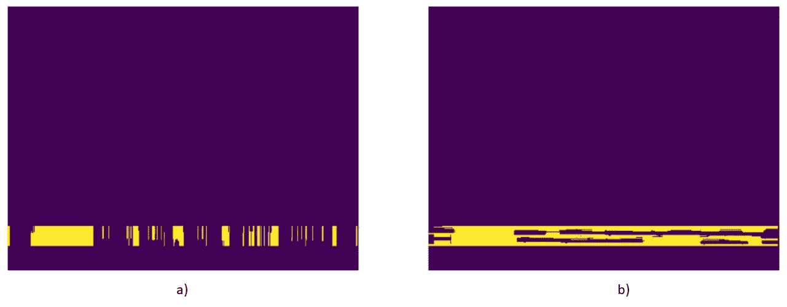

图 5 a)垂直侵蚀/膨胀 b)水平侵蚀/膨胀

然后我把两个结果加在一起，并对反转的数组进行了最终的腐蚀+二值化。代码和结果如下面的图 6 所示。

```
# add the vertically eroded and horizontally eroded images
img_add = cv2.addWeighted(img_v, 0.5, img_h, 0.5, 0.0)# perform final erosion and binarization
img_final = cv2.erode(~img_add, kernel, iterations = 3)
ret, img_final = cv2.threshold(
    img_final, 
    128, 
    255, 
    cv2.THRESH_BINARY | cv2.THRESH_OTSU
)
```

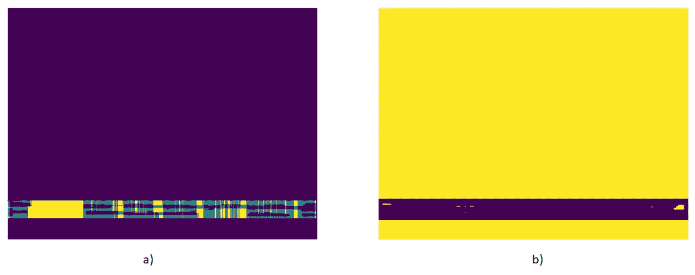

图 6 a)添加垂直腐蚀和水平腐蚀的图像 b)执行最终腐蚀和二值化

有了图 6b 所示的结果，我终于可以安全地检测到横幅并将其删除。首先，我找到了最终结果中像素值为 0 的地方，并将左上角和右下角的坐标放入单独的变量中。同样，我计算了横幅区域的高度和宽度。

```
import numpy as npbanner = np.argwhere(img_final == 0)# coordinates of the top left corner
banner_x1, banner_y1 = banner[0, 1], banner[0, 0]# coordinates of the bottom right corner
banner_x2, banner_y2 = banner[-1, 1], banner[-1, 0] # calculate width and height of banner
banner_width = banner_x2 - banner_x1
banner_height = banner_y2 - banner_y1
```

接下来，我用这些坐标和横幅的高度/宽度找到它的上下边缘的“倒影”。

```
# finding the reflection below the banner
bot_reflect = img[
    banner_y2:banner_y2 + banner_height // 2, 
    banner_x1:banner_x2, 
    :
]
bot_reflect = np.flipud(bot_reflect)# finding the reflection above the banner
top_reflect = img[
    banner_y1 - (banner_height - len(bot_reflect)):banner_y1,    
    banner_x1:banner_x2, 
    :
]
top_reflect = np.flipud(top_reflect)
```

我找到的区域在下面的图 7 中用绿色突出显示。

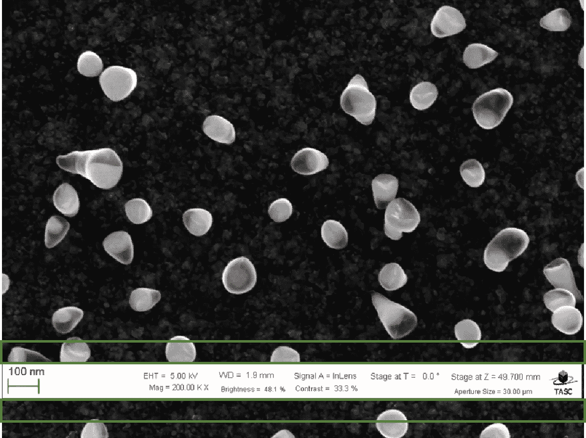

图 7 图像中用于反射填充的区域(以绿色突出显示)。来源: [CNR-IOM](https://b2share.eudat.eu/records/80df8606fcdb4b2bae1656f0dc6db8ba) ( [抄送](https://creativecommons.org/licenses/by/4.0/))

最后，我把上面和下面的倒影连接起来，用倒影替换了横幅区域。

```
reflect_pad = np.concatenate((top_reflect, bot_reflect), axis = 0)
imgcopy = img.copy()
imgcopy[banner_y1:banner_y2, banner_x1:banner_x2] = reflect_pad
```

最终结果(imgcopy)如下面的图 8 所示。

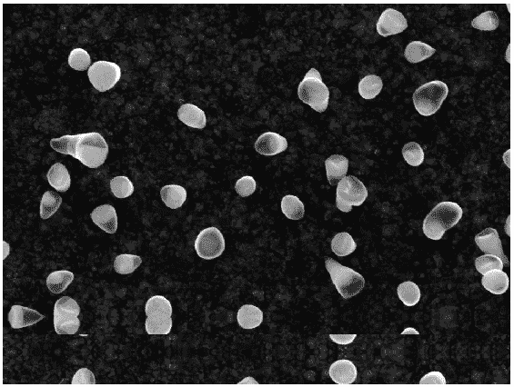

图 8 反射填充的最终结果。来源: [CNR-IOM](https://b2share.eudat.eu/records/80df8606fcdb4b2bae1656f0dc6db8ba) ( [CC-BY](https://creativecommons.org/licenses/by/4.0/) )

# 基本事实标签

移除横幅后，我使用 OpenCV 和 ImageJ 的组合创建地面真相标签。为了帮助创建地面真实标签，使用 OpenCV 使用了[分水岭算法](https://docs.opencv.org/master/d3/db4/tutorial_py_watershed.html)。

分水岭算法是一种分割算法，它将图像视为地形表面，其中高亮度像素值为丘陵，低亮度值为山谷。该算法背后的想法是，你用水填充“山谷”,随着水位上升，你沿着水汇合的边缘建造屏障。这些障碍代表了图像的分割边界。

虽然分水岭算法非常有用，但它也往往对噪声非常敏感。通常，您需要对图像执行更多的预处理，如阈值处理和 T2 距离变换，以获得良好的分割效果。这使得基于分水岭的分割算法难以很好地推广到各种图像。下面的图 9 显示了一个应用分水岭算法(带有一些预处理步骤)的例子。

```
# remove noise using a mean filter
shifted = cv2.pyrMeanShiftFiltering(imgcopy, 21, 51)# threshold the image 
graycopy = cv2.cvtColor(shifted, cv2.COLOR_BGR2GRAY)
ret, thresh = cv2.threshold(
    graycopy, 
    0, 
    255, 
    cv2.THRESH_BINARY | cv2.THRESH_OTSU
)

# apply adistance transform and find the local maxima
dt = cv2.distanceTransform(thresh, 2, 3)
localmax = peak_local_max(
    dt, 
    indices = False, 
    min_distance = min_distance_bt_peaks, 
    labels = thresh
) # apply the watershed algorithm
markers, num_seg = label(localmax, structure = np.ones((3, 3)))
labels = watershed(-dt, markers, mask = thresh)
```

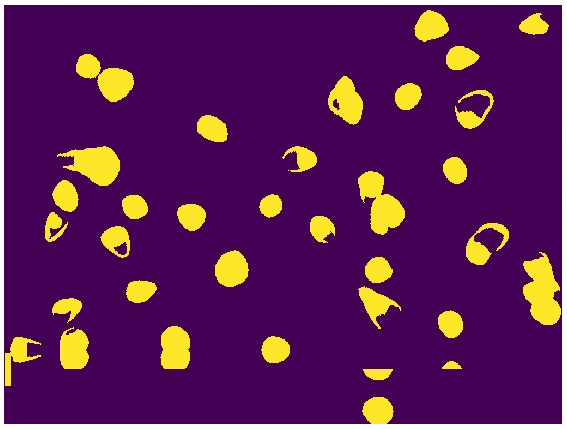

图 9 使用分水岭算法的结果

如上所述，分水岭算法本身不足以创建地面真实标签。然而，作为第一遍近似，它的表现并不太差。因此，我决定使用上面的代码，首先为尽可能多的图像提供标签，然后用 [ImageJ](https://imagej.nih.gov/ij/) 再次检查标签，以清理标签，使它们更准确地匹配图像。

ImageJ 是一个用 Java 编写的图像处理和分析工具，专为科学图像设计。下面的图 10 显示了 ImageJ 菜单的一个例子。

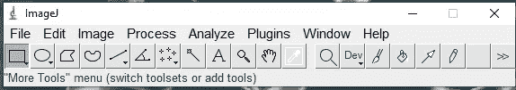

图 10 图像 j 菜单

我使用菜单左侧的五个选择工具，用鼠标选择图像的区域，然后选择:编辑→选择→创建遮罩，以清理从分水岭算法创建的第一遍地面真实标签。为了标记尽可能多的图像，我试图限制标记，以便只要图像中有足够多的粒子可以给出尺寸分布的良好近似，地面真实标记是可以接受的。这方面的一些例子如图 9 所示。

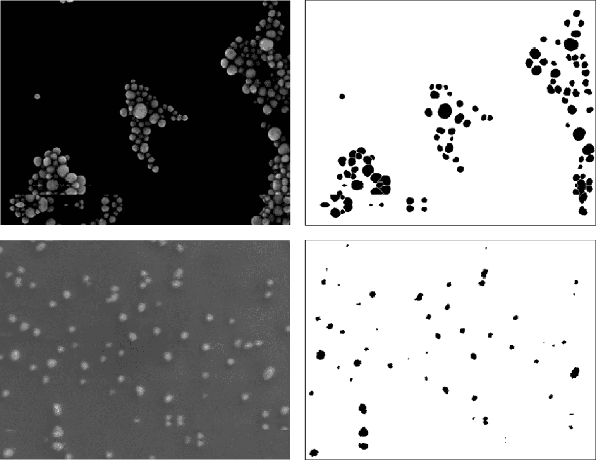

图 9 不充分的事实标签。来源: [CNR-IOM](https://b2share.eudat.eu/records/80df8606fcdb4b2bae1656f0dc6db8ba) ( [CC-BY](https://creativecommons.org/licenses/by/4.0/) )

起初，我用这种方法标记了大约 750 张图片。然而，我在训练中很快发现，使用这种质量的标签并不能很好地训练，我不得不更加谨慎地用 ImageJ 对它们进行第二次检查。这一次，我尽可能确保图像中的每一个粒子都以接近像素的精确度被标记出来。

为了确保数据质量，地面实况标签覆盖了相应的图像，并用肉眼检查，以确定它们相互反映的程度。然后，继续使用 ImageJ 的选择工具，我会用放大 200-300 倍的覆盖图来修饰标签。这些新的基本事实标签的例子如图 10 所示。

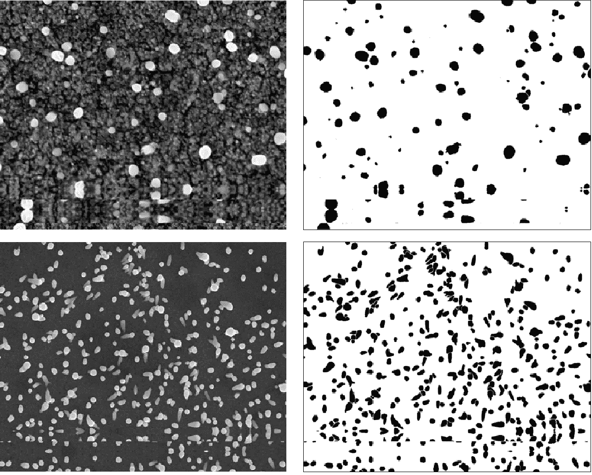

图 10 最终地面真相标签。来源: [CNR-IOM](https://b2share.eudat.eu/records/80df8606fcdb4b2bae1656f0dc6db8ba) ( [CC-BY](https://creativecommons.org/licenses/by/4.0/) )

总共有大约 250 张图片被第二次完全贴上标签。这些被放在单独的目录中，一个目录用于原始图像(从现在开始称为`path_img`)，另一个目录用于地面真相标签(从现在开始称为`path_lbl`)。虽然这是一个比以前小得多的数据集，但由于影像和地面实况标签之间不存在不准确性，因此在跟踪训练损失时，它表现出了更好的性能。

# 创建数据集群

一旦创建了足够多的地面真相标签来形成我的训练集，我就开始训练我的深度学习模型。为了做到这一点，我使用了 [fastai](https://github.com/fastai/fastai) ，这是一个基于 PyTorch 构建的强大库，可以使使用深度学习的培训更加直观和简化。第一步是确保我的训练集以适合 fastai 框架的方式组织。为此，需要将训练数据和基础事实标签放入一个 [DataBunch](https://docs.fast.ai/basic_data.html) 对象中。我将展示下面的代码，并在下面的段落中更详细地解释它。

```
# use smaller image sizes for to deal with memory issues
size = (192, 256)# batch size
bs = 24# create DataBunch
data = (SegmentationItemList.from_folder(path_img)
        .split_by_rand_pct(0.2)
        .label_from_func(lambda x: path_lbl/f'{x.stem}.png')
        .transform(
              get_transforms(flip_vert=True, max_warp=None),    
              tfm_y=True, 
              size=size
         )
         .databunch(bs=bs)
         .normalize())
```

这段代码的主要部分从“创建数据集中”部分开始，在这里变量`data`变成了数据集中对象。它首先从`path_img`目录中收集原始图像，并将数据分成训练集和验证集。这是在`.split_by_rand_pct(0.2)`行中完成的，其中随机选择 20%的数据作为验证集，以防止训练集过度拟合。

每个图像的相应基本事实标签(即损失函数中使用的 y 值)然后在`.label_from_func`中收集。这将一个函数应用于在`path_img`中收集的每一项，并将所有输出放入一个列表中。我应用的函数`lambda x: path_lbl/f'{x.stem}.png'`获取图像文件名，并在`path_lbl`目录中寻找匹配的文件名(扩展名为. png)。

然后将一系列图像变换应用于训练和验证集，作为数据扩充的一种形式。我使用的变换包括(但不限于)翻转任一轴上的图像，旋转图像和放大图像。关于我使用的转换的完整列表，请点击这里的。请注意，我还应用了`tfm_y=True`,这意味着我们应用于原始图像的任何变换也会应用于相应的标签。这对于进行图像分割时的训练至关重要。

此外，对所有图像应用了调整大小转换，确保它们都是 192x256 像素。这个转换应用于所有图像的原因很不幸，因为如果图像再大一点，我在训练它们的时候就会耗尽 CUDA 内存。出于类似的原因，用于训练的批量大小也是一次只有 24 个图像。

最后，像素值在结束时都被归一化，以防止大的异常值影响训练过程。

# 骰子系数

训练前的最后一步是确定一个度量标准，以确定模型的表现如何。用于图像分割模型的一个常见度量是[骰子](https://en.wikipedia.org/wiki/S%C3%B8rensen%E2%80%93Dice_coefficient)系数。它与 [F1 的分数](https://en.wikipedia.org/wiki/F1_score)相同，尽管表达方式略有不同。

骰子系数通过以下公式计算:

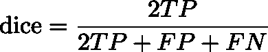

其中 TP 是真阳性，FP 是假阳性，FN 是假阴性。在这种情况下，真正值指的是由预测确定的所有正值，这些值也出现在基础真值标签中的相同位置。例如，如果 7x7 图像的基本事实标签是:

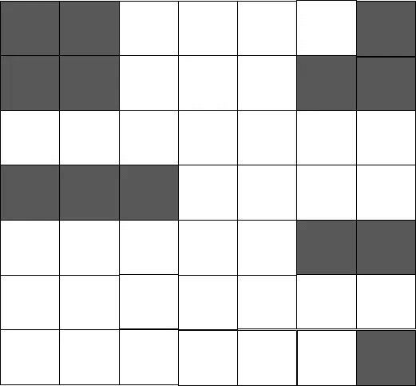

预测是:

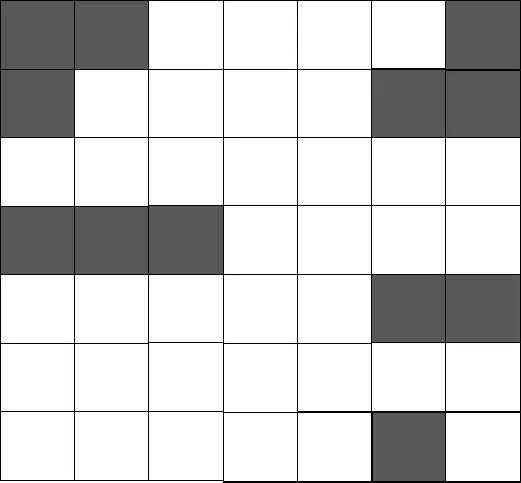

真阳性的数量将是 11 ie。有 11 个出现在预测和基本事实标签的相同位置。假阳性的数量将是 1(即在预测中出现一个不存在于基本事实标签中的 1)并且假阴性的数量是 2(即两个 1 存在于预测没有获得的基本事实标签中)。骰子系数为:

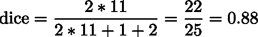

# 培训— U-Net

既然已经创建了 DataBunch 对象并选择了度量标准，我终于可以开始训练了。用于图像分割任务的常见架构是 U-Net 架构。U-Net 主要由两个主要部分组成，下采样路径(也称为编码器)和上采样路径(也称为解码器)。它具有自动编码器的许多功能，但在编码和解码部分之间明显增加了跳跃连接。稍后我将解释跳过连接，但首先，让我们讨论它作为自动编码器的属性。下面的图 9 是取自原始 U-Net 论文的 U-Net 架构的一个例子。你可以在这里罚款原纸[。](https://arxiv.org/abs/1505.04597)

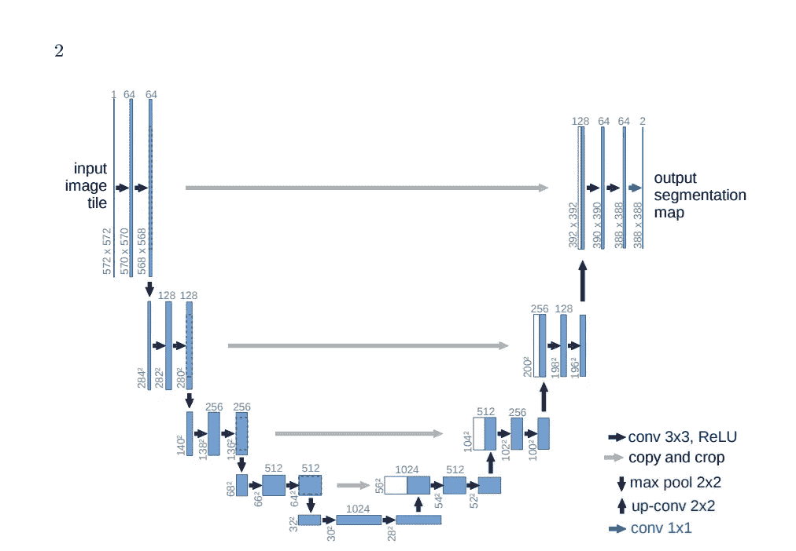

图 9 U-Net 架构。来源:https://arxiv.org/abs/1505.04597

网络的左半部分是标准的 CNN，具有卷积层，后面是 ReLU 和 max pool 层。这是一个经典的 CNN，通常用于图像分类问题，目标是输入图像像素值并输出单个分类。然而，在图像分割中，目标是对图像中的每个像素进行分类。因此，您的最终张量应该与原始图像的大小和形状相同(在我们的例子中，为 192x256)。这是通过在架构的上采样部分使用上卷积层来实现的。

您可以将向上卷积(也称为转置卷积)视为在像素值之间额外填充零的卷积。图 10 显示了一个例子。

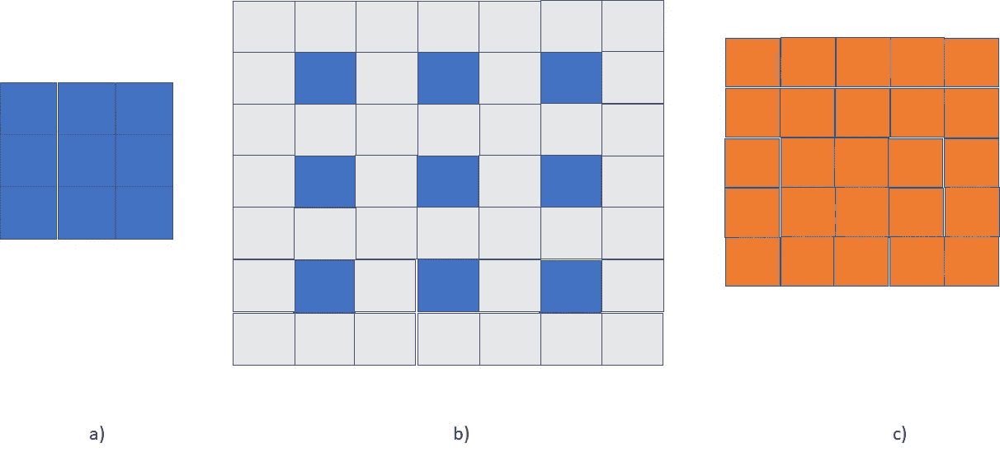

图 10 a)用于上采样的输入 b)在像素值之间用零填充的输入 c)与 3×3 内核卷积后的输出矩阵

请注意，填充后，执行卷积会产生比输入维数更大的输出。这使得我们最终的输出与输入的大小和形状相同。

现在让我们来谈谈跳过连接。回到图 9，注意连接从下采样路径到上采样路径的层的灰色箭头。这些被称为跳过连接，它们将下采样层的输出连接到相应的上采样层。这些跳跃连接的目的是允许将在下采样路径中学习到的特征和空间信息传输到上采样路径。这允许上采样路径在执行分段时记住“在哪里”以及“是什么”。

幸运的是，fastai 库提供了一个函数，可以在一行代码中创建整个架构。

```
learn = unet_learner(data, models.resnet18, metrics=dice)
```

在我的训练中，我使用 resnet18 CNN 作为下采样路径。`data`参数是我们之前创建的 DataBunch，而用于评估模型的指标是 Dice 指标(如果您不知道 Dice 指标是什么，我会在讨论如何确定模型的有效性时详细介绍)。

然后，通过整个 U-Net 后的最终输出是一个二进制遮罩，其像素值被分类为背景像素(0)或粒子像素(1)。

# 培训—超参数调整

当训练一个模型时，你总是要经历大量的超参数调整。最重要的超参数之一是学习率，这是获得正确结果的关键。幸运的是，fastai 提供了许多资源，使得优化学习率变得更加容易。

创建 U-Net 架构后，进行了模拟训练，使用从 1e-7 到 10 的各种学习率计算损失。这是使用 fastai 库中的 [LR 查找器](https://docs.fast.ai/callbacks.lr_finder.html)完成的。结果如图 11 所示。

```
lr_find(learn)
learn.recorder.plot()
```

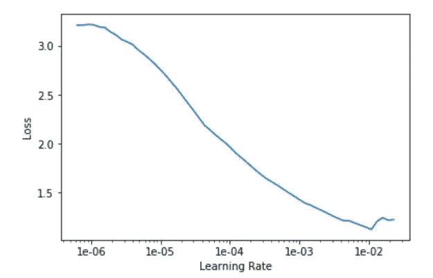

图 11 学习率探测器图

确定学习率时，通常希望在曲线达到最小值之前选择一个值。但是，请记住，这只是一个起点，您可能仍然需要根据训练过程调整学习速度。例如，如果您的损失在后续迭代后开始增加，您可能仍然需要选择较低的学习速率。用于训练模型的最终学习速率是 2e-5 和 5e-5 之间的[循环学习速率](https://arxiv.org/abs/1506.01186)。

另一个要考虑的超参数是冻结或解冻图层组的程度。当通过 fastai 创建 U-Net 时，权重参数已经在 [ImageNet](http://www.image-net.org/) 数据库中进行了训练。这背后的想法是，由于许多图像通常彼此相关，使用一个数据集确定的权重通常可以[转移](/a-comprehensive-hands-on-guide-to-transfer-learning-with-real-world-applications-in-deep-learning-212bf3b2f27a)到另一个数据集，并获得相当好的结果。这允许您使用较少数量的图像来训练相对较好的模型。在我的训练中，我冻结了三层组中的前两层。

```
learn.unfreeze()
learn.freeze_to(2)
```

最后，要确定的最后一个超参数是时期数和[重量衰减](/this-thing-called-weight-decay-a7cd4bcfccab)。在多次测试和实验之后，发现这些超参数的最佳值是 50 个时期和 0.1 的重量衰减。

```
learn.fit_one_cycle(50, slice(2e-5, 5e-5), wd=1e-1)
```

图 12 显示了培训期间培训和验证损失的图表。

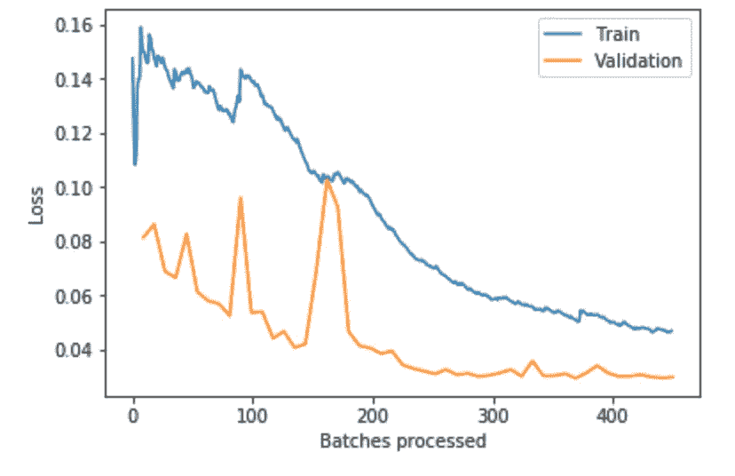

图 12 培训期间的培训和验证损失

# 估价

最后一步是评估模型的有效性。训练之后，创建了最终的第三个测试集，该测试集根本不参与训练。Dice 系数是使用该测试集上的预测和基本事实标签计算的，发现为 97.5%。

此外，最终预测与原始图像重叠，并通过肉眼检查，以确定模型在给定 EM 图像上的表现如何。下面的图 13 显示了这样一个例子:

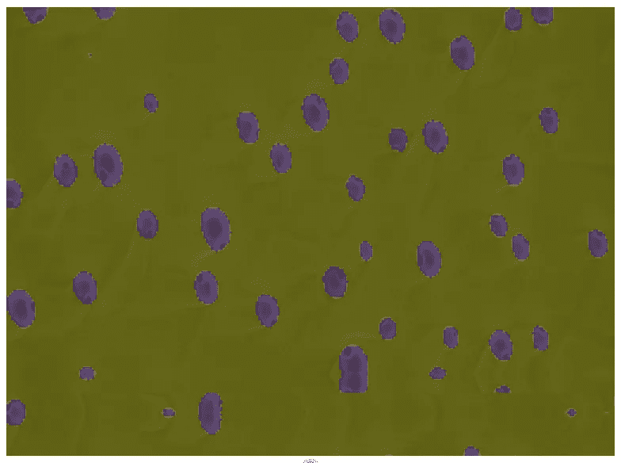

图 13 预测覆盖在原始图像上。截图来自 [SAEMI](http://saemi.herokuapp.com)

虽然该模型在预测粒子的位置方面做得很好，但当粒子在图像中非常接近时，它很难分离粒子。目前，该应用程序允许您执行一些后处理，以避免这一问题，但在未来，我想尝试通过在更平衡的数据集上训练实例分割模型来改进我的模型，同时增加训练图像的数量。

# 摘要

由从 NFFA-欧洲获得的 SEM 图像组成的训练集，并进行相应的处理以获得良好的数据。地面实况标签是使用 OpenCV 和 ImageJ 的组合制作的。通过利用 U-Net 和 Dice 度量，使用 fastai 库进行训练。由单独的测试组确定的最终骰子得分为 97.5%。

如果你想了解更多关于这个培训背后的动机，请点击这里查看我的系列[的第一部分](/saemi-size-analysis-of-electron-microscopy-images-1-4bb9cd47ad3c)。如果你想了解如何使用我创建的部署这个模型的应用程序，请查看我的系列文章第 2 部分[这里](/saemi-size-analysis-of-electron-microscopy-images-7ab55bd979ac)。非常感谢你阅读这篇文章，我希望你能从中获得许多有价值的信息！