# 电子显微镜图像的尺寸分析，

> 原文：<https://towardsdatascience.com/saemi-size-analysis-of-electron-microscopy-images-7ab55bd979ac?source=collection_archive---------62----------------------->

来源: [CNR-IOM](https://b2share.eudat.eu/records/80df8606fcdb4b2bae1656f0dc6db8ba) ( [抄送](https://creativecommons.org/licenses/by/4.0/))

## 第 2 部分，如何从 EM 图像获得尺寸分布

本文是我的系列文章的第 2 部分，详细介绍了 SAEMI 的使用和开发，这是我创建的一个 web 应用程序，用于执行电子显微镜图像的高通量定量分析。在这里查看第 1 部分(在这里我回顾了应用背后的动机)和第 3 部分[这里](/saemi-size-analysis-of-electron-microscopy-images-36c9f61d52ed)(在这里我回顾了我如何训练我的图像分割模型)。你也可以在这里查看 app [，在这里](https://saemi.herokuapp.com/)查看它的 Github [。在这篇文章中，我给出了一个如何使用该应用程序并获得最佳结果的演练。](https://github.com/lwang94/sem_size_analysis)

# 所以你有一个电子显微镜图像

从这篇文章开始，我假设你以前看过/拍过电子显微镜(EM)图像，或者至少熟悉电子显微镜。如果没有，请查看我的系列文章第 1 部分[中的](/saemi-size-analysis-of-electron-microscopy-images-1-4bb9cd47ad3c)，在那里我详细描述了开发这个应用程序背后的动机。不过，让我们假设你是一名研究人员，已经进行了一些电磁测量，现在想对你的图像进行一些定量分析。更具体地说，您想要确定图像中颗粒的平均尺寸以及该分布的标准偏差。例如，假设您有一个 EM 图像，如图 1 所示。

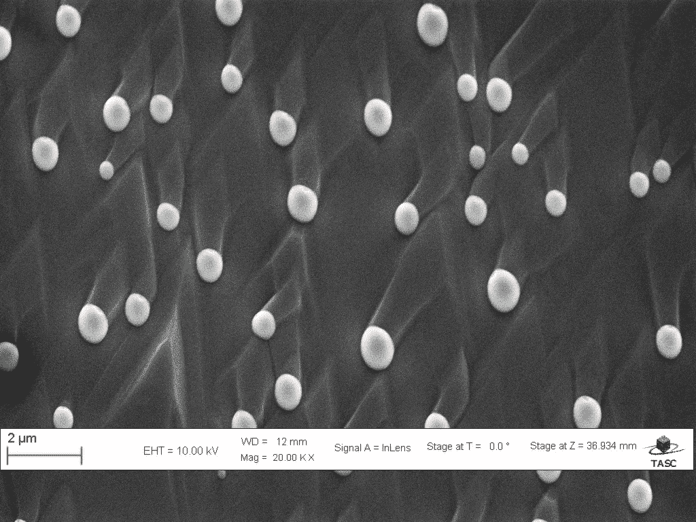

图 1 是一个电磁图像的例子。来源:[CNR-IOM](https://b2share.eudat.eu/records/80df8606fcdb4b2bae1656f0dc6db8ba)([CC-BY](https://creativecommons.org/licenses/by/4.0/))

这里首先要注意的是图像底部显示的横幅，其中包含测量信息，如比例尺、电子高压(EHT)和放大倍数。许多电子显微镜及其配套软件会将这类信息(至少会有一个比例尺)添加到图像中。不幸的是，由于这是图像本身的一部分，因此保留它可能会影响深度学习模型的最终分割。

为了减少出错的可能性，应该尽可能从图像中删除附加的“元信息”。但是，请注意在其他地方保留比例尺的记录，因为在最终步骤中，需要将最终计算结果从像素转换为物理尺寸。目前，“元信息”可以通过许多不同的方法去除。

最简单的方法，也是我个人推荐的方法，就是把它从图像中剔除。它引入更多伪像的可能性最小，并且需要图像处理中最少的技术能力来执行。唯一的缺点是裁剪图像可能会丢失重要的数据。

为了展示其他选项，您还可以使用一些更复杂的图像处理技术，使用 Python 中的 open-cv 或 scikit-image 库来移除横幅。这些方法包括使用反射填充、最近邻填充和常数填充。这三种方法的示例如图 2 所示。在所有三个示例中，横幅原来所在的区域都用红色突出显示。

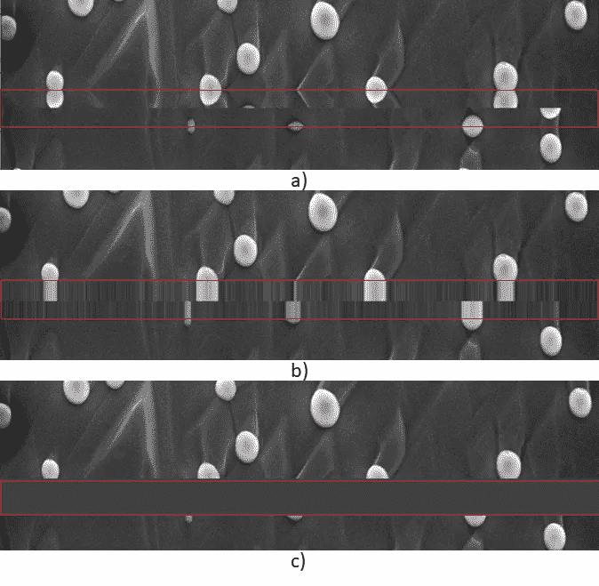

图 2 a)使用反射填充去除标语的示例 b)使用最近邻填充去除标语的示例 c)通过用常数填充替换标语来去除标语。来源: [CNR-IOM](https://b2share.eudat.eu/records/80df8606fcdb4b2bae1656f0dc6db8ba) ( [抄送](https://creativecommons.org/licenses/by/4.0/))

可以看出，这些方法中的每一种都可能导致图像出现非预期的伪像，这取决于您决定如何处理“元信息”。

# 使用应用程序

现在，假设您决定通过裁剪来移除横幅。然后你可以使用这个[链接](https://saemi.herokuapp.com/)进入应用程序，然后使用顶部的“上传图片”按钮上传图片。或者，你可以按照我的 github 页面上的说明[这里](https://github.com/lwang94/sem_size_analysis)在你的电脑上本地使用这个应用程序。无论哪种方式，一旦打开应用程序，你会看到如图 3 所示的主页。“上传图像”按钮以红色突出显示。如果您手头没有 EM 图像，您也可以使用旁边的“尝试演示”按钮。这将上传一个已经准备好的演示 EM 图像，作为应用程序如何工作的例子。

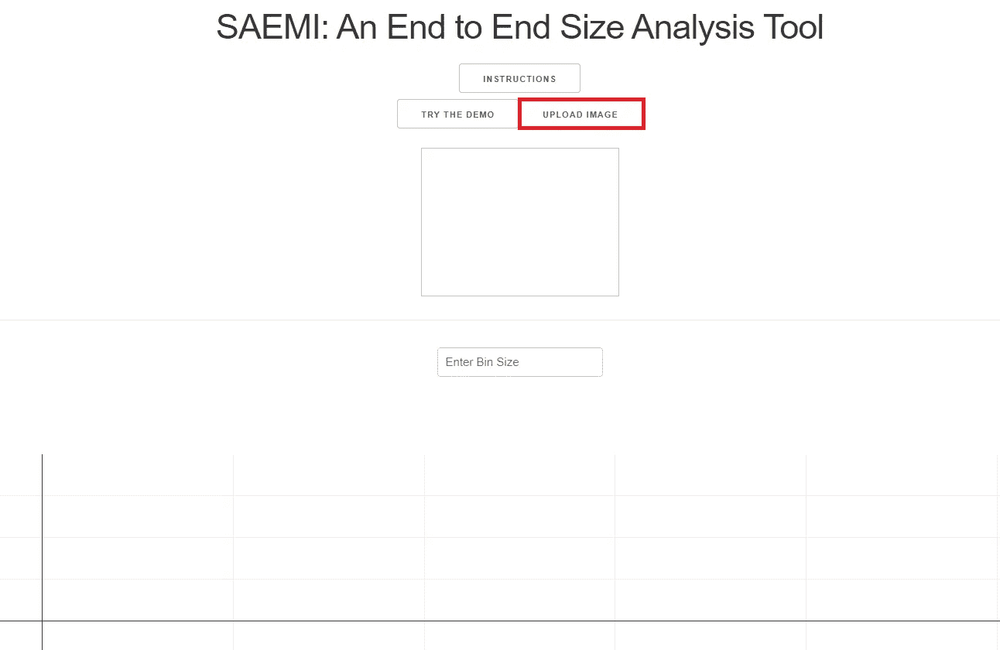

图 3 赛米主页。截图来自 [SAEMI](http://saemi.herokuapp.com/)

一旦图像上传到服务器，它将通过我的深度学习模型进行馈送，并使用[连通分量标记](https://en.wikipedia.org/wiki/Connected-component_labeling)来计算粒子的大小分布。整个过程大约需要 20-30 秒。我会继续尽我所能加快这个过程。然而，即使有这么长的运行时间，它仍然比手动标记 EM 图像快得多，因为这些图像中一次可以有数百个粒子。计算完大小分布后，您将看到一个类似于图 4 所示的网页。

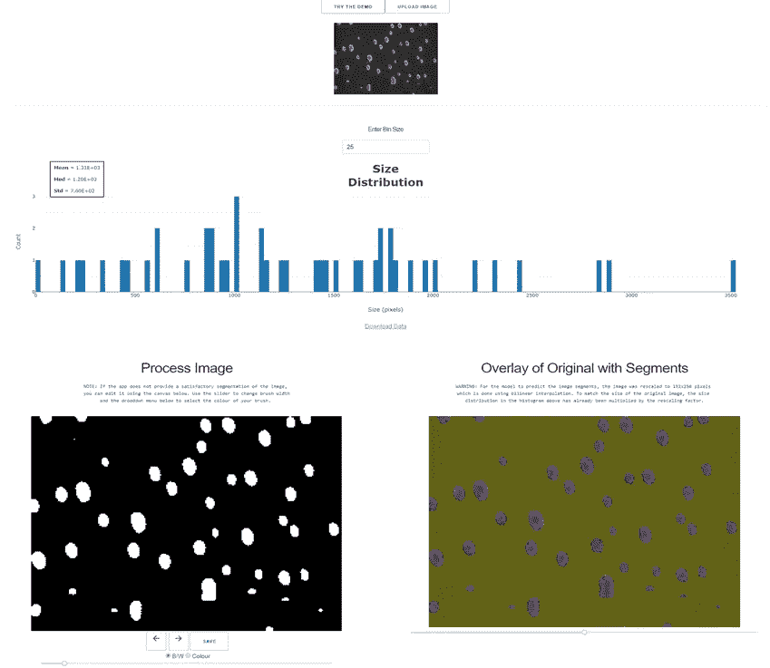

图 4 图片上传后的 SAEMI。截图来自[萨米](http://saemi.herokuapp.com/)

让我们更详细地看一下每一部分。

# 粒度分布

你会注意到的第一个也可能是最重要的部分是尺寸分布直方图。这在图 5 中更详细地示出。

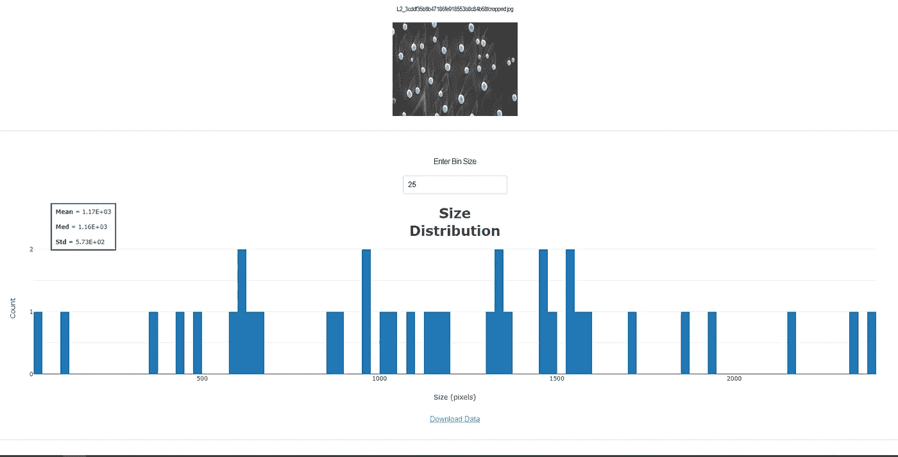

图 5 粒度分布直方图。截图来自[萨米](http://saemi.herokuapp.com/)

顶部是原始 EM 图像，图像文件的名称显示在它的上方。应用程序计算的大小分布显示在直方图下方，x 轴为大小(以像素为单位), y 轴为计数。因此，有 3 个粒子占据图像中大约 1300 个像素，1 个粒子占据大约 500 个像素。在应用程序中，你可以将鼠标悬停在数据点上来查看它们的确切值。

平均值、中值和标准偏差也已计算出来，并显示在直方图的左上角。在直方图的正上方，你还可以看到一个输入框，上面写着“输入箱子尺寸”。这可用于改变用于定义直方图的仓尺寸。默认的媒体夹大小是 25 像素。例如，图 6 显示了一个 75 像素的直方图。

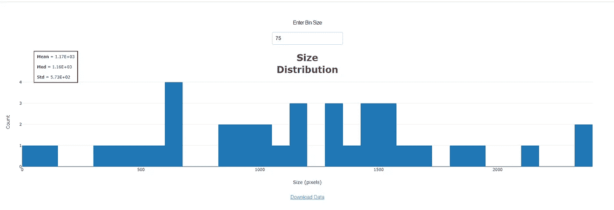

图 6 箱尺寸为 75 的尺寸分布。截图自[萨米](http://saemi.herokuapp.com/)

最后，点击底部的“下载数据”将下载尺寸分布作为一个单独的列。csv 文件。然后，您可以执行其他计算，例如确定其他统计模式，或者按照您希望的方式对尺寸分布数据进行建模。

不过，需要注意的重要一点是，所有这些尺寸都是以像素为单位计算的。一个粒子在 EM 图像中占据多少像素。为了获得物理相关的测量值，您必须自己将尺寸转换回物理单位。例如，在图 1 的原始图像中，比例尺显示 2 微米占据大约 110 个像素。因此，500 像素大小的颗粒实际上具有大约 0.9 平方微米的面积。

# 用片段覆盖原件

您应该查看的下一部分是图 7 中右下方的部分。

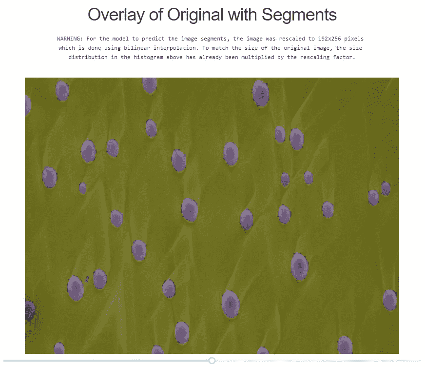

图 7 覆盖了分段预测的原始 EM 图像。截图自[萨米](http://saemi.herokuapp.com/)

这一部分是为了让你仔细检查预测，并确保应用程序能够正确地分割你的 EM 图像。正如你所看到的，这个应用程序在预测图像中每个粒子的位置方面做得非常好。为了更加清晰，您还可以使用图像底部的滑块来更改叠层的不透明度。如果您希望原始图像更清晰，可以将滑块滑动到较低的值。这如图 8 所示。

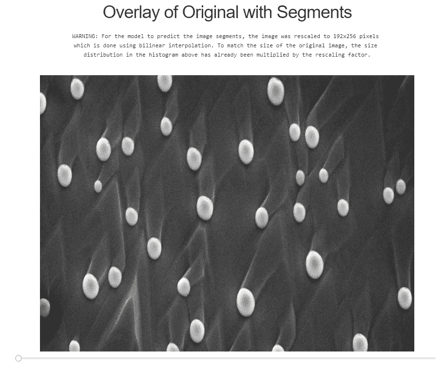

图 8 显示了原始图像。截图来自[萨米](http://saemi.herokuapp.com/)

或者，您可以将滑块滑动到更高的值，以便更清楚地显示预测。这如图 9 所示。

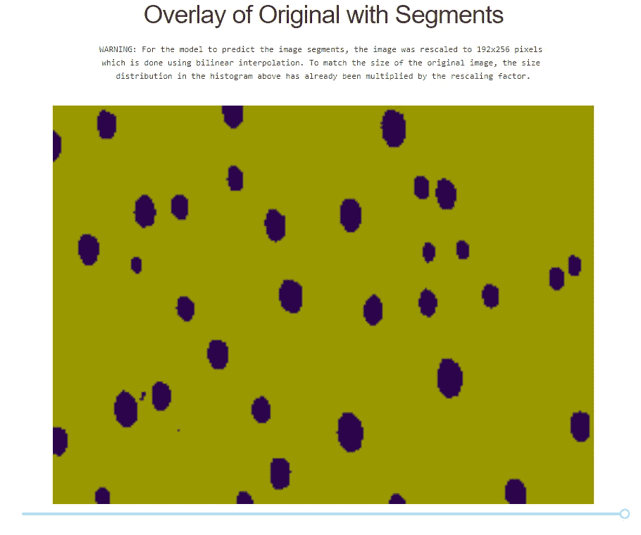

图 9 示出了预测的分割。截图来自[萨米](http://saemi.herokuapp.com/)

从覆盖图来看，似乎这个模型在分割原始 EM 图像的粒子方面做得相当不错。然而，请注意在分段预测的左下方，有两个非常小的预测粒子，它们在原始 EM 图像中不存在。这在图 10 中更详细地示出。

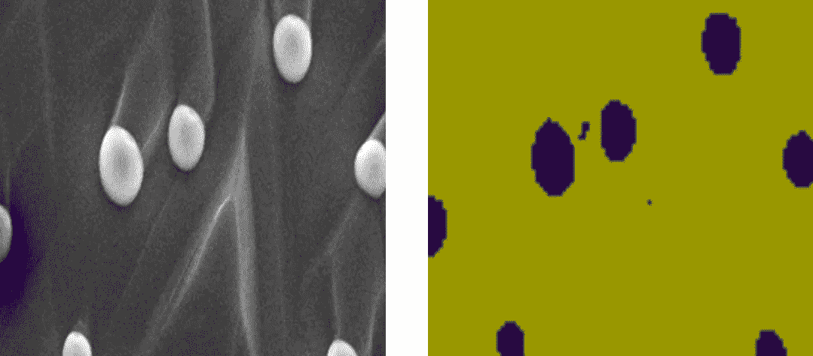

图 10 原始 EM 图像和预测不匹配的区域。截图自[萨米](http://saemi.herokuapp.com/)

不幸的是，由于它们的尺寸非常小，它们可能会使计算出的平均值偏向较低的值。在这种情况下，中值可能是 EM 图像中平均颗粒尺寸的更好量度。

# 处理结果图像

为了确保直方图显示尽可能准确，您可以使用“处理图像”部分编辑掉一些不准确的预测。这在图 11 中有更详细的显示。

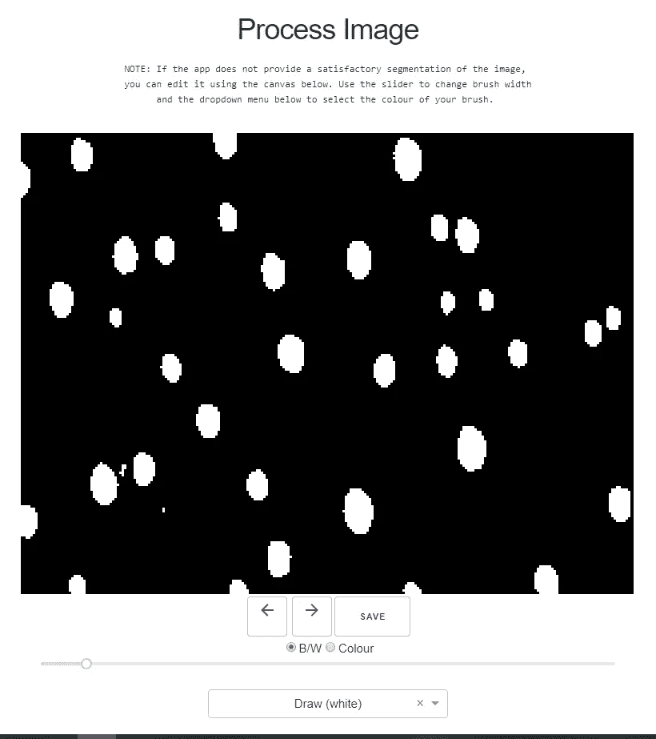

图 11 后处理图像画布。截图来自 [SAEMI](http://saemi.herokuapp.com/)

在图 11 中，您可以看到图像下方显示了几个不同的项目，这将帮助您编辑预测。前两个是撤销和重做按钮(分别用左右箭头表示)，应该非常简单。在它们旁边的右边是保存按钮，它将保存你对图像所做的更改，然后根据你的更改重新计算尺寸分布。

它们的正下方是“黑白”和“颜色”两个选项按钮。如果选择“黑白”，上面显示的图像将只是二进制掩码。如果你选择“颜色”，图像实际上会显示应用程序看到的单个粒子。换句话说，对于阵列中每个连接的组件，显示的图像将具有唯一的标签。两个选项的比较如图 12 所示。

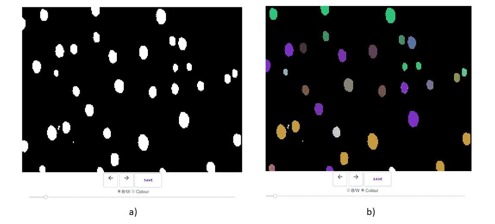

图 12 a)黑白选项 B)颜色选项。截图自[萨米](http://saemi.herokuapp.com/)

当你不确定应用程序将两个非常接近的粒子视为一个粒子还是两个粒子时，显示“颜色”选项会很有用。请记住，这两个选项都不会编辑图像本身。它只是为您提供对原始预测的不同看法。

在底部，有一个下拉菜单，允许您选择如何编辑图像。有三个选项可供选择:绘制、移除和擦除。选择这些选项将改变画笔的颜色分别为白色，红色和黑色。

使用“绘制”笔刷编辑图像会将您绘制的任何内容添加到预测中。例如，如果在左上角有一个应用程序不知何故漏掉的粒子，你可以用白色画笔在左下角的画布上绘制来填充它。图 14 显示了一个例子。

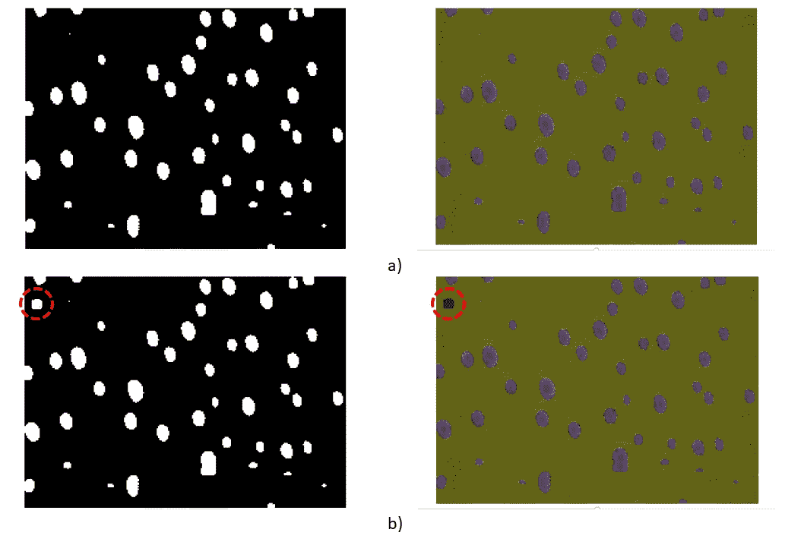

图 14 a)原始分割 b)使用 Draw 函数在左上角添加粒子。截图来自[萨米](http://saemi.herokuapp.com/)

然而，对于我们的图像，有些斑点被误认为是粒子，最好使用移除(红色)或擦除(黑色)选项。通过使用红色画笔，您可以移除任何被红色笔画标记的粒子。图 15 显示了一个例子。

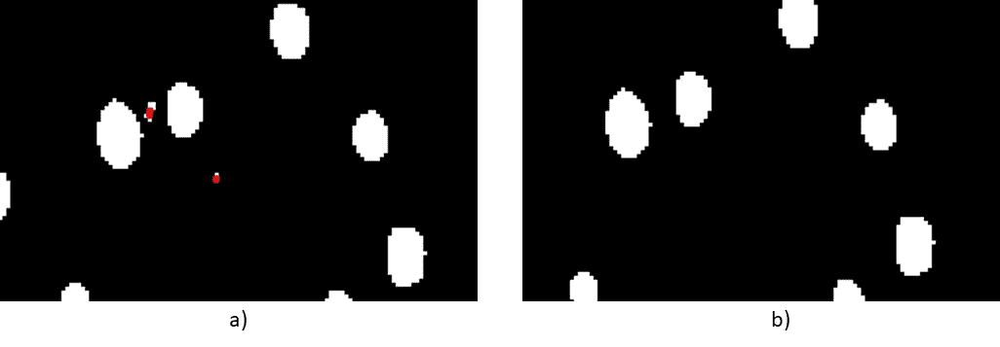

图 15 a)示出了在按下保存并应用移除选项之后，在原始分段 b)上的移除(红色)画笔。截图来自[萨米](http://saemi.herokuapp.com/)

使用黑色画笔将简单地从预测中擦除该区域。虽然乍一看，红色和白色的画笔是一样的，但它们确实有两种不同的功能。红色画笔移除整个粒子，而白色画笔仅移除已标记的部分。图 16 显示了两种画笔的不同用法。

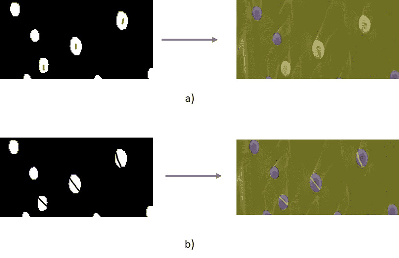

图 16 a)在粒子上使用红色笔刷的结果 b)在粒子上使用黑色笔刷的结果。截图自[萨米](http://saemi.herokuapp.com/)

最后，在两个显示选项下面有一个滑块，可以改变“笔刷”的宽度。图 13 显示了不同画笔宽度的示例。

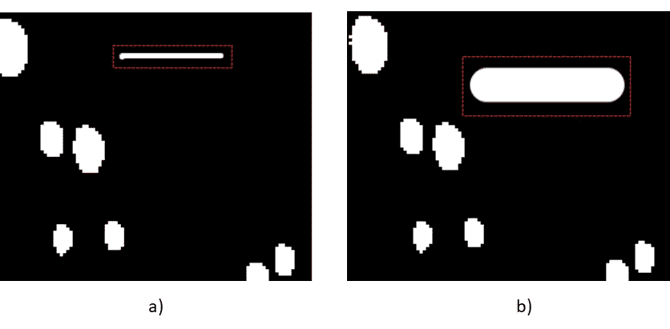

图 13 a)在宽度尺寸为 5 的画布上绘图 b)在宽度尺寸为 30 的画布上绘图。截图来自[萨米](http://saemi.herokuapp.com/)

# 恭喜你！你有一个尺寸分布

在执行了令您满意的后处理步骤后，您最终会得到一个准确反映原始图像的尺寸分布。最终的直方图如图 18 所示。

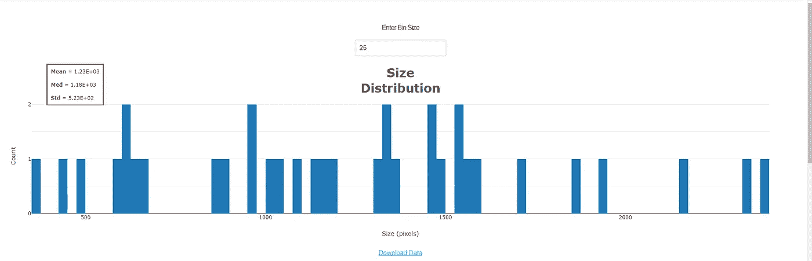

图 18 最终的直方图。截图来自[萨米](http://saemi.herokuapp.com/)

与我们在图 5 中获得的原始直方图相比，差异并不大，因为该模型已经在预测图像中的粒子方面做得非常好。此外，图像中有许多粒子，所以即使是它犯的小错误也被它识别的阳性粒子淹没了。

但是，如果仔细观察，您会发现平均值从 1.17E3 变为 1.23E3，分布的标准偏差从 5.73E2 变为 5.23E2。同样，您可以将此分布下载为. csv 文件，以便稍后执行其他计算。的。csv 文件包含由我的深度学习模型确定的所有单个粒子的计算尺寸(以像素为单位)。

下载后要执行的计算示例。csv 文件，您可以计算您的大小分布的模式和偏斜，如果您想要更多的统计信息。您也可以从同一样本的多个图像中汇总数据，以获得更大的样本量。此外，您可以绘制多个直方图，反映样品大小分布如何随时间、温度、pH 值等变化。

如果你想在你自己的 EM 图像上尝试 SAEMI，你可以现在就去[那里](http://saemi.herokuapp.com)并遵循本文中概述的步骤。祝你好运，请查看本系列的[最后部分](/saemi-size-analysis-of-electron-microscopy-images-36c9f61d52ed)，在那里我会更深入地了解我是如何训练深度学习模型的，以及它的架构实际上是什么。谢谢！