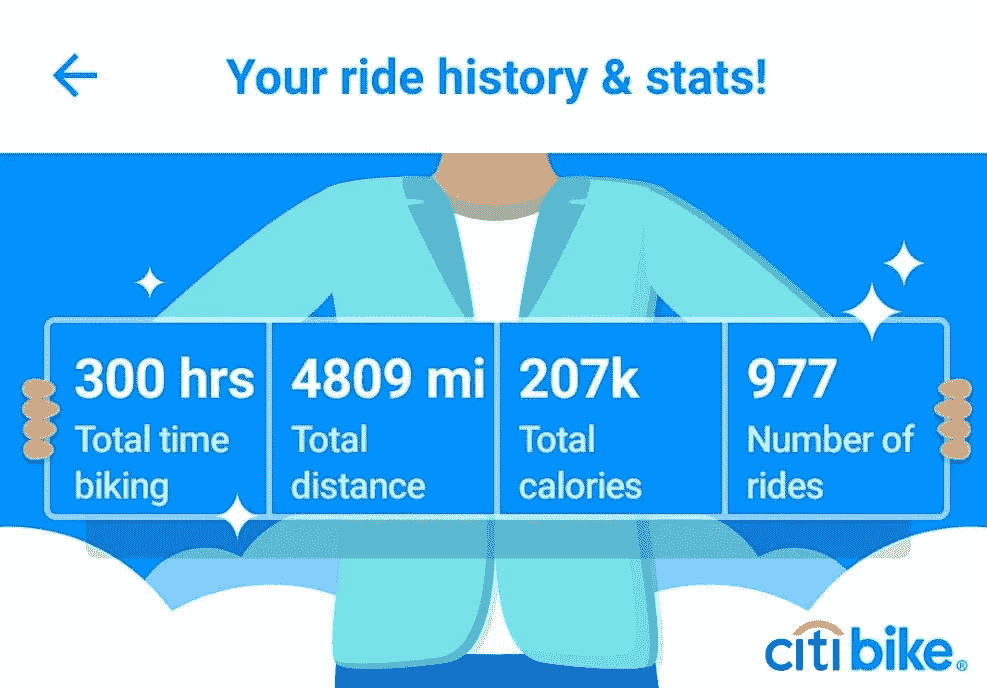
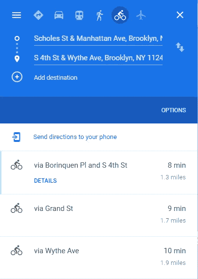
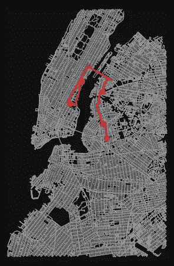
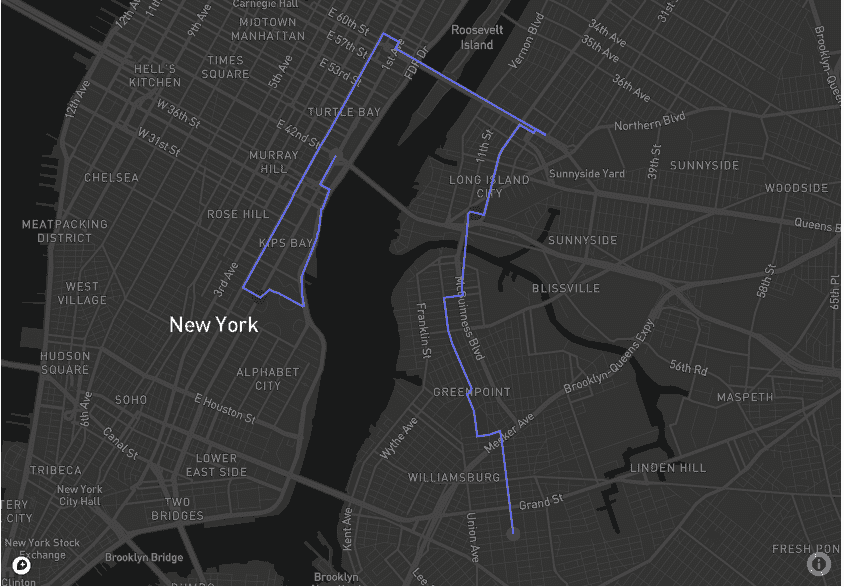

# 安全的城市自行车运动第 1 部分:使用历史骑行数据创建随机的城市自行车路线并制作动画

> 原文：<https://towardsdatascience.com/safe-city-biking-part-1-creating-randomized-citibike-routes-using-historical-ride-data-136224bbd955?source=collection_archive---------76----------------------->


马克斯·本德在 [Unsplash](https://unsplash.com/s/photos/biking?utm_source=unsplash&utm_medium=referral&utm_content=creditCopyText) 上的照片

## 端到端项目

## 在本文中，我将勾勒出我的项目路线图，从 Arduino 到数据科学/分析再到增强现实，并从第一步开始。

我一直是一个狂热的自行车爱好者:从每天骑自行车在数英里的山上往返于高中，到现在每天骑着 Citibike 在布鲁克林和时代广场之间跑 12 英里去上班。以下是我成为会员两年来的 Citibike 统计数据截图(在此之前，我会在城市里玩滑板):



这是横穿美国大约一倍半的距离

如果你熟悉在纽约骑自行车，你就会知道骑自行车并不总是安全或平稳的。这些年来我看到了进步，但也有相当多的事故，比如被打开的车门撞上，或者撞到一个很大的坑洞，我被从自行车上摔了下来。除了伤害/事故统计数据之外，很难找到这个城市实际骑自行车情况的数据，所以我决定收集自己的数据。

**以下是项目的主要步骤:**

1.  使用 2019 年夏季的 Citibike 历史骑行数据规划骑行路线。
2.  创建具有 GPS/LTE、陀螺仪和加速度计功能的 Arduino 传感器。
3.  路线上超过 100 次骑行，从安装在自行车头盔上的传感器收集数据。使用 HTTP post 请求发送数据，并将这些数据存储在数据库中。
4.  在 Python 中分析这些数据后，构建一个模型，该模型可以预测从 A 点到 B 点的最稳定乘坐，同时还可以提供路线间平均速度和稳定性的热图。
5.  使用 Mapbox 将所有这些整合到 Unity 中，并创建 AR 世界范围的应用程序和 VR 可探索的数据体验。

首先，我从 Citibike 的[月度骑行数据库](https://s3.amazonaws.com/tripdata/index.html)下载了 2019 年 6 月和 7 月。我想找出其他骑手最常走的路线，并围绕这些路线规划我的路线。为此，我创建了一个名为`pathfinder`的函数，它将创建一条从离我最近的自行车站开始的路线，并不断选择每英里最受欢迎的自行车站，直到它到达五英里。第一步是使用[哈弗森公式](https://kite.com/python/answers/how-to-find-the-distance-between-two-lat-long-coordinates-in-python)，过滤数据帧，只保留距离起点站 1 英里半径内的终点站。这个公式考虑了地球的曲率，这比只采用欧几里得距离更准确。

我使用斯科尔斯街&曼哈顿大道和 S 4 街&威斯大道，函数返回 1.14 英里，而谷歌地图给我 1.3 英里。我添加了一个 1.15 倍的乘数，以说明从鸟瞰图到实际路线长度的转换，从而得到 1.31 英里。



我们将使用 OSMNX 在未来的计算中使用最短的路线

然后，我使用 rand 从该点选择三个最受欢迎的终端站之一。一旦我离开我的第一个出发站 5 英里，我将结束探路者循环，使用`osmnx`包走所有的路线。

我们的 Pathfinder 函数通过 while 循环输出以下路径:

```
station number 0: Scholes St & Manhattan Ave
station number 1: Bayard St & Leonard St
station number 2: 49 Ave & 21 St
station number 3: 1 Ave & E 18 St
station number 4: 1 Ave & E 44 St
```

我们可以用它来绘图:

```
fig, ax = ox.plot_graph_routes(G, route, route_color='b', node_size=0)
```



经过一些 Geopandas 数据帧处理后，我用 plotly.express `scatter_mapbox`制作了路线动画。



我将在每次外出时为自己生成一条随机路径，尽管随着时间的推移，我将不得不考虑覆盖范围以及与先前路线的重叠。

如果我们有车站自行车数量/可用性数据，我们可以使用它来运行蒙特卡罗马尔可夫链(MCMC)模型(如果在每个时间点从车站租赁自行车，则根据会员/骑手总数有额外的车站激活概率),以计算每天结束时自行车在城市中的分布。我可能会在另一篇文章中做这个练习，因为在运行模型之前，它需要更多的数据收集和更多的预处理步骤。

下一次，我将介绍如何设置 Arduino 设备，并将其连接到数据库以使用 Python 进行查询。如果你对这个项目感兴趣，请随时联系我，就你希望我收集的任何数据或你可能有的想法提出建议。

你可以在[这个 GitHub 库](https://github.com/andrewhong5297/Safebikingproject)里找到所有的代码。