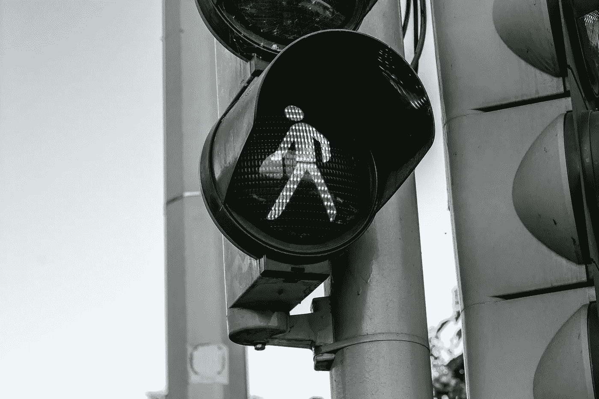
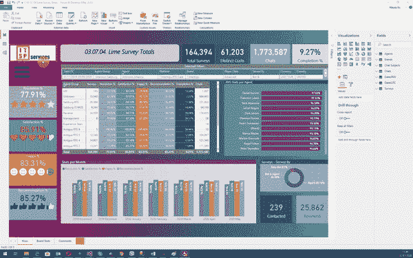
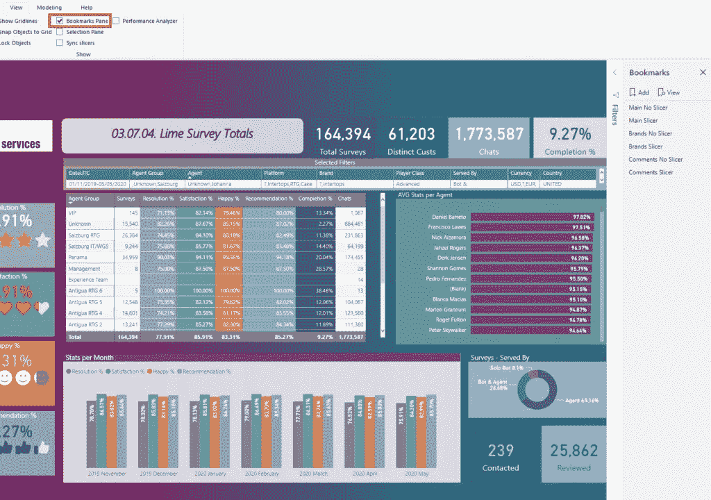
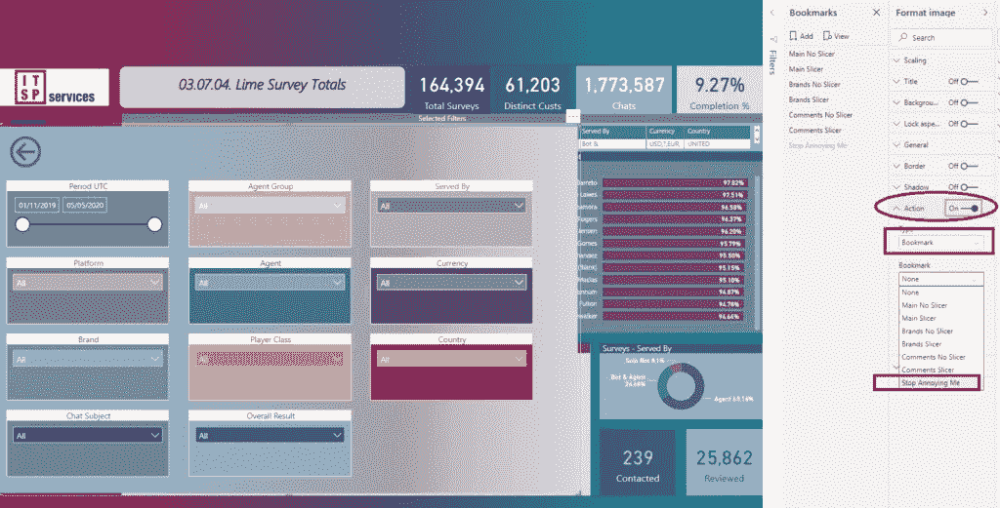
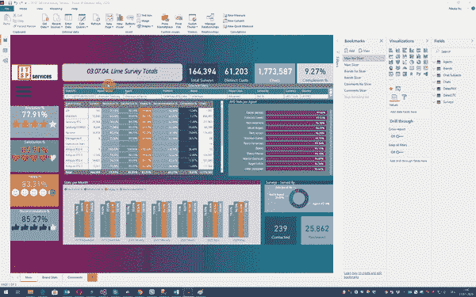

# Power BI 中的安全点击技巧

> 原文：<https://towardsdatascience.com/safe-click-trick-in-power-bi-d3e2296ade04?source=collection_archive---------45----------------------->

## 想要避免恼人的书签“点击”行为？检查这个简单的“安全点击”技巧！

JESHOOTS.com 在 Pexels 上拍摄的照片

书签是 Power BI 中最常用的功能之一。就我个人而言，这是我的最爱之一，因为它们让您有可能创建“类似应用程序”的功率 BI 报告，并使它们看起来更具交互性。

我已经写过关于使用书签将静态视觉效果转换成动态视觉效果的文章。你也可以使用书签[构建一个你的用户会喜欢的专业切片器面板](/build-pro-slicer-pane-in-power-bi-911248b39348)。老实说，确实有许多可以应用书签的用例。

基本上，书签所做的是，它捕捉报告页面上视觉效果的当前状态，因此您可以通过按钮、图像、形状等在您的操作中使用它作为参考。

## 讨厌的书签

然而，书签有一个非常令人讨厌的行为，当您处理形状时会出现这种行为。让我们转到 Power BI 中的一个示例，我将解释问题是什么以及如何轻松解决它。

我有一个大的切片器面板，作为多个切片器的占位符。然而，如果我点击矩形区域的某个地方，在切片器本身之外，这个窗格将覆盖所有切片器！对于我的用户来说，这不是一个好的体验，因为他们中的大多数人不知道他们可以点击形状以外的任何地方，一切都会恢复正常。而我想改变这种行为…

## 安全点击技巧！

我们需要做的第一件事是打开 Power BI desktop 中视图选项卡下的书签窗格:

展开切片器窗格后，我将创建一个新的书签，取消选中所有内容，因此它变成灰色:

现在，让我们为我们的形状定义一个动作，以便它指向我们新创建的书签:

由于我们已经禁用了一切，这个形状变得不可点击，这意味着它不会出现在我们的切片器，如果用户点击它！

让我们看看这是否可行:

厉害！正如你所注意到的，当我点击形状内的区域时，在切片器之外，什么也没有发生——正如我们所预期的！

## 结论

小细节可以对用户体验产生很大影响。在设计 Power BI 报告时请记住这一点，您的用户会喜欢您的:)

订阅[这里](http://eepurl.com/gOH8iP)获取更多有见地的数据文章！