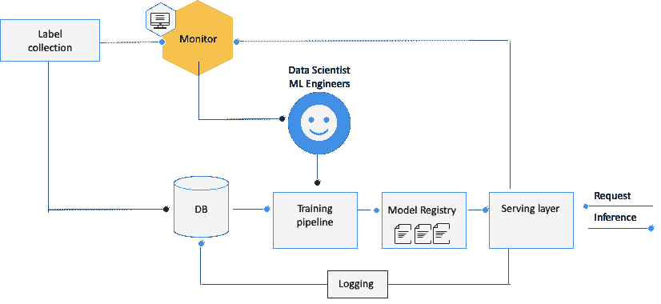
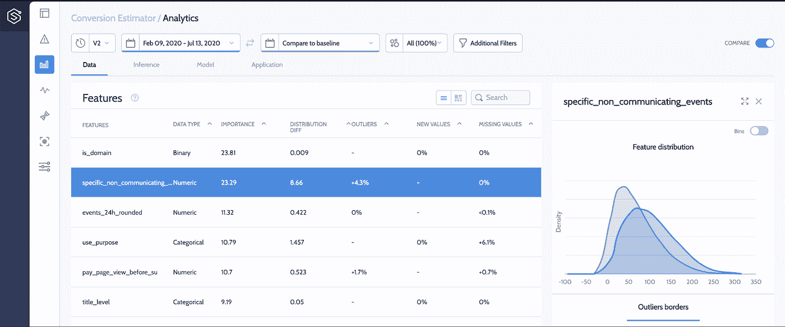
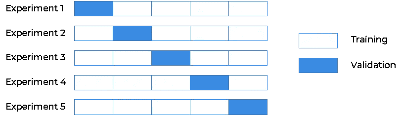
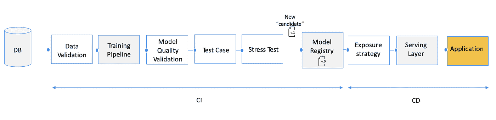
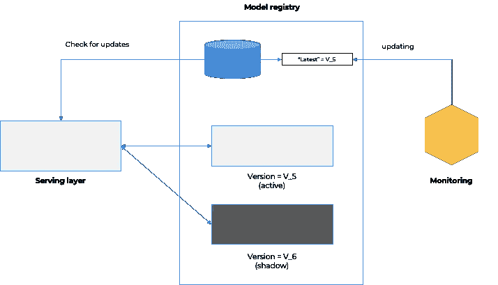
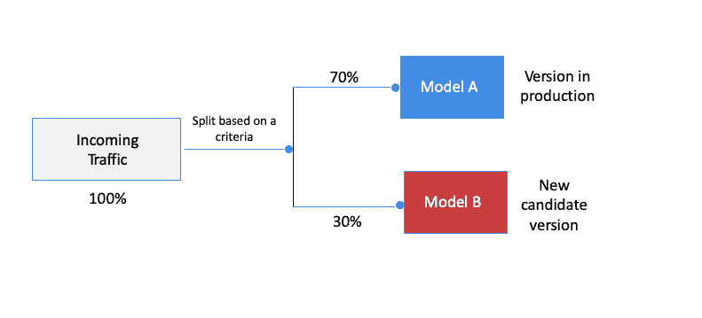
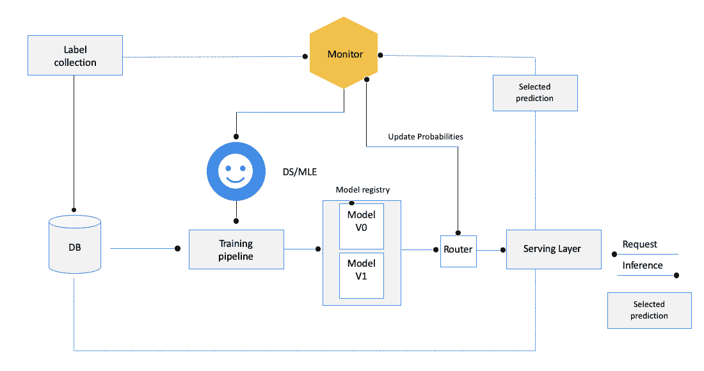
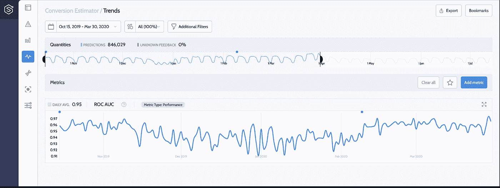

# 将 ML 模型安全地推广到生产中

> 原文：<https://towardsdatascience.com/safely-rolling-out-ml-models-to-production-13e0b8211a2f?source=collection_archive---------16----------------------->

## [理解大数据](https://towardsdatascience.com/tagged/making-sense-of-big-data)

## 轻松部署机器学习模型和版本的最佳 CI/CD 实践

指挥不同的(非 ML)乐器。资料来源:联合国人类住区规划署

对于任何数据科学家来说，将模型的新版本投入生产的那一天都是百感交集的一天。一方面，你们正在发布一个新的版本，这个版本旨在产生更好的结果和更大的影响；另一方面，这是一个相当可怕和紧张的时刻。你新的闪亮版本可能包含一些缺陷，只有在它们产生负面影响后，你才能发现这些缺陷。

> *ML 就像指挥不同的乐器一样复杂*

将一个新版本替换或发布到生产环境会触及到业务流程的核心决策逻辑。随着人工智能采用率的上升，自动发布和更新模型的必要性正在成为一项常见和频繁的任务，这使得它成为数据科学团队的首要关注问题。

**在这篇文章中，我将回顾是什么使新版本的推出如此敏感，需要什么预防措施，以及如何利用监控来优化您的持续集成(CI)管道，以及您的持续部署(CD)管道，以安全地实现您的目标。**

ML 系统由软件的多个移动且独立的部分组成，这些部分需要相互协调工作:

“ML 管弦乐队”。作者图片

**培训管道**:包括利用您的历史数据集生成工作模型的所有处理步骤:数据预处理，如嵌入、缩放、特征工程、特征选择或降维、超参数调整，以及使用交叉验证或保留集的性能评估。

*   **模型注册中心**:一个部署的模型可以采取多种形式:特定的对象序列化，比如 pickle，或者跨技术序列化格式，比如 PMML。通常，这些文件保存在基于注册表的共享文件存储中(S3、GCS 等)，保存在标准版本存储库(git)或专用服务中，如 [MLFlow 模型注册表](https://mlflow.org/docs/latest/model-registry.html)。
*   **服务层**:这是实际的预测服务。这些层可以与依赖于模型预测的应用程序的业务逻辑嵌入在一起，也可以分离出来充当与其支持的业务流程分离的预测服务。在这两种情况下，核心功能都是使用模型注册中心的模型，根据新的输入请求检索相关的预测。这种服务可以以批处理或流的方式工作。
*   **标签收集**:为监督学习案例收集基础事实的过程。可以手动、自动或使用主动学习等混合方法来完成。
*   **监控**:一个集中的服务，监控整个过程和你的活体模型的健康状况，从进入服务的输入的质量，到检测漂移、偏差或完整性问题的收集标签。

鉴于这种相对高级和复杂的编排，许多事情可能会失去同步，并导致我们部署一个性能不佳的模型。一些最常见的罪魁祸首是:

## 1.缺乏自动化

大多数组织仍然手动更新他们的模型。无论是培训管道还是它的一部分，例如特征选择，或者服务层对新创建的模型的交付和推广；手动这样做可能会导致错误和不必要的开销。

## 2.多个利益相关方

由于涉及到多个利益相关者和专家，会有更多的移交，因此会有更多的误解和整合问题的空间。当数据科学家设计流程时，ML 工程师通常进行编码-并且没有完全一致(例如，使用不同的缩放方法)，这可能导致无意的行为。

## 3.真实生活数据的超动态性

实证研究是在离线实验室环境中进行的，使用历史数据集，并通过模拟举行测试。不用说，这些环境与生产环境非常不同，对于生产环境，实际上只有部分数据可用。这可能会导致数据泄漏或错误的假设，从而在模型投入生产并需要为实时数据流提供服务时，导致糟糕的性能、偏差或有问题的代码行为。例如，新部署的版本无法处理分类特征中的新值，同时在推理阶段将其预处理为嵌入向量。

## 4.ML 模型的无声故障与传统 IT 监控

监控 ML 比监控传统软件更复杂——整个系统在工作的事实并不意味着它实际上做了它应该做的事情。如果没有适当的专用 ml 监控服务，此类故障可能会“悄无声息地”消失，直到业务损失已经造成。你可以阅读更多关于[如何监控 ml 模型](/monitor-stop-being-a-blind-data-scientist-ac915286075f)和[是否应该自己建造](https://www.superwise.ai/resources/thinking-about-building-your-own-ml-monitoring-solution-answer-these-questions-first)。

# 生产中 ML 的 CIֿֿֿ/CD

CI 实践是关于频繁地测试每个软件单元的代码基础，以及通过使用单元/集成/系统测试一起工作的不同软件工件的完整性。

> *新的模型版本应被视为软件工件*

新模型的创建需要一组单元和集成测试，以确保新的“候选”模型在提交到模型注册中心之前是有效的。**但是在 ML 领域，CI 不仅仅是关于测试和验证代码和组件，还包括测试和验证数据、数据模式和模型质量**。虽然 CI 的焦点是维护有效的代码库和模块的工件，但是在为每个模块构建新的工件之前，CD 过程处理将工件(在我们的例子中，是新的模型版本)实际部署到生产中的阶段。

# CI 阶段的最佳实践

以下是 CI 阶段的一些主要最佳实践，它们会影响模型/新版本实现的安全展示:

## 数据有效性

使用历史数据重新训练/生成模型。为了使模型与生产相关，训练数据集应该充分表示当前出现在生产中的数据分布。这将避免选择偏差或干脆不相关。为此，在开始训练管道之前，应该测试训练集的分布，以确保它适合任务。在这一阶段，可以利用监控解决方案提供关于最后生产案例分布的详细报告，通过使用数据测试工具，如 [deequ](https://github.com/awslabs/deequ) 或 [TDDA](https://github.com/tdda/tdda) ，这种类型的数据验证约束可以自动添加到 CI 流程中。

使用监控服务从生产中提取数据分布，并将它们与您的训练数据集进行比较(图片来自 superwise.ai 系统)

## 模型质量验证

在执行培训管道时，在将新模型作为“候选”模型提交到注册表之前，请确保新的培训流程经过了健康适合度验证。

> *即使培训管道是完全自动化的，它也应该包括一个保留/交叉验证模型评估步骤。*

给定所选的验证方法，应该应用测试来验证拟合的模型收敛不指示过度拟合，即:在训练数据集上看到减少的损失，而在验证集上看到增加的损失。性能还应该高于某个最低速率——基于硬编码的阈值、作为基线的原始模型，或者通过利用监控服务并在使用的验证集期间提取生产模型的速率来动态计算。

交叉验证评估设置示例。作者图片

## 测试案例—生产数据假设的稳健性

一旦模型质量验证阶段完成，就应该执行集成测试，以查看服务层如何与新版本集成，以及它是否成功地为特定边缘情况的预测服务。例如:处理可能为空的要素中的空值，处理分类要素中的新分类级别，处理不同长度的文本输入，甚至处理不同的图像大小/分辨率……这里的示例也可以手动合成或取自监控解决方案，其功能包括识别和保存存在数据完整性问题的有效输入。

## 模型压力测试

更改模型或更改其预处理步骤或包也会影响模型的操作性能。在许多用例中，比如实时竞价，增加模型服务的延迟可能会极大地影响业务。因此，作为模型 CI 流程的最后一步，应该执行压力测试来测量操作方面，如平均响应时间。这种度量可以相对于业务约束或者相对于由监控解决方案计算的当前生产操作模型等待时间来评估。

# CD 阶段的最佳实践

CD 阶段是实际部署代码以替换先前版本的过程。在传统的软件工程中，这通常是通过“[蓝绿色](https://martinfowler.com/bliki/BlueGreenDeployment.html)或“[金丝雀](https://martinfowler.com/bliki/CanaryRelease.html)”部署来实现的——一种逐步推出版本的方法。首先，变更被部署到案例的一个小的子集，通常逐渐扩展到服务器的一个子集。一旦确定功能运行良好，就可以将更改推广到其余的服务器。

**将 CD 过程应用于 ML 模型，基本上应该是一个渐进的过程，在让它发挥作用并做出真正的自动化决策之前，使用生产系统验证实时数据的模型正确性和质量。**这种评估通常被称为“在线评估”，与 CI 阶段完成的测试相反，CI 阶段完成的测试基于历史数据集，可被视为“离线评估”。

完整的 CI/CD 模型生命周期。作者图片

这种模型在线评估可能涉及一些基本策略:

## 影子评估

影子评估(或通常称为“黑暗发射”)是一种非常直观和安全的策略。在影子模式中，新模型作为“候选模型”添加到注册表中。任何新的预测请求都由模型版本(当前在生产中使用的版本)和影子模式中的新候选版本来推断。

> *在影子模式下，使用新的生产数据流测试新版本，但只有最新“生产模型”版本的预测被使用并返回给用户/企业。*

有了影子模式，在新版本确实被批准并按预期工作之前，没有暴露的风险。影子模式的好处有两个:

1.  新版本的性能在它“运行”之前被评估，
2.  您确保新版本在生产管道中运行良好

使用这种方法，监控服务应该在两组预测中持续存在，并持续监控两个模型，直到新模型足够稳定，可以提升为新的“生产版本”。一旦新版本准备好了，监控服务就向服务层发信号通知它需要升级模型版本。从技术上讲，这种“提升”可以通过为新版本更新“最新”标签并使服务层始终与“最新”模型版本标签一起工作来完成(类似于 docker 图像中的“最新”概念)。或者通过使用显式模型版本标签，但是这将要求服务层总是首先检查什么是最新的生产就绪版本标签，然后才重新加载相关版本并使用它来执行预测。

监控服务负责决定何时提升影子模型。作者图片

> 我们应该使用统计假设将新的“影子”版本与当前最新的生产模型进行比较

这种测试应该验证新版本的性能具有所需的效果大小，也称为:在特定的统计功效下，两个版本性能指标之间的差异，也称为:当存在一个效果时，正确识别该效果的概率。例如:如果最新版本在过去一周的精度水平为 91%，则新的候选版本必须具有 0 或更大的效果大小，因此新的精度率将至少为 91%。

> *整体绩效水平不是唯一的衡量标准*

不过，在提升模型之前，监控其他因素可能也很重要:性能稳定性，即确定我们上一个示例中每日精度性能的变化，或者检查特定子群体的性能约束。例如，对于我们的“VIP 客户”,该模型必须至少具有 95%的精确度。当标签收集需要时间或可能完全丢失时，可以使用其他 KPI 来测试新模型，作为其质量的代理，即:在贷款审批用例中，此类反馈循环可能需要 3-6 个月以上的时间。在这些情况下，可以使用两个版本的预测之间的相关水平，因为新版本相对于其前一版本应该具有相对较高的相关水平。另一种选择是测试生产数据相对于其训练数据集的分布偏移水平，以确保新版本是在相对于当前生产分布的相关数据集上训练的。

除了所有的好处之外，影子评估也有局限性，只是部分实用。这就是我们将在下面分析的内容，以及审查替代解决方案。

## A/B 评估

在许多 ML 场景中，模型的预测实际上会影响它运行的周围环境。让我们以一个推荐模型为例，该模型负责排列要提供的前 5 个电影建议。在大多数情况下，标签取决于用户是否确实观看了建议的电影之一。在这里，模型的预测影响了用户的行为，从而影响了收集的数据。如果候选阴影模型输出 5 部非常不同的电影，用户没有选择它们的事实并不一定意味着它们是糟糕的推荐——只有模型处于阴影模式并且没有采取任何现实生活中的行动的事实使得用户不可能实际看到这些电影。在这种情况下，性能成功是无法比较的。这时需要进行在线 A/B 测试评估。

在 A /B 设置中，当前最新版本和新的候选版本(可称为模型 A/“控制”组和模型 B /“处理”组)实际上都在生产中活动。根据特定的逻辑，每个新请求被路由到其中一个模型，并且只有所选的模型用于预测。

A/B 路由示例。作者图片

这些评估可以进行一段时间，预测，或者直到统计假设——新版本是否至少和以前的版本一样好——被验证。与影子策略类似，要测试的 KPI 可以是性能、稳定性或一些其他代理，……但需要注意的是，监控服务应该负责管理和评估 A/B 测试。

> 这种方法的成功很大程度上取决于正确仔细地划分 A/B 测试组的能力。

一个好的做法是对一个特定的部分做一个随机的抽样来得到“治疗”，意思是从新的版本中预测。例如，对于电影推荐用例，任何新的请求应该有 X(例如 10%)的机会被新的模型版本服务，直到测试完成。通常，暴露系数相对较低，因为这种策略实际上甚至在定性测试完成之前就“暴露”了新模型。

这种 A/B 配置也可以推广到 A/B/C/…设置中，即同时比较多个模型。请记住，由于测试次数较多，同时测试几个模型会增加假阳性结果的几率。此外，考虑到我们在每组中测试的样本数量较少，因此“小效应大小”的统计功效会降低，因此应谨慎考虑。

# 多臂土匪

多臂土匪(MAB)实际上是一种更“动态”的 A/B 测试实验，但也是一种更复杂的测量和操作。这是一种经典的强化学习，人们试图“探索”(尝试新的模型版本)，同时“利用”和优化已定义的绩效 KPI。这种配置是基于监控服务内部的探索/开发权衡的实现。根据收集的性能 KPI(或前面描述的其他代理),流量在两个(或更多)版本之间动态分配。

在这种情况下，新版本会遇到一定数量的案例。它越是等于或超过之前的版本，基于它的性能 KPI，越来越多的流量会被导向它。

基于监控结果的动态多臂 bandit 路由。作者图片

这样的配置看起来很理想，因为我们试图在优化主要指标的同时动态地优化“曝光度”。但是，它需要高级监控和自动化功能来实施多臂 bandit 解决方案，并根据其结果动态调整流量。特别是考虑到与系统要利用的一个明确的 KPI(性能、稳定性，...

# 监控安全部署的好处

通过查看传统软件中使用的示例，并将其实施到我们自己的 ML 范例，CI/CD 最佳实践中，我们了解到要有一个更好的“推出日”需要采取许多步骤。所有这些策略都依赖于强大的监控组件来使流程更加数据驱动。

> *安全地推出模型是为了监控 ML 基础设施的所有部分的协调*

下面我们可以看到新版本的安全交付(V2，标记为蓝点)，在生产中产生改进的 ROC AUC 性能。

superwise.ai 监控的模型截图

展望未来，您的模型在生产中的健康还需要一个全面的、数据驱动的再培训策略。虽然 CI/CD 范例解决了新模型推出的“什么”和“如何”问题，但 CT(持续培训)范例涵盖了“何时”问题。这将是我的同事[或 Itzahary](https://medium.com/u/4b1a8c1d089a?source=post_page-----fd90478f97fc--------------------------------) 下一篇帖子中的重点，敬请关注！

> *从 CI/CD 到 CT(持续培训)。CT 是一个新的属性，是 ML 系统独有的，它涉及自动重新训练和服务模型*

我希望这篇文章对你有所帮助。如果你对本文的内容有任何问题、反馈或者想集思广益，请在这里发表评论或者通过 [LinkedIn](https://www.linkedin.com/in/oren-razon/?originalSubdomain=il) 联系我

我要感谢我的同事们[珀尔·利伯曼](https://medium.com/u/86c5e042163c?source=post_page-----fd90478f97fc--------------------------------)、[或伊扎哈里](https://medium.com/u/4b1a8c1d089a?source=post_page-----fd90478f97fc--------------------------------)和[奥里·科恩](https://medium.com/u/4dde5994e6c1?source=post_page-----fd90478f97fc--------------------------------)他们有见地的评论和想法

[*柳文欢·拉松*](https://www.linkedin.com/in/oren-razon/) *是*[*super wise . AI*](https://www.superwise.ai/)*公司的联合创始人兼首席技术官，该公司让数据科学&运营团队能够利用先进的人工智能监控平台了解和控制他们的人工智能活动。柳文欢是一位经验丰富的 ML 从业者，在过去的 15 年里，他为初创公司和企业的大型 ML 活动提供领导和咨询。*

我总是在找借口阅读、写作、谈论和分享关于 MLOps 主题的想法。