# 销售预测:从传统时间序列到现代深度学习

> 原文：<https://towardsdatascience.com/sales-forecasting-from-time-series-to-deep-learning-5d115514bfac?source=collection_archive---------1----------------------->


图片由我可爱的女朋友 Beatriz Belbut 提供

## 从传统时间序列模型到现代深度学习，直观地进行销售预测。

## 介绍

在任何一家公司，都有一种预测未来收入和未来销售的内在愿望。基本配方是:

***收集与以前销售相关的历史数据，并使用它来预测预期销售。***


照片由[马库斯·斯皮斯克](https://unsplash.com/@markusspiske?utm_source=medium&utm_medium=referral)在 [Unsplash](https://unsplash.com?utm_source=medium&utm_medium=referral) 拍摄

在过去的十年里，深度学习作为所有可想象的机器学习基准背后的驱动力的兴起彻底改变了这个领域:无论是在计算机视觉、语言还是其他许多领域。最近，有人可能会说，深度学习通过允许模型在单个模型中编码多个时间序列以及解释分类变量，重构了销售预测的潜在未来。我今天的目标是:

**从时间序列的角度带您了解销售预测的主要概念和模型背后的基本直觉，并讨论最近的深度学习模型可以带来什么样的功能。**

## 阅读建议

如果你觉得你需要温习销售预测和时间序列的基础知识，我推荐这三本书:

*   [哈佛商业文章](https://hbr.org/1971/07/how-to-choose-the-right-forecasting-technique)销售预测的基本原理。
*   [TDS 文章作者](/the-complete-guide-to-time-series-analysis-and-forecasting-70d476bfe775) @Marco Peixeiro 来自 on @ Towards Data Science(真的很全面很有启发性)。
*   [“亚马逊预测的时间序列预测原理”](https://d1.awsstatic.com/whitepapers/time-series-forecasting-principles-amazon-forecast.pdf)。他们详尽地解释了销售预测是如何工作的，以及在这个领域可能遇到的挑战和问题。

## 销售预测问题

销售预测就是利用历史数据为决策提供信息。

一个简单的预测周期如下所示:

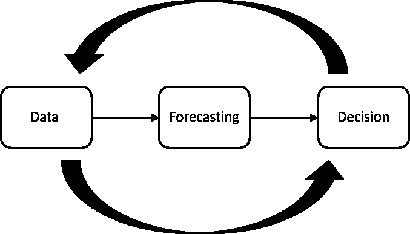

作者图片

就其核心而言，这是一个[时间序列](https://en.wikipedia.org/wiki/Time_series#:~:text=A time series is a,sequence of discrete-time data.)问题:给定一些时间上的数据，我们希望预测这些数据在未来的动态。为了做到这一点，我们需要一些可训练的动态模型。

根据亚马逊的时间序列预测原则，预测是一个难题，原因有二:

*   合并大量历史数据，这可能会导致丢失有关目标数据动态过去的重要信息。
*   整合相关但独立的数据(假期/事件、位置、营销推广)

除此之外，销售预测的一个重要方面是准确性非常关键:

*   如果预测过高，可能会导致过度投资，从而亏损。
*   如果预测过低，可能会导致投资不足，从而失去机会。

纳入天气、时间和空间位置等外部因素可能有利于预测。在[柳德米拉·塔拉年科](https://medium.com/u/b55a9c86f797?source=post_page-----5d115514bfac--------------------------------)的这篇[中型文章](https://medium.com/swlh/how-to-apply-machine-learning-in-demand-forecasting-for-retail-b781957e5919)中，她提到了一个很好的例子，讨论了优步、Lyft 或滴滴出行等按需乘车服务如何必须考虑天气条件(如湿度和温度)、一天中的时间或一周中的某一天等因素来进行需求预测。因此，好的预测模型应该具有能够解释这些因素的机制。

总而言之，到目前为止我们知道些什么？

*   我们知道预测是一个难题，准确性非常重要。
*   我们知道有一些难以解释的外部因素在起作用。

我们还不知道的是:

*   什么是传统的预测方法，为什么他们可能会屈服于这些挑战。
*   深度学习方法如何有所帮助，以及取代传统模型的前景如何。

## 预测模型的类型

根据《哈佛商业评论》的这篇文章，有三种预测技巧:

*   **定性技术**:通常涉及专家意见或关于特殊事件的信息。
*   **时间序列分析和预测**:涉及历史数据，在数据的动态中寻找结构，如周期模式、趋势和增长率。
*   **因果模型**:这些模型涉及相关的因果关系，可能包括库存或市场调查信息等渠道因素。它们可以包含时间序列分析的结果。

我们将重点介绍时间序列分析方法，这是传统预测方法背后的驱动力，它可以给出预测前景的综合布局。

## 时间序列方法

时间序列是在连续的、等距的时间点获取的数据点序列，可用于预测未来。时间序列分析模型涉及使用历史数据来预测未来。它在数据集中查找趋势、周期性波动、季节性和行为模式等特征。

在处理从时间序列角度解决的销售预测问题时，需要考虑的三个基本要点是:

*   重复模式
*   静态模式
*   趋势

现在，我们将研究这些因素中的每一个，并编写代码让我们直观地理解它们。在那之后，我们将看到现代深度学习模型可以带来什么。

## 重复模式

当查看时间序列数据时，我们寻找的一个元素是在时间上重复的模式。与这个想法相关的一个关键概念是 [**自相关**](https://en.wikipedia.org/wiki/Autocorrelation#:~:text=Autocorrelation, also known as serial,the time lag between them.) 。

***直观地说，自相关对应于观测值之间的相似性，作为它们之间时滞的函数。***

那是什么意思？它指的是通过查看不同时间点的观测值之间的相关性(即“自动”)来发现时间序列中观测值动态的结构。这是寻找重复模式的主要工具之一。

为了澄清这一点，让我们来看看 kaggle 公开发布的[天气数据集，并绘制其原始温度数据和自相关图。](https://www.kaggle.com/muthuj7/weather-dataset)

这些步骤将是:

*   加载我们的数据集
*   清除日期列
*   绘制原始天气数据
*   使用`statsmodels`绘制自相关图

```
import pandas as pd
import matplotlib.pyplot as plt
import seaborn as sns
sns.set()
from statsmodels.graphics.tsaplots import plot_acf

green = sns.color_palette("deep", 8)[2]
blue = sns.color_palette("deep", 8)[0]

# Loading the dataset
df_weather = pd.read_csv("data/weatherHistory.csv")

#Cleaning the dates column
df_weather['Formatted Date'] = pd.to_datetime(df_weather['Formatted Date'])

#Plotting the raw weather data
fig = plt.figure(figsize=(17,8))
ax1 = fig.add_subplot(121)

plt.scatter(df_weather["Formatted Date"],df_weather["Temperature (C)"], color=green,s=20)
plt.title("Weather Data Time Series",fontsize=15)
plt.xlabel("Date",fontsize=15)
plt.ylabel("Temperature (ºC)",fontsize=15)

# Plotting the autocorrelation plot
ax2 = fig.add_subplot(122)
plot_acf(df_weather["Temperature (C)"], ax=ax2,color=blue)
plt.title("Autocorrelation Plot for Weather Data", fontsize=15)
plt.ylabel("Correlation",fontsize=15)
plt.xlabel("Lag",fontsize=15)
plt.show()
```

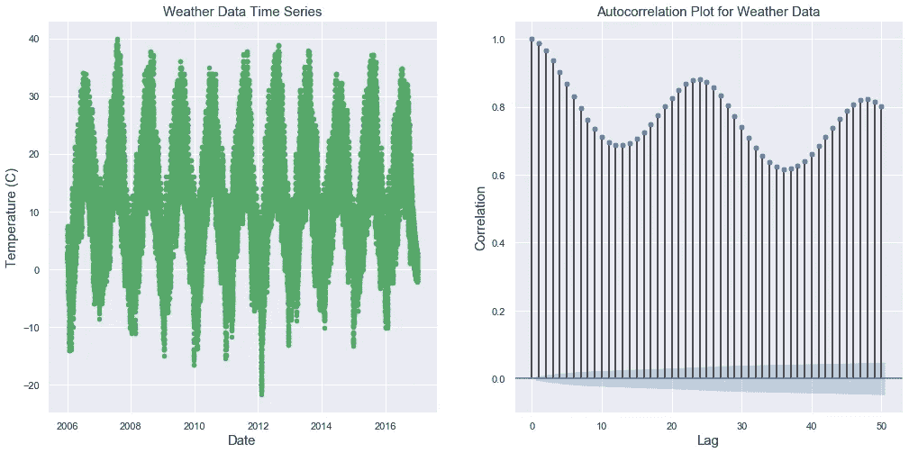

我们可以清楚地看到左边有一个重复的图案，似乎是正弦曲线形状。在右边，我们可以看到自相关图:线条的大小表示给定滞后值的相关程度。当我们考虑天气的季节性和重复性时，该图似乎表明了一种相关的循环模式。

然而，我们能从销售数据集的自相关图中得到什么呢？它会呈现出和这个简单的天气数据集一样清晰的重复模式吗？

让我们用这个[零售销售数据集](https://www.kaggle.com/manjeetsingh/retaildataset)绘制与上面相同的信息。

这里的步骤将是:

*   加载数据集
*   获得 45 家商店的总销售额
*   绘制 2010 年至 2013 年间的总销售量

```
import pandas as pd
import matplotlib.pyplot as plt
import seaborn as sns
sns.set()
from statsmodels.graphics.tsaplots import plot_acf
import matplotlib.dates as mdates
import datetimegreen = sns.color_palette("deep",8)[2]
blue = sns.color_palette("deep",8)[0]

retail_sales = "./sales_dataset.csv' df_sales  = pd.read_csv(retail_sales)fig = plt.figure(figsize=(17,8))
ax1 = fig.add_subplot(121)
df_sales_sum = df_sales.groupby(by=['Date'], as_index=False)['Weekly_Sales'].sum()
df_sales_sum["Date"] = pd.to_datetime(df_sales_sum["Date"])
df_sales_sum.plot(x="Date",y="Weekly_Sales",color="g",ax=ax1, fontsize=15)
plt.xlabel("Date",fontsize=15)
plt.title("Total Sales Volume", fontsize=15)
plt.ylabel("Sales", fontsize=15)
date_form = mdates.DateFormatter("%Y-%m-%d")
year_locator = mdates.YearLocator()
ax1.xaxis.set_major_locator(year_locator)ax2 = fig.add_subplot(122)
plot_acf(df_sales_sum.Weekly_Sales,ax=ax2)
plt.title("Autocorrelation", fontsize=15)
plt.xlabel("Lag",fontsize=15)
plt.ylabel("Correlation", fontsize=15)
plt.show()
```

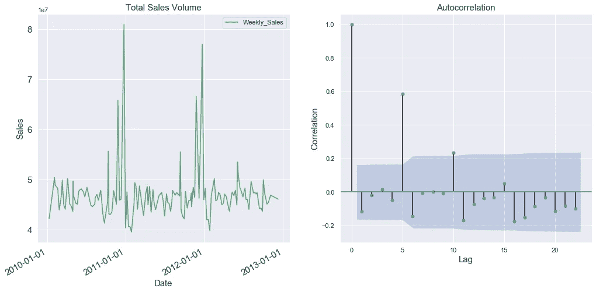

在这里，我们看到在`lag = 5`的观察中有一个相对高相关性的点。我们在前面的图表中看到的相同结构的缺乏是销售的偶然性的结果:考虑到预测销售的因素的数量，我们不应该期望数据像在天气数据集中那样具有完全清晰的相关性。然而，有趣的是观察到可能与所涉及产品类型相关的因素相关的相关性峰值。例如，对于一个销售圣诞礼物的商店，我们应该期望看到从圣诞节开始相隔一年的观察结果之间的高相关性，因为人们更有可能在这个特定时期购买更多的礼物。

## 静态模式

顾名思义，静态模式的概念与不变的事物相关。

在时间序列中，这个概念最著名的代理是[](https://en.wikipedia.org/wiki/Stationary_process)**，平稳性是指一个时间序列保持静态的统计性质:一个平稳时间序列中的观测值不依赖于时间。**

**趋势和季节性会影响时间序列在不同时间的值。传统上，我们会随着时间的推移寻找一致性，例如通过使用观察值的平均值或方差。当时间序列是平稳的时，建模会更容易，统计建模方法通常假设或要求时间序列是平稳的。**

**如果你想更深入地了解平稳性，我推荐 Shay Palachy 的这篇[作品](/stationarity-in-time-series-analysis-90c94f27322#:~:text=In%20the%20most%20intuitive%20sense,not%20itself%20change%20over%20time.)**

**检查数据集是否稳定的标准过程包括使用一种称为 Dickey-Fuller 测试的测试，该测试检查数据是否具有静态统计属性的置信度。要了解更多细节，请查看这篇[文章](/the-complete-guide-to-time-series-analysis-and-forecasting-70d476bfe775)。**

```
from statsmodels.tsa.stattools import adfuller

adf_test_sales = adfuller(list(df_sales_sum["Weekly_Sales"]))

adf_test_weather = adfuller(list(df_weather["Temperature (C)"]))

print("Weather Results:")
print("ADF = " + str(adf_test_weather[0]))
print("p-value = " +str(adf_test_weather[1]))

print("Retail sales results:")

print("ADF = " + str(adf_test_sales[0]))

print("p-value = " +str(adf_test_sales[1]))Weather Results:
ADF = -10.140083406906376
p-value = 8.46571984130497e-18
Retail sales results:
ADF = -2.6558148827720887
p-value = 0.08200123056783876
```

**在这里，我们可以看到天气数据集的测试结果指向平稳，这是一个我们应该持保留态度的结果，因为它在很大程度上取决于我们如何对数据进行采样，通常气候数据是循环平稳的。然而，在我们的零售销售数据集上，p 值表明数据将是稳定的，这种置信度并不显著。**

## **趋势**

**趋势代表在我们的数据中识别的趋势。在股票市场的情况下，这可能是给定股票的趋势，看起来是上涨或下跌。对于销售预测来说，这是关键: ***确定一个趋势可以让我们知道我们的时间序列前进的方向，这是预测销售未来的基础。*****

**我们将使用`[fbprophet](https://facebook.github.io/prophet/docs/quick_start.html)`包来确定我们两个数据集的总体趋势。这些步骤将是:**

*   **选择天气数据的范围(在 2007 年和 2009 年之间)**
*   **将数据作为具有两列的 dataframe 提供给`fbprophet.Prophet`对象:“ds”(表示日期)和“y”(表示数据)**
*   **运行模型**
*   **用上限和下限绘制趋势图**

```
from fbprophet import Prophet
from datetime import datetime

start_date = "2007-01-01"
end_date = "2008-12-31"
df_weather["Formatted Date"] = pd.to_datetime(df_weather["Formatted Date"], utc=True)

date_range = (df_weather["Formatted Date"] > start_date) & (df_weather["Formatted Date"] < end_date)

df_prophet = df_weather.loc[date_range]

m = Prophet()

ds = df_prophet["Formatted Date"].dt.tz_localize(None)
y = df_prophet["Temperature (C)"]
df_for_prophet = pd.DataFrame(dict(ds=ds,y=y))
m.fit(df_for_prophet)

future = m.make_future_dataframe(periods=120)

forecast = m.predict(future)
forecast = forecast[["ds","trend", "trend_lower", "trend_upper"]]
fig = m.plot_components(forecast,plot_cap=False)
trend_ax = fig.axes[0]

trend_ax.plot()
plt.title("Trend for Weather Data", fontsize=15)
plt.xlabel("Date", fontsize=15)
plt.ylabel("Weather Trend", fontsize=15)
plt.show()INFO:fbprophet:Disabling yearly seasonality. Run prophet with yearly_seasonality=True to override this.
C:\Users\lucas\.conda\envs\env_1\lib\site-packages\pystan\misc.py:399: FutureWarning:

Conversion of the second argument of issubdtype from `float` to `np.floating` is deprecated. In future, it will be treated as `np.float64 == np.dtype(float).type`.
```

**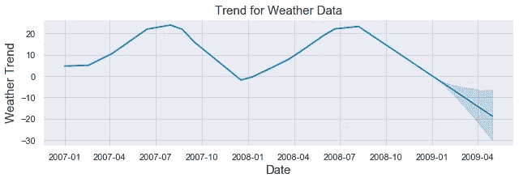**

**我们可以看到，对于天气来说，趋势正如我们所预期的那样遵循常规季节，在夏季上升，在冬季下降。**

**现在，让我们对零售数据集做同样的事情。这些步骤与上面的图类似，唯一的区别是我们将从零售数据集中选择一家商店。**

```
from fbprophet import Prophet

m = Prophet()
# Selecting one store
df_store_1 = df_sales[df_sales["Store"]==1]

df_store_1["Date"] = pd.to_datetime(df_store_1["Date"])
ds = df_store_1["Date"].dt.tz_localize(None)
y = df_store_1["Weekly_Sales"]
df_for_prophet = pd.DataFrame(dict(ds=ds,y=y))
m.fit(df_for_prophet)
future = m.make_future_dataframe(periods=15)
forecast = m.predict(future)
forecast = forecast[["ds","trend", "trend_lower", "trend_upper"]]
fig = m.plot_components(forecast,plot_cap=False)
trend_ax = fig.axes[0]
trend_ax.plot()
plt.title("Trend for Retail Data", fontsize=15)
plt.xlabel("Date", fontsize=15)
plt.ylabel("Sales Trend", fontsize=15)

plt.show()C:\Users\lucas\.conda\envs\env_1\lib\site-packages\ipykernel_launcher.py:8: SettingWithCopyWarning:

A value is trying to be set on a copy of a slice from a DataFrame.
Try using .loc[row_indexer,col_indexer] = value instead

See the caveats in the documentation: https://pandas.pydata.org/pandas-docs/stable/user_guide/indexing.html#returning-a-view-versus-a-copy

INFO:fbprophet:Disabling daily seasonality. Run prophet with daily_seasonality=True to override this.
C:\Users\lucas\.conda\envs\env_1\lib\site-packages\pystan\misc.py:399: FutureWarning:

Conversion of the second argument of issubdtype from `float` to `np.floating` is deprecated. In future, it will be treated as `np.float64 == np.dtype(float).type`.
```

**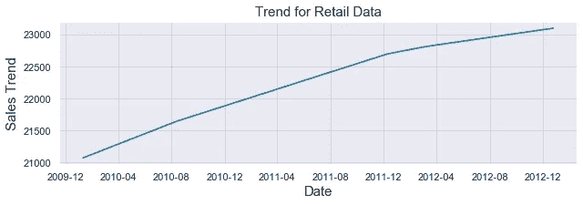**

**从 2010 年到 2013 年，所选商店的销售业绩呈现出近乎完美的线性上升趋势，总销量增幅超过 1%。对这些结果的实际解释需要其他指标，如流失率和潜在的成本增加，因此上升趋势不一定意味着利润增加。然而，一旦考虑了所有因素，趋势是整体性能的良好指标。**

## **传统时间序列模型在销售预测中的应用**

**到目前为止，我们已经介绍了销售预测问题的基本知识，并从时间序列的角度确定了它的主要组成部分:重复模式、静态模式和趋势的概念。如果你想更深入地了解时间序列，我推荐@Will Koehrsen 的这篇文章。**

**现在，我们将研究处理销售预测问题的传统时间序列方法:**

*   **移动平均数**
*   **指数平滑法**
*   **ARIMA**

## **移动平均数**

**该模型假设下一个观察值是所有过去观察值的平均值，它可用于识别数据中有趣的趋势。我们可以定义一个窗口来应用移动平均模型平滑时间序列，并突出显示不同的趋势。**

**让我们用移动平均线模型来预测天气和销售。这些步骤将是:**

*   **选择一个范围**
*   **定义移动平均窗口的值**
*   **计算平均绝对误差**
*   **画出滚动平均值的上下界**
*   **绘制真实数据**

```
from sklearn.metrics import mean_absolute_error

green = sns.color_palette("deep", 8)[2]
blue = sns.color_palette("deep", 8)[0]

start_date = "2007-01-01"
end_date = "2008-12-31"
df_weather["Formatted Date"] = pd.to_datetime(df_weather["Formatted Date"], utc=True)
date_range = (df_weather["Formatted Date"] > start_date) & (df_weather["Formatted Date"] < end_date)
df_weather_ma = df_weather.loc[date_range]
series = df_weather_ma["Temperature (C)"]

window=90
rolling_mean = series.rolling(window=window).mean()
fig,ax = plt.subplots(figsize=(17,8))

plt.title('Moving Average Model for Weather Dataset',fontsize=15)
plt.plot(rolling_mean, color=green, label='Rolling mean trend')
#Plot confidence intervals for smoothed values
mae = mean_absolute_error(series[window:], rolling_mean[window:])
deviation = np.std(series[window:] - rolling_mean[window:])
lower_bound = rolling_mean - (mae + 2 * deviation)
upper_bound = rolling_mean + (mae + 2 * deviation)
plt.plot(upper_bound, 'r--', label='Upper bound / Lower bound')
plt.plot(lower_bound, 'r--')
plt.plot(series[window:],color=blue, label="Actual Values")

plt.legend(loc='best')
plt.grid(True)
plt.xticks([])

plt.show()
```

**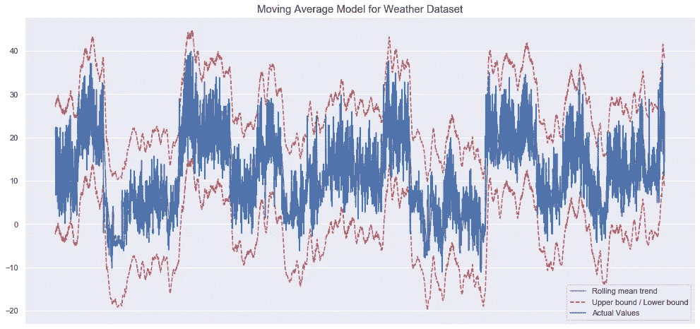**

**这个模型似乎捕捉到了一些天气的动态变化。让我们看看该模型如何处理零售数据集。**

```
series = df_sales_sum.Weekly_Sales
window=15

rolling_mean = series.rolling(window=window).mean()
fig,ax = plt.subplots(figsize=(17,8))

plt.title('Moving Average Model for Retail Sales',fontsize=15)

plt.plot(rolling_mean, color=green, label='Rolling mean trend')

#Plot confidence intervals for smoothed values
mae = mean_absolute_error(series[window:], rolling_mean[window:])
deviation = np.std(series[window:] - rolling_mean[window:])
lower_bound = rolling_mean - (mae + 1.92 * deviation)
upper_bound = rolling_mean + (mae + 1.92 * deviation)

plt.plot(upper_bound, 'r--', label='Upper bound / Lower bound')
plt.plot(lower_bound, 'r--')

plt.plot(series[window:], color=blue,label='Actual values')

plt.legend(loc='best')
plt.grid(True)
plt.xticks([])
plt.show()
```

**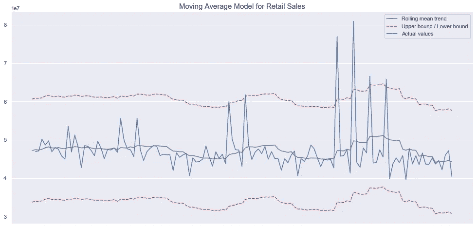**

**对于销售数据集，拟合看起来没有那么有希望，但是与天气数据集相比，零售数据集的数据也少得多。此外，设置我们的平均大小的窗口参数对我们的整体性能有很大的影响，我没有做任何额外的超参数调整。在这里，我们应该明白的是，复杂的销售数据集需要比简单的一维时间序列所能提供的更多的信息。**

## **指数平滑法**

**指数平滑类似于移动平均，但在这种情况下，每个观察值的权重会递减，因此，随着我们远离当前，观察值的重要性会降低。这种假设有好有坏:降低时间序列动态中过时信息的权重可能是有益的，但当过去的信息与数据的动态有某种永久的因果关系时，这种假设可能是有害的。**

**让我们在上面使用的天气数据集中使用指数平滑，我们将:**

*   **符合数据**
*   **预报**
*   **对照实际值绘制预测图**

```
from statsmodels.tsa.api import ExponentialSmoothing
import matplotlib.pyplot as plt
import matplotlib.dates as mdates
import seaborn as sns
sns.set()
import pandas as pd

fit1 = ExponentialSmoothing(df_weather["Temperature (C)"][0:200]).fit(smoothing_level=0.1, optimized=False)
fit2 = ExponentialSmoothing(df_weather["Temperature (C)"][0:200]).fit(smoothing_level=0.5, optimized=False)
forecast1 = fit1.forecast(3).rename(r'$\alpha=0.1$')
forecast2 = fit2.forecast(3).rename(r'$\alpha=0.5$')
plt.figure(figsize=(17,8))

forecast1.plot(color='blue', legend=True)
forecast2.plot(color='red', legend=True)
df_weather["Temperature (ºC)"][0:200].plot(marker='',color='green', legend=True)
fit1.fittedvalues.plot(color='blue')
fit2.fittedvalues.plot(color='red')
plt.title("Exponential Smoothing for Weather Data", fontsize=15)
plt.xticks([])

plt.show()
```

**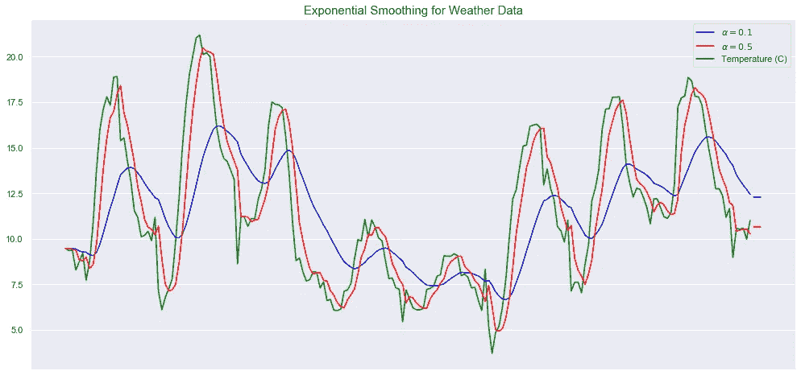**

**现在，对于零售数据集:**

```
# Put the correct dataframe here!

fit1 = ExponentialSmoothing(df_sales_sum["Weekly_Sales"][0:200]).fit(smoothing_level=0.1, optimized=False)

fit2 = ExponentialSmoothing(df_sales_sum["Weekly_Sales"][0:200]).fit(smoothing_level=0.5, optimized=False)

forecast1 = fit1.forecast(3).rename(r'$\alpha=0.1$')
forecast2 = fit2.forecast(3).rename(r'$\alpha=0.5$')
plt.figure(figsize=(17,8))

forecast1.plot(color='blue', legend=True)
forecast2.plot(color='red', legend=True)
df_sales_sum["Weekly_Sales"][0:200].plot(marker='',color='green', legend=True)
plt.ylabel("Sales", fontsize=15)

fit1.fittedvalues.plot(color='blue')
fit2.fittedvalues.plot(color='red')

plt.title("Exponential Smoothing for Retail Data", fontsize=15)
plt.xticks([], minor=True)
plt.show()
```

**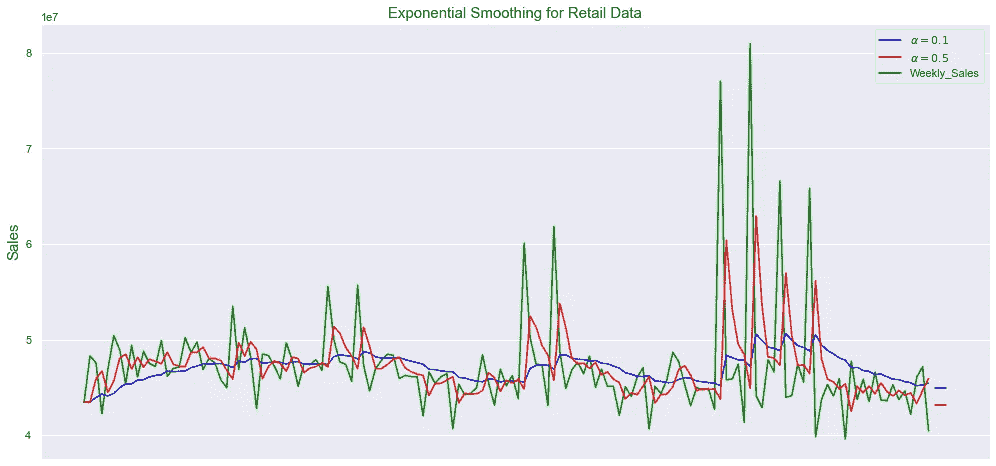**

**这里，我们使用平滑因子(最近一段时间的权重)的两个值 alpha = 0.1 和 alpha = 0.5 进行平滑，并用绿色绘制实际温度和零售数据。**

**正如我们在这里看到的，平滑因子越小，时间序列就越平滑。这具有直观的意义，因为随着平滑因子接近 0，我们接近移动平均模型。第一个似乎很好地捕捉了两个数据集的动态，但它似乎未能捕捉某些峰值活动的幅度。**

**从概念上讲，在给定数据集的性质的情况下，思考模型的假设如何影响其性能是很有趣的。我认为新信息对销售更重要，因为影响商店销售产品可能性的因素可能会不断变化和更新。因此，与假设动态以某种方式保持不变的模型相比，具有降低过去信息重要性的能力的模型将更准确地捕捉这种变化动态。**

## **有马**

**ARIMA 或自回归综合移动平均是一种时间序列模型，旨在描述时间序列数据中的自相关性。它适用于短期预测，并且对于为用户指定的时间段提供预测值非常有用，可以显示需求、销售、计划和生产的良好结果。**

**ARIMA 模型的参数定义如下:**

*   **p:模型中包含的滞后观测值的数量**
*   **d:原始观测值被差分的次数**
*   **问:移动平均线窗口的大小**

**现在，我将使用 ARIMA 模型来模拟天气数据和零售销售。这些步骤将是:**

*   **将数据分为训练和测试**
*   **符合数据**
*   **打印均方差(我们的评估指标)**
*   **用真实值绘制模型拟合图**

```
from statsmodels.tsa.arima_model import ARIMA
from sklearn.metrics import mean_squared_error
import pandas as pd

X = df_weather["Temperature (C)"].values

train_size = 600
test_size = 200

train, test = X[0:train_size], X[train_size:train_size+test_size]

history = [x for x in train]
predictions = []
for t in range(len(test)):
	model = ARIMA(history, order=(5,1,0))
	model_fit = model.fit(disp=0)
	output = model_fit.forecast()
	yhat = output[0]
	predictions.append(yhat)
	obs = test[t]
	history.append(obs)

mse = mean_squared_error(test, predictions)
print(f"MSE error: {mse}")
plt.figure(figsize=(17,8))

plt.plot(test)
plt.plot(predictions, color='red')
plt.title("ARIMA fit Weather Data")
plt.xticks([])
plt.show()MSE error: 3.105596078192541
```

**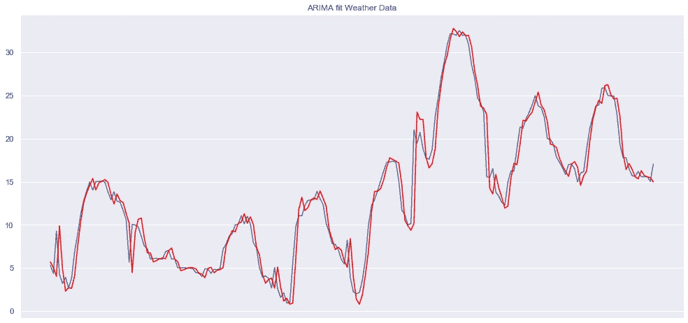**

**在这里，我们看到了 ARIMA 模型与天气数据集的预期良好拟合，因为之前我们看到该数据集具有非常高的自相关性。让我们将此与模型在销售数据集上的表现进行比较:**

```
from statsmodels.tsa.arima_model import ARIMA
from sklearn.metrics import mean_squared_error
import pandas as pd

import matplotlib.pyplot as plt
import seaborn as sns
sns.set()

X = df_sales_sum["Weekly_Sales"].values

split = int(0.66*len(X))
train, test = X[0:split], X[split:]

history = [x for x in train]
predictions = []
for t in range(len(test)):
	model = ARIMA(history, order=(5,1,0))
	model_fit = model.fit(disp=0)
	output = model_fit.forecast()
	yhat = output[0]
	predictions.append(yhat)

	obs = test[t]
	history.append(obs)
mse = mean_squared_error(test, predictions)

print(f"MSE error: {mse}")

plt.figure(figsize=(17,8))
plt.plot(test)
plt.plot(predictions, color='red')
plt.title("ARIMA fit to Sales Data",fontsize=15)
plt.xticks([])
plt.show()MSE error: 47664398980324.34
```

**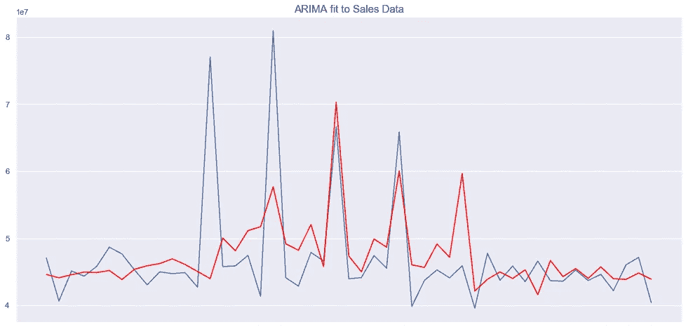**

**在这里，拟合度远不如在气象数据集中的拟合度好，考虑到 ARIMA 模型通常适用于高度稳定的数据集，这是意料之中的。**

**让我们记住，这里的结果只是为了展示模型，并不代表准确的估计。数据集是有限的(求和后的零售数据集小于 200 个数据点)，我没有执行任何复杂的超参数调整。这里的目标只是演示这些模型是如何工作的，以及如何在 python 中实现它们。我们可以证实，零售数据集似乎提出了传统模型无法克服的挑战。**

**我们可以看到，对于有明确模式的数据集，传统模型工作得很好。然而，在缺乏这种结构的情况下，这些模型似乎不具备适应的灵活性，因为它们依赖于关于目标时间序列动态的强有力的假设。**

**现在，我们将讨论当前用于销售预测的深度学习方法，并尝试了解它们可以带来什么，这将有利于在传统模型不足以满足需求的情况下提高预测准确性。**

## **现代销售预测和深度学习**

**在这里，我想概述一下我认为最适合销售预测的深度学习候选人的主要候选人。**

## **[亚马逊的 DeepAR 模型](https://docs.aws.amazon.com/forecast/latest/dg/aws-forecast-recipe-deeparplus.html)**

**我们今天在这里讨论的模型对每个单独的时间序列都适用一个模型。然而，在销售中，通常有多个时间序列与您试图建模的动态相关。因此，能够在所有相关时间序列上联合训练模型是非常有益的。**

**进入亚马逊预测 DeepAR+，这是一种使用递归神经网络预测一维时间序列的监督学习算法。它允许在一个模型上训练多个时间序列特征，并且在标准时间序列基准上优于传统模型。**

**该模型的主要特点是，它克服了传统模型只能在单一时间序列上训练的局限性。此外，该模型使用**概率预测**，其中，该模型预测不同未来情景的可能性分布，展示一组预测区间，而不是传统的对我们在给定日期或期间预期销售多少的点预测。这些预测分位数可以用来表示预测中的不确定性，从而为我们提供每个预测的置信区间。当涉及到点预测用处不大的下游使用决策时，这些类型的预测特别重要。**

## **销售预测的 NLP**

**一种乍一看似乎非常规但很有希望的方法是使用自然语言处理模型进行预测。我想提到两种方法:**

*   **[嵌入实体的销售预测](https://lotuslabs.ai/forecasting-retail-store-sales-with-deep-learning-using-entity-embeddings/)**
*   **[根据产品描述语言进行销售预测](https://nlp.stanford.edu/pubs/pryzant2017sigir.pdf)**

****实体嵌入****

**在 LotusLabs 的这篇[文章中，他们描述了使用分类数据(彼此不相关的数据)并利用该数据的嵌入表示来进行预测的想法。为了建立这种表示，传统的神经网络用于将输入映射到嵌入空间。](https://lotuslabs.ai/forecasting-retail-store-sales-with-deep-learning-using-entity-embeddings/)**

**通过识别相似的输入并将它们映射到相似的位置，他们能够识别出原本很难看到的模式。使用这种方法的一个优点是，您不必执行任何特性工程。**

**关于这种方法的一个有趣的细节是，它克服了简单的一热编码表示中的稀疏性等问题。**

****NLP 对产品描述进行销售预测****

**这篇[论文](https://nlp.stanford.edu/pubs/pryzant2017sigir.pdf)采取了不同的方法。他们使用了日本电子商务市场 [Rakuten](https://global.rakuten.com/corp/innovation/tag/30-105/) 上超过 90，000 个产品描述的数据，并确定了可操作的写作风格和词汇用法，这些风格和用法高度预测了消费者的购买行为。**

**该模型综合使用了词向量、LSTMs 和注意力机制来预测销售额。他们发现，季节性的、礼貌的、权威的和信息丰富的产品描述会带来最好的结果。**

**此外，他们表明，即使你考虑到品牌忠诚度和商品身份等其他因素，产品描述的嵌入式叙述中的词语也是销售的非常重要的决定因素。他们使用神经网络的新特征选择方法具有良好的性能，并且该方法本身指出了在使用执行销售预测时必须考虑的数据集环境的异质性。**

****用于销售预测的 WAVENET】****

**在 [Corporacion Favorita 杂货销售预测](https://www.kaggle.com/c/favorita-grocery-sales-forecasting/notebooks?sortBy=scoreAscending&group=everyone&pageSize=20&competitionId=7391)比赛中获得第二名的选手使用了[改编版的 Wavenet CNN 模型](https://arxiv.org/pdf/1803.04037.pdf)。Wavenet 是一个生成模型，可以在给定一些条件输入的情况下生成实值数据序列。根据作者的说法，这里的主要思想在于[扩张因果卷积](https://theblog.github.io/post/convolution-in-autoregressive-neural-networks/)的概念。**

**WaveNet 被构造为完全卷积神经网络，其中卷积层具有各种膨胀因子，允许其感受野指数增长，并使用能够保持特征图大小的上采样滤波器覆盖许多时间点。这种方法可以扩大内核的视野，并捕捉输入的整体全局视图。要了解更多，我推荐 DeepMind 的这篇[文章。](https://deepmind.com/blog/article/wavenet-generative-model-raw-audio)**

**生成模型似乎是深度学习中销售预测的一个明显趋势，因为它们已经证明有能力对分布进行建模，因此可以预测不同场景的可能性，在销售预测的偶然背景下，当人们可以访问足够的数据时，这似乎是比传统模型更好的方法。**

****关于元学习的快速说明****

**在今年 5 月发表的这篇论文中，邵会·马和罗伯特·菲尔德斯开发了一种销售预测的元学习方法。这个想法是使用元学习者利用潜在的预测方法池，而不是一个模型的方法。**

**他们的方法使用元学习器来提取数据的相关特征，这些元学习器使用 1-D 卷积的堆叠序列和最后合并的校正线性单元。在集合阶段，他们使用密集层和 softmax 将来自多个预报的预测结合起来。**

**他们的方法点表明该领域趋向于更混合的自学方法，而不是单一模型解决方案。**

## **结论**

**传统的方法只能解释它们被训练的一维数据的动态。然而，像这样的方法指出了混合模型的未来，其中多个时间序列可以被考虑，分类变量可以被包括在预测管道中。**

**通用性和灵活性似乎是渗透成功销售预测模型的关键因素。深度学习能够开发复杂的定制预测模型，这些模型包含非结构化零售数据集，因此只有当数据足够复杂时，使用它们才有意义。**

**如果你想看看这篇文章的笔记本，你可以在这里找到它。**

**如果你喜欢这种类型的内容，请查看我的 Youtube 频道:**

**作者**

**如果您想更深入地了解 Python 预测，请查看 Udemy 的这些课程:**

> **这些是附属链接，如果你使用它们，我会得到一小笔佣金，干杯！:)**

*   **[时间序列分析、预测和机器学习](http://seekoapp.io/613516d6d1d4680008a83b31)**
*   **[用于时间序列数据分析的 Python](http://seekoapp.io/61351720668e0d0009cface1)**

**这里有一些程序员必备的附属链接:)**

*   **[Bose 降噪耳机](https://amzn.to/3Wj0Zg5)**
*   **[罗技 MX Master 3 高级无线鼠标](https://amzn.to/3Dm432m)**
*   **[海盗船 K55 RGB 键盘](https://amzn.to/3Wpvfpx)**

**如果你喜欢这篇文章，请在 [LinkedIn](https://www.linkedin.com/in/lucas-soares-969044167/) 和 [Twitter](https://twitter.com/LucasEnkrateia) 上联系我。**

**谢谢，下次再见！:)**

# **参考**

*   **[卡达维德，拉莫里& Grabot 2018](https://hal.archives-ouvertes.fr/hal-01881362/document)**
*   **[哈佛商业文章:“如何选择正确的预测技术”](https://hbr.org/1971/07/how-to-choose-the-right-forecasting-technique)**
*   **[时间序列分析和预测完全指南](/the-complete-guide-to-time-series-analysis-and-forecasting-70d476bfe775)**
*   **[《时间序列预测原理与亚马逊预测》](https://d1.awsstatic.com/whitepapers/time-series-forecasting-principles-amazon-forecast.pdf)。**
*   **[如何在零售需求预测中应用机器学习？](https://medium.com/swlh/how-to-apply-machine-learning-in-demand-forecasting-for-retail-b781957e5919)**
*   **[Python 中的时间序列—指数平滑和 ARIMA 过程](/time-series-in-python-exponential-smoothing-and-arima-processes-2c67f2a52788)**
*   **[马&菲尔德斯，2020](https://www.sciencedirect.com/science/article/pii/S0377221720304847)**
*   **[Pryzant，Chung & Jurafsky，2017](https://nlp.stanford.edu/pubs/pryzant2017sigir.pdf)**
*   **[通过使用实体嵌入的深度学习预测零售店销售额](https://lotuslabs.ai/forecasting-retail-store-sales-with-deep-learning-using-entity-embeddings/)**
*   **[亚马逊的 DeepAR 模型](https://docs.aws.amazon.com/forecast/latest/dg/aws-forecast-recipe-deeparplus.html)**
*   **[DeepAR 知识库](https://github.com/zhykoties/TimeSeries)**
*   **[WaveNet:原始音频的生成模型](https://deepmind.com/blog/article/wavenet-generative-model-raw-audio)**
*   **增强的迪基-富勒测验**
*   **[销售预测的平稳数据检验](https://pythondata.com/stationary-data-tests-for-time-series-forecasting/)**