# 具有价格和促销效果的销售预测

> 原文：<https://towardsdatascience.com/sales-forecasting-with-price-promotion-effects-b5d70207b128?source=collection_archive---------0----------------------->


图片来源:Pixabay

## 促销分析，时间序列预测，干预分析

许多生意都是季节性的，有些生意会在假期赚钱，比如超级碗、劳动节、感恩节和圣诞节。此外，他们在一年中的几个星期里利用促销来增加对产品或服务的需求或知名度。

在本帖中，我们将使用时间序列分析技术来分析历史数据，具有推广效果。

我们将要使用的数据是 9 家商店和 3 种产品的每周销售和价格数据。最后，我们将预测其中一家商店三种产品之一未来 50 周的销售情况。你可以在这里找到数据集[。](https://raw.githubusercontent.com/susanli2016/Machine-Learning-with-Python/master/data/Sales_Product_Price_by_Store.csv)

# 数据

*   商店:商店代码。我们总共有 9 家店。
*   产品:产品代码。我们总共有三种产品。
*   Is_Holiday:该周是否包含假日的指标:0 =否，1 =是。
*   基价:无折扣的基本价格或日常价格。
*   价格:每周的实际价格。它们要么是促销时的促销价格，要么是日常价格。
*   周销售量:周销售量。

新功能. py

在上面的数据预处理中，我们添加了新的功能，如以美元、年、月、日、周为单位的周销售额。

# 电子设计自动化(Electronic Design Automation)

为了获得关于数据中连续变量的第一印象，我们将绘制 [ECDF](https://en.wikipedia.org/wiki/Empirical_distribution_function) 。

ECDF.py

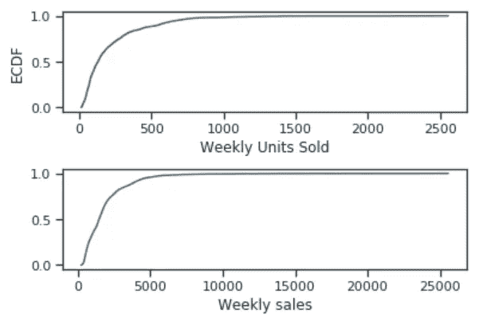

图 1

*   虽然在最好的一周，一家商店销售了 2500 多台，但大约 80%的时间，周销售量都没有超过 500 台。
*   尽管最高周销售额超过 25K 美元，但超过 90%的数据的周销售额低于 5K 美元。

```
df.groupby('Store')['weekly_sales'].describe()
```

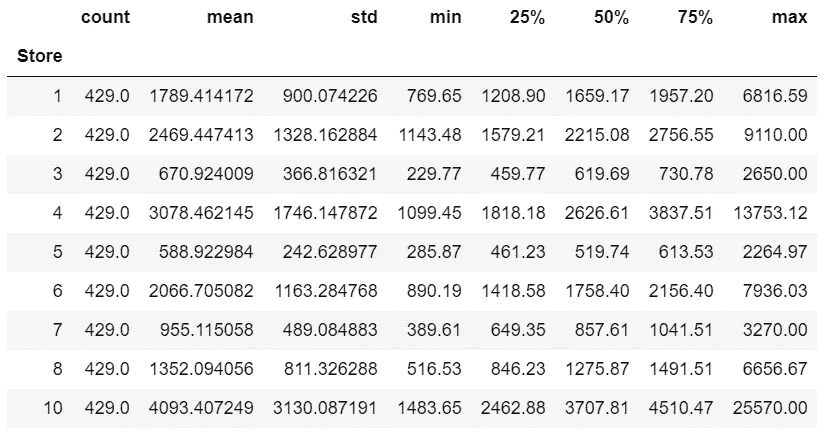

图 2

```
df.groupby('Store')['Weekly_Units_Sold'].sum()
```

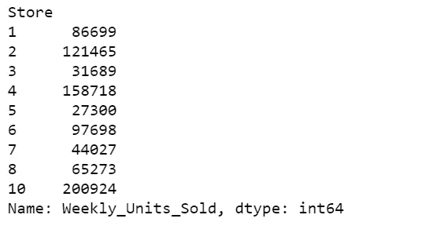

图 3

*   很容易看出，在所有 9 家商店中，商店 10 的平均周销售额最高，商店 10 的总周销售量也最高。
*   而 5 号店的平均周销售额最低。
*   显然，10 号店是最畅销和最拥挤的一家。

```
g = sns.FacetGrid(df, col="Is_Holiday", height=4, aspect=.8)
g.map(sns.barplot, "Product", "Price");
```

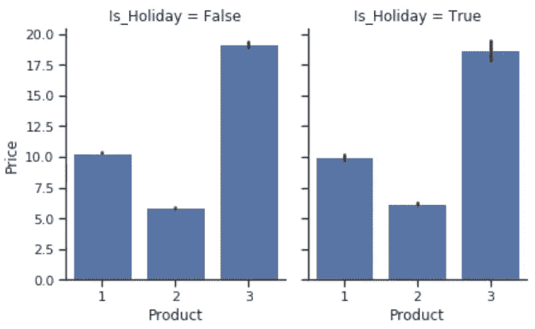

图 4

```
g = sns.FacetGrid(df, col="Is_Holiday", height=4, aspect=.8)
g.map(sns.barplot, "Product", "Weekly_Units_Sold");
```

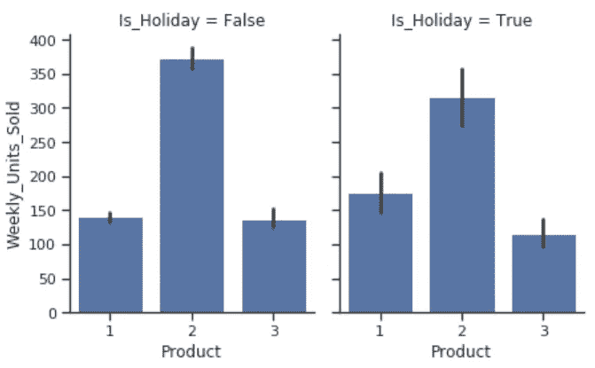

图 5

*   产品 2 是所有三种产品中最便宜的产品，它卖得最多。
*   产品 3 是所有三种产品中最贵的产品。
*   此外，产品价格在节假日期间没有变化。

```
g = sns.FacetGrid(df, row="Is_Holiday",
                  height=1.7, aspect=4,)
g.map(sns.distplot, "Weekly_Units_Sold", hist=False, rug=True);
```

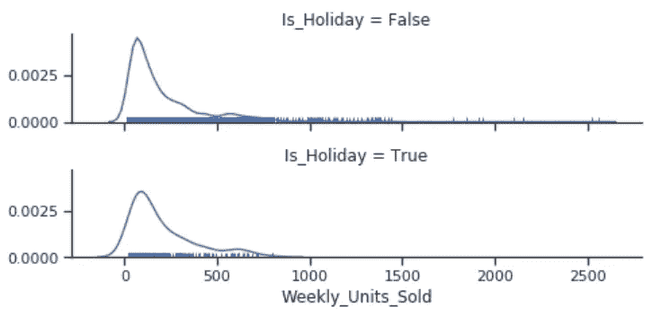

图 6

```
sns.factorplot(data= df, 
               x= 'Is_Holiday',
               y= 'Weekly_Units_Sold',
               hue= 'Store');
```

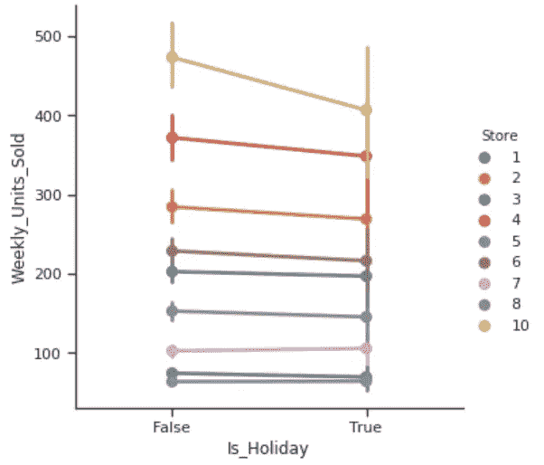

图 7

```
sns.factorplot(data= df, 
               x= 'Is_Holiday',
               y= 'Weekly_Units_Sold',
               hue= 'Product');
```

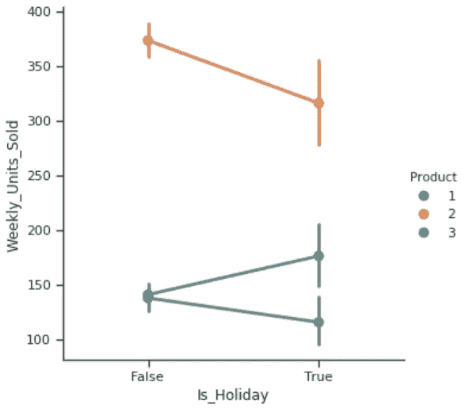

图 8

*   假期似乎不会对业务产生积极影响。对于大多数商店来说，假日期间的周销售量与平时相同，而 10 号商店在假日期间有所下降。
*   产品 1 的周销售量在假日期间略有增加，而产品 2 和产品 3 在假日期间有所下降。

```
g = sns.FacetGrid(df, col="Product", row="Is_Holiday", margin_titles=True, height=3)
g.map(plt.scatter, "Price", "Weekly_Units_Sold", color="#338844", edgecolor="white", s=50, lw=1)
g.set(xlim=(0, 30), ylim=(0, 2600));
```

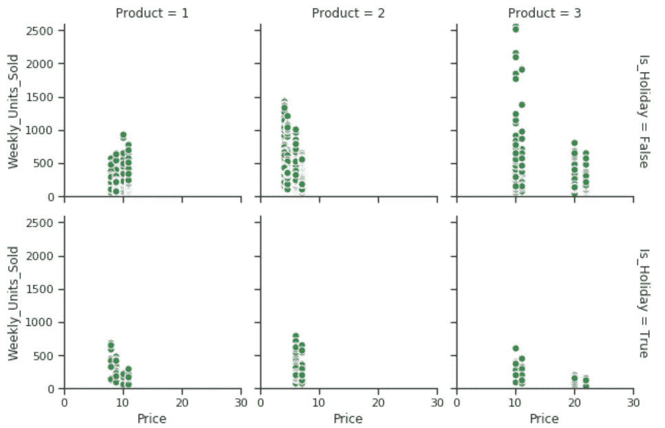

图 9

*   每个产品都有不止一个价格，在节假日和平时都是如此。我猜一个是正常价格，另一个是促销价格。
*   产品 3 的价格差距是巨大的，在促销期间它被削减到将近 50%。
*   产品 3 在非节假日期间销量最大。

```
g = sns.FacetGrid(df, col="Store", hue="Product", margin_titles=True, col_wrap=3)
g.map(plt.scatter, 'Price', 'Weekly_Units_Sold', alpha=.7)
g.add_legend();
```

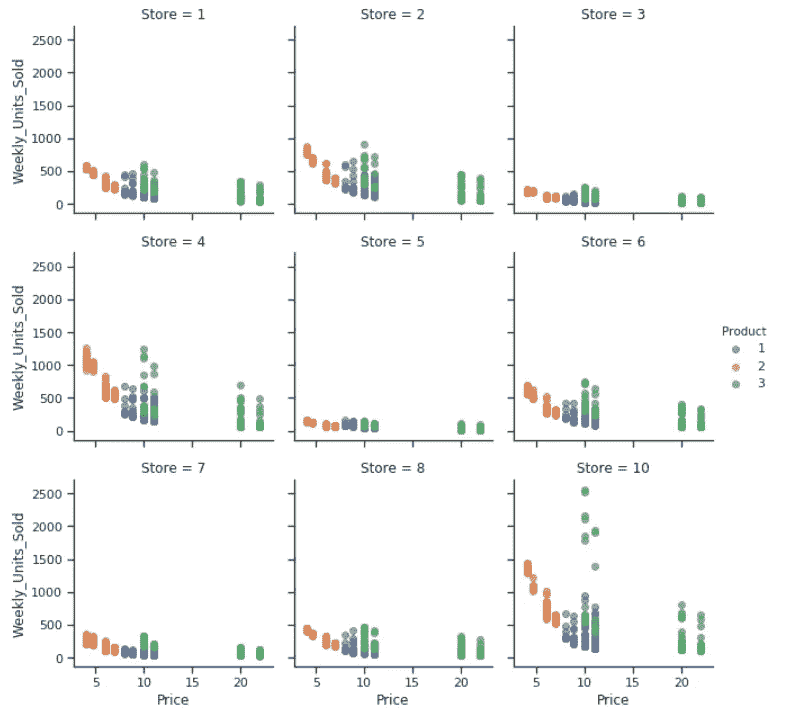

图 10

这 9 家商店都销售这 3 种产品。他们似乎都有类似的打折促销活动。但是，在商店 10 的促销活动中，产品 3 的销量最高。

```
g = sns.FacetGrid(df, col="Store", col_wrap=3, height=3, ylim=(0, 1000))
g.map(sns.pointplot, "month", "Weekly_Units_Sold", color=".3", ci=None, order = [1,2,3,4,5,6,7,8,9,10,11,12]);
```

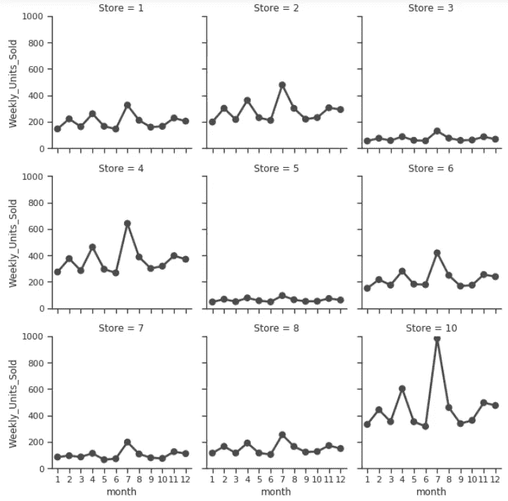

图 11

每个商店都有一定的季节性，10 号店的季节性最明显。

```
g = sns.FacetGrid(df, col="Product", col_wrap=3, height=3, ylim=(0, 1000))
g.map(sns.pointplot, "month", "Weekly_Units_Sold", color=".3", ci=None, order = [1,2,3,4,5,6,7,8,9,10,11,12]);
```

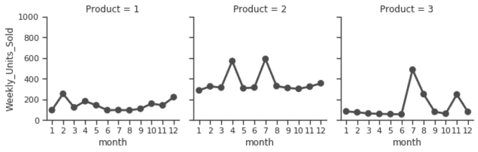

图 12

每个产品都有一定的季节性，产品 2 每年有两个旺季，产品 3 有一个旺季。

```
g = sns.FacetGrid(df, col="Store", col_wrap=3, height=3, ylim=(0, 2000), hue='Product', palette="Set1")
g.map(sns.pointplot, "month", "Weekly_Units_Sold", ci=None, order = [1,2,3,4,5,6,7,8,9,10,11,12], alpha=.7)
g.add_legend();
```


图 13

*   总的来说，在每家商店，产品 2 每周的销售量都比其他产品多。
*   在商店 10，产品 3 偶尔会超过产品 2。

```
g = sns.PairGrid(df, y_vars=["Weekly_Units_Sold"], x_vars=["Price", "Is_Holiday"], height=4)
g.map(sns.regplot, color=".3");
```


图 14

*   价格越便宜，每周售出的数量就越多。
*   是不是放假跟单位卖不卖没关系。

这里我们增加了一个新的栏目，叫做“促销”，这个栏目是从“底价”和“价格”派生出来的。

推广. py

```
sns.factorplot(data= df, 
               x= 'promotion',
               y= 'Weekly_Units_Sold',
               hue= 'Store');
```

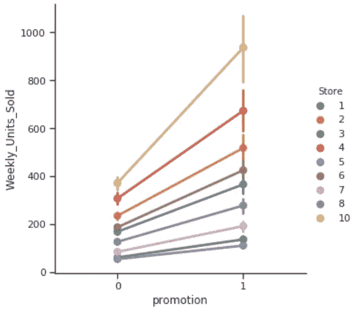

图 15

在促销期间，每家商店都卖得更多，没有例外。

```
sns.factorplot(data= df, 
               x= 'promotion',
               y= 'Weekly_Units_Sold',
               hue= 'Product');
```

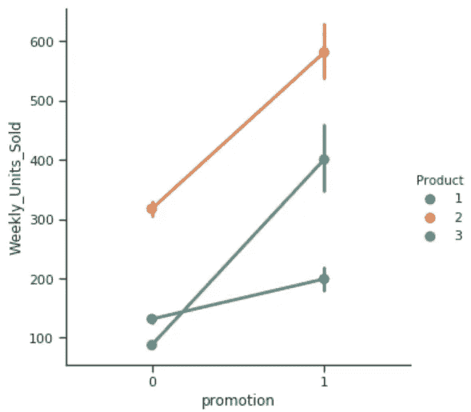

图 16

促销期间，每种产品都卖得更多，尤其是产品 2 和产品 3。

```
g = sns.FacetGrid(df, col="Store", hue="promotion", palette = 'plasma', row='promotion')
g = (g.map(plt.scatter, "Price", "Weekly_Units_Sold")
     .add_legend())
```

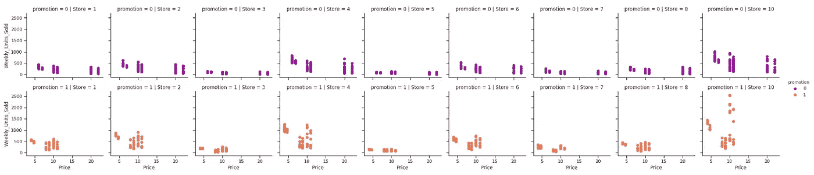

图 17

所有的商店都有相似的价格促销模式，出于某种原因，商店 10 在促销期间卖得最多。

```
g = sns.FacetGrid(df, hue="promotion", col="Product", height=4)
g.map(qqplot, "Price", "Weekly_Units_Sold")
g.add_legend();
```

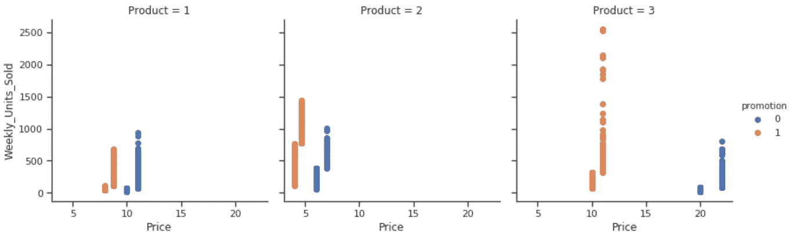

图 18

每个产品都有正常价格和促销价格。在促销期间，产品 3 的折扣最高，销量也最大。

***观察值***

*   销售最多、最拥挤的是 10 号店，最不拥挤的是 5 号店。
*   就售出的单位数量而言，全年最畅销的产品是产品 2。
*   商店不一定在假期进行产品促销。节假日似乎不会对商店或产品的表现产生影响。
*   产品 2 好像是最便宜的产品，产品 3 是最贵的产品。
*   大多数商店都有一些季节性，他们每年有两个旺季。
*   产品 1 在 2 月份的销量比其他月份稍高，产品 2 在 4 月和 7 月左右的销量最高，产品 3 在 7 月至 9 月的销量最高。
*   每种产品都有其正常价格和促销价格。产品 1 和产品 2 的正常价格和促销价格之间没有明显的差距，但是，产品 3 的促销价格可以削减到其原价的 50%。虽然每个商店都对产品 3 进行这种降价，但在降价期间，商店 10 的销售额最高。
*   促销期间比平时卖得多并不稀奇。商店 10 使产品 3 在 7 月至 9 月期间成为最畅销的产品。

# 先知的时间序列

我们将为商店 10 中的产品 3 构建一个时间序列分析，并以美元为单位预测每周销售额。

timeseries_viz.py

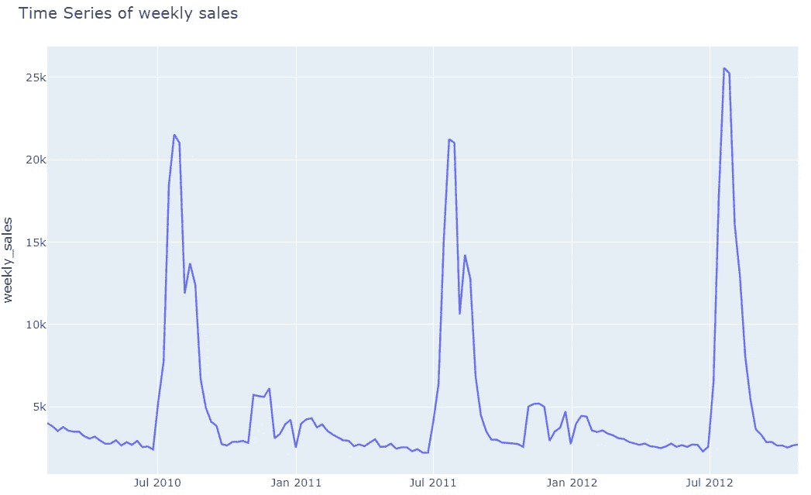

图 19

商店 10 中产品 2 的季节性很明显。在学校放假期间，销售总是在七月和九月之间达到高峰。

下面我们正在实现 [prophet](https://facebook.github.io/prophet/docs/seasonality,_holiday_effects,_and_regressors.html) 模型，预测未来 50 周的周销售额。

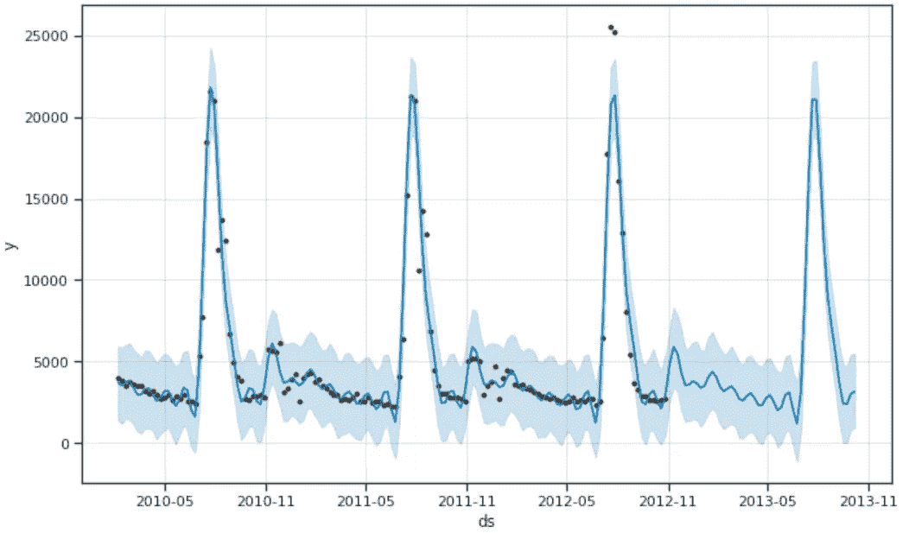

图 20

该模型能够捕捉到季节性。

```
model.plot_components(forecast);
```

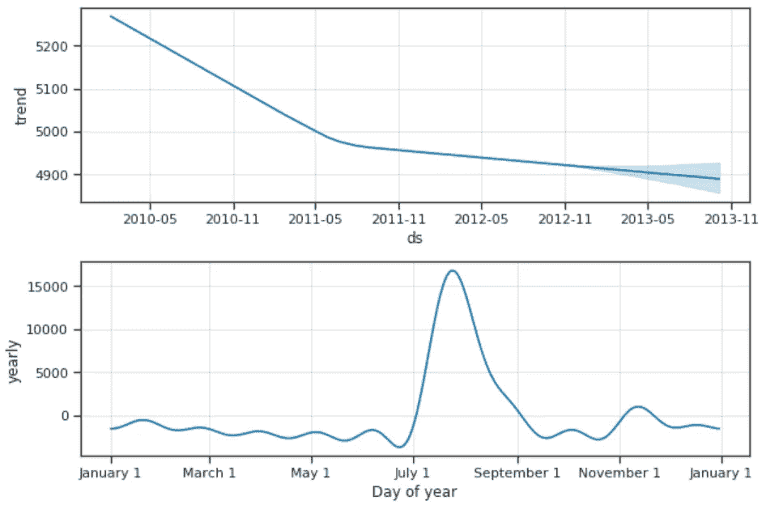

图 21

```
metric_df = forecast.set_index('ds')[['yhat']].join(store_10_pro_3.set_index('ds').y).reset_index()
metric_df.dropna(inplace=True)
error = mean_squared_error(metric_df.y, metric_df.yhat)
print('The RMSE is {}'. format(sqrt(error)))
```

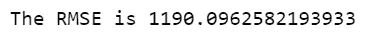

# 季节性效应

关于 Prophet 的一个伟大的事情是，我们可以添加我们自己的定制季节。这里我们将添加从七月初到九月初的学校假期。

add _ 季节性. py

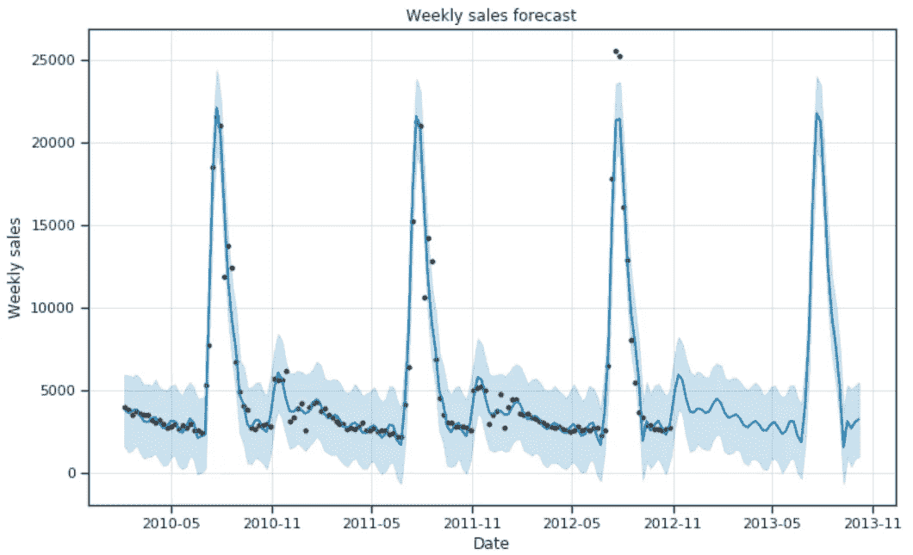

图 22

```
metric_df = forecast.set_index('ds')[['yhat']].join(store_10_pro_3.set_index('ds').y).reset_index()
metric_df.dropna(inplace=True)
error = mean_squared_error(metric_df.y, metric_df.yhat)
print('The RMSE is {}'. format(sqrt(error)))
```

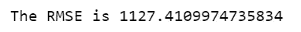

RMSE 下降了一点。

```
model.plot_components(forecast);
```

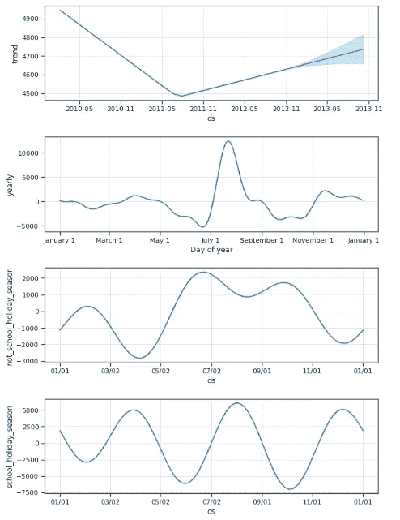

图 23

[Jupyter 笔记本](https://github.com/susanli2016/Machine-Learning-with-Python/blob/master/Promotional%20Time%20Series%20.ipynb)可以在 [Github](https://github.com/susanli2016/Machine-Learning-with-Python/blob/master/Promotional%20Time%20Series%20.ipynb) 上找到。享受这周剩下的时光吧！

参考资料:

[](https://facebook.github.io/prophet/docs/seasonality,_holiday_effects,_and_regressors.html) [## 季节性、假日效应和回归因素

### 如果您有假期或其他想要建模的周期性事件，您必须为它们创建一个数据框架。它有…

facebook.github.io](https://facebook.github.io/prophet/docs/seasonality,_holiday_effects,_and_regressors.html) 

[https://seaborn.pydata.org/generated/seaborn.FacetGrid.html](https://seaborn.pydata.org/generated/seaborn.FacetGrid.html)