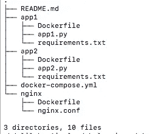

# 使用 Docker 和 Nginx 的负载平衡解决方案示例

> 原文：<https://towardsdatascience.com/sample-load-balancing-solution-with-docker-and-nginx-cf1ffc60e644?source=collection_archive---------0----------------------->


## 当今大多数业务应用程序都使用负载平衡在不同资源之间分配流量，避免单个资源过载。

负载平衡架构的一个明显优势是提高了应用程序的可用性和可靠性，因此，如果一定数量的客户端向后端请求一定数量的资源，负载平衡器会留在它们之间，并将流量路由到满足大多数路由标准(不太忙、最健康、位于给定区域)的后端..等等)。

有很多路由标准，但我们将把本文的重点放在固定的循环标准上——这意味着每个后端接收固定量的流量——我认为这很少被记录下来:)。

为了简化，我们将基于 flask Python 文件创建两个后端“应用程序”。我们将使用 NGINX 作为负载平衡器，将 60%的流量分配给应用 1，40%的流量分配给应用 2。

让我们开始编码，以下是我们项目的完整架构:



负载平衡项目树

**app1/app1.py**

```
from flask import request, Flask
import jsonapp1 = Flask(__name__)
@app1.route('/')def hello_world():
return 'Salam alikom, this is App1 :) 'if __name__ == '__main__':
app1.run(debug=True, host='0.0.0.0')
```

**app2/app2.py**

```
from flask import request, Flask
import jsonapp1 = Flask(__name__)
@app1.route('/')def hello_world():
return 'Salam alikom, this is App2 :) 'if __name__ == '__main__':
app1.run(debug=True, host='0.0.0.0')
```

然后，我们必须通过添加 requirements.txt 文件来对两个应用程序进行 dockerize。它将只包含 flask 库，因为我们使用的是 python3 映像。

**app 1/requirements . txt**
您可以为 app2 创建相同的。

```
Flask==1.1.1
```

**app1/Dockerfile**
你可以为 app2 创建相同的。

```
FROM python:3
COPY ./requirements.txt /requirements.txt
WORKDIR /
RUN pip install -r requirements.txt
COPY . /
ENTRYPOINT [ "python3" ]
CMD [ "app1.py" ]
```

我们将使用 NGINX 作为负载平衡器，路由标准将由循环法**权重**参数保证:

**nginx/nginx.conf**

```
upstream loadbalancer {
server 172.17.0.1:5001 weight=6;
server 172.17.0.1:5002 weight=4;
}
server {
location / {
proxy_pass [http://loadbalancer;](http://loadbalancer;)
}} 
```

然后，我们将通过使用 Nginx 映像创建 Dockerfile 来对我们的负载平衡器进行 dockerize。它会在启动时将上述 conf 文件复制到容器内的相关路径中。

**nginx/Dockerfile**

```
FROM nginx
RUN rm /etc/nginx/conf.d/default.conf
COPY nginx.conf /etc/nginx/conf.d/default.conf
```

现在我们将创建 docker-compose 文件，该文件将加速我们的完整架构，以便我们可以从浏览器访问它。

**docker-compose.yml**

```
version: '3'
services:
app1:
build: ./app1
ports:
- "5001:5000"
app2:
build: ./app2
ports:
- "5002:5000"
nginx:
build: ./nginx
ports:
- "8080:80"
depends_on:
- app1
- app2
```

关于 docker-compose.yml 的一些要点:

*   它将基于我们的 docker 文件为 app1、app2、Nginx 构建映像，然后根据这些映像构建容器。
*   app1 和 app2 容器中打开的端口是 5000(flask 使用的默认端口)，这些端口将被映射到 5001 和 5002。
    负载平衡器会根据该端口将流量路由到适当的应用程序。
*   负载平衡器(Nginx)会将其内部 80 端口暴露给 8080，这样我们就可以从 [http://localhost:8080](http://localhost:8080) 访问应用程序

最后，我们将通过运行下面的命令来加速我们的架构，并在浏览器中享受结果:)

```
docker-compose up
```


您还可以在下面的 GitLab repo 中找到完整的代码:

[](https://gitlab.com/ouassini/load-balancing) [## Abdelilah OUASSINI /负载平衡

### GitLab.com

gitlab.com](https://gitlab.com/ouassini/load-balancing) 

一如既往，我希望你学到了新的东西。萨拉姆:)