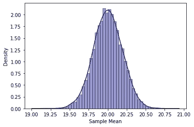
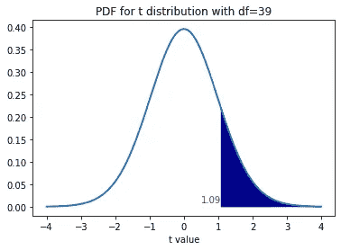

# 抽样分布——样本均值

> 原文：<https://towardsdatascience.com/sampling-distribution-sample-mean-fcf69484535e?source=collection_archive---------33----------------------->

## 用 Python 模拟和例子

在推理数据分析中讨论的最重要的概念之一是抽样分布的概念。了解抽样分布有助于我们更好地理解和解释描述性和预测性数据分析调查的结果。在不确定性和假设检验的情况下，抽样分布也经常用于决策。

[Marcin Jozwiak](https://unsplash.com/@marcinjozwiak?utm_source=unsplash&utm_medium=referral&utm_content=creditCopyText) 在 [Unsplash](https://unsplash.com/?utm_source=unsplash&utm_medium=referral&utm_content=creditCopyText) 上拍摄的照片

# 什么是抽样分布？

你可能已经熟悉了概率分布的概念。概率分布让我们了解与随机变量可能假设的值(或值的范围)相关的概率和可能性。随机变量的值(结果)是随机确定的。随机变量的一些例子包括零售商店的月收入、在任何给定的一天到达洗车场的顾客数量、在任何给定的一天在某条高速公路上的事故数量、零售商店的周销售量等。虽然随机变量的结果是随机的，但概率分布允许我们获得和了解结果中出现不同值的可能性和概率。抽样分布是我们附加到样本的样本统计上的概率分布。

# 样本均值作为样本统计量

样本统计量(也简称为统计量)是从样本中获得的值。这里有一个例子，假设你收集了居住在某个街区的 250 个随机选择的个人填写的调查结果。根据调查结果，您意识到该样本中个人的平均年收入为 82，512 美元。这是一个样本统计，用*x̅= 82，512 美元表示。*样本均值也是一个具有概率分布的随机变量(用 X̅表示)。X̅的概率分布称为样本均值的抽样分布。可以为其他类型的样本统计定义样本分布，包括样本比例、样本回归系数、样本相关系数等。

你可能想知道为什么 X̅是一个随机变量，而样本均值只是一个单一的数字！理解这一点的关键在于*样本间可变性*的概念。这个想法指的是从同一人群中抽取的样本并不完全相同。这里有一个例子，假设在上面的例子中，我们不是只对居住在某个特定社区的 250 个人进行一次调查，而是在那个社区进行了 35 个同样大小的样本。如果我们为 35 个样本中的每一个计算样本均值 *x̅* ，你将得到 35 个不同的值。现在假设，假设，我们在那个社区进行了许多相同规模的调查。我们会得到许多许多(不同的)样本均值。由这些样本平均值得到的分布就是我们所说的样本平均值的抽样分布。从这个角度考虑样本均值，我们可以想象 X̅(注意大写字母)是如何代表样本均值的随机变量，而*(注意小写字母)只是该随机变量的一种实现。*

# *样本均值的抽样分布*

*假设 *X* 代表数据(总体)，若 X 具有均值μ和标准差σ的分布，且若 X 近似正态分布或样本量 *n* 较大，*

**

*上述分布仅在以下情况下有效，*

*   *x 近似正常**或**样本量 *n* 大，*
*   *数据(总体)标准差σ已知。*

*如果 x 是正态的，那么 X̅也是正态分布的，与样本大小 *n* 无关。[中心极限定理](https://www.simplypsychology.org/central-limit-theorem.html)告诉我们，即使 x 不正态，如果样本量足够大(通常大于 30)，那么 X̅'s 分布近似正态(Sharpe，De Veaux，Velleman and Wright，2020，PP . 318–320)。如果 X̅是正态的，我们可以很容易地将其标准化并转换为标准正态分布 *Z* 。*

*如果总体标准差σ是*而不是*已知的，我们不能假设样本均值 X̅是正态分布的。如果满足某些条件(下面解释),那么我们可以将 X̅变换为另一个随机变量 *t* ,*

**

*随机变量 *t* 据说遵循 *t* 分布，具有 *n-1* 个自由度，其中 *n* 是样本大小。t 分布呈钟形且对称(就像正态分布一样)，但与正态分布相比，它的尾部更厚。这意味着与正态分布相比，离平均值越远的值出现的可能性越大。*

*对随机变量 *t* 使用 t 分布的条件如下(Sharpe 等人，2020 年，第 415-420 页):*

*   *如果 X 是正态分布，即使对于小样本量(*n<15)，也可以使用 t 分布。**
*   *如果样本量在 15 到 40 之间，只要 X 是单峰的并且合理对称，就可以使用 t 分布。*
*   *对于大于 40 的样本量，可以使用 t 分布，除非 X 的分布严重偏斜。*

# *用 Python 模拟*

*让我们从正态分布中抽取一个大小为 *n=250* 的样本。这里我们假设我们的数据是正态分布的，参数μ = 20，σ = 3。从这个群体中收集一个样本*

*运行这段代码一次，我就会得到随机变量 X̅.的一个实例(或实现)下面是我运行这段代码 10 次后， *x̅* 的 10 个值。*

**

*但是如果我运行这段代码 10，000 次，记录下 *x̅* 的值，并绘制出这些值的频率(或密度)，我会得到下面的结果。*

**

*样本均值的分布(图片由作者提供)。*

*如您所见，该分布近似对称且呈钟形(就像正态分布一样)，平均值约为 20，标准误差约等于 3/sqrt(250) = 0.19。*

*用不同的样本量从相同的人群中取样将导致不同的结果分布的分布测量。正如我们所预期的，增加样本量将减少标准误差，因此，分布将在其平均值附近变窄。请注意，即使样本量非常小，X̅分布也是正态分布。这是因为 X 是正态分布的。*

**

*样本大小对样本均值分布标准误差的影响(图片由作者提供)。*

# *人口(数据)不正常怎么办？*

*别担心！即使您的数据不是正态分布，如果样本量足够大，X̅的分布仍然可以使用正态分布来近似(根据中心极限定理)。下图显示了 x 严重向左倾斜时的 X̅分布。正如你所看到的，对于小样本，X̅'s 分布倾向于模拟 x 的分布。然而，随着样本量的增长，X̅的分布变得更加对称和钟形。如上所述，如果样本量很大(通常大于 30)，不管 x 的分布是什么，X̅'s 分布都是近似正态的。*

**

*对于大样本量，X̅'s 分布是正常的，即使 x 有一个偏斜的分布。*

# *示例和应用*

*了解 X̅的分布可以帮助我们解决问题，在不确定的情况下，我们需要使用推断数据分析来做出决策。许多商业问题需要能够解决随机事件的随机性和概率性的决策工具。假设测试 是许多不同商业领域经常使用的工具之一，包括零售运营、市场营销、质量保证等。*

*例如，假设一家零售店开展了一项大型营销活动，并有兴趣调查该活动对该店平均销售额的影响。假设管理层想要调查平均日销售额现在是否大于 8000 美元。以下假设证明了这个研究问题:*

**

*请注意，我们正在对总体平均销售额进行测试，因此μ。为了解决测试问题，假设我们记录了 40 天的销售量(样本为 *n=40* )并计算所需的统计数据。假设日销售量的平均值和标准差分别计算为 *x̅=$8,100* 和 *s=$580，*。由于σ的值未知，并且假设上述假设检验正在进行，我们可以将 X̅转换为自由度为 *n-1=39* 的随机变量 *t* ，其中，*

**

*为了解决测试问题，我们需要找到与测试相关的 p 值。该属性计算如下:*

**

*随机变量 *t* 的概率密度函数以及测试的 p 值如下所示。*

**

*测试的 p 值在图片中突出显示(图片由作者提供)。*

*下面将找到测试的 p 值。*

*计算得出的 p 值约等于 0.14。根据大多数标准(显著性水平)，这是一个大的 p 值，表明我们未能拒绝零假设。换句话说，根据 X̅的分布和收集的样本，我们不能得出零售店的平均日销售量μ大于 8000 美元的结论。这个计算是可能的，只是因为我们知道 X̅的分布。*

*可以为其他样本统计(例如，样本比例、回归预测系数等)定义采样分布。)也用于其他环境，如置信区间和预测区间或对回归结果的推断分析。*

*[1]: Sharpe N. R .，De Veaux R. D .，Velleman P. F .，Wright D. (2020) *商业统计，第四版加拿大*。加拿大皮尔逊公司。*