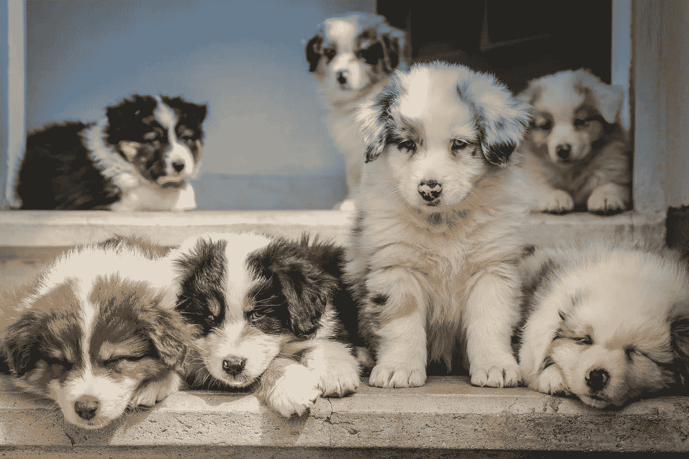
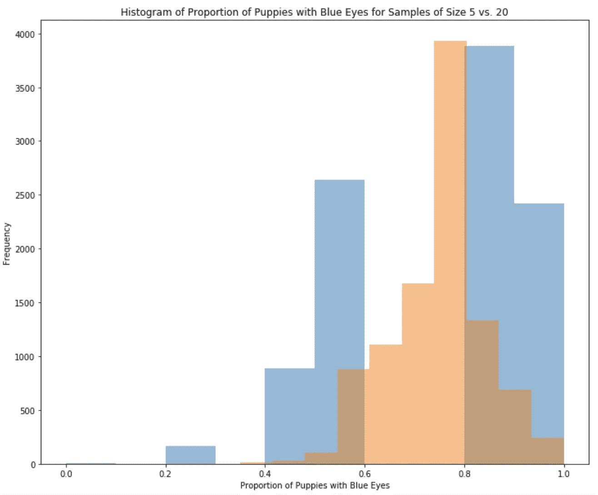
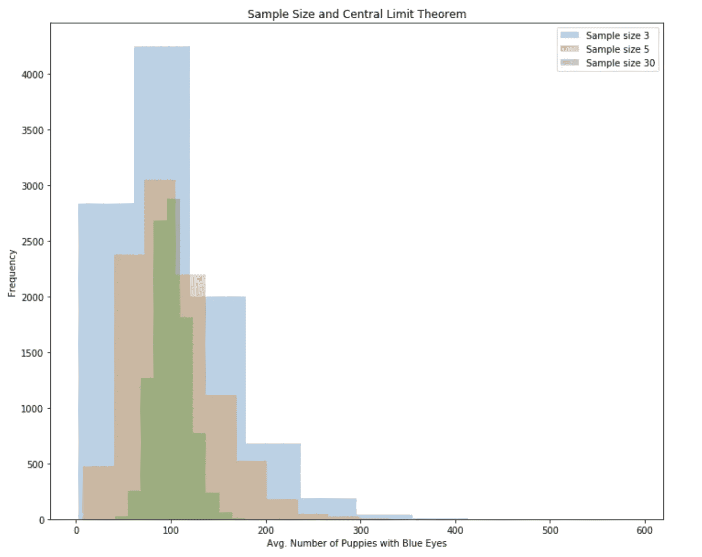

# 使用 Python 实现的样本分布

> 原文：<https://towardsdatascience.com/sampling-distributions-with-python-implementation-3f4555e1d450?source=collection_archive---------29----------------------->

## 抽样分布、中心极限定理和用 Python 例子解释的自举

在 [Unsplash](https://unsplash.com/s/photos/puppies?utm_source=unsplash&utm_medium=referral&utm_content=creditCopyText) 上由 [Jametlene Reskp](https://unsplash.com/@reskp?utm_source=unsplash&utm_medium=referral&utm_content=creditCopyText) 拍摄的照片

抽样分布是统计数据的分布(可以是任何统计数据)。你可能会问为什么抽样分布很重要？嗯，它们是推断统计学的关键，推断统计学的目标是根据从一个群体的个体样本中收集的数据得出关于该群体的结论。

在本文中，感兴趣的群体是 10，000 只澳大利亚牧羊犬幼犬。我一直很好奇澳洲狗有蓝眼睛的比例是多少，淡褐色的比例是多少(假设这是它们唯一能拥有的两种眼睛颜色现实中并不是这样！).所以我们要估计的参数是蓝眼睛小狗在我们人口中所占的比例。假设我能找到 20 只小狗作为我们的样本参与实验。那 30 只小狗中蓝眼睛的比例(比例是 0，1 值的平均值)是我们的统计。下面你可以看到这个例子是模拟的

采样分发服务器有以下两个属性:

1.  采样分布以原始参数值为中心。
2.  样本量越大，抽样分布的方差越小。

从上面我们可以看到，原始样本的平均值为 0.75，标准偏差和方差分别为 0.433 和 0.187。让我们在示例中探索上述属性:

我们看到样本的比例以原始平均值(0.75)为中心。对于较大的样本量(20，如图中橙色所示)，这一点更容易观察到。我们还可以看到，与 5 个样本相比，20 个样本的方差在减小。实际上，每个样本的方差就是原始数据的方差除以样本量。

在处理抽样分布时，经常会讨论两个重要的数学定理:

1.  大数定律
2.  中心极限定理

# 大数定律

大数定律表明，随着样本量的增加，样本均值将越来越接近总体均值。让我们用我们的例子来验证一下。

我们可以看到，在一个规模为 100 的样本中，平均值更接近原始平均值。

# 中心极限定理

该定理指出，在样本量足够大的情况下，均值的抽样分布将呈正态分布。这个定理并不适用于所有的统计学。它适用于以下情况:

1.  样本均值
2.  样本均值之间的差异
3.  样本比例
4.  样本比例之间的差异

为了验证这一点，让我们将我们的示例更改为非正态分布的样本。

我们看到，对于大小为 3 和 5 的样本，分布向右倾斜，对于大小为 30 的样本，分布更接近正态分布。

# 拔靴带

依赖数学定理，如中心极限定理，会导致缺口。我们可能不总是能够获得足够大的样本(收集 5 只小狗已经够难了！正如我们在中心极限定理一节中看到的，5 不是一个足够大的样本)或者我们可能在这些定理不适用的地方使用样本统计。

在这些情况下，我们可以使用自举。统计学中的自举意味着替换抽样，它允许我们模拟抽样分布的创建。`np.random.choice(sample, size, replace=True`可用于自举。事实上，在前面的所有章节中，我们已经从 20 只小狗的样本中进行了引导。通过自举，然后计算我们统计数据的重复值，我们可以了解我们统计数据的抽样分布。