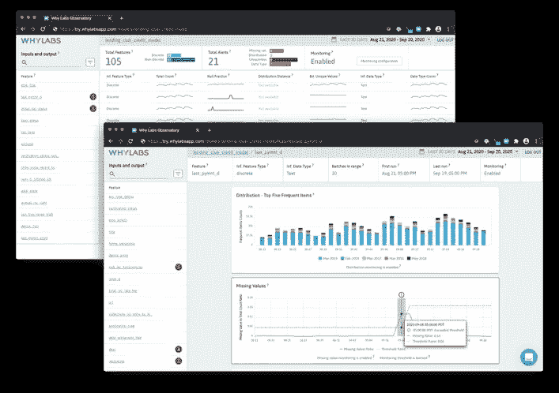

# 采样是不够的，取而代之的是分析您的 ML 数据

> 原文：<https://towardsdatascience.com/sampling-isnt-enough-profile-your-ml-data-instead-6a28fcfb2bd4?source=collection_archive---------25----------------------->

## 人工智能和数据管道的生产测井方法

艾萨克·巴克斯和伯尼斯·赫尔曼

照片由 [Unsplash](https://unsplash.com?utm_source=medium&utm_medium=referral) 上的 [Petri R](https://unsplash.com/@petri_r?utm_source=medium&utm_medium=referral) 拍摄

现在是 2020 年，我们大多数人仍然不知道我们的模型在生产中何时、何地、为何或如何出错。虽然我们都知道“什么会出错，什么会出错”，或者“老鼠和[数据科学家]精心制定的计划经常出错”，但复杂的模型和数据管道往往被推向生产，而很少关注诊断不可避免的不可预见的故障。

在传统的软件中，日志记录和工具已经被作为标准的实践来创建透明性和理解复杂系统的健康状况。当涉及到人工智能应用时，日志记录通常是不完整的。在这篇文章中，我们概述了 ML 日志记录的不同方法，并对它们进行了比较和对比。最后，我们提供了一个名为 WhyLogs 的开源库，只需几行代码就可以实现数据记录和分析。

# 传统软件中的登录是什么？

日志是开发和操作健壮软件系统的重要工具。当您的生产系统进入错误状态时，使用工具来更好地定位和诊断问题的来源是非常重要的。

对于许多软件工程学科来说，堆栈跟踪有助于定位执行路径并确定程序在失败时的状态。但是，堆栈跟踪并不能提供故障发生前状态如何变化的信息。日志记录(及其相关术语，[软件跟踪](https://en.wikipedia.org/wiki/Tracing_(software)))是将程序执行和事件信息存储到一个或多个文件中的一种实践。日志对于诊断各种软件的问题至关重要；生产系统的必备。

图片由[monkeyuser.com](http://monkeyuser.com)免费使用

# 数据记录有何不同？

统计应用程序，如数据科学和机器学习中的应用程序，是需要日志记录的主要候选对象。然而，由于这些应用程序的复杂性，可用的工具仍然有限，它们的采用远不如标准软件日志广泛。

统计应用通常是不确定的，并且需要许多状态变化。由于需要处理广泛分布的状态，必须避免严格的逻辑断言，并且机器学习软件通常永远不会到达错误状态，而是静静地产生差的或不正确的结果。这使得错误分析变得更加困难，因为维护人员在问题发生时不会被提醒。

当检测到错误状态时，诊断问题通常很费力。与显式定义的软件相比，数据集对于内省来说尤其不透明。软件完全由代码指定，开发人员可以轻松地包含精确的日志记录语句来查明问题，而数据集和数据管道则需要大量的分析来进行诊断。

虽然 ML 中有效的日志实践可能难以实现，但在许多情况下，它们甚至比标准软件更有必要。在典型的软件开发中，在部署到生产环境之前，大量的问题可能会被编译器、ide、类型检查、逻辑断言和标准测试所捕获。有了数据，事情就没那么简单了。这激发了在 ML 操作中改进工具和最佳实践的需求，以推进统计记录。

软件开发中对好的测井工具的一般要求同样适用于 ML 操作领域。这些要求可能包括(但当然不限于)以下内容。

# 记录要求

1.  易于使用
    良好的日志记录有助于开发，因为它可以尽早地、经常地向开发人员公开内部功能。如果日志是笨重的，没有人会使用它。软件开发中常见的日志模块可以像打印语句一样简单易用。
2.  **轻量级**
    日志记录不应该干扰程序执行，因此必须是轻量级的。
3.  **标准化便携**
    现代系统庞大复杂，我们必须能够调试。日志需要多语言支持。输出格式应该是标准的，易于从多个来源进行搜索、过滤、消费和分析。
4.  我们必须能够在不修改代码的情况下修改所有服务的详细程度、输出位置，甚至可能是格式。对于开发人员或数据科学家来说，详细程度和输出要求可能与生产服务非常不同。
5.  **接近代码**
    日志记录调用应该存在于它们所引用的代码/服务中，日志记录应该让我们非常快速地查明服务中的问题发生在哪里。日志记录提供了一种生成系统内部逻辑功能跟踪的系统方法。

# 谈到 ML 日志记录，有哪些方法可用？

## 标准代码内日志记录

在数据科学中，标准日志模块可以而且应该做很多事情。我们可以记录数据访问、正在执行的步骤(培训、测试等)。还可以记录模型参数和超参数以及更多细节。专注于 ML 用例的服务和库(比如 CometML)可以扩展这种日志的效用。

虽然标准日志记录可以提供很大的可见性，但它很少甚至不提供对数据的内省。

**优点**

*   灵活且可配置
*   可以跟踪中间结果和低复杂度的数据
*   允许重用现有的非 ML 测井工具

**缺点**

*   高存储、I/O 和计算成本
*   数据科学家可能不熟悉或不适合日志记录格式
*   日志处理需要计算量很大的搜索，特别是对于复杂的 ML 数据
*   由于昂贵的存储成本，数据保留率较低；对过去问题的根本原因分析不太有用

## 抽样

监控 ML 特有的大量数据的一种常见方法是记录数据的随机子集，无论是在训练、测试还是推理过程中。随机选择数据的某个子集并存储它以供以后参考，这可能是相当直接和有用的。基于采样的数据记录不能准确表示异常值和罕见事件。因此，诸如最小值、最大值和唯一值等重要指标无法准确测量。保留异常值和不常见值非常重要，因为它们通常会影响模型行为，导致模型预测出现问题，并且可能表明存在数据质量问题。

**优点**

*   易于实施
*   比其他日志解决方案需要更少的前期设计
*   日志处理等同于对原始数据的分析
*   数据科学家熟悉的数据输出格式

**缺点**

*   高存储、I/O 和计算成本
*   信号嘈杂，覆盖范围有限；小样本要求可扩展且轻便
*   没有统计分析处理步骤是不可读或不可解释的
*   抽样往往会遗漏罕见事件和异常值
*   无法精确计算依赖于异常值的指标，如最小值/最大值和唯一值
*   输出格式依赖于数据，这使得与监控、调试或自省工具集成更加困难

## 数据剖析

记录数据的一种有前途的方法是数据剖析(也称为数据草图或统计指纹)。这个想法是捕捉给定数据集的人类可解释的统计特征，以提供对数据的洞察。已经存在广泛的有效流算法来生成可扩展的、轻量级的数据集统计特征，并且文献非常活跃并且正在增长。然而，在实践中实现这些算法存在重大的工程挑战，特别是在 ML 日志记录的环境中。一个项目正在努力克服这些挑战。

**优点**

*   易用性
*   可扩展且轻量级
*   通过基于文本的配置文件灵活配置
*   准确表示罕见事件和离群值相关指标
*   无需进一步处理即可直接解释的结果(如直方图、平均值、标准差、数据类型)

**缺点**

*   没有现有的普遍解决方案
*   解决方案背后涉及数学和工程问题

# 让数据记录变得简单而不妥协！介绍 WhyLogs。

数据分析解决方案 WhyLogs 是我们对 ML 的现代、简化数据记录的贡献。WhyLogs 是一个开源库，其目标是通过提供近似的数据分析和满足上述五个日志记录要求(简单、轻量级、可移植、可配置、接近代码)来弥补 ML 日志记录的不足。

估计的统计配置文件包括每个要素的分布近似值，这些近似值可以提供直方图和分位数、总体统计数据(如最小/最大/标准偏差)、唯一性估计值、空计数、频繁项目等。所有的统计数据都是可合并的，这使得算法变得非常并行，并且允许将多个数据集的数据合并在一起，以便以后进行分析。这对于实现灵活的粒度(因为您可以更改聚合级别，例如，从每小时更改为每天或每周)和登录分布式系统非常关键。

WhyLogs 还支持适用于生产环境的特性，如标记、小内存占用和轻量级输出..标记和分组功能是实现细分级别分析以及将细分映射到核心业务 KPI 的关键。

## 便携轻巧

目前，有 [Python](https://github.com/whylabs/whylogs-python) 和 [Java](https://github.com/whylabs/whylogs-java) 实现，提供 Python 与 pandas/numpy 的集成，以及与 Spark 的可扩展 Java 集成。生成的日志文件很小，并且跨语言兼容。我们在以下数据集上测试了 WhyLogs Java 的性能，以验证 WhyLogs 的内存占用和输出二进制文件的大小。

*   借贷俱乐部数据: [Kaggle 链接](https://www.kaggle.com/wordsforthewise/lending-club)
*   纽约市门票: [Kaggle 链接](https://www.kaggle.com/new-york-city/nyc-parking-tickets)
*   美国的止痛药: [Kaggle 链接](https://www.kaggle.com/paultimothymooney/pain-pills-in-the-usa)

我们在每个数据集上运行我们的配置文件，并收集 JMX 指标:

## 易于使用、可配置且接近代码

WhyLogs 可以很容易地添加到现有的机器学习和数据科学代码中。Python 实现可以“pip”安装，除了具有可访问 API 的库之外，还提供交互式命令行体验。

WhyLogs jupyter 笔记本示例

## 更多示例

更多使用 WhyLogs 的例子，请查看 [WhyLogs 入门笔记本](https://github.com/whylabs/whylogs-examples/blob/mainline/python/GettingStarted.ipynb)

## 强大的附加功能

当与实时数据的监控和其他服务相结合时，可以看到 WhyLogs 的全部威力。要探索这些功能如何与 WhyLogs 配合，请查看 WhyLabs 平台的[实时沙盒，该沙盒运行在 Lending Club 数据集的修改版本上，每天接收 WhyLogs 数据。](https://try.whylabsapp.com/)

WhyLabs 平台截屏捕捉了模型运行状况仪表板和功能运行状况视图。作者图片

# 让我们让数据记录成为生产 ML 系统的黄金标准！

数据科学、机器学习以及围绕它们的技术正以极快的速度发展，这些操作的规模以及参与其中的人数也是如此。伴随这种快速增长而来的是不可避免的问题激增。最佳实践在 ML 中仍处于萌芽状态，但正如软件和系统工程的情况一样，最佳实践必须继续成长和发展。有效的日志记录肯定在操作健壮的 ML/AI 系统的最佳实践中扮演主要角色。需要 WhyLogs 等项目来应对这些统计系统的独特挑战。

点击这里查看 Python [和 Java](https://github.com/whylabs/whylogs-python) [的 WhyLogs，点击这里](https://github.com/whylabs/whylogs-java)，或者开始阅读[文档](http://whylogs.readthedocs.io)。我们喜欢反馈和建议，所以请加入[我们的 Slack 频道](https://join.slack.com/t/whylabs-community/shared_invite/zt-hi7k7pv7-g0ZHAaFpRvP1kUMR~Y1bWA)或发送电子邮件至 [support@whylabs.ai](mailto:support@whylabs.ai) ！

*感谢我在 WhyLabs 的队友 Bernease Herman 合作撰写了这篇文章。关注* [*Bernease 上的*](https://twitter.com/bernease)