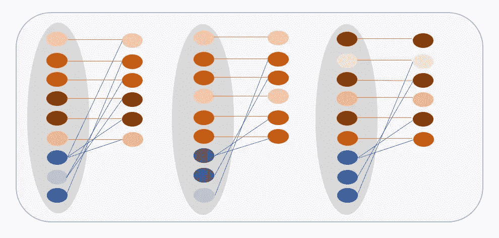
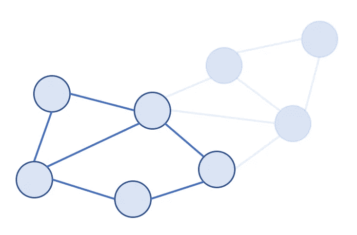
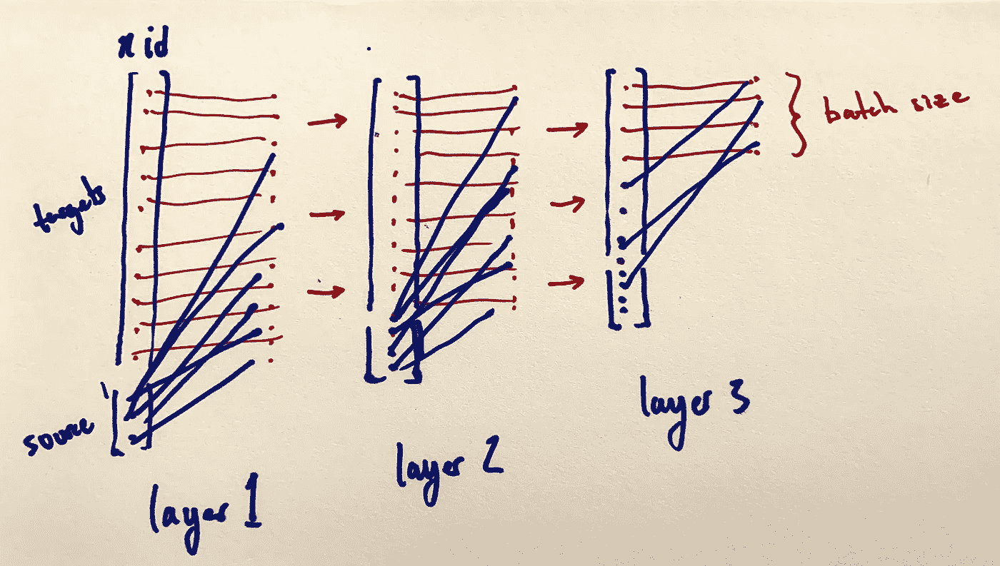
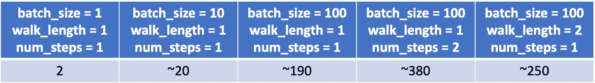

# PyTorch 几何图形中的大型图形采样

> 原文：<https://towardsdatascience.com/sampling-large-graphs-in-pytorch-geometric-97a6119c41f9?source=collection_archive---------24----------------------->

## 大型图上的图形深度学习技术

有时，我们会遇到大型图形，迫使我们超出 GPU 或 CPU 的可用内存。在这些情况下，我们可以利用图形采样技术。 [PyTorch Geometric](https://pytorch-geometric.readthedocs.io/en/latest/index.html) 是一个图形深度学习库，允许我们轻松实现许多图形神经网络架构。该库包含许多标准的图形深度学习数据集，如 Cora、Citeseer 和 Pubmed。但是最近图形开放数据集中出现了使用大规模网络的趋势，如[开放图形基准](https://ogb.stanford.edu/) (OGB) [3]。在 OGB，各种数据集从 ogbn-arxiv (169，343 个节点)这样的“小型”网络一直到 ogbn-papers100M (111，059，956 个节点)这样的“大型”数据集。也许 ogbn-arxiv 可以适合内存，如果你只是用一个小的 GCN 或其他东西做一个节点分类，但是尝试任何超出这个范围的东西，或者在 OGB 使用一个中到大的数据集，你可能不得不求助于对图形进行采样。

有多种方法可以对大型图表进行采样，我将尝试介绍两种主要的方法。

1.  邻居采样器



来自 3 层邻域采样器的二部图草图

2.GraphSAINTSampler



来自 GraphSAINTSampler 小批量的子图采样器的草图

**neighborhood sampler**类来自 GraphSAGE paper， [*大型图形上的归纳表示学习*](https://arxiv.org/pdf/1706.02216.pdf)*【2】*。*如果你之前没有使用过 SAGEConv，你可以把它想象成学习一个基于节点的邻域输出节点嵌入的函数，而不是直接学习所有的节点嵌入。这使得它对归纳任务特别有用，因为你可以通过它从未见过的 GNN 节点。*

*我画了一个 3 层的 GNN 邻居样本的抽象视图，每个层都被分成一个二分图邻居样本。*

**

*邻域采样的三层 GNN 示意图*

*我试图用蓝色画出源节点，用红色画出目标节点。如您所见，目标节点也有自循环，因此它们出现在二分图的左侧和右侧。下面是代码的样子:*

```
*train_loader = NeighborSampler(data.edge_index, node_idx=train_idx, 
                               sizes=[15, 10, 5], batch_size=1024, 
                               shuffle=**True**, num_workers=12)*
```

*`sizes`指定每个源节点要采样的邻居数量。想象一下，从我们想要计算嵌入的节点集开始(这些是上图第 3 层中最后的红色节点)。然后，我们计算超参数指定的所有样本，最终返回给我们——相反。这意味着当我们遍历所有层时，我们最终只得到我们感兴趣的节点嵌入。*

**注意*:每个小批量中的节点 id 是大图中的原始节点 id。该采样器本身不对子图进行采样，而是对邻域进行采样，以学习聚合函数。*

*从 ogbn-products 数据集上 PyTorch Geometric 中的 [GraphSAGE 示例](https://github.com/rusty1s/pytorch_geometric/blob/master/examples/ogbn_products_sage.py)中，我们可以看到`train_loader`由`batch_size`、`n_id`和`adjs`组成。*

```
***for** batch_size, n_id, adjs **in** train_loader:
    ...
    out = model(x[n_id], adjs)
    ...*
```

*`n_id`是采样过程中使用的每个节点的所有节点 id，包括采样的邻居节点和源节点。通过传递我们的模型`x[n_id]`,我们只隔离了在这一批计算中使用的那些节点的节点特征向量。`adjs`中有 3 个`adj`，由一个`edge_index`、`e_id`和`size`组成。因此，在 PyTorch 几何模型的 SAGE 模型中，我们有:*

```
***def** forward(self, x, adjs): 
    **for** i, (edge_index, _, size) **in** enumerate(adjs): 
        x_target = x[:size[1]] 
        x = self.convs[i]((x, x_target), edge_index)            
        **if** i != self.num_layers - 1:                
            x = F.relu(x) 
            x = F.dropout(x, p=0.5, training=self.training) 
    **return** x.log_softmax(dim=-1)*
```

*现在你可以看到`adjs`中的三个二分图分别被传递到三个卷积层。*

*这种方法的一个可能的缺点是，我们实际上并没有从训练数据中为每一批抽取子图。采样器试图模仿在训练数据集网络上的 GNN 卷积，而不是在每次迭代中获取实际样本。这可能是有益的，这样就不会使你的训练循环产生偏差，但是如果你正在做一些简单的分类或者链接预测之外的事情，我会遇到一些关于索引的问题。然而，从另一个角度来看，与子图采样相比，这种方法可能是有益的，因为我们减少了训练数据的偏差。*

***GraphSAINTSampler** 允许您处理原始训练数据集的实际子图，并重写从 0 到 *n* 的节点 id，其中 *n* 是子图中的节点数。*

*GraphSAINTSampler 父类有三个子类:GraphSAINTNodeSampler、GraphSAINTEdgeSampler 和 GraphSAINTRandomWalkSampler。这些类中的每一个都使用它们各自的采样方案来计算节点的重要性，这转化为采样的概率分布[5]。这个初始采样器就像一个预处理步骤，估计被采样的 *V* 中的节点 *v* 和 *E* 中的边 *e* 的概率。该概率稍后被用作子图的归一化因子[4]。*

*下面是 PyTorch Geometric 中的 [graph_saint 示例](https://github.com/rusty1s/pytorch_geometric/blob/master/examples/graph_saint.py)中的 GraphSAINTRandomWalkSampler 示例。*

```
*loader = GraphSAINTRandomWalkSampler(data, batch_size=6000, 
                                     walk_length=2, num_steps=5, 
                                     sample_coverage=100, 
                                     save_dir=dataset.processed_dir, 
                                     num_workers=4)*
```

*请记住，根据您设置超参数的方式，加载器可能不会加载整个数据集。`batch_size`超参数是每批抽样的行走次数。例如，使用 Citeseer 数据集和`batch_size = 1`、`walk_length = 1`和`num_steps = 1`，我们得到 1 个包含 2 个节点的数据样本。使用`batch_size = 10`,我们得到 1 个有 20 个节点的数据样本。使用`batch_size = 100`,我们得到大约 200 个节点——在每次迭代中可能会改变，例如 189、191 等。`num_steps`超参数是每个时期的迭代次数。因此，如果我们将`num_steps`增加到`2`，那么节点的数量将增加到大约 380，其中有一个`batch_size = 100`和一个`walk_length = 1`。`walk_length`超参数指的是采样器每次随机行走的长度，返回节点数量的结果将根据网络的分类性而有很大的不同。这实际上编译了 PyTorch Geometric 的`torch_sparse`库中稀疏张量表示上的随机行走的 C++实现(以及随后的 cuda 实现)。请参阅关于使用自定义 C++操作符扩展 TorchScript 的 [PyTorch 教程](https://pytorch.org/tutorials/advanced/torch_script_custom_ops.html)了解更多信息。*

**

*Citeseer 数据集上各种超参数的 GraphSAINT 数据加载器中的节点数*

*GraphSAINT 论文最重要的方面之一是计算归一化统计量，以减少每个子图样本中的偏差。GraphSAINTSampler 计算这些统计数据，这部分由`sample_coverage`超参数控制。得到的统计数据作为`data`对象的一个`edge_norm`属性返回。我们可以在用`edge_norm`属性正向传递我们的图形神经网络之前修改`edge_weight`属性。*

```
*edge_weight = data.edge_norm * data.edge_weight            
out = model(data.x, data.edge_index, edge_weight)*
```

*[1]费伊先生。 [PyTorch 几何](https://pytorch-geometric.readthedocs.io/en/latest/index.html)。图形深度学习库。*

*[2] W. Hamilton 等人，[大型图上的归纳表征学习](https://arxiv.org/abs/1706.02216) (2017)。*

*[3] W .胡等著[开图基准](https://ogb.stanford.edu/) (2020)。*

*[4] H. Zeng 等， [GraphSAINT:基于图抽样的归纳学习方法](https://arxiv.org/abs/1907.04931) (2020)*

*5 布朗斯坦先生。[简单可扩展图形神经网络](/simple-scalable-graph-neural-networks-7eb04f366d07) (2020)。*