# 旧金山阿片类药物危机和毒品问题及其对公共安全的影响

> 原文：<https://towardsdatascience.com/san-franciscos-opioid-crisis-and-drug-problem-and-effects-on-public-safety-1ffad5040e0f?source=collection_archive---------43----------------------->

## 使用机器学习和分类技术的旧金山毒品和犯罪分析

禁毒战争是一个阶段，指的是政府主导的行动，旨在通过加大和加强对违法者的惩罚来阻止非法毒品的使用、分销和交易。这场运动始于 20 世纪 70 年代，至今仍在发展。因此，近年来美国许多州正在经历阿片类药物危机。有一个正在进行的辩论，阿片类药物危机是墨西哥和中美洲移民的产物，而不是大型制药公司的放松管制和私人医疗保健系统的失败。因此，在这种情况下，旧金山正面临着严重的毒品问题和阿片类药物危机。我与[卡提克亚舒克拉](https://www.linkedin.com/in/kartikeya-shukla-738a48160)和[郝舒](https://github.com/hs3812)一起选择了这个数据集来执行 EDA，并应用数据科学分类算法，如 XGBoost、KNN、回归、朴素贝叶斯和随机森林，以从可视化结果中获得洞察力。旧金山(SF)在推动进步的公共卫生解决方案方面有着悠久的历史，包括医用大麻和针头交换，在这两者都合法或被广泛接受之前。这是如此不成比例，以至于加州通过了一项法案，允许旧金山开设安全注射点(SIS)。

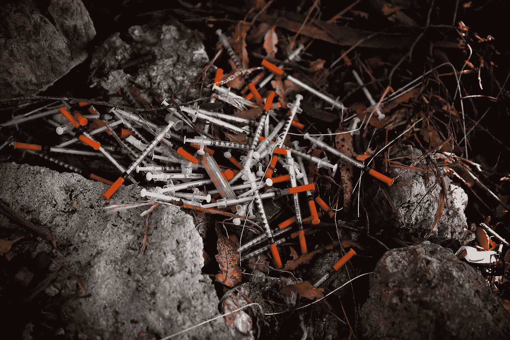

旧金山阿片类药物危机

旧金山(SF)在推动进步的公共卫生解决方案方面有着悠久的历史，包括医用大麻和针头交换，在这两者合法或被广泛接受之前。这是如此不成比例，以至于加州通过了一项法案，允许旧金山开设安全注射点(SIS)。

# 安全注射点(SIS):

安全注射场所是受医疗监督的设施，旨在提供一个卫生和无压力的环境，在这个环境中，个人能够静脉注射非法娱乐性药物，并减少公共药物使用造成的滋扰。它们是针对毒品问题的减少危害方法的一部分。北美的第一家 SIS 网站于 2003 年在温哥华市中心东区(DTES)附近开业。

# 潜在问题:

> 比较不同社区的犯罪类型。你可能会被袭击的前五个街区是哪里？某些“成对”犯罪是否经常在某个街区同时发生？
> 
> 为旧金山政府确定安装 SIS 的潜在社区

# 目标变量:

1.  2003 年至 2018 年犯罪类型与邻里之间的相关性
2.  某些类型的犯罪是经常一起发生，还是特别一起发生
3.  2013 年至 2018 年使用的药物类型与社区之间的相关性
4.  确定旧金山政府建设安全注射点的潜在社区/区域
5.  根据提供的空间和时间特征预测犯罪的类型/类别

# 数据:

我们的数据来自旧金山警察局的数据库。这是从 2003 年 1 月到 2018 年 5 月的犯罪历史数据。数据集有 13 列和 2215024 行。

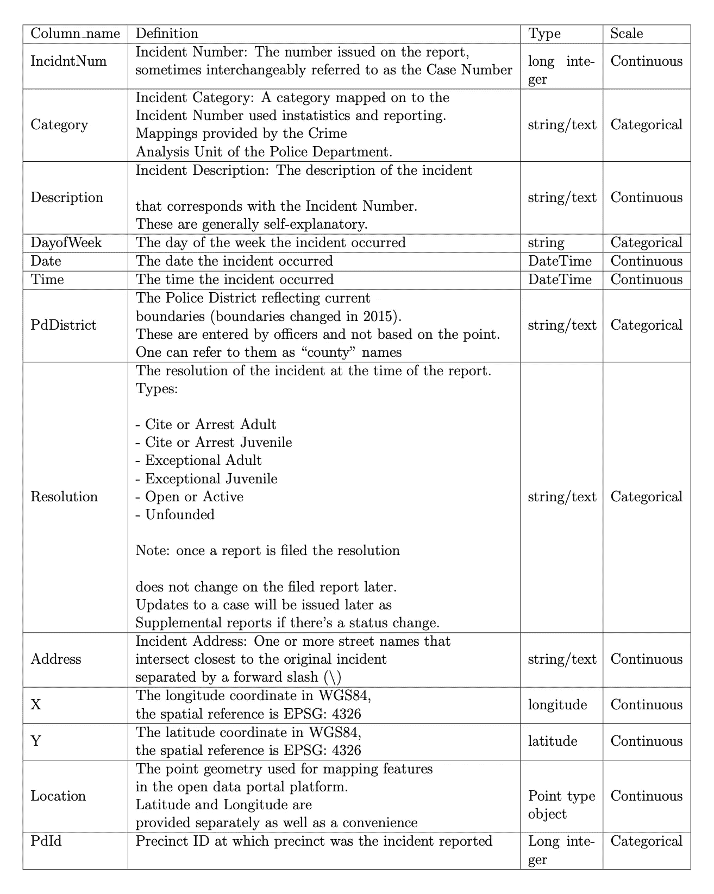

数据集元数据

# 分析和推论:

1.  我们统计了每一类犯罪的发生次数，并绘制了图表。由于分布是偏斜的，我们通过取对数来标准化它。以下是标准化的犯罪类别分布。

2.有 915 个不同的犯罪描述，这些描述决定了犯罪是否与毒品有关。因此，我们计算了每种犯罪描述的发生率，并过滤掉低于 97%的犯罪描述，剩下的用于创建聚类图。

3.创建了一个聚类图，以探索不同类型的犯罪分布(即每个 PD 区(即警区)的犯罪分布)。同样，由于这种分布是偏斜的，它影响了我们的模型(如下所示)。人们可以观察到侠盗猎车手是一个离群值，除此之外，我们没有获得任何信息，因此需要规范化。

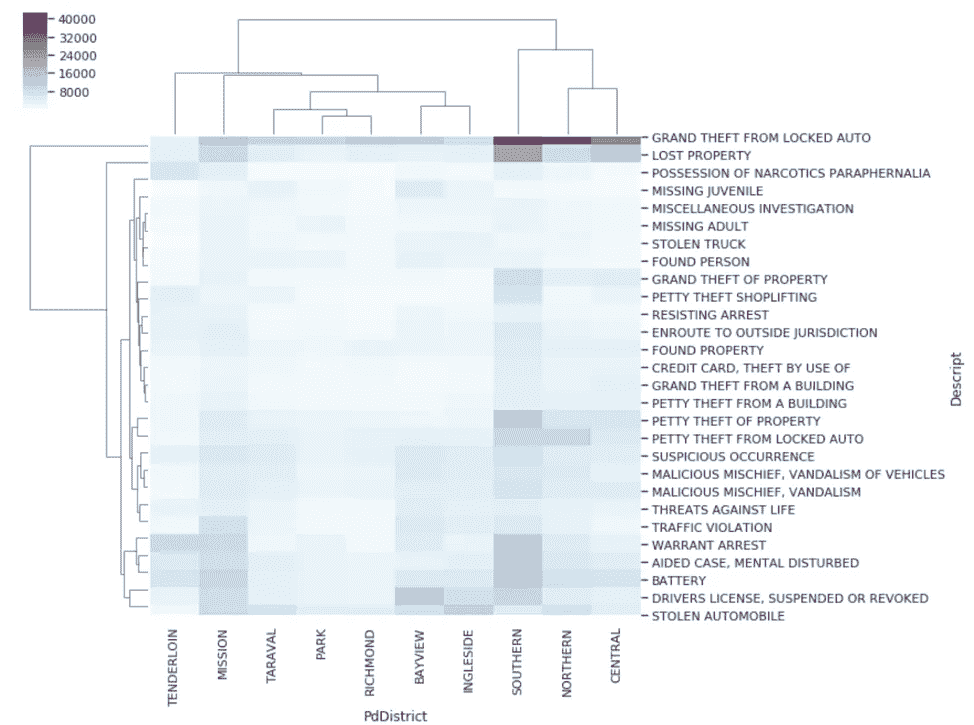

4.因此，使用**最小-最大归一化**进行归一化，因为记录日志不会保留一个特征相对于另一个特征的大小比例。下面是标准化的聚类图:

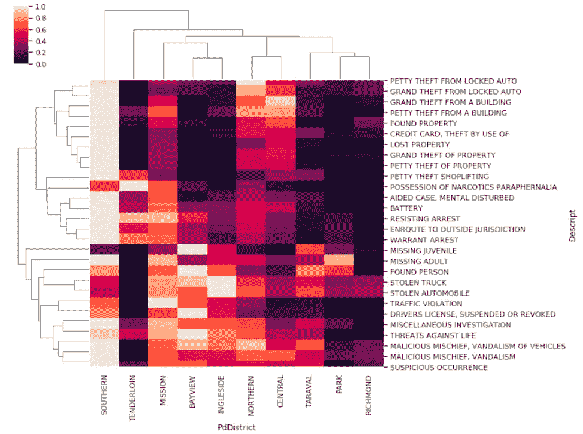

在这里，我们可以观察到以下情况:

(一)*南部:*极高的盗窃发生率，包括从汽车中盗窃
(二)*湾景:*重大的暴力和威胁事件

(iii) *Tenderloin:* 似乎是一个异常值，拥有毒品用具的发生率极高。Tenderloin 似乎是安装 SIS 的潜在候选人，尽管它可能是假阳性(即这些可能是由于大麻)。因此，人们需要更深入地研究。

5.接下来，我们使用一些正则表达式和字符串模式匹配过滤了与毒品相关的犯罪，并统计了每个与毒品相关的描述的出现次数。同样，分布是倾斜的，它影响了下面显示的聚类图。人们可以观察到 Tenderloin 是一个异常值，我们没有获得其他信息。

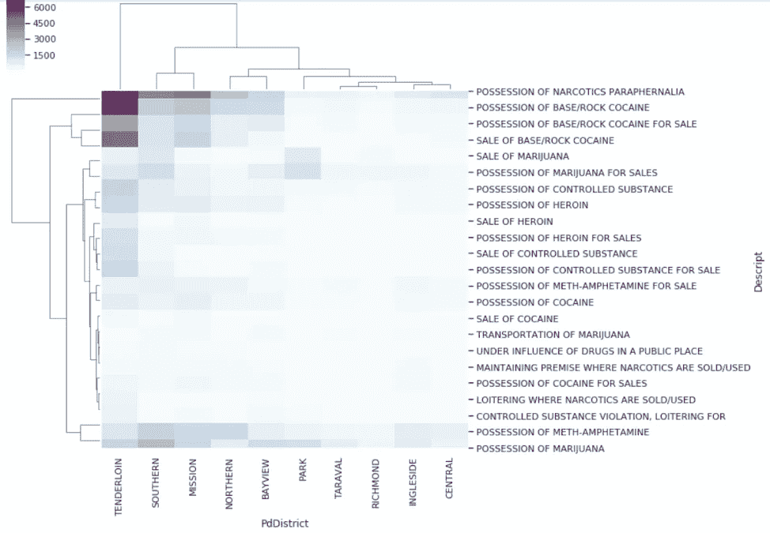

6.下面是标准化的聚类图，显示了各县与毒品相关的犯罪的分布情况。

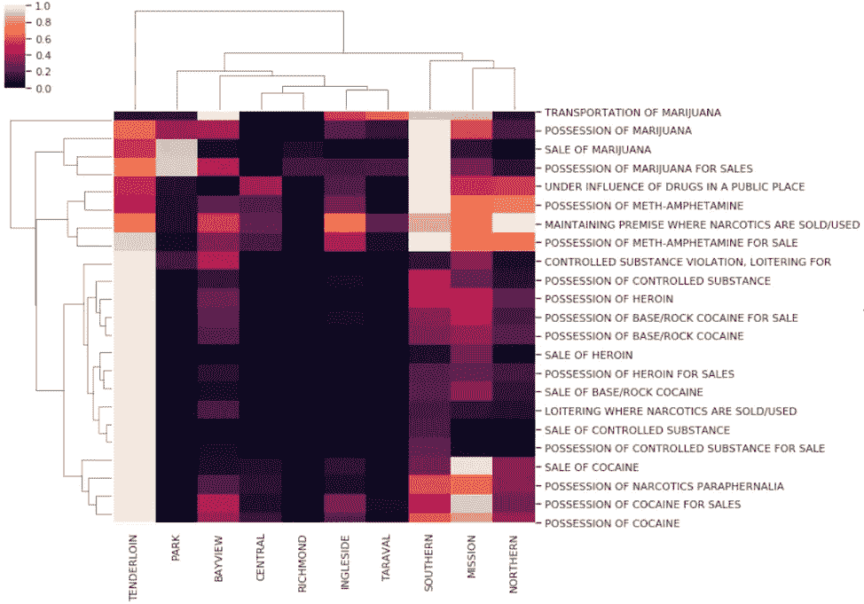

***推论:***

> 从上面的聚类图，我们可以清楚地得出结论，田德隆，南部，使命和北部是安装 SIS 的最佳候选人

7.此后，进行时间序列分析，以分析阿片类药物随时间的变化趋势。首先，我们压缩了大量与毒品相关的犯罪描述，以创建阿片类药物组/特征(即巴比妥酸盐特征、可卡因特征、大麻特征、冰毒特征等)。然后，我们为每个组创建了一个 30 天的窗口，并统计了从 2003 年 1 月 1 日到 2018 年 5 月 15 日每个月的 30 天窗口内每个组的事件数量。

为了去除月份的周期性特征，我们将它们从 0 到 187 进行索引。下面是一个堆积直方图，代表这些趋势。如你所见，与冰毒和海洛因相关的事件显著上升。

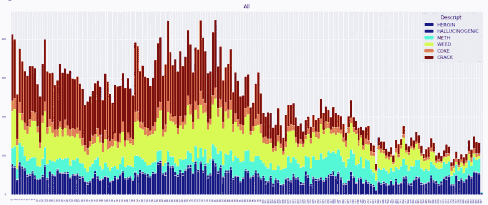

8.为了使趋势更加清晰，以下是 2003 年至 2018 年期间类阿片趋势的标准化分布。

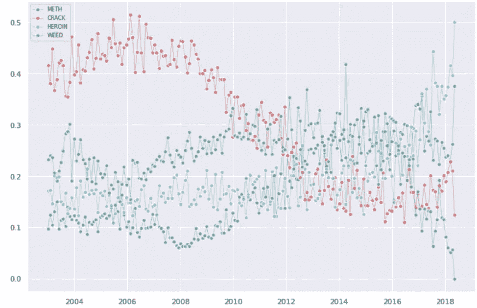

人们可以观察到，与裂纹相关的事件在此期间有所减少。同样，大麻相关事件在 2016 年合法化后有所下降。但是与冰毒和海洛因相关的犯罪显著上升——这是断定这是一种流行病的实质性证据。

# 型号选择:

1.  我们从一个二元逻辑回归模型开始，该模型预测了犯罪是否与毒品有关的可能性，给出了某些地理坐标。这将有助于旧金山政府根据预测向某些地区分配资源。我们最初的准确率是 94%，高得“令人怀疑”。因此，我们检查了偏见——我们发现我们的目标阶层是不平衡的——也就是说，与毒品相关的犯罪相比，与毒品无关的犯罪要多得多。因此，我们使用 SMOTE 对目标类进行了过采样。在此之后，我们的准确率为 77%，这是有意义的，尽管 AUC 从 0.68786 上升到 0.69875。

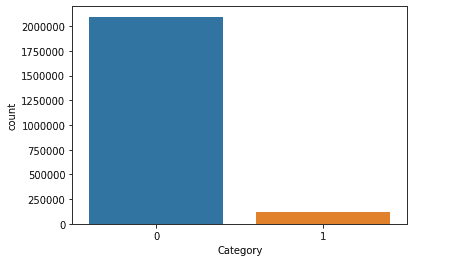

目标类别分布(过采样前)

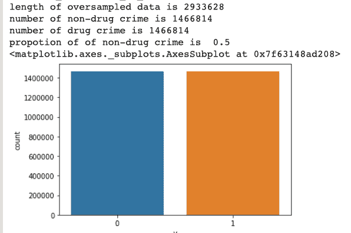

目标类别分布(过采样后)

这种不平衡的分布可以通过欠采样或过采样来解决。选择过采样的原因是，尽管欠采样可能有效，但在此过程中会丢失许多有用的数据。这些数据对逻辑回归算法是有意义的。

过采样技术是 **SMOTE** ，代表合成少数过采样技术。原因有二。首先， **SMOTE** 是一种非常常见的过采样技术。其次，当对不平衡数据集中的少数类进行过采样时，可能发生的情况是，模型最终会学习到少数几个示例的太多细节，通常是通过随机添加少数类数据这样的简单方法。另一方面，SMOTE 学习少数数据点的邻域的属性。这样，模型可以更好地泛化。

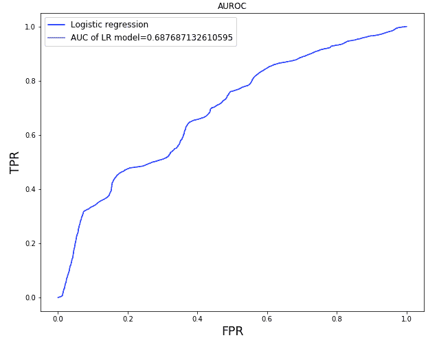

过采样前的 AUC

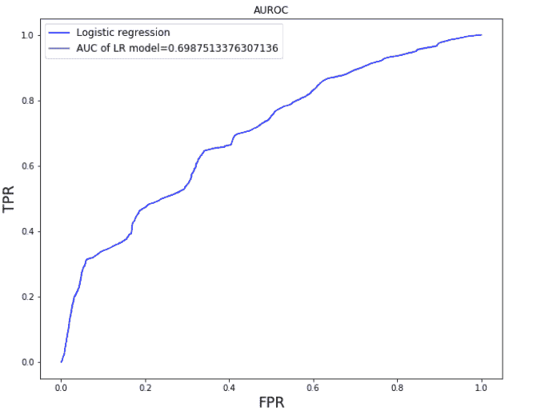

过采样后的 AUC

***推论***

> 我们意识到二元逻辑回归(即二元 LR)不足以解决我们的问题。例如，如果我们使用这些预测来分配政府资源，那么我们可能会有很高的假阳性率。由于仅仅找到非毒品/毒品相关犯罪高发的地理坐标/区域是不够的，我们需要更深入地研究，例如，我们希望在谋杀率高于纵火率的地方分配更多的资源。于是我们转而使用其他多类模型，如**多项逻辑回归(多项 LR)** 、 **XGBoost** 、 **KNN** 和**随机森林。**

# 项目:

## 结论:

XGBoost 表现最好。上述模型预测了每一类犯罪的可能性，给出了地理坐标，以及犯罪是在白天还是在晚上发生。我们可以使用这些可能性/概率&在给定的地理坐标上聚合，来识别社区并相应地分配政府资源。

## 权衡:

1.  **特征缩放:**我们每次归一化数据时都使用**最小-最大归一化**，虽然它不能很好地处理异常值，但另一方面它保留了原始的缩放比例。在对数/z 分数归一化的情况下，异常值得到很好的处理，但不会保留原始比例。对我们的分析来说，保留比额表更重要。因此，总会有权衡。
2.  **AUC/ROC 与 Precision/Recall (PR):** 我们使用 PR 作为我们的评估指标。由于我们的目标阶层不平衡，我们希望我们的模型考虑到这一点。

在现实世界中，由于正负样本非常不均匀，所以更多地使用 PR 曲线。ROC/AUC 曲线不能反映分类器的性能，但是 PR 曲线可以具有更好的可解释性。

AUC(ROC 下面积)是有问题的，尤其是当数据不平衡时。正面例子的出现率相对较低。用 AUC 来衡量分类器的性能，问题是 AUC 的增加并不能真正反映一个更好的分类器。这只是太多反面例子的副作用。由于我们更关心真阳性的实际预测，而不是模型的“整体”性能，因此 PR & F-1 评分似乎更合适。

## 代码:

您可以在我们的 github 资源库查看整个项目的代码和 jupyter 笔记本:

 [## Gandalf 1819/SF-阿片样物质-危机

### 旧金山(SF)在推动进步的公共卫生解决方案方面有着悠久的历史，包括医疗…

github.com](https://github.com/gandalf1819/SF-Opioid-Crisis) 

除此之外，您还可以在这里进一步查看 Tableau 分析:

 [## Tableau 公共

### 编辑描述

public.tableau.com](https://public.tableau.com/profile/chinmaynw#!/vizhome/SFDrugOpioidCrisis/Sheet1) 

# 参考资料:

[1][https://www . kqed . org/news/11766169/旧金山-芬太尼-死亡-几乎-150](https://www.kqed.org/news/11766169/san-francisco-fentanyl-deaths-up-almost-150)

[2][https://www . SF chronicle . com/Bay area/article/Bay-Briefing-芬太尼-流行病-恶化-in-San-14032040.php](https://www.sfchronicle.com/bayarea/article/Bay-Briefing-Fentanyl-epidemic-worsens-in-San-14032040.php)

[3][https://www . business insider . com/San-Francisco s-dirty est-street-has-a-drug-market-and-pills-of-poop-2018-10](https://www.businessinsider.com/san-franciscos-dirtiest-street-has-a-drug-market-and-piles-of-poop-2018-10)

[4][https://www . SF chronicle . com/bayarea/article/California-bill-allowing-San-Francisco-safe-13589277 . PHP](https://www.sfchronicle.com/bayarea/article/California-bill-allowing-San-Francisco-safe-13589277.php)

[5][https://data . SF gov . org/Public-Safety/Police-Department-Incident-Reports-Historical-2003/tmnf-yvry/data](https://data.sfgov.org/Public-Safety/Police-Department-Incident-Reports-Historical-2003/tmnf-yvry/data)

[https://data.sfgov.org/d/wkhw-cjsf](https://data.sfgov.org/d/wkhw-cjsf)

[7][https://www . quora . com/What-the-meaning-of-min-max-normalization](https://www.quora.com/What-is-the-meaning-of-min-max-normalization)