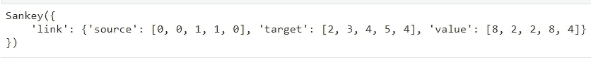
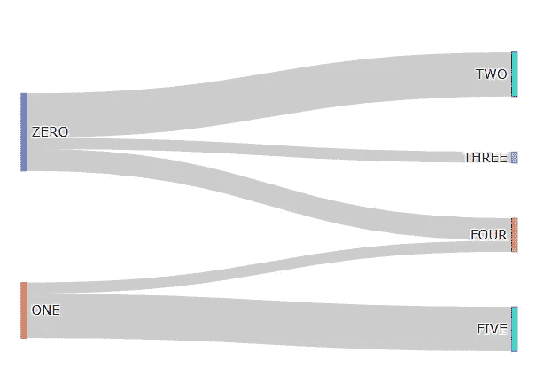
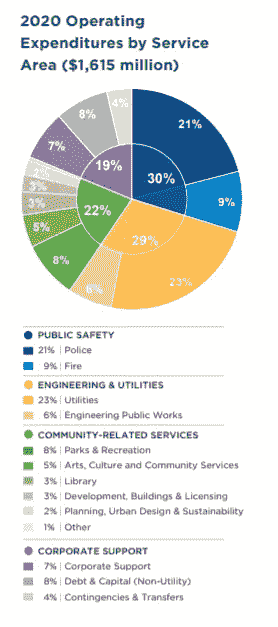
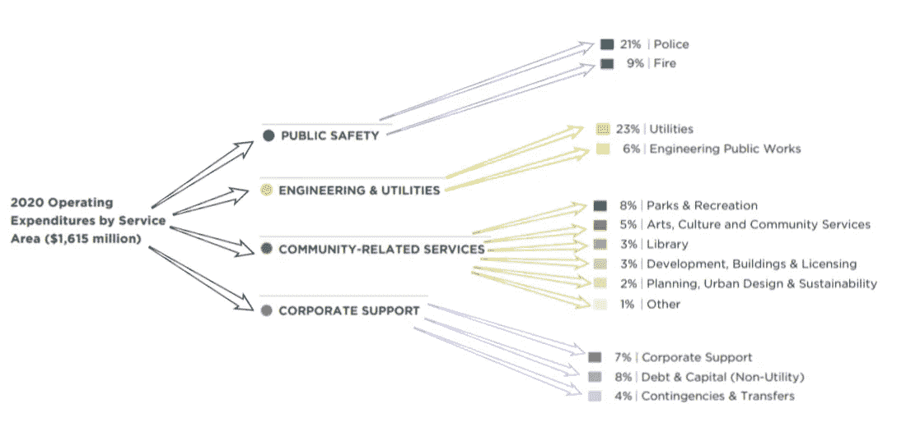
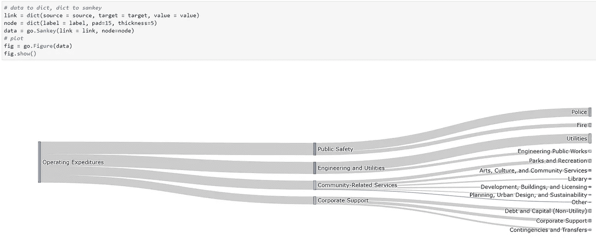
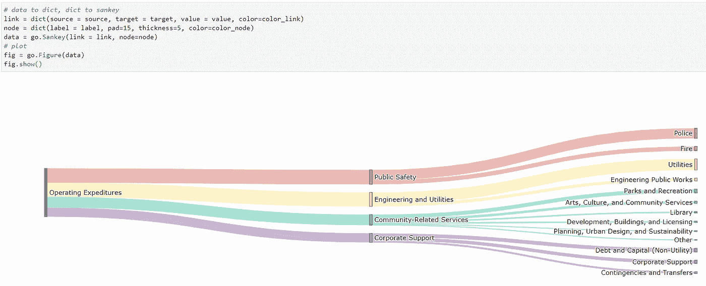
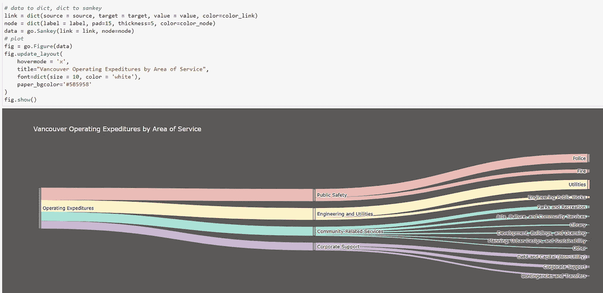
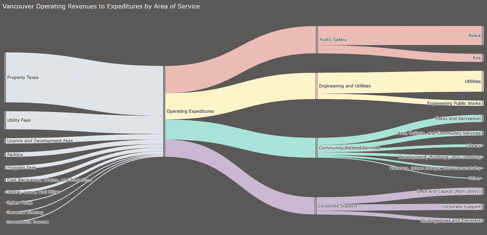

# 基于 Python 的 Plotly 的桑基图基础

> 原文：<https://towardsdatascience.com/sankey-diagram-basics-with-pythons-plotly-7a13d557401a?source=collection_archive---------1----------------------->

## 可视化流量和比较比例的绝佳选择

在本文中，我将介绍使用 Plotly 和 Python 绘制桑基图的基础知识。

它们是一个方便的图表，用于可视化任何一种可测量的流量——一些例子是[旅行者](https://www.flickr.com/photos/walkingsf/8222524899/in/photostream)、[拼写者](https://www.reddit.com/r/dataisbeautiful/comments/6a4pb8/how_52_ninthgraders_spell_camouflage_sankey/)和[金钱](https://www.behance.net/gallery/16622319/Sankey-diagrams)的流量。


[桑基图显示了蒸汽机的能效，1898 年](https://upload.wikimedia.org/wikipedia/commons/1/10/JIE_Sankey_V5_Fig1.png)

这张图表的制作归功于爱尔兰船长马修. H. P. R .桑基，他用它来形象化蒸汽机的能源效率。

桑基图的思想类似于网络图，其中链接连接节点。

主要区别在于，在桑基的模型中，链接具有不同的宽度，它们共同编码一个可测量的变量。

## 亲自动手

对于下面的例子，我将结合 Jupyter Lab 使用 Plotly 来探索如何创建一个 Sankey。

```
import plotly.graph_objects as go
```

用 Plotly 构建图表有不同的方法；我将使用图形对象，用 Jupiter 小部件可视化图形，并为最终的可视化导出一个 HTML。

## 逻辑

构建一个 Sankey 可能相当困难，特别是如果您有太多的节点和连接，我将使用列表作为例子来简化它，但是您可以用 JSON 文件或 Pandas 数据帧来修改这个逻辑。

我们将使用`go.Sankey`来构建图表，这需要一个`link`。

那个`link`是一本包含我们想要绘制的连接数据的字典。

```
source = [0, 0, 1, 1, 0]
target = [2, 3, 4, 5, 4]
value = [8, 2, 2, 8, 4]
```

源和目标是 Plotly 将连接的节点的索引列表，值是将定义这些连接的宽度的数字列表。

```
link = dict(source = source, target = target, value = value)
data = go.Sankey(link = link)
print(data)
```



我们将 Sankey 对象保存到一个名为 data 的变量中，现在我们可以将该数据传递给一个图形；

```
fig = go.Figure(data)
```

并显示图表。

```
fig.show()
```


就是这个想法。让我们试着识别这些节点，这样我们就能更清楚地看到什么在连接什么。

我们需要一个包含节点数据的字典，它应该包含一个带有标签的列表。我们还可以添加更多的参数，比如`pad`来定制节点之间的距离，或者`thickness`来定义它们的句柄的大小。

```
# data
**label = ["ZERO", "ONE", "TWO", "THREE", "FOUR", "FIVE"]**
source = [0, 0, 1, 1, 0]
target = [2, 3, 4, 5, 4]
value = [8, 2, 2, 8, 4]# data to dict, dict to sankey
link = dict(source = source, target = target, value = value)
**node = dict(label = label, pad=50, thickness=5)**
data = go.Sankey(link = link, **node=node**)# plot
fig = go.Figure(data)
fig.show()
```



那更好理解。我们可以阅读列表，并想象它们之间的联系。

## 用例

现在让我们用一些真实的数据来尝试一下，我将尝试改变温哥华 2020 年预算中的这种可视化。



[温哥华 2020 年预算，第。6](https://vancouver.ca/files/cov/2020-budget-book.PDF)

我希望看到资金从运营支出流向地区和服务的比例。

我将从总支出的一个节点开始，它将连接到四个领域，然后将链接到它们的细分领域——让我们快速勾画一下这个想法。



用 sketch.io 绘制

我已经使用了百分比来查找值，并为链接构建了以下列表。

```
source = [0, 0, 0, 0,       # Op Expeditures
          1, 1,             # Public Safety
          2, 2,             # Eng n Util
          3, 3, 3, 3, 3, 3, # Community Serv
          4, 4, 4]          # Corp Supporttarget = [1, 2, 3, 4, 
          5, 6,
          7, 8, 
          9, 10, 11, 12, 13, 14, 
          15, 16, 17]value = [484500, 468350, 355300, 306850, 
         339150, 145350, 
         371450, 96900, 
         129200, 80750, 48450, 48450, 32300, 16150, 
         113050, 129200, 64600]
```

让我们也为节点定义标签。

```
label = ['Operating Expeditures', 
         'Public Safety', 
         'Engineering and Utilities', 
         'Community-Related Services', 
         'Corporate Support',
         'Police', 
         'Fire',
         'Utilities', 
         'Engineering Public Works',
         'Parks and Recreation', 
         'Arts, Culture, and Community Services',
         'Library', 
         'Development, Buildings, and Licensing',
         'Planning, Urban Design, and Sustainability', 
         'Other',
         'Corporate Support', 
         'Debt and Capital (Non-Utility)', 
         'Contingencies and Transfers']
```

一旦我们准备好数据，剩下要做的就是定义我们的图形和绘图。



很好，越来越好了。

我们可以在图表中使用另一种编码，即颜色。

我们可以定义节点和链接的颜色；为此，我们需要一个每个元素有一种颜色的列表。

```
color_node = [
'#808B96', 
'#EC7063', '#F7DC6F', '#48C9B0', '#AF7AC5',
'#EC7063', '#EC7063',
'#F7DC6F', '#F7DC6F',
'#48C9B0', '#48C9B0', '#48C9B0', '#48C9B0', '#48C9B0', '#48C9B0',
'#AF7AC5', '#AF7AC5', '#AF7AC5']color_link = [
'#EBBAB5', '#FEF3C7', '#A6E3D7', '#CBB4D5',
'#EBBAB5', '#EBBAB5',
'#FEF3C7', '#FEF3C7',
'#A6E3D7', '#A6E3D7', '#A6E3D7', '#A6E3D7', '#A6E3D7', '#A6E3D7',
'#CBB4D5', '#CBB4D5', '#CBB4D5']
```

在这里，我试图突出每个支出的区域，我对节点和链接使用相似的颜色，一个比另一个亮一点。



几乎准备好了，剩下要做的就是添加标题、调整细节和导出 HTML 文件。

我们可以在绘图之前更新图形的布局，这允许我们更改字体、背景颜色、定义工具提示上的信息等等。

```
fig.update_layout(
    hovermode = 'x',
    title="Vancouver Operating Expeditures by Area of Service",
    font=dict(size = 10, color = 'white'),
    paper_bgcolor='#5B5958'
)
```



一旦可视化准备就绪，我们就可以将其导出为 HTML。这可能是最自然的部分，我们所要做的就是调用`.write_html(‘filename.html’)`。

这里你可以看到另一个例子，我增加了营业收入。



[https://thiagobc23.github.io/plotly-sankey/van.html](https://thiagobc23.github.io/plotly-sankey/van.html)

我试图移除白色的文字阴影，但是我在 Plotly 中找不到解决方案，我找到的最好的答案是[覆盖 CSS](https://github.com/ropensci/plotly/issues/1118) 。

你可以在这里找到这篇文章的代码[，在这里](https://github.com/Thiagobc23/plotly-sankey)找到带有交互式 Sankey [的网页。](https://thiagobc23.github.io/plotly-sankey/van.html)

感谢你花时间阅读我的文章，我希望你喜欢它。

**更多资源:** [Plotly —图形对象](https://plotly.github.io/plotly.py-docs/generated/plotly.graph_objects.Sankey.html)
[Plotly —桑基图](https://plotly.com/python/sankey-diagram/#reference)