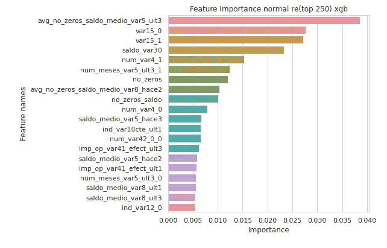

# 桑坦德银行客户满意度——使用 Python 的自我案例研究

> 原文：<https://towardsdatascience.com/santander-customer-satisfaction-a-self-case-study-using-python-5776d3f8b060?source=collection_archive---------35----------------------->

## *作为 self 案例研究的一部分，使用 Python (* [github link](https://github.com/ashishthomaschempolil/Santander-Customer-Satisfaction) 和[Linkedin](https://www.linkedin.com/in/ashishthomas7/)**)**对 Kaggle 中的桑坦德客户满意度数据集进行分类建模

# **目录**

1.  商业问题
2.  使用机器学习来解决业务问题
3.  评估指标(曲线下面积)
4.  探索性数据分析
5.  特征工程
6.  现有解决方案
7.  我的模型实验
8.  摘要、结果和结论
9.  未来的工作
10.  链接到我的个人资料— Github 代码和 Linkedin
11.  参考

加勒特·帕克在 [Unsplash](https://unsplash.com?utm_source=medium&utm_medium=referral) 上拍摄的照片

# 1.商业问题

本案例研究基于 2016 年开展的 [Kaggle 竞赛](https://www.kaggle.com/c/santander-customer-satisfaction)。客户满意度是当今每个公司最重要的关键绩效指标之一，被视为公司成功的关键因素。不开心的顾客不会留下来。更重要的是，不开心的顾客很少在离开前表达他们的不满。桑坦德银行是一家西班牙跨国银行和金融公司，业务遍及欧洲、北美、南美和亚洲。在桑坦德银行举办的这场 Kaggle 竞赛中，我们需要根据公司提供的功能，提前预测客户是否对他们的服务不满意。这将有助于他们在客户离开之前采取主动措施提高客户满意度。

# 2.使用机器学习来解决业务问题

这个问题是一个分类建模任务，以确定客户(数据点)是否不满意。

我们有两个文件:test.csv 和 train.csv，其中包含大约 370 个匿名的特征和一个作为目标的依赖特征。每个数据点代表一个客户，如果客户对公司的服务不满意，TARGET 中的值为 1，如果客户满意，TARGET 中的值为 0，并且数据集严重失衡。

# 3.评估指标(曲线下面积)

这里使用的度量是 ROC (接收器工作特性)曲线下的**面积，ROC**(接收器工作特性)曲线是在不同阈值下真阳性率(灵敏度或召回率)(TPR)和假阳性率(FPR)之间的图下的**面积。AUC 有助于确定模型是否擅长区分类别。AUC 越高，模型预测 0 为 0 和 1 为 1 的能力越强。AUC 为 0.5 意味着模型进行随机猜测(随机模型)，而 AUC 为 0 意味着模型预测 0 为 1，1 为 0，而 AUC 为 1 是理想的分类器。**

[来源](/understanding-auc-roc-curve-68b2303cc9c5) — AUC 是 ROC 曲线下的面积

这里有一篇关于 AUC 的非常好的文章。

 [## 理解 AUC - ROC 曲线

### 在机器学习中，性能测量是一项基本任务。所以说到分类问题，我们可以…

towardsdatascience.com](/understanding-auc-roc-curve-68b2303cc9c5) 

# 4.探索性数据分析

我们将首先深入研究数据集，并通过可视化观察所有特征，这将有助于我们获得结论以及特征工程的想法。总共有 370 个特征都是匿名的(不包括“目标”特征)。我们能够从文献综述中以及通过观察值的分布来获得匿名化特征所传达的信息。

由于有许多特性，我们将检查具有**零方差**的特性(不包含任何信息，即仅存在 1 个唯一值)，如果发现，将删除它们。

发现 34 个特征具有零方差，并且这些都被移除。

我们现在将检查重复的**特征**(即它们在数据点上共享相同的值，不需要相同的特征名称)。

发现 12 个特征是重复的，其中 6 个被移除。

我们现在将移除所有的**稀疏特征**(具有很少信息的特征)。设置一个条件，使得如果特征具有为 0 的 99%的值，则它被认为是稀疏特征。

也没有发现缺失值。

去除不必要的特征后的最终特征数是 142。

现在，我们将探索每一项功能。

## 4.1 目标

我们可以看到数据集非常不平衡，只有 3.96%的客户不满意，96.04%的客户满意。

## 4.2 var3(地区)

通过查看其他文献以及当前唯一值的数量(=208)，此功能可能包含客户所在地区的信息。此功能中还有一个异常值-999999，它可能缺少值。除了异常值，这些值的范围从 0 到 208。发现最常见的唯一值是 2(对于训练和测试数据，大约 97%)。首先，我们将把所有-999999 转换为-1 值，并且只考虑不包括“2”的值来研究值计数。

“var3”的值计数，不包括最常见的值“2”

由于查看值计数，我们可以看到-1 仅代表整个数据集的一小部分(即使在排除 2 之后)。因此，我们将用此功能最常用的值“2”替换缺失的值。

## 4.3 var15(年龄)

在训练数据中发现 var15 的最小值为 5，最大值为 105。因为 var15 的值是从 5 到 105，所以可以有把握地认为该特征暗示了客户的年龄。文献综述也证明了这一点。

训练和测试数据具有相似的分布，两者都由最年轻的客户组成。

不满意的顾客的最小年龄是 23 岁。似乎每个年轻顾客(23 岁以下)总是很满意。因此，我们可以在特征工程期间创建一个新的特征，它本质上是告诉客户是否在 23 岁以下。

## 4.4 var38(抵押价值)

从 kaggle 的各种文献可以推断，var38 可能是抵押价值。

var38 的值计数

这里我们不能得到任何信息，因为一个值有很高的频率。我们将打印出每个百分点值。

以百分位数表示的 var38 值

我们可以看到，0 百分位值和 10 百分位值之间有着巨大的差异。这与 90 百分位值和 100 百分位值的情况相同。现在，我们将检查低于 97.5 百分位的所有值的 var38 分布图(高于 97.5 百分位的值 1 占主导地位，无法提取可用信息)

我们可以看到上面的图是右偏的，峰值在 100，000 到 150，000 之间。我们可以应用对数变换并检查结果分布。

应用对数变换后

我们可以看到它看起来类似于正态分布。由于机器学习模型在正态分布上工作得更好，因此我们可以为该特征创建具有对数变换和不具有对数变换的新数据集，并在特征工程阶段比较性能。

## 4.4 带有关键字的功能

有几个特征有特定的关键字，它们是:“imp”、“ind”、“num”、“saldo”。这些关键字被发现是从一些文献中获得的一些西班牙语单词的缩写形式。

“num”要素在数据集中具有最高的制图表达。

现在我们要做的是通过为每个关键字随机选择 2 个特征来逐个探索每个关键字的特征，然后我们将得出结论。

## **4 . 4 . 1‘imp’特性**

imp' likey 是 importe 的缩写词，在西班牙语中表示数量(从文献综述中推断)。带有“imp”关键字的特征的总数是 14。通过查看包含“imp”关键字的两个随机选择的特性的值计数，我们可以看到这两个特性最常出现的值都是 0。0 在这两个特征中占了 87%以上。

随机选择的“imp”特征训练和测试数据的频率图

对数变换后不包括 0 的随机选择的“imp”特征的分布

同样在对数变换之后，分布(不包括 0)变得很像高斯分布。因此，我们可以为所有“imp”功能制定一个策略。

**imp 特性的策略:**

1.  我们可以创建一个具有对数变换(不包括 0) imp 特征的新数据集。
2.  我们还可以创建另一个没有应用转换的数据集(保持原样)。

## 4 . 4 . 1“saldo”功能

具有 saldo 关键字的特征的数量是 26。现在，我们将像处理“imp”特征一样处理数据。通过查看这两个特征的值计数，我们可以看到 0 也是最常见的值(大约占整个训练数据集的 95%)。

训练和测试数据的频率图

发现所有“saldo”特征都是连续的。

对数变换后的随机“萨尔多”特征(不包括零)

同样在这里(类似于“imp”功能)，我们可以创建新的数据集，将对数变换应用于 saldo 功能，除了 0 值将保持不变。

**“萨尔多”特色战略:**

1.  我们可以使用经过对数变换(不包括 0)的 saldo 要素创建一个新数据集。
2.  我们还可以创建另一个没有应用转换的数据集(保持原样)。

## 4.4.3“数量”特征

“num”可能是数字的缩写形式。探索所有“num”特征的值计数，我们可以说每个具有“num”关键字的特征本质上都是分类的。

一些带有“num”关键字的特性及其对应的唯一值的数量

为带有“num”关键字的功能找到的唯一值的最大数量是 172(总数据点约为 70k)，最小数量是 2。我们将为“数字”功能采用一种策略:

**针对“数字”功能的战略**

1.  我们将对允许的唯一值的最大数量设置一个阈值，以便将一个特征定义为分类特征。我们将阈值设置为 10。
2.  我们可以使用响应编码、一个热编码创建新数据集，并保留“num”个要素的要素不变。(这只适用于根据上述规则定义的分类特征)

## 4 . 4 . 3“ind”特征

“ind”功能可能指指示器。查看值计数后，所有具有“ind”特征的特征只有 2 个唯一值。

**针对“ind”特性的策略**

我们保留这些功能不变。

# 5.特征工程

从文献回顾中可以理解，对于特定数据点，不同特征上零的出现次数是识别客户是否不满意的一个重要特征。因此，我们将为预处理后的数据创建要素，如下所示:

**no_zeros:** 一个数据点的不同特征中出现的零值数量

**no_nonzeros:** 一个数据点的不同特征中存在的非零值的数量

现在，我们将添加一个特性，该特性计算不同关键字特性(' saldo '，' ind '，' num '，' imp') 中的**个零和非零值:**

现在，我们将对具有 50(不含)到 210(含)个唯一值的所有特性的每个唯一值取所有“saldo”和“imp”特性的**平均值，并将其添加为特性。**

**K 均值聚类:**我们将在对这个特定步骤应用标准化之后，添加 k = 2，4，6，8，10 的 K 均值聚类值作为特征。注意:我们在这个步骤之后获得的特征是不标准化的，因为我们需要应用对数变换。我们应用标准化来获得 K-means 聚类特征。

**移除与目标高度相关的特征和低相关的特征:**我们将移除彼此高度相关的所有特征，保留一个。我们将移除与“目标”特征具有低相关性的所有特征。对于移除高相关特征，阈值保持为任何高于 0.95 相关值的特征，而对于移除与“目标”的低相关值，阈值是任何低于 10**-3 相关值的特征。

**创建新数据集:**

现在，我们将使用日志转换创建新的数据集。我们将对功能' var38 '，所有' saldo '和' imp '功能应用对数变换，零值除外，零值将保持不变。

现在我们有两个数据集，一个是对数转换的，另一个是普通数据集(没有任何对数转换)。现在，我们将对这些应用**一个热编码**和**响应编码**，并创建新的数据集。这里，编码应用于唯一值的数量在 3 和 10 之间(包括 3 和 10)的那些特征。这里有一篇关于如何计算 [**响应编码**](https://medium.com/@thewingedwolf.winterfell/response-coding-for-categorical-data-7bb8916c6dc1) 的文章。对于响应编码，我使用拉普拉斯平滑来平滑数据(假设在测试数据中有一个在训练数据中没有看到的类别值，我们不希望该唯一值的概率为零，所以我们应用平滑)。通过手动检查从一组阿尔法中随机选择的特征的响应编码值，根据结果编码值的变化程度来找到最佳阿尔法。

最后，创建了 6 个数据集，它们是:

1.  **正常**
2.  **普通带一个热编码**
3.  **正常带响应编码**
4.  **测井转换**
5.  **用响应编码转换的日志**
6.  **用一个热编码转换的日志**

现在我们将**标准化**所有数据集。标准化后，我们将应用**主成分分析**(这里 n=2)并将其作为特征添加到每个数据集。

最初，我们只有 142 个用于训练和测试数据的特征。现在我们已经创建了 6 个数据集，要素的最终数量如下:

1.  **正常:359 特性**
2.  **普通带一个热编码:446 个特征**
3.  **正常带响应编码:374 特征**
4.  **测井转换:359 个特征**
5.  **响应编码转换的日志:374 个特征**
6.  **一次热编码转换的日志:446 个特征**

# 6.现有解决方案

1.  [**德里克·范登艾森。(2017).桑坦德客户满意度**](https://beta.vu.nl/nl/Images/werkstuk-elsen_tcm235-865964.pdf) **:** 在预处理中，他去除了方差为零的特征、稀疏特征以及重复的列条。现在，在标准化之后，他移除了具有 0.99 或更高的高相关值的所有第一对相关特征。**特征工程:**从 var3 (Nationality)特征中创建新的特征，其本质上携带了客户是否来自最普通的国家或具有最普通的价值的信息。var15(年龄)、var36 和 var38(抵押价值)也是如此，var15 的值为-999999，这可能意味着缺少值。创建的另一个特性告诉我们数据点的值是否为-999999。创建此功能后，var3 中的所有-999999 值都被替换为最常用的值。对 var36 也是如此，因为它的值为 99，与其他唯一值(包括 0、1、2 和 3)相差甚远。Var36 是一个热编码，因为其值表明它是分类的。另一个功能是计算数据点中 0 的数量(dmi3kno，2015)。此外，还为数据点功能创建了多个 1。作者创建了 3 个模型:**逻辑回归、随机森林和 XGBoost** ，具有超参数调整的 10 折分层交叉验证。发现度量 AUC 对于 XGBoost 是最好的。
2.  [**kweonwooj 用 Python**](https://github.com/kweonwooj/kaggle_santander_customer_satisfaction/tree/master/34_wpppj) **:** 重新实现 pjpan 的第 34 位解(用 R 代码)，在这次重新实现中，用户删除了所有有常量(只有 1 个唯一值)的特性，删除了所有重复的特性，保留了一个。将 9999999999 和-99999 等所有极值转换为-1。移除稀疏要素，条件是如果要素的 99%值为 0，则该要素被声明为稀疏。对于这组列“num_meses_var8_ult3”、“num_meses_var13_largo_ult3”、“num_op_var40_comer_ult1”，这组列中的所有 meses 列的值都被更改为 int 类型。而集合中的所有其他特征的值除以 3(这些特征的唯一值为 3 的倍数)。数据在 XGBoost 上用 10 个分层的 k 折叠进行训练。预测的测试值是所有这些模型测试预测值的平均值，这些预测值符合 10 个分层的 k 倍。

对于我的方法，我已经创建了 6 个数据集，这在特征工程部分进行了详细说明，并将在这 6 个不同的数据集上建模。

# 7.我的建模实验

我有 6 个数据集，所以我要做的是，对每个数据集，我将在**逻辑回归、决策树、随机森林、XGBoost 和 LightGBM** 上建模。首先，对数据集进行随机分割，对“目标”进行分层(确保训练和测试中唯一“目标”值的比例相同)，分割比例为 85:15。在数据集上建模后，我基于随机森林模型选择了**个顶级特征，然后为每个数据集创建了包含前 250 个特征**的新数据集。然后**基于具有前 250 个特征的**数据集**创建随机森林、XGBoost 和 LightGBM 模型**。使用**随机搜索 CV 进行逻辑回归、决策树和随机森林找到最佳超参数。**

用于随机搜索 cv 的不同超参数

这里 class_weight = 'balanced '处理了类的不平衡。对于**决策树**和**随机森林**，在拟合具有最佳超参数的模型之后，在这些模型之上拟合校准的分类器(以获得概率值)。

这里的模型不是**决策树分类器**就是**随机森林分类器**。

对于 **XGBoost** 和 **LightGBM，**我手动更改了每个参数，并根据以下文章找到了最佳参数。对这两个模型使用 RandomSearchCV 耗费了大量时间。

 [## 像老板一样在 Python 中微调 XGBoost

### XGBoost(或极端梯度推进)不再被引入，只是在太多的数据科学中被证明是相关的…

towardsdatascience.com](/fine-tuning-xgboost-in-python-like-a-boss-b4543ed8b1e) 

下面是 **XGBoost** 的代码，类似的还有 **LightGBM** (除了物镜在 **LightGBM** 中变成‘二进制’)。

不同数据集的组合 AUC 图如下所示:

**日志**数据集的 AUC 分数(已排序)

**正常**数据集的 AUC 分数(已排序)

基于验证 AUC 的每个数据集的最佳模型

然后，我们根据**集合**和**堆叠**的验证 AUC，从每个数据集中选择最佳模型。我们不从所有模型中取出最好的模型，因为对于堆叠和集成，模型之间的差异越大(这确保我们从不同的数据集取出模型，否则在相同数据集上训练的模型将出现)，最终集成/堆叠分类器的性能将越好(每个模型将是不同主题的专家，即例如:如果我们建立狗分类器模型，我们可以建立分类器，使得一个模型将检测尾部， 另一个模型将检测人脸等，因此结合这些模型将提供更好的性能，这就是我所说的不同模型的意思)。 所以数据集之间的差异越大，模型之间的差异就越大。

然后，获得的最佳模型在提供的整个训练数据集上进行训练(我们之前分割了数据)，然后用于预测测试“目标”概率值。然后，获得的 6 个“目标”被用作创建新数据帧的特征。在该数据帧的顶部训练分类器(堆叠)。这里使用的分类器是**逻辑回归**(通过**随机搜索 CV** 找到的超参数)，并且在 Kaggle 中提交“目标”的测试概率值。还提交了从 6 个最佳模型获得的 6 个测试概率值，并记录了它们的公开 AUC 分数。然后，基于获得的公开 AUC 分数，选择最佳的 2 个模型(这里是“log re(top 250) xgb”和“normal re(top 250)”)，然后对概率值进行简单的平均集合。然后在 Kaggle 上提交获得的值，并记录公开的 AUC 分数。

# 8.摘要、结果和结论

带有 kaggle 公共 AUC 分数的模型

我们可以从上面的结果数据框中看到，拟合于对数变换响应编码(前 250 个特征)数据集的 XGB 模型和拟合于正常响应编码(前 250 个特征)数据集的 XGB 模型表现非常好。这两个模型的简单平均组合能够获得 0.82746 的 kaggle 公共 AUC 分数，仅比公共排行榜中的最高分数(0.84532)低约 2%。在 Log transformed(所有特征)上训练的 xgb 模型表现很差，因为它具有最差的公开分数。对分类特征进行响应编码极大地改进了模型，因为与在响应编码数据集上训练的模型相比，在其他数据集模型上训练的模型不会产生很好的结果。

日志响应编码(前 250 个功能)xgboost 模型(前 20 个功能)

正常响应编码(前 250 个功能)xgboost 模型(前 20 个功能)

此外，从所使用的两个集合模型的特征重要性图中，我们可以看到，在这两个模型中，具有最高重要性的共同特征是“var15”(代表从文献综述中推断的“年龄”)，这意味着年龄是决定客户是否满意的重要因素。

# 9.未来的工作

1.  我们可以使用**贝叶斯优化**来找到每个模型的最佳超参数。
2.  我们也可以尝试实施**深度学习模型**来解决问题。

# 10.链接到我的个人资料— Github 代码和 Linkedin

你可以在这个 [**github 链接**](https://github.com/ashishthomaschempolil/Santander-Customer-Satisfaction) 上找到这个案例研究的完整代码。你可以在 [**Linkedin**](https://www.linkedin.com/in/ashishthomas7/) 或**ashishthomas7@gmail.com**联系我。

# 11.参考

1.  [https://www . Applied ai course . com/course/11/Applied-Machine-learning-course](https://www.appliedaicourse.com/course/11/Applied-Machine-learning-course)
2.  [桑坦德银行客户满意度调查(2017 年)](https://beta.vu.nl/nl/Images/werkstuk-elsen_tcm235-865964.pdf)
3.  [kweonwooj 用 Python 重新实现 pjpan 的第 34 位解决方案(用 R 代码实现)](https://github.com/kweonwooj/kaggle_santander_customer_satisfaction/tree/master/34_wpppj)
4.  [https://medium.com/r/?URL = https % 3A % 2F % 2f towards data science . com % 2f fine-tuning-xgboost-in-python-like-a-boss-b 4543 ed 8 B1 e](/fine-tuning-xgboost-in-python-like-a-boss-b4543ed8b1e)
5.  https://towards data science . com/mercari-price-re commendation-for-online-retail-sellers-979 C4 d07 f 45 c？gi=5873f2d314af
6.  [https://medium . com/@ thewingdwolf . winterfell/response-coding-for-categorical-data-7bb 8916 c6dc 1](https://medium.com/@thewingedwolf.winterfell/response-coding-for-categorical-data-7bb8916c6dc1)
7.  [https://towards data science . com/understanding-AUC-roc-curve-68b 2303 cc9 C5](/understanding-auc-roc-curve-68b2303cc9c5)