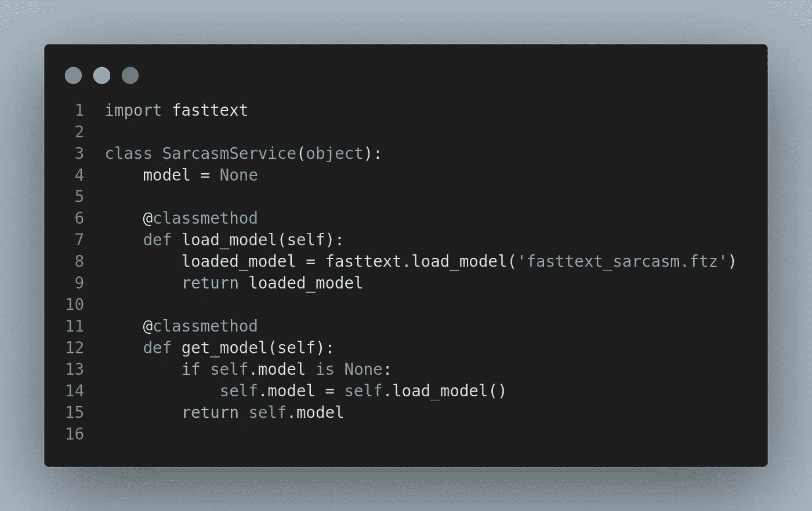
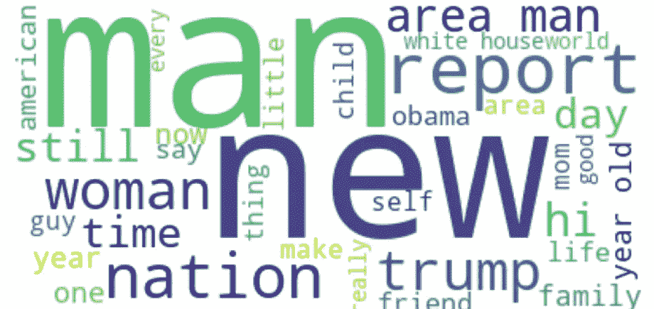

# 讽刺分类(使用快速文本)

> 原文：<https://towardsdatascience.com/sarcasm-classification-using-fasttext-788ffbacb77b?source=collection_archive---------36----------------------->



## 我们将使用 FastText python 模块为新闻标题构建一个讽刺分类器。

FastText 是由脸书研究团队创建的一个库，用于高效学习单词表示法和句子分类。它在 NLP 社区中吸引了很多人，特别是作为一个强大的单词表示基线，取代了 word2vec，因为它在获取单词向量时考虑了字符 n 元语法。这里我们将使用 FastText 进行文本分类。

数据收集自[https://www . ka ggle . com/RMI SRA/news-headlines-dataset-for-sneach-detection](https://www.kaggle.com/rmisra/news-headlines-dataset-for-sarcasm-detection)。这里讽刺的是来自[*TheOnion*](https://www.theonion.com/)*而非讽刺的是来自*[*HuffPost*](https://www.huffingtonpost.com/)。现在让我们跳到编码。**

**首先，让我们检查数据来决定方法。可以从[https://www . ka ggle . com/RMI SRA/news-headlines-dataset-for-stranship-detection/data 下载数据？select =挖苦 _ 头条 _ 数据集 _v2.json](https://www.kaggle.com/rmisra/news-headlines-dataset-for-sarcasm-detection/data?select=Sarcasm_Headlines_Dataset_v2.json) 。**

```
***#load data*
**import** **pandas** **as** **pd**
df = pd.read_json("Sarcasm_Headlines_Dataset_v2.json", lines=**True**)
#shuffle the data inplace
df = df.sample(frac=1).reset_index(drop=**True**)
*# show first few rows*
df.head()**
```

****

**基本上，在阅读带有 pandas 的表格形式的 json 时，数据集包含 3 列，其中‘headline’包含新闻的标题文本,‘is _ anticate’包含分别表示讽刺和非讽刺的 1 和 0。如果我们看到讽刺和非讽刺的例子的代表性是**

**0 14985
1 13634
Name:is _ sniptic，dtype: int64**

**现在来看看课文是如何寻找讽刺和非讽刺的例子的:**

```
**#word cloud on sarcastic headlinessarcastic = ‘ ‘.join(df[df[‘is_sarcastic’]==1][‘headline’].to_list())plot_wordcloud(sarcastic, ‘Reds’)**
```

****

```
***#word cloud on sarcastic headlines* sarcastic = ' '.join(df[df['is_sarcastic']==0]['headline'].to_list()) plot_wordcloud(sarcastic, 'Reds')**
```

****

**现在，在构建分类器模型之前，我们需要对文本进行一些清理，以消除噪声。既然这些都是新闻标题，就不包含太多废话。我想到的清理是把所有的字符串都变成小写，去掉所有不是字母数字的内容，用一个特定的标签替换数字。**

```
**df['headline'] = df['headline'].str.lower()
df['headline'] = df['headline'].apply(alpha_num)
df['headline'] = df['headline'].apply(replace_num)**
```

**现在，我们已经准备好清理文本和它们相应的标签来构建一个二元讽刺分类器。如前所述，我们将使用 FastText python 模块构建模型。**

**首先，需要在环境中安装 FastText python 模块。**

```
***#Building fasttext for python\* 
!git clone https://github.com/facebookresearch/fastText.git 
!cd fastText
!pip3 install .**
```

**我们需要以 FastText api 可以理解的格式准备好训练和测试文件。我们希望用来训练模型的文本文件的默认格式应该是 __ label __** 

```
***#data preparation for fasttext*
**with** open('fasttext_input_sarcastic_comments.txt', 'w') **as** f:
    **for** each_text, each_label **in** zip(df['headline'], df['is_sarcastic']):
        f.writelines(f'__label__**{each_label}** **{each_text}\n**')**
```

**文件中的数据如下所示:**

```
**!head -n 10 fasttext_input_sarcastic_comments.txt__label__1 school friends dont find camp songs funny
__label__0 what cutting americorps would mean for public lands
__label__0 when our tears become medicine
__label__1 craig kilborn weds self in private ceremony
__label__1 white couple admires fall colors
__label__1 mom much more insistent about getting grandkids from one child than other
__label__0 diary of a queer kids mom
__label__1 sephora makeup artist helping woman create the perfect pink eye
__label__1 kelloggs pulls controversial chocobastard from store shelves
__label__0 winston churchills grandson introduces a new nickname for donald trump**
```

**这里 __label__0 表示非讽刺，__label__1 表示讽刺。现在我们已经准备好开始训练分类器模型了。为此，将把数据集分为训练(90%)和测试(10%)数据集。用于监督二元分类的 FastText 函数是 *train_supervised* 。**

```
***''*
*For classification train_supervised call will be used:*

*The default parameters to it:*
 *input             # training file path (required)*
 *lr                # learning rate [0.1]*
 *dim               # size of word vectors [100]*
 *ws                # size of the context window [5]*
 *epoch             # number of epochs [5]*
 *minCount          # minimal number of word occurences [1]*
 *minCountLabel     # minimal number of label occurences [1]*
 *minn              # min length of char ngram [0]*
 *maxn              # max length of char ngram [0]*
 *neg               # number of negatives sampled [5]*
 *wordNgrams        # max length of word ngram [1]*
 *loss              # loss function {ns, hs, softmax, ova} [softmax]*
 *bucket            # number of buckets [2000000]*
 *thread            # number of threads [number of cpus]*
 *lrUpdateRate      # change the rate of updates for the learning rate [100]*
 *t                 # sampling threshold [0.0001]*
 *label             # label prefix ['__label__']*
 *verbose           # verbose [2]*
 *pretrainedVectors # pretrained word vectors (.vec file) for supervised learning []*
*'''*
model = fasttext.train_supervised('sarcasm_train.bin', wordNgrams=2)**
```

**要测量测试数据集中的性能:**

```
***#measuring performance on test data*
**def** print_results(sample_size, precision, recall):
    precision   = round(precision, 2)
    recall      = round(recall, 2)
    print(f'{sample_size=}')
    print(f'{precision=}')
    print(f'{recall=}')

print_results(*model.test('sarcasm_test.bin'))***sample_size=2862 
precision=0.87 
recall=0.87*****
```

**结果虽然不完美，但看起来很有希望。我们现在保存模型对象，以便将来进行推理。**

```
***#save the model*
model.save_model('fasttext_sarcasm.model')**
```

**FastText 还能够压缩模型，以便通过量化牺牲一点点性能来获得更小的模型文件。**

```
**# with the previously trained `model` object, call
model.quantize(input='sarcasm_train.bin', retrain=True)\
# results on test set
print_results(*model.test('sarcasm_test.bin')) ***sample_size=2862 
precision=0.86 
recall=0.86*****
```

**如果你看到精度和召回似乎遭受 0.01 分，但是，看看模型文件大小:**

```
**!du -kh ./fasttext_sarcasm****98M ./fasttext_sarcasm.ftz
774M ./fasttext_sarcasm.model*****
```

**压缩模型只有基本模型的 1/12。因此，这是模型大小和性能之间的权衡，用户必须根据用例来决定。既然分类器模型已经训练好并准备好了，现在是准备好推理脚本的时候了，这样您就可以计划部署了。**

```
**def predict_is_sarcastic(text):
    return SarcasmService.get_model().predict(text, k=2)if __name__ == '__main__':
    ip = 'Make Indian manufacturing competitive to curb Chinese imports: RC Bhargava'
    print(f'Result : {predict_is_sarcastic(ip)}')***Result : (('__label__0', '__label__1'), array([0.5498156 , 0.45020437]))*****
```

**从上面可以看出，最大概率的结果标签是 __label__0，这意味着根据训练的模型，所使用的标题是非讽刺性的。在 model.predict()调用中，k 的值表示您希望输出的类的数量以及它们各自的概率分数。由于我们使用了 softmax 激活(FastText 中默认的一个)，两个标签的概率之和为 1。**

**总之，在进行任何 NLP 分类时，FastText 可以是一个强大的基线，并且它的实现非常容易。这篇文章的所有源代码可以在[我的 git repo](https://github.com/sambit9238/Deep-Learning/tree/master/sarcasm_classifier) 找到。FastText python 模块没有得到官方支持，但对于技术人员来说，这不应该是一个实验问题:)。在以后的文章中，波斯特将尝试讨论如何将训练好的模型转移到生产中。**

**[](https://github.com/facebookresearch/fastText/tree/master/python) [## Facebook 研究/快速文本

### fastText 是一个用于高效学习单词表示和句子分类的库。在本文档中，我们…

github.com](https://github.com/facebookresearch/fastText/tree/master/python) [](https://github.com/sambit9238/Deep-Learning/tree/master/sarcasm_classifier) [## sambit 9238/深度学习

### 深度学习技术在自然语言处理、计算机视觉等领域的实现。-sambit 9238/深度学习

github.com](https://github.com/sambit9238/Deep-Learning/tree/master/sarcasm_classifier)**