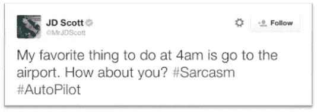
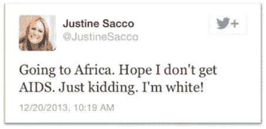

# 自然语言处理中的讽刺检测

> 原文：<https://towardsdatascience.com/sarcasm-detection-with-nlp-cbff1723f69a?source=collection_archive---------3----------------------->

## 一个高度复杂现象的研究综述

梅勒妮·德雷维克在 [Unsplash](https://unsplash.com?utm_source=medium&utm_medium=referral) 上的照片

## ⚠️读了我在⚠️博客中的[原帖](https://anebz.eu/sarcasm-detection-nlp)

当你试图知道某人是否在讽刺你时，你可能会做出这样的表情。对人类来说不易察觉，机器呢？

**注意:**为了简洁起见，这篇文章将只考虑使用 tweets 和使用深度学习模型的讽刺检测。

讽刺检测在 NLP 中是一个非常狭窄的研究领域，它是情感分析的一个特例，它不是检测整个光谱中的情感，而是关注讽刺。因此，这个领域的任务是*检测给定文本是否是讽刺性的。*

我们遇到的第一个问题是，与情绪分析中情绪类别的定义非常明确(爱客观上有积极的情绪，恨消极的情绪，无论你问谁或你说什么语言)不同，讽刺的边界没有那么明确。在开始发现讽刺之前，先了解一下什么是讽刺是至关重要的。

## 什么是讽刺？

[牛津词典](https://www.lexico.com/en/definition/sarcasm)提供了如下定义:

> 讽刺是使用通常表示相反意思的语言来嘲笑或表达轻蔑。

有些人可能不同意它的目的，但有一个惯例，人们使用积极的话来传达消极的信息。当然，它因人而异，高度依赖于文化[、性别](https://www.tandfonline.com/doi/abs/10.1080/08824090109384781)和其他许多方面。例如，美国人和印度人对讽刺的理解是不同的。

此外，有人讽刺并不意味着其他人认为这是说话人的意图。这种**主观性**将对 DL 模型的性能产生影响。

# 1.数据:推特数据集

首先，两个 Twitter 数据集被用来进行研究:

## [里洛夫等人，2013 年](https://www.aclweb.org/anthology/D13-1066/)

他们的数据集由自动提取的推文组成:35k 包含标签#挖苦和 140k 随机推文。

里洛夫数据集的一个例子

与其他数据集相比，该数据集很大，但与 DL 模型中使用的数据集相比，该数据集非常小。这是不平衡的，这意味着非讽刺性的推文比讽刺性的多，这是现实的，因为讽刺在我们的日常互动中非常罕见，数据集应该尽可能地代表现实。关于讽刺的类型，这个数据集捕捉了**有意的讽刺，**这条推文被贴上讽刺的标签是因为作者希望它是这样，它没有考虑人们的看法。

## [Ptáek 等人，2014 年](https://www.aclweb.org/anthology/C14-1022/)

他们的数据集由手动标注的推文组成:他们将 7k 条推文标注为讽刺，并添加了另外 7k 条随机推文。

Ptáek 数据集的一个例子

这个数据集要小得多，因为手动标注更加耗时。这些研究人员还选择使其平衡，增加比通常更多的讽刺例子，以帮助模型更好地概括。在这种情况下，被标记为讽刺的推文是注释者认为是讽刺的(**认为是讽刺**)，作者的意图没有被考虑。

> 这条推文在 2013 年疯传，这名女子在登机前写了这条推文，当她抵达她所访问的非洲国家时，推特爆炸了，她收到了许多指责她的各种消息，她甚至失去了工作……当有人最终让她发言时，她说她是在讽刺和开玩笑，她无意冒犯任何人。但在那个时候，她的意图无关紧要。

# 2.特征

历史上，原始推文添加了许多层功能:

1.  清理:删除其他标签，链接，图片。
2.  词法功能:删除停用词、标记化、弓形、词性标注
3.  实用特征:表情符号、提及
4.  [上下文不一致](https://www.aclweb.org/anthology/P15-2124/):上下文不一致。可以是显式的，也可以是隐式的
5.  [**用户嵌入**](https://arxiv.org/abs/1805.06413) **:** 风格和个性特征。这种嵌入以两个相似用户具有相似嵌入的方式编码一个 Twitter 用户的信息。因为他们在推特上谈论同一个话题，用相似的风格写作，或者有可比的行为模式。

用户嵌入的想法是，如果在训练数据中有一个具有某种个性的用户，他们碰巧发出讽刺性的推文，那么当我们获得新数据时，有一个新用户具有类似的风格，因此与前一个用户类似的嵌入，无需查看新用户的推文，我们就可以预测这个用户是否会讽刺。仅仅通过观察嵌入的相似性。

最后两个特征是在撰写本文时才出现的，已经取代了早期研究中使用的纯语言和词汇特征。

# 3.模型

有无数的 DL 模型和架构的组合，这篇文章的目的不是深入分析模型。

直到 2017 年，大多数模型都是机器学习模型、逻辑回归、SVM 和 CNN 的一些尝试。

大约在 2017 年，LSTMs 开始有牵引力，由于它们的顺序性质和更容易处理长期依赖性，它们接管了 ML 模型。像变形金刚这样的注意力模型也很快取代了它们，现在变形金刚、密集网络和 CRF 层的组合正在被使用。

# 4.分析

不同的论文有不同的评价方法，但在几乎所有的情况下，人的评价很差，模型的评价更差。可能的原因是少量的数据和人类本身无法察觉讽刺。

分析当前研究立场的主要论文之一来自 2019 年 Oprea 和 Magdy，他们提出了 3 个旨在回答的问题:

1.  用户嵌入是否预示了推文的讽刺性质？
2.  用户嵌入在 Riloff 和 Ptacek 数据集之间扮演什么角色？
3.  这两个数据集之间的性能差异是什么？

换句话说，第一个问题是，我们是否可以在不看推文的情况下，仅通过了解用户过去的行为和个性来预测讽刺。概括一点，讽刺是随机的，还是有某些性格特征使某人更可能是讽刺的？

如果是，它们对这两个数据集的影响是什么？了解某人，他们的爱好和兴趣，他们的个性，是否有助于我们*发现*他们是否在讽刺我们？

至于性能，在这两个数据集上训练模型，DL 模型在哪里表现得更好？

> 我鼓励读者停止阅读一段时间，根据你的直觉和你目前所读的内容，尝试猜测答案并思考原因。

这只猴子正在努力思考用户嵌入，并阻止你马上看到答案，鼓励你花一分钟思考它们:)

保罗·尼科勒洛在 [Unsplash](https://unsplash.com?utm_source=medium&utm_medium=referral) 上的照片

该论文表明，*用户确实有一种基于他们的历史行为来决定是否讽刺的倾向。对我们来说，有些人比其他人更讽刺似乎是很自然的，但这是第一次有人在推特上发表这样的观点:是的，个性和讽刺是相关的。*

为了回答第二个问题，用户嵌入在 Ptacek 数据集上是很好的预测器，但在 Riloff 数据集上不是。这意味着当察觉到别人的讽刺时，了解他们是有帮助的。但是当检测到他们有意的讽刺时，添加用户嵌入似乎不会增加任何价值。

关于第三个问题，DL 模型在 Riloff 上表现相当不错，在 Ptacek 上表现不佳。这可能有很多原因，平衡/不平衡，他们捕捉的不同类型的讽刺，但在我看来，在这一点上，它只是大小的问题(Riloff 的 35k 讽刺性推文，Ptacek 的 7k)。我相信这个模型在 Riloff 上有更好的结果，只是因为有更多的推文可以训练。如果数据集具有相同的大小，那么观察它们之间的差异将会非常有趣。

这篇论文也是第一次正式表示，由于 Riloff 和 Ptacek 之间的结果缺乏一致性，他们得出结论，这些数据集是不等价的，它们捕捉了不同的现象，即有意和感知的讽刺。

这篇论文的意义是巨大的，我希望看到它对 2020 年以后发表的论文的影响。

# 5.当前立场和未来研究

目前，一般来说，人们使用的主要是文本数据，一般来自 Twitter 和 Reddit，但也来自其他论坛帖子。

至于特征，他们使用了一些词汇特征、单词的上下文嵌入(BERT)和用户嵌入。

每个月都有新的发布模型，通常是一些密集层的变形金刚组合。

现在常见的一些**错误**有:

*   假阴性:模型没有检测到讽刺性的推文，很可能是因为它们非常特定于特定的情况或文化，并且它们需要 DL 模型所不具备的高水平的世界知识。最有效的讽刺是专门针对人、情境和说话者之间的关系的讽刺。
*   以非常礼貌的方式写的讽刺性的推文不会被发现。有时候，人们用礼貌作为讽刺的方式，用非常正式的词来形容与随意的谈话不相称。以非常正式的方式称赞某人是一种常见的讽刺方式。

## 未来的研究

作为未来的研究，我希望看到在数据集上做更多的工作，更大，更完整，更多样化的数据集，而不是不断增长的复杂的 DL 模型。一个模型和它的数据一样好，而且迄今为止使用的数据集都有它们的偏见和局限性。

实际上，在 2019 年底发布了一个新的数据集，[Oprea 和 Magdy 的 iSarcasm，](https://arxiv.org/abs/1911.03123)用户可以贡献自己讽刺的推文，并包括对为什么讽刺的解释，以及一些关于他们的元数据。不幸的是，它不是很大(大约 1k 条推文)，但在我看来，这是朝着正确方向迈出的一小步。

DL 的最大挑战之一似乎是将世界知识添加到模型中，这将加速训练，并极大地有助于泛化和偏向。但问题是怎么做。截至目前，没有答案。

最后，有些人正在超越文本，使用图像和音频的多模态讽刺检测，根据电视节目如《生活大爆炸》和《老友记》的数据训练模型。它仍处于早期阶段，但考虑到讽刺的多模态性，它看起来很有希望。很多时候讽刺的不是文字，而是语调或者面部表情。

这是截至 2020 年初讽刺检测的概述，我希望它足够信息量，以便任何具有最低限度机器学习知识的人都可以理解并了解最新的研究。

你可以在[我的 Github](https://github.com/anebz/papers#sarcasm-detection) 中找到发表在《讽刺检测》上的大多数论文的注释，以及我的演示文稿中的幻灯片。我已经把我在帖子中直接引用的具体论文的链接放了出来。

我很乐意讨论发现讽刺的想法和方法，或者解释一些不清楚的概念。欢迎在 Twitter 上和我[聊天。感谢阅读！](https://twitter.com/aberasategi)