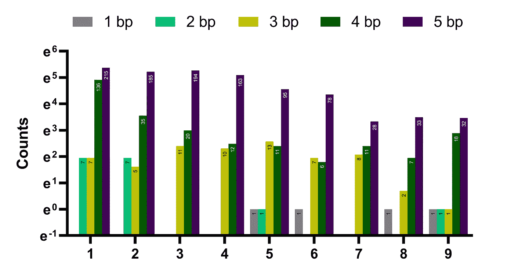
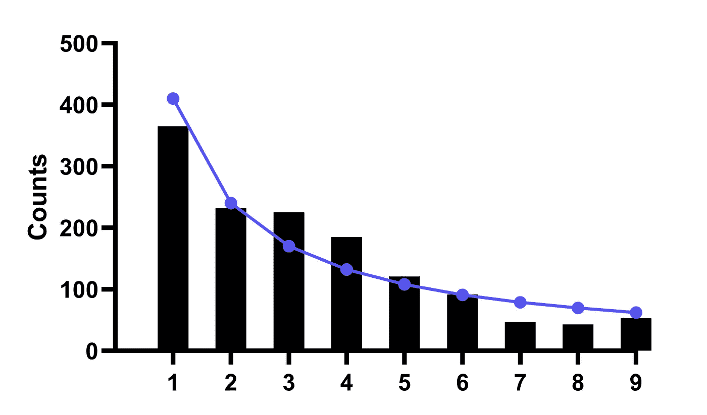
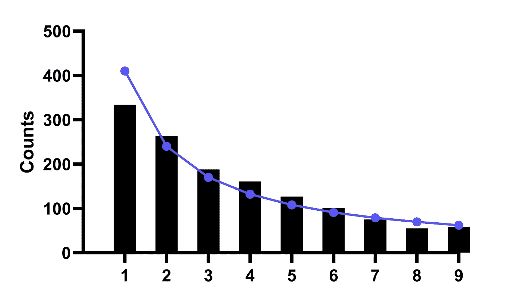
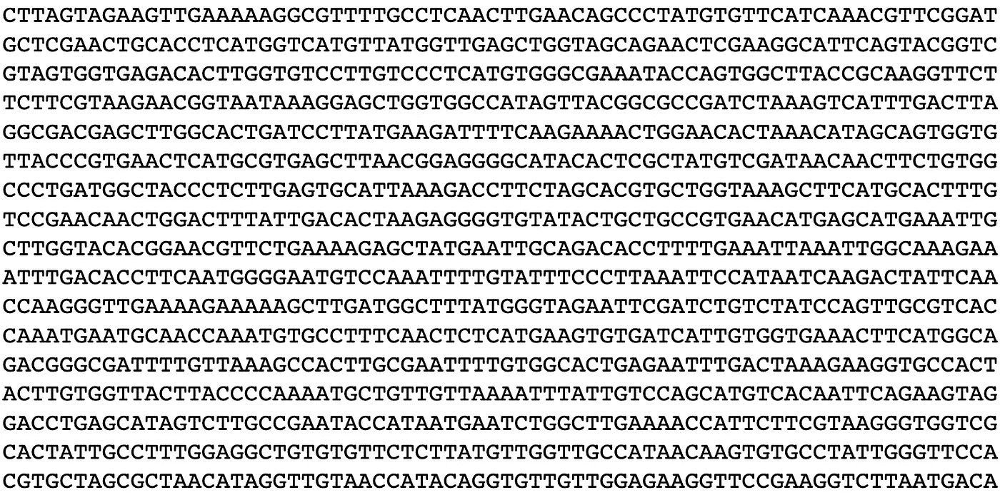

# SARS 基因组符合本福特定律，具有核碱基的笛卡尔乘积

> 原文：<https://towardsdatascience.com/sars-genome-fits-benfords-law-with-the-cartesian-product-of-nucleobases-534876aff947?source=collection_archive---------45----------------------->

## ~Python 代码~

恒星也以多种方式遵循本福德定律。(*图片作者)*

许多人可能听说过来自网飞的书呆子和娱乐纪录片 [*的*](https://www.netflix.com/title/81031737)*[本福德定律](https://en.wikipedia.org/wiki/Benford's_law)连接* 章节“数字”老实说，那是我第一次听说它的地方。1 到 9 中较小数字的第一位优势…这是一种隐藏的模式，我们都以某种方式融入其中，无法摆脱。

鉴于目前的事件，我想知道本福特定律如何适用于病毒基因组序列，因为本福特定律需要大量的实例才能恰当地适用。SARS 物种基因组(包括新型冠状病毒，通常称为新型冠状病毒)的核苷酸或核碱基长度约为 29，800(也称为基因组的组成部分:A，T，G，C)。出版物已经显示了本福德对特定基因的分析趋势，但是仅仅看基因组序列似乎不能说明生物信息，除了提供一些有趣的“玩弄”法律。今天，我将玩转法律，揭开 SARS 序列的“本福特性”。首先，我导入了序列文本文件，去掉了换行符。然后，我将字符串分割成单个字母，并创建了一个函数“count_pattern”用于计数(代码如下所示)。在这篇文章中，我展示了 [2003 年非典](https://www.ncbi.nlm.nih.gov/nuccore/AY278488.2)和 [2019 年新型冠状病毒](https://www.ncbi.nlm.nih.gov/nuccore/NC_045512)的例子(点击查看基因组信息)。

创建更多实例的一种方法是查看特定的核碱基(我称之为 **bp** )排列在基因组中出现了多少次(即 AG、at、GC、ATG、GGG、CTA、ATGC、CGTT……被发现了多少次)。为了穷尽这个列表，我们只取 bp: A，T，G，c 的*笛卡尔积*【简而言之，什么是*笛卡尔积*？这是一种重复的排列:比方说，把苹果、梨和香蕉按照一定的顺序放进四个口袋#1、2、3、4，每个口袋一个水果。]为了不出现大多数个位数，我从单个 BP(A、T、G、C 分别出现的次数)到 5 bp(即 AGTGC)进行了计数。

值得一提的一个“bug”是 Python 3 中的 *count* 函数不会多次重复计算排列中的同一个字符。例如，如果遇到'..AAAA..，‘我们知道技术上有 3 个‘AA’在里面，但是函数会回答 2。同样，如果遇到..TTTTT..，'在这种安排下，该函数将只记录 1 个“TTT”，而我们将记录 3 个。为了快速解决这个问题*(暂时忘记优雅)，我简单地半手工将 repeat=3 & 5 的计数添加到 2 bp 的计数中，将 repeat=4 & 5 的计数添加到 3 bp 的计数中，将 repeat=5 的计数添加到 4 bp 的计数中。我没有深究，但数学就是这样解决的。这仅适用于 bp 一致的计数排列。*

*有趣的是，似乎有一种奇偶依赖或交替趋势:**偶数*BP 排列的计数产生了一种更像本福特的趋势***——这意味着第一位数更有可能是 1 和 2，**，而奇数*BP 排列的计数似乎大大违反了本福特定律。***注意 y 轴是自然对数而不是线性刻度，以更好地显示下计数值。*

**

*笛卡尔乘积 bp 数的 sar(*作者图片)**

**

*新型冠状病毒按笛卡尔积的 bp 数(*作者图片)**

*然而，如果将所有的数据汇总在一起，我们会得到一个基于曼-惠特尼检验的类似本福特的曲线(SARS 和新型冠状病毒序列的 P > 0.86)。虽然曼-惠特尼检验可能不是检测任何细微差别的最佳方法，但由于趋势很明显，我将暂时搁置它。黑色条代表实际数据，而紫色曲线是公式 *log(1+1/d)得出的本福特曲线。**

**

*SARS 样本结果(*图片由作者提供)**

**

*新型冠状病毒样本结果(*图片由作者提供)**

*我们能从这个练习中学到什么？我被本福德定律的流行所震惊——它似乎以某种方式潜伏在这个世界的计数之下。有许多方法可以创建要计数的实例(就像这里介绍的一样)。虽然我不是遗传学专家，但我敢打赌这篇文章的结论对其他基因组也适用。我也想知道随机生成的序列是否符合这个结论。本福特定律是所有可测量事物的基础，还是仅仅是“自然发生”的事物？“自然发生”到底是怎么定义的？也许研究人员可以致力于建立更有意义的标准和指导方针，利用本福特定律来检测欺诈行为，并提供可操作的见解。一篇显示人类大脑电活动也遵循这一普遍规律的文章可以在这里找到。我将把进一步的见解和解释留给任何感兴趣的人——但我对探索这个话题很感兴趣。*

**

*来自 [FASTA](https://www.ncbi.nlm.nih.gov/nuccore/NC_045512.2?report=fasta) 的文字截图*