# 🛰️从卫星探测海岸线变化的四个步骤

> 原文：<https://towardsdatascience.com/satellite-coasts-detection-model-with-python-and-opencv-28d1b4b8474e?source=collection_archive---------10----------------------->

## Python 和 OpenCV 来检测海岸线随时间的变化

# 介绍

***海岸是一个非常动态的系统*** 在这个系统中，海岸线的侵蚀、后退或前进现象受到众多气象、地质、生物和人为因素的控制。

在海洋磨蚀的作用大于沉积物的情况下，有明显的海岸侵蚀的情况，字面上导致地球表面 ***解体和破坏*** 。

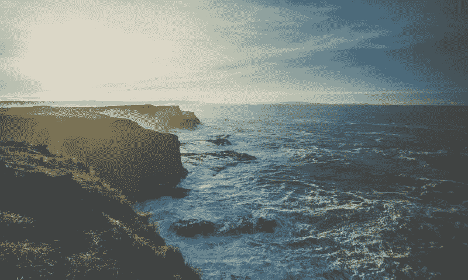

*来源:* [*弗林德斯大学*](https://www.flinders.edu.au/) *(CC0)*

# 本文的目标是

在本文中，我们将使用一种叫做 ***的算法对 Landsat 8 平台上的***【OLI】传感器*** 获取的两幅卫星图像进行 Canny 边缘检测*** 。

通过这种方法， ***我们将能够可视化和评估一个特定的欧洲地区遭受强烈侵蚀作用的海岸线的进程:霍尔德内斯海岸。***

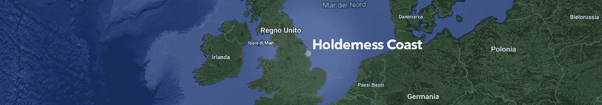

这里的**是拟定的*工作流程*** :

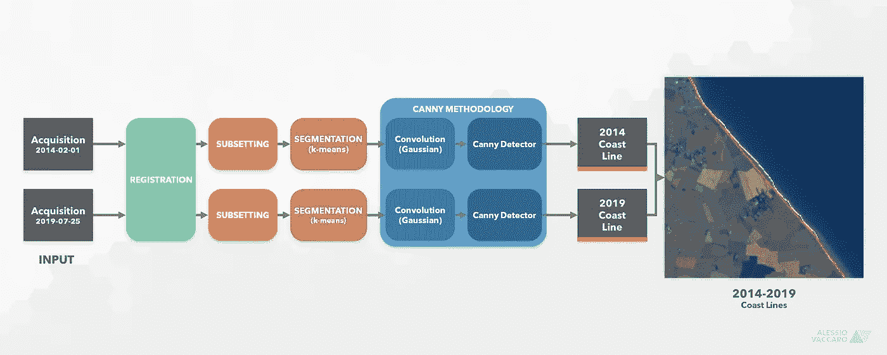

整个管道:从进口到产品。

开始吧！但是之前…

# 0.陆地卫星 OLI 数据简介

Landsat 8 是一个轨道平台，安装在一个名为 OLI(实用陆地成像仪)的 ***11 波段多光谱传感器*** 上。

具体来说，在本文中，我们将仅使用分辨率为 30 米的波段(即前 7 个波段)。

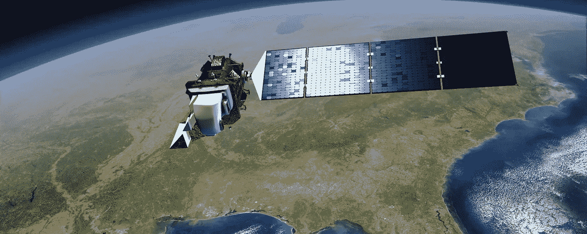

美国地质调查局地球资源卫星 8 号

***资料可以免费下载*** ，注册后通过***USGS***:[https://earthexplorer.usgs.gov/](https://earthexplorer.usgs.gov/)提供的平台。

此外，正如通常使用的那样， ***我们将使用反射率*** ，即从地球表面反射的阳光量【0–1】，而不是使用入射阳光的原始数据。

# 1.包导入

在各种常见的软件包中，本文我们将使用*来轻松处理 ***光栅*** 图像，使用 ***OpenCV*** 来应用 ***Canny*** 算法和 ***Scikit-Learn*** 到 ***段****

# *2.数据导入*

*让我们定义一个变量，它告诉我们要保留的波段数以及先前在 JSON 中输入的辅助数据:*

*这个 *Json* 是来自 Landsat OLI 成像仪(我创造的*)的*信息集合。一种说明书。看起来是这样的:***

*bands.json 文件包含了我们将要使用的波段的所有有用信息。*

*请记住，我们将只使用 30 米分辨率的波段，所以只有前 7 个。如果你愿意有较低的分辨率(100m)，你可以嵌入 ***重要的 TIRS 1 和 TIRS 2 波段以及*** 。*

*正如上面几行已经提到的，我们将使用来自 OLI 陆地卫星 8 号的两个不同的采集数据:*

*   *2014/02/01*
*   *2019/07/25*

*为了方便和加速两个采集 ***的所有操作，我们将定义一个 Acquisition()类*** ，它将允许我们封装所有必要的函数。*

*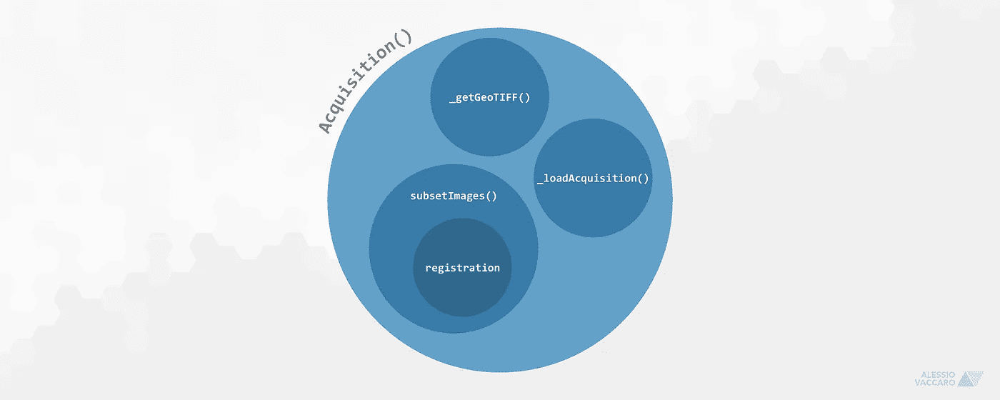*

*在代码执行期间，这将允许我们执行一些支持功能，例如:*

*   *在指定路径中搜索 GeoTIFF*
*   ****加载*** 采集；*
*   *收购 ***登记*** (对齐)；*
*   ***采集*子集*采集***

*好了， ***我们现在可以使用 ***:*** 来启动整个代码****

*结果应该是这样的:*

```
**Searching for 'tif' files in Data/2014-02-01
Found 7 'tif' files
Loading images
Done
Searching for 'tif' files in Data/2019-07-25
Found 7 'tif' files
Loading images
Done**
```

*我们的 14 幅 OLI 图像(7 个波段中的 2 次采集)现已加载。*

## *2.1.子集化多光谱立方体*

*在这个阶段，在两个多光谱立方体 的 ***的“对齐”(*或更正式的注册*)之后，我们负责剪切掉我们不感兴趣的采集部分。****

*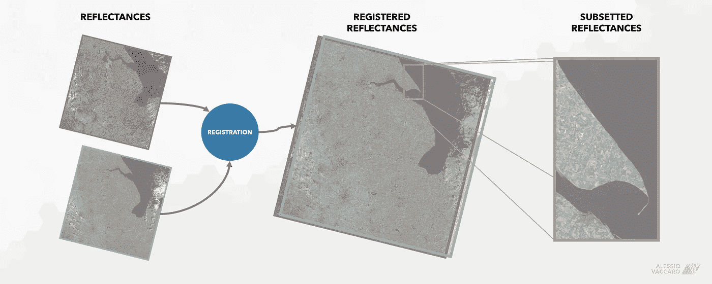*

*让我们使用函数***sub estimates()***来“剪切”不需要的数据。*

*因此，让我们 ***定义 AOI*** ( *感兴趣区域*)并使用 ***【采集()*** 类中的函数***subestimages()***进行子集化:*

*搞定了。*

# *3.数据探索*

## *3.1.可视化多光谱立方体*

*让我们尝试查看 2019/07/25 收购的所有乐队。 ***纯粹出于审美原因*** ，在制作图像剧情之前，我们先用***standard scaler()***对图像进行标准化处理。*

*这应该是结果。*

*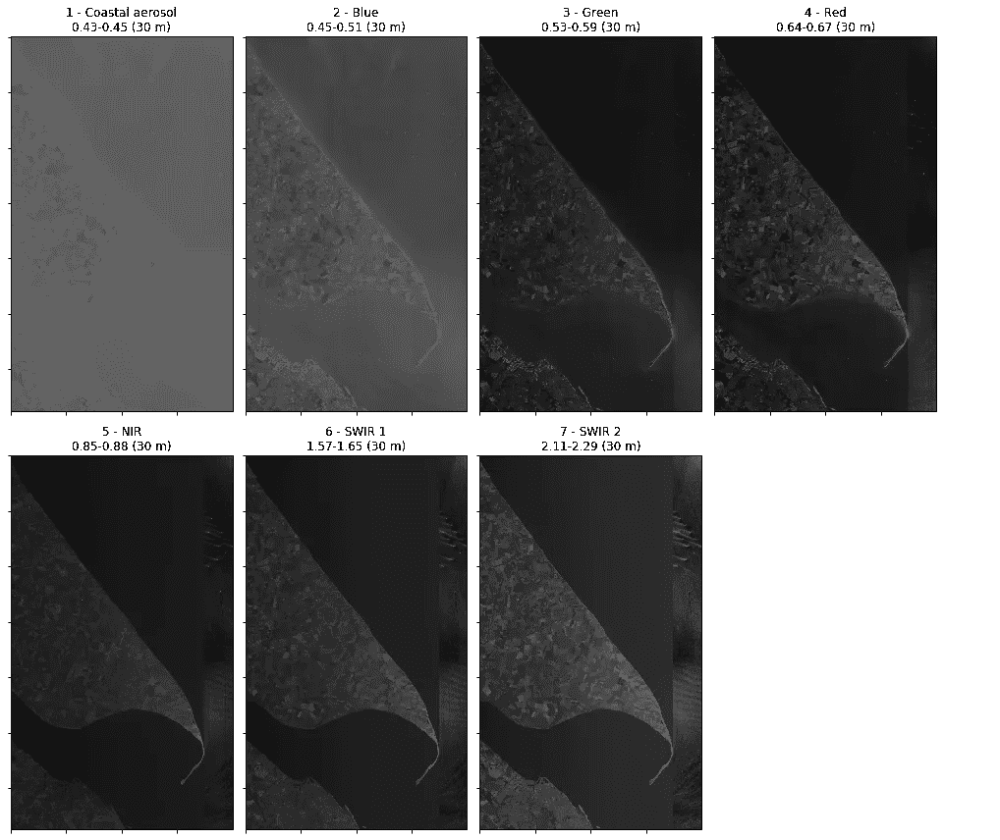*

*正如你所看到的，有些波段比其他波段更亮。这很正常。*

## *3.2.以复合 RGB 显示多光谱立方体*

*现在让我们尝试在使用波段 4(红色)、3(绿色)和 2(蓝色)获得的 ***RGB 合成*** 中可视化这两个采集。*

*偏置和增益被定义 ***只是为了得到一个漂亮的 viz*** 。*

*这就是结果！有趣的是，这两种采集在反射率方面有着显著的不同。*

*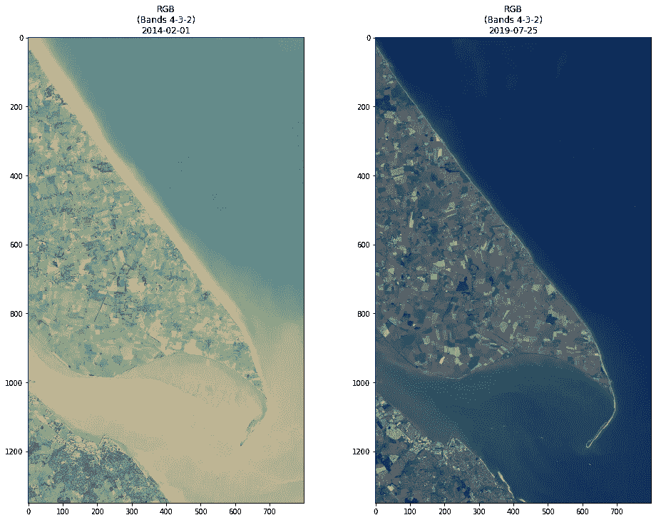*

*好了，继续进行 ***海岸线检测*** 。*

# *4.自动海岸线检测*

*在本段中，我们将使用 ***Canny 的方法*** 进行边缘检测。*

*在进行真正的检测之前，有必要准备数据集，尝试通过聚类算法 ***对其进行分割，以区分海洋和陆地*** 。*

*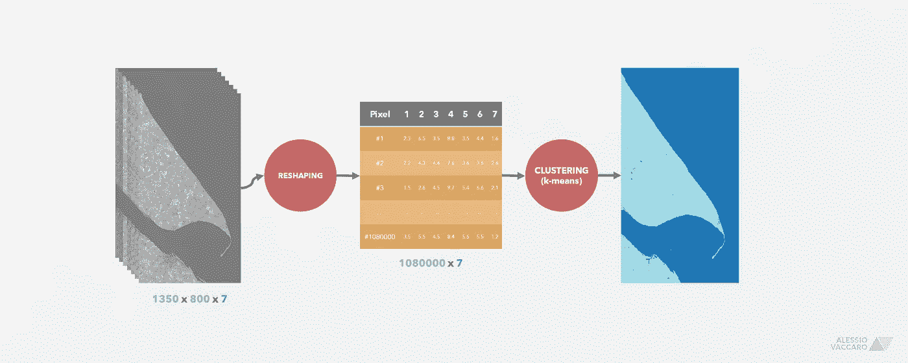*

## *4.1 数据准备*

*在这个阶段，我们应该为聚类操作重塑两个多光谱立方体。*

## *4.2 使用 K 均值的图像分割*

****让我们通过 k-means 对这两个收购*** 进行分段(使用你更喜欢的模型)。*

## *4.3.收购细分结果*

*这里有两个集群确定代表浮现的土地和水体。*

*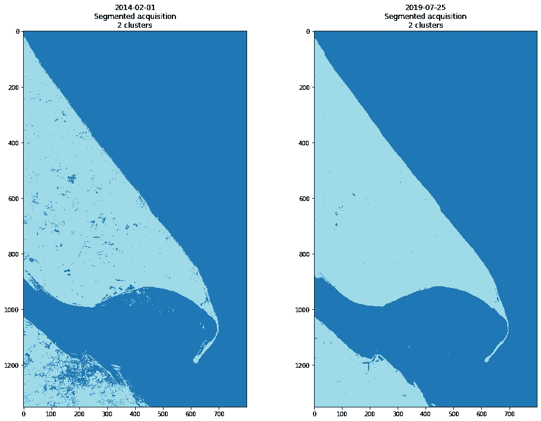*

## *4.4.Canny 边缘检测算法*

*Canny 的传统钥匙技术分为以下几个阶段:*

1.  ****降噪*** 通过与高斯滤波器卷积；*
2.  *图像 ***四个方向*** (水平、垂直、2 斜)的渐变计算；*
3.  *提取 ***梯度局部极大值***；*
4.  ****阈值带迟滞*** 用于边缘提取。*

*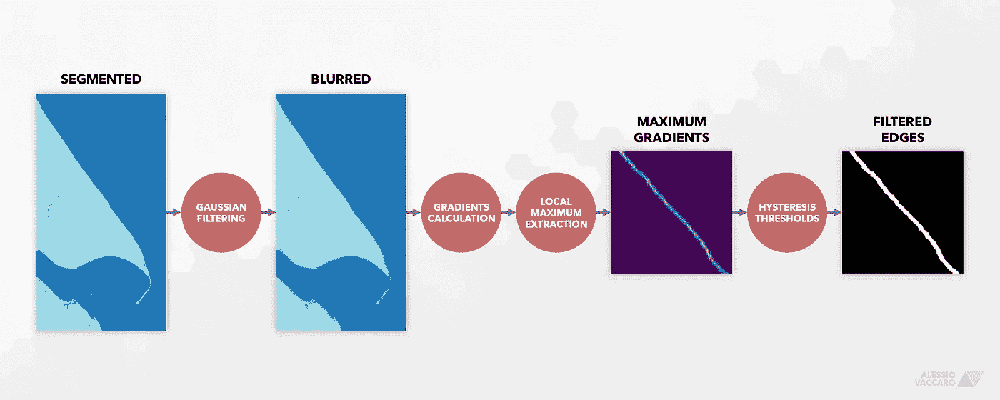*

*让我们立即开始，通过 ***将聚类结果转换成图像*** ，然后 ***通过具有 15×15 内核的高斯滤波器降低噪声*** :*

*稍微模糊图像后，我们可以使用***OpenCV******Canny()***模块继续执行真正的 Canny 技术:*

*在一行代码中，我们获得了梯度，提取了局部最大值，然后对每次采集应用了具有滞后的阈值。*

**注意:使用 Canny()参数探索不同的结果。**

## *4.5.结果呢*

*这是结果。*

*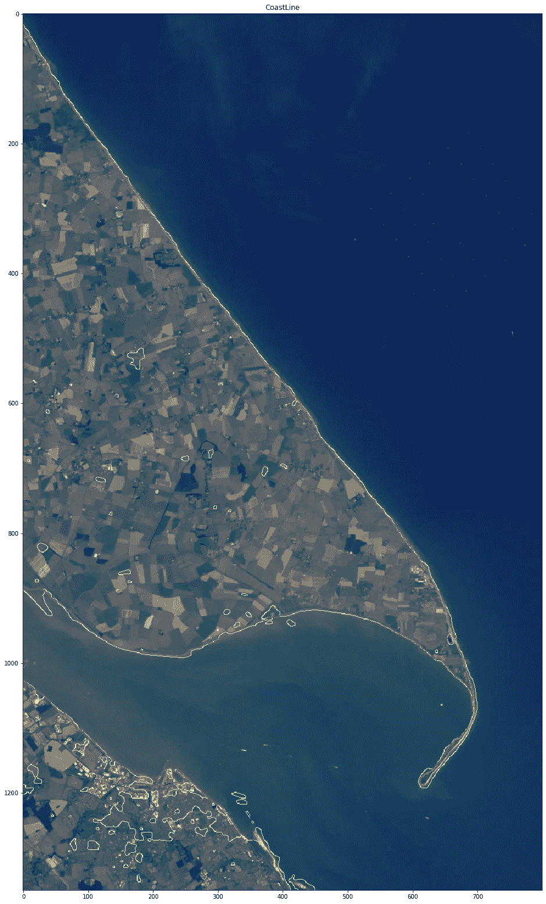*

*以下是一些细节:*

*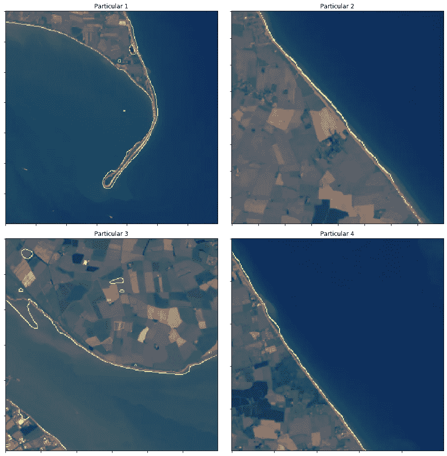*

# *5.结论*

*从结果中可以看出，Canny 的算法在其原始管道中工作得相当好，但其性能像往常一样取决于所涉及的数据。*

*事实上，所使用的聚类算法允许我们分割初始的多光谱立方体，其性能当然可以改进。并行使用几个聚类模型可以全面改善结果。*

*🤝*如有任何疑问、反馈或合作要求，请随时* ***联系我***[***Linkedin***](https://www.linkedin.com/in/alessio-vaccaro/?lipi=urn%3Ali%3Apage%3Ad_flagship3_feed%3Bm6wy3IpeQb22IUmuzeXutg%3D%3D)*。我会很高兴和你聊天！**

*[👉](https://emojipedia.org/backhand-index-pointing-right/)要获得更多类似的内容，并关注即将发布的文章，请不要忘记在 Medium 上 ***关注我。****

*[👉](https://emojipedia.org/backhand-index-pointing-right/) *如需参考本文，请联系我。谢谢你。**