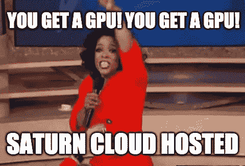
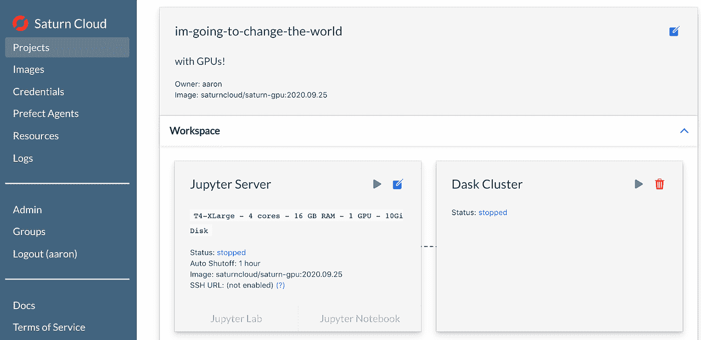
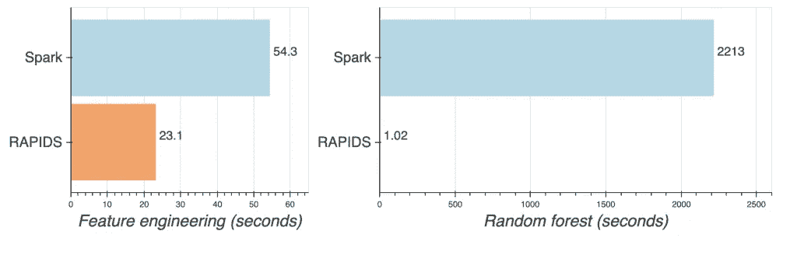
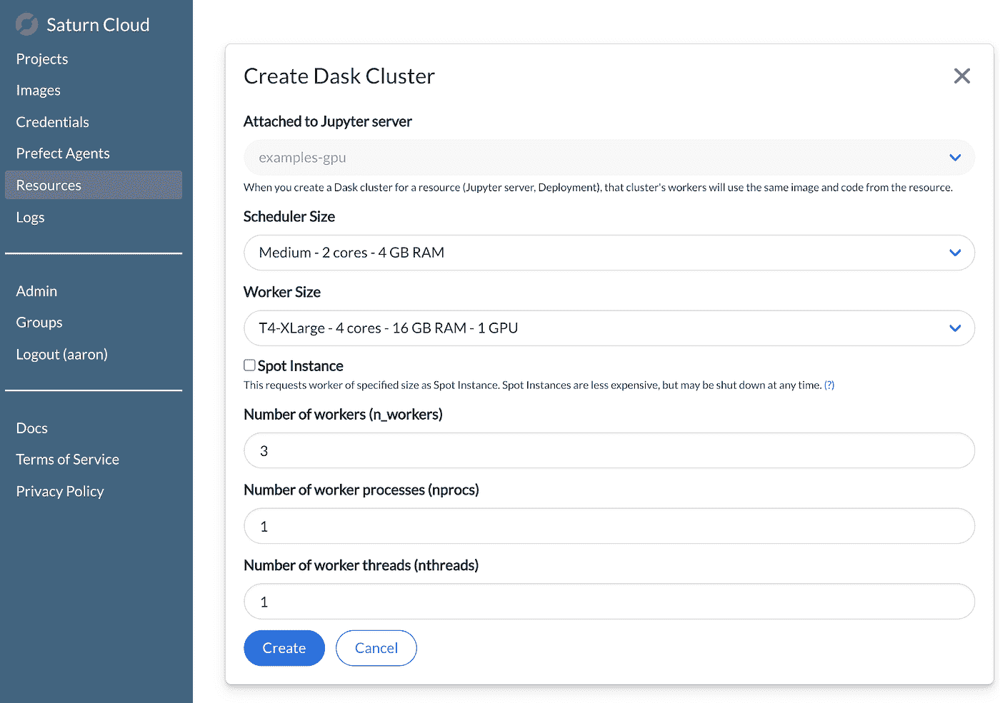

# 土星云托管已推出:为每个人的 GPU 数据科学

> 原文：<https://towardsdatascience.com/saturn-cloud-hosted-has-launched-gpu-data-science-for-everyone-c3e1ae21b1b5?source=collection_archive---------48----------------------->

## **数据科学的未来&机器学习支持 GPU**

GPU 计算是数据科学的未来。RAPIDS、TensorFlow 和 PyTorch 等包实现了数据科学所有方面的闪电般快速处理:数据清理、特征工程、机器学习、深度学习等。利用 GPU 计算的挑战在于，它需要对内部硬件或基础设施进行投资，以便在云上利用 GPU。

今天，土星云宣布推出[土星云托管](https://www.saturncloud.io/s/tryhosted/)，这是一个端到端 GPU 数据科学的云托管解决方案，适合所有初创公司、小型团队、学生、研究人员和修补数据科学家的需求。

鸣谢:土星云

> ***TL；DR***:[Saturn Cloud Hosted](https://www.saturncloud.io/s/tryhosted/)是实时的，任何人只需点击一个按钮，就可以注册并启动支持 GPU 的数据科学机器。您可以立即开始免费试用！

鸣谢:土星云

注册后几秒钟内，您就可以启动 JupyterLab 实例，该实例具有针对最流行的 GPU 数据科学包的预配置环境，由英伟达 T4 或 V100 GPU 提供支持。当您的数据大小超过单个 GPU 时，您可以轻松地扩展到由多个 GPU 机器组成的集群。几百甚至！Saturn Hosted 负责所有硬件供应、环境设置和集群通信挑战，因此数据科学家可以直接投入工作。

土星云托管的 GPU 改变世界。鸣谢:土星云

由 NVIDIA GPUs 托管的土星云的愿景是将世界上最快的数据科学和机器学习能力带给每个人，无论预算、资源和时间如何。虽然 GPU 加速工具在以前是一种奢侈品，但随着时间的推移，价格下降，加上云可用性和 Saturn Cloud 提供的基础设施，使其成为日常用户的强大工具。

## GPU 上更快的随机森林

让我们探索使用 Apache Spark 在 CPU 机器集群上实现分布式随机森林训练，并将其与使用 RAPIDS 和 Dask 在 GPU 机器集群上训练的性能进行比较。

> ***TLDR*** *:我们使用 3 亿个实例训练了一个随机森林模型:Spark 在 20 节点 CPU 集群上耗时 37 分钟，而 RAPIDS 在 20 节点 GPU 集群上耗时 1 秒。这比 GPU 快了 2000 多倍。*

您可以在此阅读关于该基准测试的更多内容[。我们在 Spark (CPU)和 RAPIDS (GPU)集群上对纽约市出租车数据的 **300，700，143 个实例**训练了一个随机森林模型。两个集群都有 20 个工作节点，小时价格大致相同。以下是工作流程每个部分的结果。](/random-forest-on-gpus-2000x-faster-than-apache-spark-9561f13b00ae)

> Spark 是 37 分钟，而 RAPIDS 是 1 秒钟！

GPU 粉碎了它——这就是为什么你现在拥有它们会如此激动。想想当你不需要为一次拟合等待超过 30 分钟时，迭代和改进模型的速度会有多快。一旦您添加了超参数调整或测试不同的模型，每次迭代很容易增加到几个小时或几天。

需要看到才相信？你可以在这里找到笔记本！或者继续阅读，看看如何在 Saturn Cloud Hosted 中建立一个项目，并为自己运行它。

## 借助土星云托管的 GPU 加速数据科学

在 Saturn Cloud Hosted 上使用 GPU 很容易上手，我们将使用一个数据样本完成上面的随机森林模型训练练习。该示例使用纽约市出租车数据来训练随机森林模型，该模型将乘坐分为“高小费”或“低小费”乘坐。当你创建一个帐户时，这些笔记本会被预加载到一个“examples-gpu”项目中，或者你也可以自己点击[这里](https://github.com/saturncloud/examples/tree/main/examples/examples-gpu/nyc-taxi)获取这些笔记本。

我们首先将一个 CSV 文件加载到一个数据帧中，但是因为我们使用的是 RAPIDS cudf 包，所以数据帧被加载到 GPU 内存中:

然后经过一些特征处理，我们训练我们的随机森林模型！

Saturn Cloud Hosted 的伟大之处在于这段代码“能够正常工作”。环境已经给你设置好了，GPU 也接好了，现在你可以专注于训练一个模型了。

如果数据集很大，使用单个 GPU 可能不够，因为数据集和后续处理必须适合 GPU 内存。这就是土星云上的 Dask 星团发挥作用的地方！您可以从 UI 或笔记本中定义集群，确保为 Dask 工作人员选择 GPU 大小:

接下来就是为分布式 GPU 处理导入适当的 RAPIDS 模块和子模块:

# 你想要一个简单的方法来获得超快的 GPU 数据科学吗？

是啊！有了土星云托管，您可以在几秒钟内启动 GPU 集群。Saturn Cloud 处理所有工具基础设施、安全性和部署问题，让您立即开始使用 RAPIDS。点击这里免费试用土星云主持的！

如果您所在的公司需要虚拟私有云解决方案，土星云也提供企业解决方案，您可以在这里找到。

**作者:**
亚伦·里希特，土星云高级数据科学家

米（meter 的缩写））塞巴斯蒂安·梅蒂，土星云的创始人